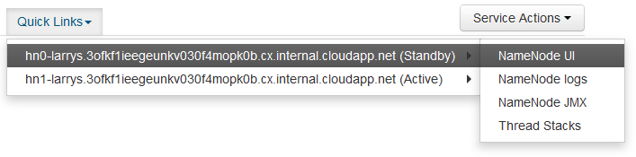

<properties
pageTitle="用來存取 Ambari web UI、 ResourceManager、 JobHistory、 NameNode、 Oozie 及其他網站使用者介面的 [SSH 通道"
description="瞭解如何使用 SSH 通道安全地瀏覽 web 資源裝載於您 Linux 型 HDInsight 節點。"
services="hdinsight"
documentationCenter=""
authors="Blackmist"
manager="jhubbard"
editor="cgronlun"/>

<tags
ms.service="hdinsight"
ms.devlang="na"
ms.topic="article"
ms.tgt_pltfrm="na"
ms.workload="big-data"
ms.date="10/17/2016"
ms.author="larryfr"/>

# 用來存取 Ambari 網頁 UI、 JobHistory、 NameNode、 Oozie，與其他網路使用者介面的 [SSH 通道

Linux 型 HDInsight 叢集透過網際網路、 提供 Ambari web UI 的權限，但無法 UI 的部分功能。 例如，網站使用者介面上的透過 Ambari 其他服務。 Ambari 網頁 UI 的完整功能，您必須使用叢集標頭 SSH 通道。

## 什麼需要 SSH 通道？

數個 Ambari 中的功能表會不完全填入 SSH 通道，不為它們依賴網站和服務所公開之叢集上執行其他 Hadoop 服務。 通常，這些網站並不安全，因此不安全直接在網際網路上公開。 有時候服務會執行的網站，例如動物園管理員節點的另一個叢集節點。

以下是 Ambari 網頁 UI 所使用的服務沒有 SSH 通道無法存取︰

* JobHistory，
* NameNode，
* 執行緒堆疊
* Oozie 網頁 UI
* HBase 母片與記錄的使用者介面

如果您使用指令碼動作自訂叢集，任何服務或公用您安裝的程式公開網頁 UI 會要求 SSH 通道。 例如，如果您安裝色調使用指令碼的巨集指令，您必須使用 SSH 通道存取色調的 web UI。

## 什麼是 SSH 通道？

[安全命令介面 (SSH) 通道](https://en.wikipedia.org/wiki/Tunneling_protocol#Secure_Shell_tunneling)路由傳送至在本機工作站，透過 SSH 連線至 HDInsight 叢集主節點，要求然後解決的如同在產生的連接埠的流量。 回應是然後經由回您的工作站通道。

## 必要條件

使用時 SSH 通道 web 流量，您必須具備下列項目︰

* SSH 用戶端。 Linux 和 Unix 散佈或 Macintosh OS X，`ssh`命令提供的作業系統。 我們建議您的 Windows [PuTTY](http://www.chiark.greenend.org.uk/~sgtatham/putty/download.html)

    > [AZURE.NOTE] 如果您想要使用的 SSH 用戶端以外`ssh`或 PuTTY，請參閱如何建立 SSH 通道用戶端的說明文件。

* 網頁瀏覽器可使用 SOCKS proxy 設定

## 建立通道，使用 [SSH] 命令

使用下列命令以建立 SSH 通道使用`ssh`] 命令。 __使用者名稱__與 SSH 使用者 HDInsight 叢集，並__CLUSTERNAME__取代 HDInsight 叢集的名稱

    ssh -C2qTnNf -D 9876 USERNAME@CLUSTERNAME-ssh.azurehdinsight.net

這樣會建立路由流量至本機的連接埠 9876 叢集，透過 SSH 的連線。 選項包括︰

* **D 9876** -會將透過通道流量路由傳送的本機連接埠。

* **C** -壓縮所有資料，因為 web 流量大部分的文字。

* **2** -強制 SSH 嘗試通訊協定版本只 2。

* **問:** -安靜模式。

* **T** ，停用虛擬 tty 配置，因為我們只是要轉寄的連接埠。

* **n** -防止讀取 STDIN，因為我們只是要轉寄的連接埠。

* **N** -不會執行遠端命令，因為我們只是要轉寄的連接埠。

* **f** ，在背景中執行。

如果您使用 SSH 金鑰設定叢集，您可能需要使用`-i`參數指定 SSH 私密金鑰的路徑。

後命令完成，便會傳送到本機電腦上的連接埠 9876 的流量會透過路由安全通訊端層 (SSL) 叢集向節點，並顯示為那里來自。

## 建立使用 PuTTY 通道

您可以使用下列步驟來建立使用 PuTTY SSH 通道。

1. 開啟 PuTTY，並輸入您的連線資訊。 如果您不熟悉 PuTTY，請參閱[使用 SSH 與 Linux 為基礎的 Hadoop HDInsight 從 Windows 上](hdinsight-hadoop-linux-use-ssh-windows.md)關於如何使用 HDInsight 資訊。

2. 在 [左邊] 對話方塊的 [**類別**] 區段中，展開**連線**、 展開**SSH**，，然後選取**通道**。

3. **控制 SSH 連接埠轉送選項**表單上提供下列資訊︰

    * **來源連接埠**-您想要轉寄的用戶端的連接埠。 例如， **9876**。

    * **目的地**-SSH Linux 型 HDInsight 叢集位址。 例如， **mycluster ssh.azurehdinsight.net**。

    * **動態**-可讓路由動態 SOCKS proxy。

    

4. 按一下 [**新增**]，若要新增設定]，，然後按一下 [**開啟**] 以開啟 SSH 的連線。

5. 出現提示時，登入伺服器。 這會建立 SSH 工作階段，並啟用通道。

## 使用瀏覽器通道

> [AZURE.NOTE] 本節中的步驟會使用 FireFox 瀏覽器中，因為這是免費 Linux、 Unix、 Macintosh OS X 和 Windows 系統。 也可以使用其他支援使用 SOCKS proxy 的新式瀏覽器。

1. 設定用於**localhost:9876** **SOCKS v5** proxy 瀏覽器。 以下是 Firefox 設定的外觀。 如果您使用不同的連接埠比 9876，變更所用的連接埠︰

    

    > [AZURE.NOTE] 選取 [**遠端 DNS** ，會使用 HDInsight 叢集解決網域名稱系統 (DNS) 要求。 如果這是未選取，就會在本機解析 DNS。

2. 驗證的流量會路由透過通道 vising 例如[http://www.whatismyip.com/](http://www.whatismyip.com/)網站啟用及停用在 firefox 是 proxy 設定。 設定已啟用，會到機器 Microsoft Azure 資料中心的 IP 位址。

##驗證 Ambari 網頁 UI

一旦建立叢集，請使用下列步驟以驗證您可以存取服務 web Ui Ambari 網站︰

1. 在瀏覽器中，移至 http://headnodehost:8080。 `headnodehost`地址會透過通道傳送到叢集和解析為 headnode Ambari 上執行。 出現提示時，輸入叢集管理員 （管理員） 的使用者名稱和密碼。 您可能會提示您一次以 Ambari 網頁 UI。 如果是這樣，重新輸入資訊。
    
    > [AZURE.NOTE] 使用時的 http://headnodehost:8080 地址連線到叢集，您連線直接移至主節點的 Ambari 上執行 http 使用 SSH 通道安全通訊通道。 當您連線透過網際網路而不使用通道，會受到保護使用 HTTPS 通訊。 若要使用 HTTPS 透過網際網路連線，請使用 https://CLUSTERNAME.azurehdinsight.net，其中__CLUSTERNAME__是叢集的名稱。

2. 從 Ambari 網路使用者介面中，選取 [HDFS 在頁面左側的清單。

    

3. 顯示 HDFS 服務的資訊時，請選取 [__快速連結__]。 隨後便會列出叢集標頭節點。 選取的標頭的節點，其中一個，然後選取 [ __NameNode ui__。

    

    > [AZURE.NOTE] 如果您有變得很慢的網際網路連線，或主節點忙碌，您可能會出現，而不是功能表等待指標，當您選取__快速連結__。 如果是這樣，等待一兩分鐘的時間從伺服器時，收到的資料，然後再試一次清單]。
    >
    > 如果您有較低解析度的螢幕，或在瀏覽器視窗沒有最大化，可能會在螢幕右側的裁切__快速連結__] 功能表中的某些項目。 如果是這樣，展開 [使用滑鼠，] 功能表，然後使用右邊的箭號捲動到右側，即可看到 [其他] 功能表的螢幕。

4. 看起來應該類似下列頁面︰

    

    > [AZURE.NOTE] 請注意此頁面中; 的 URL應該__http://hn1-CLUSTERNAME.randomcharacters.cx.internal.cloudapp.net:8088/叢集__類似。 這使用內部的完整的網域名稱 (FQDN)] 節點並不使用 SSH 隧道不能存取。

## 後續步驟

現在，您已經學會如何建立和使用 SSH 通道，請參閱下列資訊的監控和管理使用 Ambari 叢集︰

* [使用 Ambari 管理 HDInsight 叢集](hdinsight-hadoop-manage-ambari.md)

如需有關如何使用 HDInsight SSH 的詳細資訊，請參閱下列各項︰

* [使用上 HDInsight Linux、 Unix，或 OS X 的 Linux 型 Hadoop SSH](hdinsight-hadoop-linux-use-ssh-unix.md)

* [使用上從 Windows HDInsight Linux 為基礎的 Hadoop SSH](hdinsight-hadoop-linux-use-ssh-windows.md)
