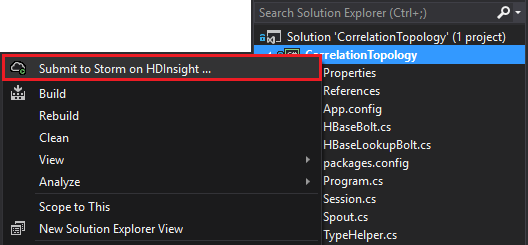

<properties
 pageTitle="一段時間的事件互相關聯大量與 HBase 上 HDInsight"
 description="瞭解如何在不同時間送達使用大量和 HBase HDInsight 上的事件互相關聯。"
 services="hdinsight"
 documentationCenter=""
 authors="Blackmist"
 manager="jhubbard"
 editor="cgronlun"
 tags="azure-portal"/>

<tags
 ms.service="hdinsight"
 ms.devlang="dotnet"
 ms.topic="article"
 ms.tgt_pltfrm="na"
 ms.workload="big-data"
 ms.date="10/27/2016"
 ms.author="larryfr"/>

# 一段時間的事件互相關聯大量與 HBase 上 HDInsight

使用 Apache 大量常設資料存放區，您可以建立關聯資料的項目，都會在不同的時間。 例如，連結使用者工作階段，來計算工作階段的持續多久的登入和登出事件。

在此文件中，您將學習如何建立基本的 C# 大量拓撲的使用者階段追蹤登入和登出事件，並將工作階段的工期。 拓撲使用 HBase 常設資料儲存區。 HBase 也可讓您執行的記錄的資料，以產生其他深入資訊，例如多少使用者工作階段已開始或結束特定期間批次查詢。

## 必要條件

- Visual Studio 與 Visual Studio 的 HDInsight 工具︰ 資訊，請參閱[開始使用 Visual Studio 的 HDInsight 工具](../HDInsight/hdinsight-hadoop-visual-studio-tools-get-started.md)安裝。

- 在 HDInsight Apache 大量叢集 (windows)。 此動作會執行大量拓撲，處理內送的資料，並將其儲存至 HBase。

    > [AZURE.IMPORTANT] 雖然 SCP.NET 拓撲支援到後 10/28 2016年建立的 Linux 型大量叢集，HBase SDK.NET 套件可 10/28 2016年正常運作 linux。

- HDInsight 叢集上 Apache HBase (Linux 或 windows)。 這是這個範例中的資料存放區。

## 架構

事件來源相關聯的事件需要常見的識別碼。 For example，使用者識別碼、 工作階段識別碼或其他） 唯一且 b） 包含所有傳送至大量的資料中的資料。 此範例使用 GUID 值，代表工作階段的識別碼。

此範例中是由兩個 HDInsight 叢集所組成︰

-   歷史資料 HBase︰ 持續性資料存放區

-   大量︰ 用來內嵌內送的資料

資料隨機產生的大量拓撲，並包含下列項目︰

-   工作階段識別碼︰ GUID 可唯一識別每個工作階段

-   事件︰ 開始或結束的事件。 例如，開始，一定會發生之前結束

-   時間︰ 事件的時間。

這是處理及儲存資料的 HBase。

### 大量拓撲

啟動工作階段時,**開始**的事件收到拓撲，而 HBase 登入。 收到事件**結束**時，拓撲擷取**開始**事件，並計算兩個事件之間的時間。 HBase 然後儲存此**工期**值及**結束**事件資訊。

> [AZURE.IMPORTANT] 當此拓撲示範基本的圖樣時，生產解決方案需要花在下列情況下的設計︰
>
> - 登出順序送達的事件
> - 重複的事件
> - 首字的事件

範例拓撲包含下列元件︰

-   Session.cs︰ 建立的隨機工作階段識別碼，開始，並且多久將持續工作階段，模擬使用者工作階段

-   Spout.cs︰ 建立 100 工作階段發出開始事件、 等待每個工作階段的隨機逾時與然後會發出結束事件。 然後回收已結束工作階段，以產生新的文件。

-   HBaseLookupBolt.cs︰ 使用的工作階段識別碼查閱 HBase 工作階段資訊。 處理事件結束時，它會找出對應的開始事件，並將工作階段的工期。

-   HBaseBolt.cs︰ 儲存到 HBase 的資訊。

-   類型轉換時從讀取 / 寫入 HBase TypeHelper.cs︰ 可協助。

### HBase 結構描述

在 HBase，資料儲存在下列結構描述/設定的表格︰

-   資料列識別碼︰ 用的索引鍵，此表格中的資料列的工作階段

-   欄系列︰ 系列名稱為 「 cf 」。 儲存在這一系列中的資料行如下︰

    -   事件︰ 開始或結束時間

    -   時間︰ 以毫秒為單位的事件發生的時間

    -   持續時間︰ 在開始和結束事件之間的長度

-   版本: 「 cf' 系列設定為 [保留的每個資料列的 5 個版本

    > [AZURE.NOTE] 版本是先前儲存的特定列索引鍵的值的記錄。 根據預設，HBase 只會傳回最新版的資料列的值。 在此情況下，相同的資料列用於所有事件 （開始]，結束。） 列的每個版本由時間戳記的值。 這會提供檢視歷史記錄的特定的識別碼的事件

## 下載的專案

範例專案可以從[https://github.com/Azure-Samples/hdinsight-storm-dotnet-event-correlation](https://github.com/Azure-Samples/hdinsight-storm-dotnet-event-correlation)下載。

下載包含下列 C# 專案︰

-   CorrelationTopology: C# 大量拓撲隨機使用者階段發出開始和結束的事件。 每個工作階段的持續時間介於 1 到 5 分鐘的時間。

-   SessionInfo: C# 主控台應用程式建立 HBase 資料表，並提供範例查詢，以傳回儲存的工作階段資料的相關資訊。

## 建立表格

1. Visual Studio 中開啟**SessionInfo**專案。

2. 在**方案總管]**中，以滑鼠右鍵按一下**SessionInfo**專案，然後選取 [**內容]**。

    ![使用已選取 [屬性] 功能表的螢幕擷取畫面](./media/hdinsight-storm-correlation-topology/selectproperties.png)

3. 選取 [**設定**]，然後設定為以下值︰

    -   HBaseClusterURL: HBase 叢集 URL。 例如，https://myhbasecluster.azurehdinsight.net

    -   HBaseClusterUserName︰ 管理員/HTTP 使用者帳戶叢集

    -   管理員/HTTP 使用者帳戶的密碼 HBaseClusterPassword:

    -   若要使用此範例中資料表的名稱 HBaseTableName:

    -   HBaseTableColumnFamily︰ 資料行系列名稱

    ![設定] 對話方塊的圖像](./media/hdinsight-storm-correlation-topology/settings.png)

5. 執行方案。 出現提示時，選取 [c] 鍵 HBase 叢集上建立資料表。

## 建立並部署大量拓撲

1.  Visual Studio 中開啟**CorrelationTopology**解決方案。

2.  在**方案總管]**中，以滑鼠右鍵按一下**CorrelationTopology**專案，然後選取 [內容]。

3.  在 [屬性] 視窗中，選取 [**設定**]，並提供下列資訊。 第 5 應該**SessionInfo**專案使用相同的值︰

    -   HBaseClusterURL: HBase 叢集 URL。 例如，https://myhbasecluster.azurehdinsight.net

    -   HBaseClusterUserName︰ 管理員/HTTP 使用者帳戶叢集

    -   管理員/HTTP 使用者帳戶的密碼 HBaseClusterPassword:

    -   HBaseTableName︰ 若要使用此範例中資料表的名稱。 這會包含在 SessionInfo 專案中使用相同資料表名稱

    -   HBaseTableColumnFamily: 資料行系列名稱。 這包含相同的資料行系列名稱 SessionInfo 專案中使用

    > [AZURE.IMPORTANT] 不會變更 HBaseTableColumnNames，為預設值是由**SessionInfo**用來擷取資料的名稱。

4.  儲存屬性]，然後建立專案。

5.  在**方案總管]**中，以滑鼠右鍵按一下專案，然後選取 [**提交]，在 HDInsight 大量**。 如果出現提示，請輸入認證 Azure 訂閱。

    

6.  在 [**送出拓撲**] 對話方塊中，選取所要執行此拓撲大量叢集。

    > [AZURE.NOTE] 第一次提交拓撲，可能需要幾秒才擷取 HDInsight 叢集的名稱。

7.  一旦拓撲已上傳並送出到叢集，**大量拓撲檢視**會開啟，並顯示執行拓撲。 選取**CorrelationTopology** ，並使用頂端的 [重新整理] 按鈕重新整理拓撲資訊頁面右上方。

    

    當拓撲開始產生資料時，會增加**Emitted**欄中的值。

    > [AZURE.NOTE] 如果不會自動開啟**大量拓撲檢視**，請使用下列步驟，將其開啟︰
    >
    > 1. 在**方案總管]**中，展開**Azure**，然後再展開**HDInsight**。
    >
    > 2. 以滑鼠右鍵按一下拓撲正在執行，大量叢集，然後選取 [**檢視大量拓撲**

## 查詢的資料

之後已發出資料，請使用下列步驟來查詢資料。

1. 返回**SessionInfo**專案。 如果未執行，開始新的執行個體。

2. 出現提示時，請選取 [ **s**搜尋開始事件]。 系統會提示您輸入的開始和結束時間，以定義時間範圍-僅限這兩個時間之間的事件會傳回。

    輸入開始和結束時間時，請使用下列格式︰ hh: mm 和 「 正在' 或 'pm 」。 例如，11:20 pm。

    剛開始拓撲，因為使用開始時間從之前的部署，並立即結束時間。 此應該擷取大部分的啟動時產生啟動事件。 查詢執行時，您應該會看到類似以下的項目清單︰

        Session e6992b3e-79be-4991-afcf-5cb47dd1c81c started at 6/5/2015 6:10:15 PM. Timestamp = 1433527820737

搜尋結束事件的運作方式啟動事件相同。 不過，結束事件的隨機產生介於 1 到 5 分鐘之後開始事件。 因此，您可能要嘗試幾個時間範圍，才能找到結束事件。 結束事件也會包含工作階段-事件開始的時間和結束事件時間之間的差異。 結束事件資料的範例如下︰

    Session fc9fa8e6-6892-4073-93b3-a587040d892e lasted 2 minutes, and ended at 6/5/2015 6:12:15 PM

> [AZURE.NOTE] 當您輸入的時間值在當地時間中時，查詢所傳回的時間會 UTC。

##停止拓撲

若要停止拓撲準備好時，傳回 Visual Studio **CorrelationTopology**專案。 在**大量拓撲檢視**中，選取拓撲，然後使用 [**刪除**] 按鈕上方的 [拓撲] 檢視。

##刪除叢集

[AZURE.INCLUDE [delete-cluster-warning](../../includes/hdinsight-delete-cluster-warning.md)]

##後續步驟

更多的大量範例，請參閱[在 HDInsight 大量的範例拓撲](hdinsight-storm-example-topology.md)。
 
