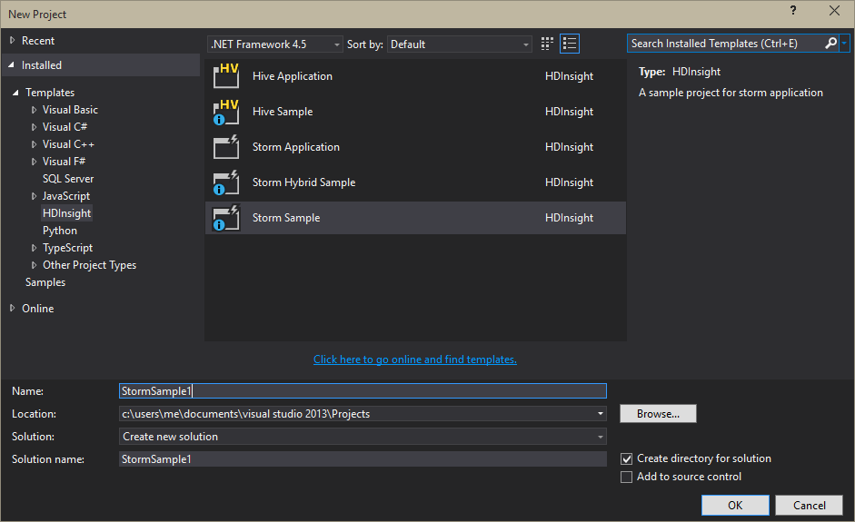

<properties
   pageTitle="部署及管理 Apache 大量拓撲上 HDInsight |Microsoft Azure"
   description="瞭解如何部署、 監控和管理 Apache 大量拓撲 HDInsight 上使用大量儀表板。 使用 Hadoop tools for Visual Studio。"
   services="hdinsight"
   documentationCenter=""
   authors="Blackmist"
   manager="jhubbard"
   editor="cgronlun"
    tags="azure-portal"/>

<tags
   ms.service="hdinsight"
   ms.devlang="java"
   ms.topic="article"
   ms.tgt_pltfrm="na"
   ms.workload="big-data"
   ms.date="10/11/2016"
   ms.author="larryfr"/>

#部署及管理在 Windows 型 HDInsight Apache 大量拓撲

[大量儀表板，可讓您輕鬆地部署，並使用網頁瀏覽器 HDInsight 叢集執行 Apache 大量拓撲。 您也可以使用儀表板監控和管理執行拓撲。 如果您使用 Visual Studio，Visual Studio HDInsight 工具會提供類似的功能，在 Visual Studio 中。

大量儀表板和大量功能 HDInsight 工具中的使用大量 REST API，可以用來建立自己的監控和管理解決方案。

> [AZURE.IMPORTANT] 這份文件中的步驟需要 Windows 型的大量 HDInsight 叢集上。 如需使用 Linux 叢集，請參閱[部署及管理 Apache 大量拓撲上 Linux 型 HDInsight](hdinsight-storm-deploy-monitor-topology-linux.md)

##必要條件

* **在 HDInsight Apache 大量**-請參閱<a href="../hdinsight-storm-getting-started/" target="_blank">快速入門上 HDInsight Apache 大量</a>建立叢集的步驟

* **大量儀表板**︰ 現代化的網頁瀏覽器支援 html 5

* **Visual Studio** Azure SDK 2.5.1 或更新版本和 Visual Studio HDInsight 工具。 請參閱安裝並設定 Visual Studio HDInsight 工具的 [<a href="../hdinsight-hadoop-visual-studio-tools-get-started/" target="_blank">開始使用 Visual Studio HDInsight 工具</a>。

    Visual Studio 下列版本之一︰

    * 使用<a href="http://www.microsoft.com/download/details.aspx?id=39305" target="_blank">更新 4</a>的 visual Studio 2012

    * Visual Studio 2013<a href="http://www.microsoft.com/download/details.aspx?id=44921" target="_blank">更新 4</a>或<a href="http://go.microsoft.com/fwlink/?LinkId=517284" target="_blank">Visual Studio 2013 社群</a>

    * <a href="http://visualstudio.com/downloads/visual-studio-2015-ctp-vs" target="_blank">Visual Studio 2015 CTP6</a>

    > [AZURE.NOTE] 目前的 Visual Studio HDInsight 工具僅支援大量 HDInsight 叢集版本 3.2 捨位。

##大量儀表板

[大量儀表板是大量叢集上的網頁。 URL 是**https://&lt;clustername >.azurehdinsight.net/**，其中**clustername** HDInsight 叢集上您大量的名稱。

從 [大量儀表板頂端，選取 [**送出拓撲**]。 依照頁面上執行的範例拓撲或上傳並執行您建立的拓撲的指示。

![送出拓撲頁面][storm-dashboard-submit]

###大量使用者介面

從大量儀表板中，選取 [**大量使用者介面**的連結]。 這會顯示叢集，除了任何執行拓撲的相關資訊。

![大量使用者介面][storm-dashboard-ui]

> [AZURE.NOTE] 使用某些版本的 Internet Explorer 中，您可能會發現大量 UI 不會更新之後您必須先瀏覽。 例如，它可能不會顯示新拓撲您送出，或它可能會顯示為使用中的拓撲，當您先前已停用它。 Microsoft 知道這個問題，而正在處理的解決方案。

####主頁面

大量使用者介面的主頁面會提供下列資訊︰

* **叢集摘要**︰ 有關大量叢集的基本資訊。

* **拓撲摘要**︰ 執行拓撲的清單。 使用此區段中的連結，若要檢視特定拓撲的詳細資訊。

* **主管摘要**︰ 大量主管的相關資訊。

* **Nimbus 設定**︰ 叢集 Nimbus 設定。

####拓撲摘要

透過 [**拓撲摘要**] 區段中的連結會顯示拓撲的下列資訊︰

* **拓撲摘要**︰ 拓撲的基本資訊。

* **拓撲動作**︰ 您可以執行的拓撲管理動作。

    * **啟動**︰ 停用的拓撲履歷表處理。

    * **停用**︰ 暫停的執行拓撲。

    * **重新平衡**︰ 調整拓撲的平行。 您已變更的叢集的節點數目後，您應該重新平衡執行拓撲。 如此一來調整以增加或減少中的節點數目叢集賠償平行拓撲。

        如需詳細資訊，請參閱<a href="http://storm.apache.org/documentation/Understanding-the-parallelism-of-a-Storm-topology.html" target="_blank">瞭解大量拓撲的平行</a>。

    * **刪除**︰ 結束大量拓撲後指定逾時。

* **拓撲 stats**︰ 以及拓撲相關統計資料。 若要在頁面上設定的時間範圍的其他項目中使用 [**視窗**] 欄中的連結。

* **Spouts**︰ 使用拓撲 spouts。 使用此區段中的連結，若要檢視特定 spouts 的詳細資訊。

* **螺栓**︰ 使用拓撲螺栓。 使用此區段中的連結，若要檢視特定螺栓的詳細資訊。

* **拓撲設定**︰ 選取拓撲的設定。

####Spout 與螺栓摘要

從**Spouts**或**螺栓**區段選取 spout 會顯示選取的項目的下列資訊︰

* **元件摘要**︰ spout 或螺栓的基本資訊。

* **Spout/螺栓 stats**: spout 或螺栓相關統計資料。 若要在頁面上設定的時間範圍的其他項目中使用 [**視窗**] 欄中的連結。

* **輸入統計資料**（僅限閃電）︰ 輸入的資料流螺栓所使用的相關資訊。

* **輸出 stats**: spout 發出此資料流時的相關資訊，或閃電。

* **執行程式**︰ spout 或螺栓的執行個體的相關資訊。 選取特定的執行程式檢視針對此執行個體所產生的診斷資訊的記錄檔的**連接埠**項目。

* **錯誤**︰ 此任何錯誤資訊 spout 或閃電。

##Visual Studio HDInsight 工具

送出大量叢集 C# 或混合式拓撲可 HDInsight 工具。 下列步驟使用範例應用程式。 建立您自己的拓撲使用 HDInsight 工具的相關資訊，請參閱[使用 HDInsight 工具的 Visual Studio 開發 C# 拓撲](hdinsight-storm-develop-csharp-visual-studio-topology.md)。

使用下列步驟將樣本部署 HDInsight 叢集上您大量然後檢視及管理拓撲。

1. 如果您在 Visual studio 並不安裝最新版的 HDInsight 工具，請參閱<a href="../hdinsight-hadoop-visual-studio-tools-get-started/" target="_blank">開始使用 Visual Studio HDInsight 工具</a>。

2. 開啟 Visual Studio 中，選取**檔案** > **新增** > **專案**。

3. 在 [**新專案**] 對話方塊中，展開 [**已安裝** > **範本**]，然後選取**HDInsight**。 從範本清單中，選取 [**大量範例**。 在對話方塊的底部，輸入應用程式的名稱。

    

1. 在**方案總管] 中**的專案，以滑鼠右鍵按一下，然後選取 [**提交]，在 HDInsight 大量**。

    > [AZURE.NOTE] 如果出現提示，請輸入 Azure 訂閱登入認證。 如果您有多個訂閱，請登入包含您大量 HDInsight 叢集上的項目。

2. 從 [**大量叢集**] 下拉式清單中，選取您大量 HDInsight 叢集上的，然後選取 [**提交]**。 您可以監視是否送出成功使用**輸出**視窗。

3. 當您順利提交拓撲時，**大量拓撲**叢集應該會出現。 拓撲從清單選取以檢視執行拓撲的相關資訊。

    

    > [AZURE.NOTE] 您也可以檢視**大量拓撲**從**伺服器總管**展開**Azure** > **HDInsight**，然後以滑鼠右鍵按一下大量 HDInsight 叢集上的，選取**檢視大量拓撲**。

    選取的圖形 spouts 或螺栓若要檢視這些元件的相關資訊。 在新視窗隨即會開啟每一個選取的項目。
    
    > [AZURE.NOTE] 拓撲名稱是拓撲的類別名稱 (在此情況下， `HelloWord`，) 加上時間戳記。

4. 從 [**拓撲摘要**] 檢視中，選取 [若要停止拓撲的 [**刪除**]。

    > [AZURE.NOTE] 大量拓撲繼續執行，直到停止或刪除叢集。

##REST API

大量使用者介面是內建上方 REST API，，所以您可以執行類似管理和使用 REST API 來監控功能。 您可以使用 REST API 來建立自訂的工具，管理及監視大量拓撲。

如需詳細資訊，請參閱[大量 UI REST API](https://github.com/apache/storm/blob/0.9.3-branch/STORM-UI-REST-API.md)。 下列資訊是 REST API 使用 Apache 大量 HDInsight 上的特定項目。

###基底 URI

HDInsight 叢集上 REST API 的基底 URI 是**https://&lt;clustername >.azurehdinsight.net/stormui/api/v1/**，其中**clustername** HDInsight 叢集上您大量的名稱。

###驗證

REST API 要求必須使用**基本驗證**]，讓您使用的 HDInsight 叢集系統管理員名稱和密碼。

> [AZURE.NOTE] 因為使用純文字傳送基本驗證時，您應該**一律**使用保護與叢集通訊的 HTTPS。

###傳回值

傳回從 REST API 資訊僅能叢集或叢集為相同的 Azure 虛擬網路上的虛擬機器中可用。 例如，傳回動物園管理員伺服器的完整的網域名稱 (FQDN) 不會從網際網路存取。

##後續步驟

現在，您學到如何部署並監控拓撲使用大量儀表板，瞭解如何︰

* [開發 C# 拓撲使用 Visual Studio HDInsight 工具](hdinsight-storm-develop-csharp-visual-studio-topology.md)

* [開發使用 Maven java 拓撲](hdinsight-storm-develop-java-topology.md)

如需更多範例拓撲清單，請參閱[在 HDInsight 大量的範例拓撲](hdinsight-storm-example-topology.md)。

[hdinsight-dashboard]: ./media/hdinsight-storm-deploy-monitor-topology/dashboard-link.png
[storm-dashboard-submit]: ./media/hdinsight-storm-deploy-monitor-topology/submit.png
[storm-dashboard-ui]: ./media/hdinsight-storm-deploy-monitor-topology/storm-ui-summary.png
