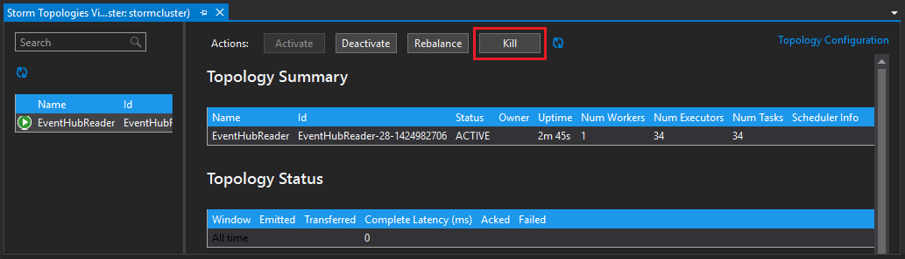

<properties
   pageTitle="處理從使用大量 HDInsight 上的事件集線器事件 |Microsoft Azure"
   description="瞭解如何使用 Visual Studio 中使用 HDInsight 工具的 Visual Studio 中建立的 C# 大量拓撲處理事件集線器資料。"
   services="hdinsight,notification hubs"
   documentationCenter=""
   authors="Blackmist"
   manager="jhubbard"
   editor="cgronlun"/>

<tags
   ms.service="hdinsight"
   ms.devlang="dotnet"
   ms.topic="article"
   ms.tgt_pltfrm="na"
   ms.workload="big-data"
   ms.date="10/27/2016"
   ms.author="larryfr"/>

# 從 Azure 事件集線器大量 HDInsight (C#) 上與處理程序事件

Azure 事件集線器可讓您處理大量網站、 應用程式和裝置中的資料。 事件集線器 spout 可讓您輕鬆地使用 Apache 大量上 HDInsight 分析此即時資料。 您也可以撰寫資料到事件從大量使用事件集線器螺栓。

在本教學課程中，您將學習如何建立使用 Azure 事件集線器的兩個拓撲使用 Visual studio HDInsight 工具安裝的 Visual Studio 範本。

* **EventHubWriter**︰ 隨機產生的資料，並將它寫入事件集線器

* **EventHubReader**︰ 從事件集線器讀取資料，並會記錄資料到大量記錄

> [AZURE.NOTE] 雖然這份文件中的步驟依賴 Windows 開發環境中具有 Visual Studio，Linux 或 Windows 型 HDInsight 叢集能提交編譯的專案。 僅限 Linux 為基礎建立叢集後 10/28 2016年支援 SCP.NET 拓撲。
>
> 若要使用的 C# 拓撲與 Linux 叢集，您必須更新 Microsoft.SCP.Net.SDK NuGet 套件由版本 0.10.0.6 專案或更新版本。 封裝的版本也必須符合大量 HDInsight 上安裝的主要版本。 例如，大量 HDInsight 版本 3.3 和 3.4 使用大量版本 0.10.x，而 HDInsight 3.5 是使用大量 1.0.x。
> 
> C# 拓撲 Linux 型叢集上的必須使用.NET 4.5，並使用單聲道 HDInsight 叢集上執行。 將使用的大部分項目，不過您應該檢查可能不相容的[單聲道相容性](http://www.mono-project.com/docs/about-mono/compatibility/)文件。
>
> Java 版本的 [此專案，也會使用 Linux 或 Windows 叢集，請參閱[從 Azure 事件集線器大量 HDInsight (Java) 上與處理程序事件](hdinsight-storm-develop-java-event-hub-topology.md)。

## 必要條件

* [HDInsight 叢集上 Apache 大量](hdinsight-apache-storm-tutorial-get-started.md)

* [Azure 事件中心](../event-hubs/event-hubs-csharp-ephcs-getstarted.md)

* [Azure.NET SDK](http://azure.microsoft.com/downloads/)

* [Visual Studio HDInsight 工具](hdinsight-hadoop-visual-studio-tools-get-started.md)

## 完成的專案

您可以下載從 GitHub 本教學課程中建立專案的完成版本︰ [eventhub-大量混合式部署](https://github.com/Azure-Samples/hdinsight-dotnet-java-storm-eventhub)。 不過，您仍需要透過下列步驟，在本教學課程提供設定的設定。

## 事件集線器 spout 和螺栓

事件集線器 spout 且 bolt Java 元件，可讓您輕鬆地處理從 Apache 大量的事件集線器。 雖然 java 寫這些元件，Visual Studio HDInsight 工具可讓您建立混合 C# 和 Java 元件的混合式拓撲。

Spout 和螺栓分散為單一 Java 封存 (.jar) 檔案命名**eventhubs-storm-spout-#.#-jar-with-dependencies.jar**，其中 #.# 是檔案的版本。

### 下載.jar 檔案

最新版的 jar 檔案會包含在資料夾底下的**文件庫/eventhubs** [HDInsight 大量範例](https://github.com/hdinsight/hdinsight-storm-examples)專案。 若要下載的檔案，請使用下列方法之一。

> [AZURE.NOTE] 包含在 Apache 大量專案已提交的 spout 及螺栓。 如需詳細資訊，請參閱[大量 583︰ 初始存回大量事件集線器](https://github.com/apache/storm/pull/336/files)GitHub 中。

* **下載 ZIP 檔案**︰ 從[HDInsight 大量範例](https://github.com/hdinsight/hdinsight-storm-examples)網站上，選取 [**下載 ZIP**下載.zip 檔案包含專案的右窗格中。

    ![下載 zip] 按鈕](./media/hdinsight-storm-develop-csharp-event-hub-topology/download.png)

    下載檔案後，您可以展開封存中，然後檔案會在**文件庫**的目錄。

* **複製專案**︰ 如果您有[給](http://git-scm.com/)安裝，請使用下列命令以複製存放庫，然後尋找該檔案**的文件庫**的目錄中。

        git clone https://github.com/hdinsight/hdinsight-storm-examples

## 設定事件集線器

事件集線器是這個範例中的資料來源。 使用[快速入門事件集線器](../event-hubs/event-hubs-csharp-ephcs-getstarted.md)文件中的 [__建立事件中心__] 區段中的資訊。

3. 建立事件中心之後，Azure 入口網站中檢視 EventHub 刀，然後選取 [__共用存取原則__。 您可以使用__+ 新增__項目，新增下列原則︰

  	| 名稱 | 權限 |
  	| ----- | ----- |
  	| 作者 | 傳送 |
  	| 閱讀程式 | 聆聽 |

    

5. 選取 [__讀取__和__寫入器__原則]。 複製並儲存稍後將會使用這兩個原則的__主索引鍵__值。

## 設定 EventHubWriter

1. 如果您在 Visual studio 並不安裝最新版的 HDInsight 工具，請參閱[開始使用 Visual Studio HDInsight 工具](hdinsight-hadoop-visual-studio-tools-get-started.md)。

2. 下載[混合大量 eventhub 式](https://github.com/Azure-Samples/hdinsight-dotnet-java-storm-eventhub)解決方案。 開啟方案，並需要一些時間進行查閱__EventHubWriter__專案的程式碼。

4. 在__EventHubWriter__專案中，開啟__App.config__檔案。 使用 [事件] 中心上您先前設定的資訊填入下列機碼的值︰

  	| 索引鍵 | 值 |
  	| ----- | ----- |
  	| EventHubPolicyName | 撰寫者 （如果您使用不同的名稱為_傳送_的權限的原則改為使用）。 |
  	| EventHubPolicyKey | 作者原則的鍵 |
  	| EventHubNamespace | 包含您的事件中樞的命名空間 |
  	| EventHubName | 您的事件中心名稱 |
  	| EventHubPartitionCount | 在您的事件中心的磁碟分割數目 |

4. 儲存並關閉**App.config**檔案。

## 設定 EventHubReader

1. 開啟__EventHubReader__專案及執行的程式碼的幾個 momoents。

2. 開啟__EventHubWriter__ __App.config__ 。 使用 [事件] 中心上您先前設定的資訊填入下列機碼的值︰

  	| 索引鍵 | 值 |
  	| ----- | ----- |
  	| EventHubPolicyName | 閱讀程式 （如果您使用不同名稱的_聆聽_權限的原則改為使用）。 |
  	| EventHubPolicyKey | 閱讀程式原則的鍵 |
  	| EventHubNamespace | 包含您的事件中樞的命名空間 |
  	| EventHubName | 您的事件中心名稱 |
  	| EventHubPartitionCount | 在您的事件中心的磁碟分割數目 |

3. 儲存並關閉**App.config**檔案。

## 部署拓撲

1. 從**方案總管**] 中，以滑鼠右鍵按一下**EventHubReader**專案並選取 [**提交]，在 HDInsight 大量**。

    

2. 在 [**送出拓撲**] 畫面中，選取 [**大量叢集**。 展開 [**其他設定**，選取**Java 檔案路徑**，選取**...**並選取包含**eventhubs-storm-spout-0.9-jar-with-dependencies.jar**下載的檔案，您先前的目錄。 最後，按一下 [**提交**]。

    ![送出] 對話方塊的圖像](./media/hdinsight-storm-develop-csharp-event-hub-topology/submit.png)

3. 當已提交拓撲時，會出現 [**大量拓撲檢視器**。 若要檢視的拓撲統計資料的左窗格中選取**EventHubReader**拓撲。 目前，不應該發生因為沒有事件已寫入事件集線器尚未。

    

4. 從**方案總管**] 中，以滑鼠右鍵按一下**EventHubWriter**專案並選取 [**提交]，在 HDInsight 大量**。

2. 在 [**送出拓撲**] 畫面中，選取 [**大量叢集**。 展開 [**其他設定** **Java 檔案路徑**，選取**...** ，然後選取選取包含您先前已下載的**eventhubs-storm-spout-0.9-jar-with-dependencies.jar**檔案的目錄。 最後，按一下 [**提交**]。

5. 當您已提交拓撲時，重新整理叢集上執行程式這兩個拓撲**大量拓撲檢視器**中的 [拓撲] 清單。

6. 在 [**大量拓撲檢視器**中，選取 [ **EventHubReader**拓撲]。

4. 在 [圖表] 檢視中，按兩下 [ __LogBolt__元件。 這會開啟螺栓__元件摘要__] 頁面。

3. 在 [__執行程式__] 區段中，選取 [__連接埠__] 欄中的連結。 這會顯示元件所記錄的資訊。 登入的資訊非常類似下列動作︰

        2016-10-20 13:26:44.186 m.s.s.b.ScpNetBolt [INFO] Processing tuple: source: com.microsoft.eventhubs.spout.EventHubSpout:7, stream: default, id: {5769732396213255808=520853934697489134}, [{"deviceId":3,"deviceValue":1379915540}]
        2016-10-20 13:26:44.234 m.s.s.b.ScpNetBolt [INFO] Processing tuple: source: com.microsoft.eventhubs.spout.EventHubSpout:7, stream: default, id: {7154038361491319965=4543766486572976404}, [{"deviceId":3,"deviceValue":459399321}]
        2016-10-20 13:26:44.335 m.s.s.b.ScpNetBolt [INFO] Processing tuple: source: com.microsoft.eventhubs.spout.EventHubSpout:6, stream: default, id: {513308780877039680=-7571211415704099042}, [{"deviceId":5,"deviceValue":845561159}]
        2016-10-20 13:26:44.445 m.s.s.b.ScpNetBolt [INFO] Processing tuple: source: com.microsoft.eventhubs.spout.EventHubSpout:7, stream: default, id: {-2409895457033895206=5479027861202203517}, [{"deviceId":8,"deviceValue":2105860655}]

## 停止拓撲

若要停止拓撲，在**大量拓撲檢視器**中，選取每個拓撲，然後按一下 [**刪除**]。

## 刪除叢集

[AZURE.INCLUDE [delete-cluster-warning](../../includes/hdinsight-delete-cluster-warning.md)]

## 備忘稿

### 檢查點

EventHubSpout 定期檢查點到動物園管理員節點，以節省郵件目前位移狀態從讀取佇列。 這個選項可讓開始在下列情況中接收郵件已儲存的位移元件︰

* 元件執行個體失敗，而是重新啟動。

* 您可以放大或縮小叢集藉由新增或移除節點。

* 拓撲遭，然後重新啟動**使用相同的名稱**。

您也可以匯出並持續檢查點匯入 WASB （Azure 儲存體使用 HDInsight 叢集。）若要執行此動作的指令碼位於 HDInsight 叢集，在**c:\apps\dist\storm-0.9.3.2.2.1.0-2340\zkdatatool-1.0\bin**上大量。

>[AZURE.NOTE] 大量叢集上所安裝的版本，可能會在未來變更時，可能會不同，路徑中的版本號碼。

在此目錄中的指令碼是︰

* **stormmeta_import.cmd**︰ 匯入所有大量中繼資料叢集預設存放容器動物園管理員。

* **stormmeta_export.cmd**︰ 所有大量中繼資料都匯出至叢集預設存放容器動物園管理員。

* **stormmeta_delete.cmd**︰ 從動物園管理員刪除所有大量中繼資料。

匯出匯入可讓您保存檢查點的資料，當您需要刪除叢集，但想要恢復處理從目前在中樞位移，當您將新的叢集恢復連線時。

> [AZURE.NOTE] 由於資料保存在預設存放容器，新叢集**必須**使用相同的儲存空間帳戶和容器和前一個叢集。

## 後續步驟

在此文件中，您已經學會如何使用 Java 事件集線器 Spout 和螺栓從 C# 拓撲使用 Azure 事件中心中的資料。 若要瞭解建立 C# 拓撲的詳細資訊，請參閱下列項目。

* [為 Apache 大量上 HDInsight 使用 Visual Studio 開發 C# 拓撲](hdinsight-storm-develop-csharp-visual-studio-topology.md)

* [SCP 程式設計指南](hdinsight-storm-scp-programming-guide.md)

* [在 HDInsight 大量的範例拓撲](hdinsight-storm-example-topology.md)
 
