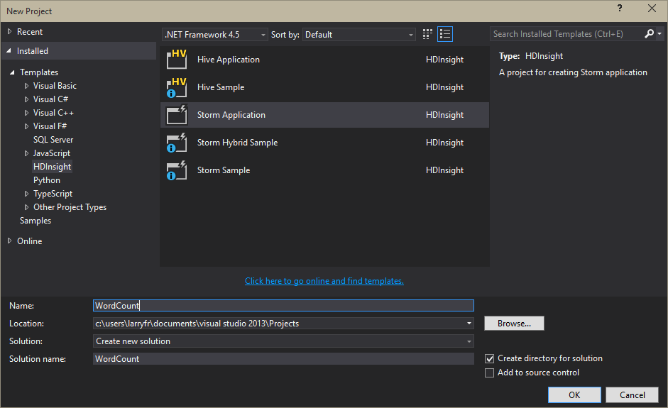

<properties
   pageTitle="使用 Visual Studio 及 C# Apache 大量拓撲 |Microsoft Azure"
   description="瞭解如何在 Visual Studio 中使用 HDInsight 工具的 Visual Studio 建立簡單的 word 計算拓撲中 C# 建立大量拓撲。"
   services="hdinsight"
   documentationCenter=""
   authors="Blackmist"
   manager="jhubbard"
   editor="cgronlun"
   tags="azure-portal"/>

<tags
   ms.service="hdinsight"
   ms.devlang="java"
   ms.topic="article"
   ms.tgt_pltfrm="na"
   ms.workload="big-data"
   ms.date="10/27/2016"
   ms.author="larryfr"/>

# 在 Visual studio 使用 Hadoop 工具 HDInsight Apache 大量開發 C# 拓撲

瞭解如何使用 Visual Studio HDInsight 工具來建立 C# 大量拓撲。 本教學課程引導 Visual Studio 中建立新的大量專案、 本機、 測試和部署到 HDInsight 叢集上 Apache 大量的程序。

您也會學習如何建立使用 C# 和 Java 元件的混合式拓撲。

> [AZURE.IMPORTANT] 雖然這份文件中的步驟依賴 Windows 開發環境中具有 Visual Studio，Linux 或 Windows 型 HDInsight 叢集能提交編譯的專案。 僅限 Linux 為基礎建立叢集後 10/28 2016年支援 SCP.NET 拓撲。
>
> 若要使用的 C# 拓撲與 Linux 叢集，您必須更新版本 0.10.0.6 使用您的專案或更高的 Microsoft.SCP.Net.SDK NuGet 套件。 封裝的版本也必須符合大量 HDInsight 上安裝的主要版本。 例如，大量 HDInsight 版本 3.3 和 3.4 使用大量版本 0.10.x，而 HDInsight 3.5 是使用大量 1.0.x。
> 
> C# 拓撲 Linux 型叢集上的必須使用.NET 4.5，並使用單聲道 HDInsight 叢集上執行。 將使用的大部分項目，不過您應該檢查可能不相容的[單聲道相容性](http://www.mono-project.com/docs/about-mono/compatibility/)文件。

## 必要條件

- Visual Studio 下列版本之一

    - 使用[更新 4](http://www.microsoft.com/download/details.aspx?id=39305)的 visual Studio 2012

    - Visual Studio 2013[更新 4](http://www.microsoft.com/download/details.aspx?id=44921)或[Visual Studio 2013 社群](http://go.microsoft.com/fwlink/?LinkId=517284)

    - Visual Studio 2015 或[Visual Studio 2015 社群](https://go.microsoft.com/fwlink/?LinkId=532606)

- Azure SDK 2.9.5 或更新版本

- Visual Studio HDInsight 工具︰ 請參閱安裝並設定 Visual Studio HDInsight 工具的 [[開始使用 Visual Studio HDInsight 工具](hdinsight-hadoop-visual-studio-tools-get-started.md)。

    > [AZURE.NOTE] Visual Studio HDInsight 工具不支援在 Visual Studio Express

-   HDInsight 叢集上 Apache 大量︰ 請參閱[快速入門上 HDInsight Apache 大量](hdinsight-apache-storm-tutorial-get-started.md)的步驟來建立叢集。

## 範本

Visual Studio HDInsight 工具提供下列範本︰

| 專案類型 | 示範 |
| ------------ | ------------- |
| 大量應用程式 | 空白的大量拓撲專案 |
| 大量 Azure SQL 作者範例 | 如何寫入 Azure SQL 資料庫 |
| 大量 DocumentDB 閱讀程式範例 | 如何從 Azure DocumentDB 讀取 |
| 大量 DocumentDB 作者範例 | 如何寫入 Azure DocumentDB |
| 大量 EventHub 閱讀程式範例 | 如何從 Azure 事件集線器讀取 |
| 大量 EventHub 作者範例 | 如何寫入 Azure 事件集線器 |
| 大量 HBase 閱讀程式範例 | 如何從 HDInsight 上 HBase 讀取叢集 |
| 大量 HBase 作者範例 | 如何寫入 HBase HDInsight 叢集上 |
| 大量混合式範例 | 如何使用 Java 元件 |
| 大量範例 | 基本 word 計算拓撲 |

> [AZURE.NOTE] HBase 讀取和寫入器範例使用 HBase REST API 與 HDInsight 叢集，不 HBase Java API 上 HBase 通訊。

這份文件中的步驟，您會建立新的拓撲使用基本的大量應用程式專案類型。

## 建立 C# 拓撲

1. 如果您在 Visual studio 並不安裝最新版的 HDInsight 工具，請參閱[開始使用 Visual Studio HDInsight 工具](hdinsight-hadoop-visual-studio-tools-get-started.md)。

2. 開啟 Visual Studio 中，選取**檔案** > **新增**]，然後按一下 [**專案**。

3. 從**新的專案**] 畫面中，展開 [**已安裝** > **範本**，然後選取**HDInsight**。 從範本清單中，選取 [**大量應用程式**]。 在畫面底部輸入**WordCount**作為應用程式的名稱。

    

4. 建立專案後，您應該有下列檔案︰

    - **Program.cs**︰ 定義專案拓撲。 請注意，預設會建立一個 spout 和一個螺栓組成的預設拓撲。

    - **Spout.cs**: 範例 spout 發出隨機數字。

    - **Bolt.cs**: 範例螺栓保持 spout 所發出的數字的計數。

    建立專案的一部分，就會從 NuGet 下載最新的[SCP.NET 套件](https://www.nuget.org/packages/Microsoft.SCP.Net.SDK/)。

    [AZURE.INCLUDE [scp.net version important](../../includes/hdinsight-storm-scpdotnet-version.md)]

在下一個區段中，您將修改此專案至基本 WordCount 應用程式。

### 實作 spout

1. 開啟**Spout.cs**。 Spouts 用來從外部來源讀取拓撲中的資料。 是 spout 的主要元件︰

    - **NextTuple**︰ 時發出新 tuple 允許 spout 大量呼叫。

    - **Ack**（僅限交易拓撲）︰ 控點的寄件者此 spout tuple 拓撲中的其他元件發起的租用戶的通知。 認可，表示 tuple 可讓知道其已成功處理下游元件 spout。

    - **失敗**（僅限交易拓撲）︰ 處理 tuple 的會失敗處理拓撲中的其他元件。 這會提供機會，在重新發出 tuple，使其可以再次處理。

2. 取代下列**Spout**類別的內容。 這樣會建立隨機到拓撲發出句子 spout。

        private Context ctx;
        private Random r = new Random();
        string[] sentences = new string[] {
            "the cow jumped over the moon",
            "an apple a day keeps the doctor away",
            "four score and seven years ago",
            "snow white and the seven dwarfs",
            "i am at two with nature"
        };

        public Spout(Context ctx)
        {
            // Set the instance context
            this.ctx = ctx;

            Context.Logger.Info("Generator constructor called");

            // Declare Output schema
            Dictionary<string, List<Type>> outputSchema = new Dictionary<string, List<Type>>();
            // The schema for the default output stream is
            // a tuple that contains a string field
            outputSchema.Add("default", new List<Type>() { typeof(string) });
            this.ctx.DeclareComponentSchema(new ComponentStreamSchema(null, outputSchema));
        }

        // Get an instance of the spout
        public static Spout Get(Context ctx, Dictionary<string, Object> parms)
        {
            return new Spout(ctx);
        }

        public void NextTuple(Dictionary<string, Object> parms)
        {
            Context.Logger.Info("NextTuple enter");
            // The sentence to be emitted
            string sentence;

            // Get a random sentence
            sentence = sentences[r.Next(0, sentences.Length - 1)];
            Context.Logger.Info("Emit: {0}", sentence);
            // Emit it
            this.ctx.Emit(new Values(sentence));

            Context.Logger.Info("NextTuple exit");
        }

        public void Ack(long seqId, Dictionary<string, Object> parms)
        {
            // Only used for transactional topologies
        }

        public void Fail(long seqId, Dictionary<string, Object> parms)
        {
            // Only used for transactional topologies
        }
    
    花點時間閱讀以瞭解此程式碼的註解。

### 實作螺栓

1. 刪除專案中的現有**Bolt.cs**檔案。

2. 在**方案總管]**中，以滑鼠右鍵按一下專案，然後選取 [**新增** > **新項目**。 從清單中，選取**大量螺栓**，然後輸入**Splitter.cs**作為的名稱。 重複此建立第二個命名 bolt **Counter.cs**。

    - **Splitter.cs**︰ 實作，否則將句子分割成個別的單字，並會發出新的資料流的文字。

    - **Counter.cs**︰ 實作螺栓的會計算每個單字，並會發出的單字及計算每個單字的新資料流。

    > [AZURE.NOTE] 這些螺栓只要讀取和寫入資料流，但您也可以使用螺栓進行通訊的來源，例如資料庫或服務。

3. 開啟**Splitter.cs**。 只有一個方法有預設的附註︰**執行**。 這稱為螺栓收到進行處理，表示 tuple 時。 在這裡，您可以讀取和處理內送的 tuple 發出輸出 tuple。

4. 取代下列程式碼**分割**類別的內容︰

        private Context ctx;

        // Constructor
        public Splitter(Context ctx)
        {
            Context.Logger.Info("Splitter constructor called");
            this.ctx = ctx;

            // Declare Input and Output schemas
            Dictionary<string, List<Type>> inputSchema = new Dictionary<string, List<Type>>();
            // Input contains a tuple with a string field (the sentence)
            inputSchema.Add("default", new List<Type>() { typeof(string) });
            Dictionary<string, List<Type>> outputSchema = new Dictionary<string, List<Type>>();
            // Outbound contains a tuple with a string field (the word)
            outputSchema.Add("default", new List<Type>() { typeof(string) });
            this.ctx.DeclareComponentSchema(new ComponentStreamSchema(inputSchema, outputSchema));
        }

        // Get a new instance of the bolt
        public static Splitter Get(Context ctx, Dictionary<string, Object> parms)
        {
            return new Splitter(ctx);
        }

        // Called when a new tuple is available
        public void Execute(SCPTuple tuple)
        {
            Context.Logger.Info("Execute enter");

            // Get the sentence from the tuple
            string sentence = tuple.GetString(0);
            // Split at space characters
            foreach (string word in sentence.Split(' '))
            {
                Context.Logger.Info("Emit: {0}", word);
                //Emit each word
                this.ctx.Emit(new Values(word));
            }

            Context.Logger.Info("Execute exit");
        }

    花點時間閱讀以瞭解此程式碼的註解。

5. 開啟**Counter.cs** ，並以下列取代課程內容︰

        private Context ctx;

        // Dictionary for holding words and counts
        private Dictionary<string, int> counts = new Dictionary<string, int>();

        // Constructor
        public Counter(Context ctx)
        {
            Context.Logger.Info("Counter constructor called");
            // Set instance context
            this.ctx = ctx;

            // Declare Input and Output schemas
            Dictionary<string, List<Type>> inputSchema = new Dictionary<string, List<Type>>();
            // A tuple containing a string field - the word
            inputSchema.Add("default", new List<Type>() { typeof(string) });

            Dictionary<string, List<Type>> outputSchema = new Dictionary<string, List<Type>>();
            // A tuple containing a string and integer field - the word and the word count
            outputSchema.Add("default", new List<Type>() { typeof(string), typeof(int) });
            this.ctx.DeclareComponentSchema(new ComponentStreamSchema(inputSchema, outputSchema));
        }

        // Get a new instance
        public static Counter Get(Context ctx, Dictionary<string, Object> parms)
        {
            return new Counter(ctx);
        }

        // Called when a new tuple is available
        public void Execute(SCPTuple tuple)
        {
            Context.Logger.Info("Execute enter");

            // Get the word from the tuple
            string word = tuple.GetString(0);
            // Do we already have an entry for the word in the dictionary?
            // If no, create one with a count of 0
            int count = counts.ContainsKey(word) ? counts[word] : 0;
            // Increment the count
            count++;
            // Update the count in the dictionary
            counts[word] = count;

            Context.Logger.Info("Emit: {0}, count: {1}", word, count);
            // Emit the word and count information
            this.ctx.Emit(Constants.DEFAULT_STREAM_ID, new List<SCPTuple> { tuple }, new Values(word, count));
            Context.Logger.Info("Execute exit");
        }

    花點時間閱讀以瞭解此程式碼的註解。

### 定義拓撲

Spouts 螺栓被以定義資料如何流動元件間圖形。 此拓撲，該圖表的如下所示︰

句子會發出 spout，其中分配給分割螺栓的執行個體。 分割螺栓分成分配給計數器螺栓的單字的句子。

[計數器執行個體中保留本機字數統計，因為我們想要確定特定文字流程相同的 [計數器螺栓執行個體，因此我們只有一個執行個體追蹤的特定的文字。 但分割螺栓，為真的不論哪些螺栓收到的句子，因此我們只想要跨這些執行個體負載平衡句子。

開啟**Program.cs**。 最重要的方法是**GetTopologyBuilder**，這用來定義大量拓撲已送出。 取代實作先前所述的拓撲下列程式碼的**GetTopologyBuilder**內容︰

        // Create a new topology named 'WordCount'
        TopologyBuilder topologyBuilder = new TopologyBuilder("WordCount" + DateTime.Now.ToString("yyyyMMddHHmmss"));

        // Add the spout to the topology.
        // Name the component 'sentences'
        // Name the field that is emitted as 'sentence'
        topologyBuilder.SetSpout(
            "sentences",
            Spout.Get,
            new Dictionary<string, List<string>>()
            {
                {Constants.DEFAULT_STREAM_ID, new List<string>(){"sentence"}}
            },
            1);
        // Add the splitter bolt to the topology.
        // Name the component 'splitter'
        // Name the field that is emitted 'word'
        // Use suffleGrouping to distribute incoming tuples
        //   from the 'sentences' spout across instances
        //   of the splitter
        topologyBuilder.SetBolt(
            "splitter",
            Splitter.Get,
            new Dictionary<string, List<string>>()
            {
                {Constants.DEFAULT_STREAM_ID, new List<string>(){"word"}}
            },
            1).shuffleGrouping("sentences");

        // Add the counter bolt to the topology.
        // Name the component 'counter'
        // Name the fields that are emitted 'word' and 'count'
        // Use fieldsGrouping to ensure that tuples are routed
        //   to counter instances based on the contents of field
        //   position 0 (the word). This could also have been
        //   List<string>(){"word"}.
        //   This ensures that the word 'jumped', for example, will always
        //   go to the same instance
        topologyBuilder.SetBolt(
            "counter",
            Counter.Get,
            new Dictionary<string, List<string>>()
            {
                {Constants.DEFAULT_STREAM_ID, new List<string>(){"word", "count"}}
            },
            1).fieldsGrouping("splitter", new List<int>() { 0 });

        // Add topology config
        topologyBuilder.SetTopologyConfig(new Dictionary<string, string>()
        {
            {"topology.kryo.register","[\"[B\"]"}
        });

        return topologyBuilder;

花點時間閱讀以瞭解此程式碼的註解。

## 送出拓撲

1. 在**方案總管] 中**的專案，以滑鼠右鍵按一下，然後選取 [**提交]，在 HDInsight 大量**。

    > [AZURE.NOTE] 如果出現提示，請輸入 Azure 訂閱登入認證。 如果您有多個訂閱，請登入包含您大量 HDInsight 叢集上的項目。

2. 從 [**大量叢集**] 下拉式清單中，選取您大量 HDInsight 叢集上的，然後選取 [**提交]**。 您可以監視送出成功時使用**輸出**視窗。

3. 當您順利提交拓撲時，**大量拓撲**叢集應該會出現。 選取**WordCount**拓撲從清單檢視執行拓撲的相關資訊。

    > [AZURE.NOTE] 您也可以檢視從**伺服器總管****大量拓撲**︰ 展開**Azure** > **HDInsight**，大量 HDInsight 叢集上的以滑鼠右鍵按一下，然後選取 [**檢視大量拓撲**。

    您可以使用 [spouts 或螺栓的連結可檢視下列元件的相關資訊。 每一個選取的項目，就會開啟新視窗。

4. 從 [**拓撲摘要**] 檢視中，按一下 [停止拓撲的 [**刪除**]。

    > [AZURE.NOTE] 大量拓撲繼續執行，直到都已停用，或刪除叢集。

## 交易拓撲

上一個拓撲是非交易。 內拓撲元件實作重新顯示的訊息，如果處理失敗拓撲元件任何功能。 針對範例交易的拓撲，建立新專案並選取**大量範例**專案類型。

交易拓撲實作支援的資料重新執行下列動作︰

- **中繼資料快取**︰ spout 必須將發出，讓資料可以擷取並再次發出發生故障資料的相關資訊的中繼資料儲存。 範例所發出的資料很小，因為重新執行字典中儲存的每個 tuple 的原始資料。

- **Ack**︰ 撥打拓撲中的每個螺栓`this.ctx.Ack(tuple)`ack 其已成功處理，表示 tuple。 當所有螺栓都有 acked tuple，`Ack`叫用 spout 的方法。 這個選項可讓 spout，若要移除重新執行的快取的資料，因為完全處理資料。

- **失敗**︰ 撥打每個螺栓`this.ctx.Fail(tuple)`表示處理失敗，表示 tuple 的。 失敗傳播到`Fail`spout，其中 tuple 可以重新執行使用的方法快取的中繼資料。

- **依序識別碼**︰ 時發出，表示 tuple，可以指定順序識別碼。 應該是識別重新執行 （Ack 和失敗） 處理 tuple 的值。 例如，在**大量範例**專案 spout 會使用下列時發出資料︰

        this.ctx.Emit(Constants.DEFAULT_STREAM_ID, new Values(sentence), lastSeqId);

    這會發出新 tuple 包含預設資料流句子**lastSeqId**中所包含的順序識別碼值。 例如，只會發出每個表示 tuple 的遞增**lastSeqId** 。

**大量範例**專案所示，交易元件是否可以在執行階段設定，根據設定。

## 混合式拓撲

Visual Studio HDInsight 工具也可用來建立混合式拓撲的部分元件 C#，而有些 Java。

範例混合式拓撲，建立新專案，並選取**大量混合式範例**。 這樣會建立包含數個示範的拓撲完全註解的範例︰

- **Java spout**及**C# 螺栓**︰ **HybridTopology_javaSpout_csharpBolt**中定義

    - 在**HybridTopologyTx_javaSpout_csharpBolt**中定義的交易的版本

- **C# spout**和**Java 螺栓**︰ **HybridTopology_csharpSpout_javaBolt**中定義

    - 在**HybridTopologyTx_csharpSpout_javaBolt**中定義的交易版本

        > [AZURE.NOTE] 此版本也會示範如何使用 Clojure 程式碼的文字檔案，為 Java 元件。

送出專案時，會使用拓撲之間切換，即可移動`[Active(true)]`至您想要使用叢集送出之前拓撲陳述式。

> [AZURE.NOTE] 所需的所有 Java 檔案會都提供為此專案**JavaDependency**資料夾中的一部分。

請考慮下列時建立及提交的混合式拓撲︰

- 若要建立新類別的執行個體 Java spout 或螺栓必須使用**JavaComponentConstructor** 。

- **microsoft.scp.storm.multilang.CustomizedInteropJSONSerializer**應用於序列化中的資料或登出 JSON 從 Java 物件 Java 元件。

- 當提交到伺服器拓撲，您必須使用**其他設定**選項來指定**Java 檔案路徑**。 指定的路徑應包含 JAR 檔案包含您 Java 類別目錄。

### Azure 事件集線器

SCP.Net 版 0.9.4.203 介紹新的類別，然後在專為使用事件中心 Spout (可讀取事件中心 Java spout。) 的方法建立時使用此 spout 拓撲，請使用下列方法︰

- **EventHubSpoutConfig**課程︰ 建立包含 spout 元件設定的物件

- **TopologyBuilder.SetEventHubSpout**方法︰ 將事件中心 Spout 的元件加入至拓撲

> [AZURE.NOTE] 當這些更容易使用事件中心 Spout 比其他 Java 元件時，還是必須使用 CustomizedInteropJSONSerializer 序列化 spout 所產生的資料。

## 使用 ConfigurationManager

不使用 ConfigurationManager 抓取設定值，否則和 spout 元件。這會導致 null 指標例外狀況。 不過，為您的專案設定傳遞至大量拓撲當做金鑰/值組拓撲內容中。 每個元件所使用的設定值必須從擷取內容初始化期間。

下列程式碼會示範如何擷取以下值︰

    public class MyComponent : ISCPBolt
    {
        // To hold configuration information loaded from context
        Configuration configuration;
        ...
        public MyComponent(Context ctx, Dictionary<string, Object> parms)
        {
            // Save a copy of the context for this component instance
            this.ctx = ctx;
            // If it exists, load the configuration for the component
            if(parms.ContainsKey(Constants.USER_CONFIG))
            {
                this.configuration = parms[Constants.USER_CONFIG] as System.Configuration.Configuration;
            }
            // Retrieve the value of "Foo" from configuration
            var foo = this.configuration.AppSettings.Settings["Foo"].Value;
        }
        ...
    }

如果您是使用`Get`方法來傳回執行個體的元件，您必須確定它將兩者`Context`和`Dictionary<string, Object>`建構函式的參數。 下列範例是基本`Get`適當地將這些值傳遞的方法︰

    public static MyComponent Get(Context ctx, Dictionary<string, Object> parms)
    {
        return new MyComponent(ctx, parms);
    }

## 如何更新 SCP.NET

最新版本的 SCP.NET 支援透過 NuGet 套件升級。 當有新的更新時，您會收到升級通知。 若要手動檢查升級，請執行下列步驟︰

1. 在**方案總管]**中，以滑鼠右鍵按一下專案，然後選取 [**管理 NuGet 套件**。

2. 從套件管理員] 中，選取 [**更新**]。 如果有可用的更新，會列出。 按一下 [**更新**] 按鈕，以將其安裝套件。

> [AZURE.IMPORTANT] 如果您的專案建立的其中一個套件更新使用 NuGet SCP.NET 舊版，您必須執行下列步驟，以更新為最新的版本︰
>
> 1. 在**方案總管]**中，以滑鼠右鍵按一下專案，然後選取 [**管理 NuGet 套件**。
> 2. 使用 [**搜尋**] 欄位，搜尋，並再新增到專案**Microsoft.SCP.Net.SDK** 。

## 疑難排解

### Null 指標例外狀況

使用 Linux 為基礎的 HDInsight 叢集 C# 拓撲，請閃電，spout 使用 ConfigurationManager 讀取在執行階段設定的設定，可能會傳回 null 指標例外狀況的元件。 這是因為載入網域設定不包含專案的組件中。

設定專案當做在拓撲中索引鍵/值組傳入大量拓撲，並且可以擷取從時初始會傳遞給您的元件的字典物件。

下列範例會示範從拓撲內容載入的設定值，請參閱本文件[ConfigurationManager](#configurationmanager)一節。

### System.TypeLoadException

使用時的 C# 拓撲與 Linux 型 HDInsight 叢集，您可能會發生下列錯誤︰

    System.TypeLoadException: Failure has occurred while loading a type.

這通常是使用二進位時，就會發生的不相容的.NET 單聲道支援的版本。

針對 Linux 為基礎的 HDInsight 叢集，請確定您的專案使用的.NET 4.5 編譯二進位檔案。

### 測試本機的拓撲

雖然很容易部署拓撲叢集，在某些情況下，您可能需要測試本機的拓撲。 使用下列步驟執行，以及在本教學課程本機的開發環境中測試範例拓撲。

> [AZURE.WARNING] 本機測試只適用於基本、 C# 只拓撲。 您不應使用本機測試混合式拓撲或拓撲使用多個資料流時，您會收到錯誤。

1. 在**方案總管] 中**的專案，以滑鼠右鍵按一下，然後選取 [**內容]**。 在 [專案屬性]，變更**輸出類型****主控台**應用程式。

    

    > [AZURE.NOTE] 請記得要部署拓撲叢集之前，變更**輸出類型**回到**課程文件庫**。

2. 在**方案總管] 中**的專案，以滑鼠右鍵按一下，然後選取 [**新增** > **新項目**。 選取**類別**，然後輸入類別名稱**LocalTest.cs** 。 最後，按一下 [**新增**]。

3. 開啟**LocalTest.cs** ，並在頂端新增下列**使用**陳述式︰

        using Microsoft.SCP;

4. 使用下列做為**LocalTest**類別的內容︰

        // Drives the topology components
        public void RunTestCase()
        {
            // An empty dictionary for use when creating components
            Dictionary<string, Object> emptyDictionary = new Dictionary<string, object>();

            #region Test the spout
            {
                Console.WriteLine("Starting spout");
                // LocalContext is a local-mode context that can be used to initialize
                // components in the development environment.
                LocalContext spoutCtx = LocalContext.Get();
                // Get a new instance of the spout, using the local context
                Spout sentences = Spout.Get(spoutCtx, emptyDictionary);

                // Emit 10 tuples
                for (int i = 0; i < 10; i++)
                {
                    sentences.NextTuple(emptyDictionary);
                }
                // Use LocalContext to persist the data stream to file
                spoutCtx.WriteMsgQueueToFile("sentences.txt");
                Console.WriteLine("Spout finished");
            }
            #endregion

            #region Test the splitter bolt
            {
                Console.WriteLine("Starting splitter bolt");
                // LocalContext is a local-mode context that can be used to initialize
                // components in the development environment.
                LocalContext splitterCtx = LocalContext.Get();
                // Get a new instance of the bolt
                Splitter splitter = Splitter.Get(splitterCtx, emptyDictionary);

                // Set the data stream to the data created by the spout
                splitterCtx.ReadFromFileToMsgQueue("sentences.txt");
                // Get a batch of tuples from the stream
                List<SCPTuple> batch = splitterCtx.RecvFromMsgQueue();
                // Process each tuple in the batch
                foreach (SCPTuple tuple in batch)
                {
                    splitter.Execute(tuple);
                }
                // Use LocalContext to persist the data stream to file
                splitterCtx.WriteMsgQueueToFile("splitter.txt");
                Console.WriteLine("Splitter bolt finished");
            }
            #endregion

            #region Test the counter bolt
            {
                Console.WriteLine("Starting counter bolt");
                // LocalContext is a local-mode context that can be used to initialize
                // components in the development environment.
                LocalContext counterCtx = LocalContext.Get();
                // Get a new instance of the bolt
                Counter counter = Counter.Get(counterCtx, emptyDictionary);

                // Set the data stream to the data created by splitter bolt
                counterCtx.ReadFromFileToMsgQueue("splitter.txt");
                // Get a batch of tuples from the stream
                List<SCPTuple> batch = counterCtx.RecvFromMsgQueue();
                // Process each tuple in the batch
                foreach (SCPTuple tuple in batch)
                {
                    counter.Execute(tuple);
                }
                // Use LocalContext to persist the data stream to file
                counterCtx.WriteMsgQueueToFile("counter.txt");
                Console.WriteLine("Counter bolt finished");
            }
            #endregion
        }

    花點時間閱讀程式碼註解。 此程式碼元件執行中的開發環境中，使用**LocalContext** ，它保存在本機磁碟機上的文字檔案的元件之間的資料流。

5. 開啟**Program.cs** ，然後將下列文字新增至**主要**的方法︰

        Console.WriteLine("Starting tests");
        System.Environment.SetEnvironmentVariable("microsoft.scp.logPrefix", "WordCount-LocalTest");
        // Initialize the runtime
        SCPRuntime.Initialize();

        //If we are not running under the local context, throw an error
        if (Context.pluginType != SCPPluginType.SCP_NET_LOCAL)
        {
            throw new Exception(string.Format("unexpected pluginType: {0}", Context.pluginType));
        }
        // Create test instance
        LocalTest tests = new LocalTest();
        // Run tests
        tests.RunTestCase();
        Console.WriteLine("Tests finished");
        Console.ReadKey();

6. 儲存變更，然後按一下 [ **F5**或選取 [**偵錯** > **啟動偵錯**啟動專案。 主控台視窗應該出現，並以測試進度登狀態。 **測試完成**出現時，請按任一按鍵將關閉視窗。

7. 使用**Windows 檔案總管**] 找出包含您的專案，例如目錄**C:\Users\<your_user_name > \Documents\Visual Studio 2013\Projects\WordCount\WordCount**。 在目錄中，開啟**回收筒**]，然後按一下**偵錯**。 您應該會看到的測試執行時所產生的文字檔案︰ sentences.txt counter.txt，與 splitter.txt。 開啟每個文字檔案，並檢查資料。

    > [AZURE.NOTE] 字串資料會保存為這些檔案中的十進位值的陣列。 例如， \[[97,103,111]] 中**splitter.txt**檔案是 「 and 」。

雖然測試基本的 word 計算本機應用程式是不重要，實際值是當您有複雜的拓撲與外部資料來源進行通訊，或執行複雜的資料分析。 當您正在處理這類專案時，您可能需要設定中斷點和逐步執行，在您隔離問題的元件。

> [AZURE.NOTE] 請務必部署到 HDInsight 叢集上大量前，將**專案類型**設回**類別文件庫**。

### 記錄資訊

您可以輕鬆地登入資訊與拓撲元件使用`Context.Logger`。 例如，下列將會建立資訊的記錄項目︰

    Context.Logger.Info("Component started");

登入的資訊可從**Hadoop 服務記錄檔**，可找到**伺服器總管**] 中檢視。 展開的 HDInsight 叢集上您大量的項目，然後展開**Hadoop 服務記錄檔**]。 最後，選取要檢視的記錄檔。

> [AZURE.NOTE] 記錄會儲存在可供您叢集 Azure 儲存體帳戶。 如果這是您已登入與 Visual Studio 以外的不同的訂閱，必須先登入至含有要檢視此資訊儲存帳戶的訂閱。

### 檢視錯誤資訊

若要檢視執行拓撲中所發生的錯誤，請使用下列步驟︰

1. 從**伺服器總管**] 中，以滑鼠右鍵按一下 HDInsight 叢集上的大量並選取**檢視大量拓撲**。

2. **Spout**和**螺栓**，**最後一個錯誤**欄必須最後一個發生錯誤的詳細資訊。

3. 選取**Spout Id**或**螺栓識別碼**列出發生錯誤的元件。 在顯示的詳細資料頁面，其他錯誤資訊會列在頁面底部的 [**錯誤**] 區段。

4. 若要取得詳細資訊，請從的前幾分鐘，查看 [大量工作者登入頁面的 [**執行程式**] 區段中選取**連接埠**。

## 後續步驟

現在，您已經學會如何開發並為 Visual Studio 中部署大量拓撲 HDInsight 工具，瞭解如何[從 HDInsight 上大量與 Azure 事件中心的程序事件](hdinsight-storm-develop-csharp-event-hub-topology.md)。

如需將資料流資料分割成多個資料流 C# 拓撲的範例，請參閱[C# 大量範例](https://github.com/Blackmist/csharp-storm-example)。

若要找出建立 C# 拓撲的相關資訊，請造訪[SCP.NET GettingStarted.md](https://github.com/hdinsight/hdinsight-storm-examples/blob/master/SCPNet-GettingStarted.md)。

更多的方法，使用 HDInsight 及更多大量 HDinsight 範例，請參閱下列動作︰

**Microsoft SCP.NET**

* [SCP 程式設計指南](hdinsight-storm-scp-programming-guide.md)

**在 HDInsight Apache 大量**

- [部署，並監控與上 HDInsight Apache 大量的拓撲](hdinsight-storm-deploy-monitor-topology.md)

- [在 HDInsight 大量的範例拓撲](hdinsight-storm-example-topology.md)

**在 HDInsight Apache Hadoop**

- [使用上 HDInsight Hadoop 登錄區](hdinsight-use-hive.md)

- [Hadoop HDInsight 上搭配使用的豬](hdinsight-use-pig.md)

- [使用上 HDInsight Hadoop MapReduce](hdinsight-use-mapreduce.md)

**在 HDInsight Apache HBase**

- [在 HDInsight HBase 快速入門](hdinsight-hbase-tutorial-get-started.md)
