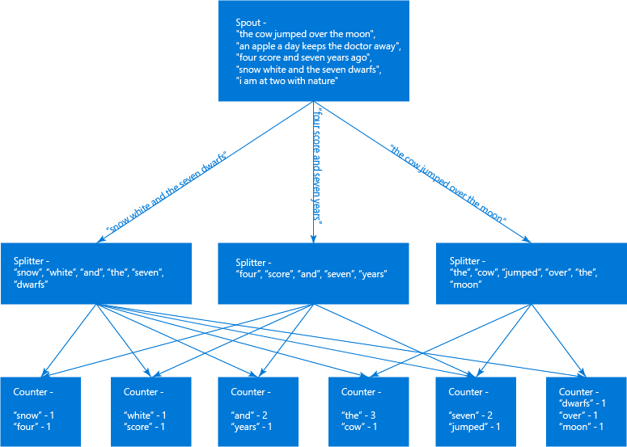

<properties
   pageTitle="開發 Apache 大量 java 拓撲 |Microsoft Azure"
   description="瞭解如何建立簡單的 word 計算拓撲 java 建立大量拓撲。"
   services="hdinsight"
   documentationCenter=""
   authors="Blackmist"
   manager="jhubbard"
   editor="cgronlun"
    tags="azure-portal"/>

<tags
   ms.service="hdinsight"
   ms.devlang="java"
   ms.topic="article"
   ms.tgt_pltfrm="na"
   ms.workload="big-data"
   ms.date="09/14/2016"
   ms.author="larryfr"/>

#開發 java Apache 大量與上 HDInsight Maven 基本的字數統計應用程式的拓撲

瞭解如何建立使用 Maven Java 為基礎的拓撲 Apache 大量 HDInsight 上。 您會逐步執行的程序建立基本的字數統計應用程式使用 Maven 和 Java，拓撲 Java 中定義的位置。 然後，您將學習如何定義拓撲使用不斷流動架構。

> [AZURE.NOTE] 不斷流動架構，是提供大量 0.10.0 或更新版本。 HDInsight 3.3 與 3.4 使用大量 0.10.0。

完成文件中的步驟之後，您會有您可以將部署上 HDInsight Apache 大量的基本拓撲。

> [AZURE.NOTE] 在這份文件中建立拓撲的完成的版本的[https://github.com/Azure-Samples/hdinsight-java-storm-wordcount](https://github.com/Azure-Samples/hdinsight-java-storm-wordcount)。

##必要條件

* <a href="https://www.oracle.com/technetwork/java/javase/downloads/jdk7-downloads-1880260.html" target="_blank">Java 開發人員套件 (JDK) 版本 7</a>

* <a href="https://maven.apache.org/download.cgi" target="_blank">Maven</a>: Maven 是 Java 專案的專案建立系統。

* 在 「 記事本 」，等文字編輯器<a href="http://www.gnu.org/software/emacs/" target="_blank">Emacs<a>，<a href="http://www.sublimetext.com/" target="_blank">適文字</a>、 <a href="https://atom.io/" target="_blank">Atom.io</a> <a href="http://brackets.io/" target="_blank">Brackets.io</a>。 您可以使用整合式的開發環境 (IDE)，例如<a href="https://eclipse.org/" target="_blank">蝕</a>(Luna 版本或更新版本)。

    > [AZURE.NOTE] 您的編輯器或 IDE 可能需要使用 Maven 不傳送此文件中的特定功能。 編輯環境的功能的相關資訊，請參閱您所使用的產品文件。

##設定環境變數

當您安裝 Java 和 JDK 時，可以設定下列環境變數。 不過，您應該檢查其存在於，並在其包含您的系統的正確值。

* **JAVA_HOME** -指向 Java 執行階段環境 (JRE) 安裝目錄。 例如，Unix 或 Linux 的通訊群組，它應該的值類似`/usr/lib/jvm/java-7-oracle`。 在 Windows 中，它會有類似值`c:\Program Files (x86)\Java\jre1.7`

* **路徑**-應該包含下列路徑︰

    * **JAVA_HOME**（或相當於路徑）

    * **JAVA_HOME\bin**（或相當於路徑）

    * 安裝 Maven 目錄

##建立新的 Maven 專案

從命令列，請使用下列程式碼，建立新名為**WordCount**Maven 專案︰

    mvn archetype:generate -DarchetypeArtifactId=maven-archetype-quickstart -DgroupId=com.microsoft.example -DartifactId=WordCount -DinteractiveMode=false

這會建立新名為**WordCount**在目前的位置，其中包含基本 Maven 專案的目錄。

**WordCount**目錄會包含下列項目︰

* **pom.xml**︰ 包含 Maven 專案的設定。

* **src\main\java\com\microsoft\example**︰ 包含您的應用程式碼。

* **src\test\java\com\microsoft\example**︰ 包含測試您的應用程式。 例如，我們將無法建立測試。

###移除範例的程式碼

我們會建立應用程式，因為刪除產生的測試應用程式檔案︰

*  **src\test\java\com\microsoft\example\AppTest.java**

*  **src\main\java\com\microsoft\example\App.java**

##新增內容

Maven 可讓您定義專案層級稱為屬性的值。 在`<url>http://maven.apache.org</url>`行︰

    <properties>
        <project.build.sourceEncoding>UTF-8</project.build.sourceEncoding>
        <!--
        Storm 0.10.0 is for HDInsight 3.3 and 3.4.
        To find the version information for earlier HDInsight cluster
        versions, see https://azure.microsoft.com/en-us/documentation/articles/hdinsight-component-versioning/
        -->
        <storm.version>0.10.0</storm.version>
    </properties>

我們現在可以使用這些值中其他節。 例如，當指定大量元件的版本，我們可以使用`${storm.version}`，而不是硬式編碼值。

##新增相依性

這是大量拓撲，因為您必須新增大量元件的相依性。 開啟**pom.xml**檔案，並新增下列程式碼中的**&lt;相依性 >**區段︰

    <dependency>
      <groupId>org.apache.storm</groupId>
      <artifactId>storm-core</artifactId>
      <version>${storm.version}</version>
      <!-- keep storm out of the jar-with-dependencies -->
      <scope>provided</scope>
    </dependency>

編譯時，Maven 會使用這項資訊來查詢**大量核心**Maven 存放庫中。 它會先尋找您的本機電腦上將存放庫內。 如果檔案沒有有，它會從公用 Maven 存放庫下載檔案，並將它們儲存在本機存放庫。

> [AZURE.NOTE] 請注意`<scope>provided</scope>`[加入] 區段中的線條。 這就是告訴我們建立，任何 JAR 檔案**大量核心**排除，因為系統會提供 Maven。 這個選項套件可讓您建立稍微小，並確保他們會使用**大量核心**位元所含的 HDInsight 叢集上大量。

##建立設定

Maven 外掛程式可讓您自訂的專案，例如如何編譯專案，或封裝為 JAR 檔案的方式建立階段。 開啟**pom.xml**檔案，並新增下列直接上述`</project>`線條。

    <build>
      <plugins>
      </plugins>
      <resources>
      </resources>
    </build>

本節會用來新增外掛程式、 資源以及其他建立設定選項。 __Pom.xml__檔案的完整參考，請參閱[http://maven.apache.org/pom.html](http://maven.apache.org/pom.html)。

###新增外掛程式

大量拓撲，<a href="http://mojo.codehaus.org/exec-maven-plugin/" target="_blank">接著 Maven 外掛程式</a>相當實用，因為其可讓您輕鬆地在您的開發環境中本機執行拓撲。 新增下列`<plugins>` **pom.xml**檔案包含接著 Maven 外掛程式區段︰

    <plugin>
      <groupId>org.codehaus.mojo</groupId>
      <artifactId>exec-maven-plugin</artifactId>
      <version>1.4.0</version>
      <executions>
        <execution>
        <goals>
          <goal>exec</goal>
        </goals>
        </execution>
      </executions>
      <configuration>
        <executable>java</executable>
        <includeProjectDependencies>true</includeProjectDependencies>
        <includePluginDependencies>false</includePluginDependencies>
        <classpathScope>compile</classpathScope>
        <mainClass>${storm.topology}</mainClass>
      </configuration>
    </plugin>

> [AZURE.NOTE] 請注意，`<mainClass>`項目會使用`${storm.topology}`。 我們未定義此較舊版本中的 [屬性] 區段 （但是我們可能有）。不過，我們會將此值從命令列上您的開發環境中稍後的步驟執行拓撲時。

實用的另一個外掛程式是<a href="http://maven.apache.org/plugins/maven-compiler-plugin/" target="_blank">Apache Maven 編譯器外掛程式</a>，這用來變更編譯選項。 我們需要此的主要原因是變更 Java 版本針對 Maven 用於來源和目標應用程式。 我們想要版本 1.7。

新增下列`<plugins>` **pom.xml**檔案包含 Apache Maven 編譯器外掛程式，並將來源和目標的版本設定為 1.7 區段。

    <plugin>
      <groupId>org.apache.maven.plugins</groupId>
      <artifactId>maven-compiler-plugin</artifactId>
      <version>3.3</version>
      <configuration>
        <source>1.7</source>
        <target>1.7</target>
      </configuration>
    </plugin>

###設定資源

[資源] 區段，可讓您包含非程式碼資源，例如元件拓撲中所需的設定檔。 如需此範例中，新增下列`<resources>` **pom.xml**檔案的區段。

    <resource>
        <directory>${basedir}/resources</directory>
        <filtering>false</filtering>
        <includes>
          <include>log4j2.xml</include>
        </includes>
    </resource>

新增資源目錄中的專案根目錄 (`${basedir}`) 為包含 [資源]，並包含名稱為__log4j2.xml__的檔案位置。 此檔案用來設定哪些資訊由拓撲記錄。

##建立拓撲

Java 大量拓撲包含您必須撰寫的三個元件 （或參考） 作為相依性。

* **Spouts**︰ 讀取從外部資料來源，並將拓撲發出資料串流。

* **螺栓**︰ 執行資料流時發出 spouts 或其他螺栓，處理，因此會發出一或多個資料流。

* **拓撲**︰ 定義如何 spouts 和螺栓排列，並提供拓撲進入點。

###建立 spout

若要降低設定外部資料來源的需求，下列 spout 只會發出隨機句子。 它是修改過的版本 spout 所提供的[大量入門範例](https://github.com/apache/storm/blob/0.10.x-branch/examples/storm-starter/src/jvm/storm/starter)。

> [AZURE.NOTE] 從外部資料來源讀取 spout 的範例，請參閱下列範例︰
>
> * [TwitterSampleSPout](https://github.com/apache/storm/blob/0.10.x-branch/examples/storm-starter/src/jvm/storm/starter/spout/TwitterSampleSpout.java)︰ 從 Twitter 讀取範例 spout
>
> * [大量 Kafka](https://github.com/apache/storm/tree/0.10.x-branch/external/storm-kafka)︰ 讀取 Kafka spout

如 spout，建立新檔案中名為 「 **RandomSentenceSpout.java** **src\main\java\com\microsoft\example**目錄和使用下列內容為︰

    /**
     * Licensed to the Apache Software Foundation (ASF) under one
     * or more contributor license agreements.  See the NOTICE file
     * distributed with this work for additional information
     * regarding copyright ownership.  The ASF licenses this file
     * to you under the Apache License, Version 2.0 (the
     * "License"); you may not use this file except in compliance
     * with the License.  You may obtain a copy of the License at
     *
     * http://www.apache.org/licenses/LICENSE-2.0
     *
     * Unless required by applicable law or agreed to in writing, software
     * distributed under the License is distributed on an "AS IS" BASIS,
     * WITHOUT WARRANTIES OR CONDITIONS OF ANY KIND, either express or implied.
     * See the License for the specific language governing permissions and
     * limitations under the License.
     */

     /**
      * Original is available at https://github.com/apache/storm/blob/master/examples/storm-starter/src/jvm/storm/starter/spout/RandomSentenceSpout.java
      */

    package com.microsoft.example;

    import backtype.storm.spout.SpoutOutputCollector;
    import backtype.storm.task.TopologyContext;
    import backtype.storm.topology.OutputFieldsDeclarer;
    import backtype.storm.topology.base.BaseRichSpout;
    import backtype.storm.tuple.Fields;
    import backtype.storm.tuple.Values;
    import backtype.storm.utils.Utils;

    import java.util.Map;
    import java.util.Random;

    //This spout randomly emits sentences
    public class RandomSentenceSpout extends BaseRichSpout {
      //Collector used to emit output
      SpoutOutputCollector _collector;
      //Used to generate a random number
      Random _rand;

      //Open is called when an instance of the class is created
      @Override
      public void open(Map conf, TopologyContext context, SpoutOutputCollector collector) {
      //Set the instance collector to the one passed in
        _collector = collector;
        //For randomness
        _rand = new Random();
      }

      //Emit data to the stream
      @Override
      public void nextTuple() {
      //Sleep for a bit
        Utils.sleep(100);
        //The sentences that will be randomly emitted
        String[] sentences = new String[]{ "the cow jumped over the moon", "an apple a day keeps the doctor away",
            "four score and seven years ago", "snow white and the seven dwarfs", "i am at two with nature" };
        //Randomly pick a sentence
        String sentence = sentences[_rand.nextInt(sentences.length)];
        //Emit the sentence
        _collector.emit(new Values(sentence));
      }

      //Ack is not implemented since this is a basic example
      @Override
      public void ack(Object id) {
      }

      //Fail is not implemented since this is a basic example
      @Override
      public void fail(Object id) {
      }

      //Declare the output fields. In this case, an sentence
      @Override
      public void declareOutputFields(OutputFieldsDeclarer declarer) {
        declarer.declare(new Fields("sentence"));
      }
    }

花點時間閱讀程式碼註解，以瞭解此 spout 的運作方式。

> [AZURE.NOTE] 雖然這種拓撲使用只有一個 spout，其他人有許多到拓撲摘要來自不同來源的資料。

###建立螺栓

螺栓處理資料處理。 此拓撲，我們有兩個螺栓︰

* **SplitSentence**︰ 分割**RandomSentenceSpout**發出分成個別的單字的句子。

* **WordCount**︰ 計算每個單字發生的次數。

> [AZURE.NOTE] 螺栓可以如實執行任何動作，例如，計算、 持續性，或向外部元件。

建立兩個新的檔案、 **SplitSentence.java**及**WordCount.Java** **src\main\java\com\microsoft\example**目錄中。 使用下列內容的檔案︰

**SplitSentence**

    package com.microsoft.example;

    import java.text.BreakIterator;

    import backtype.storm.topology.BasicOutputCollector;
    import backtype.storm.topology.OutputFieldsDeclarer;
    import backtype.storm.topology.base.BaseBasicBolt;
    import backtype.storm.tuple.Fields;
    import backtype.storm.tuple.Tuple;
    import backtype.storm.tuple.Values;

    //There are a variety of bolt types. In this case, we use BaseBasicBolt
    public class SplitSentence extends BaseBasicBolt {

      //Execute is called to process tuples
      @Override
      public void execute(Tuple tuple, BasicOutputCollector collector) {
        //Get the sentence content from the tuple
        String sentence = tuple.getString(0);
        //An iterator to get each word
        BreakIterator boundary=BreakIterator.getWordInstance();
        //Give the iterator the sentence
        boundary.setText(sentence);
        //Find the beginning first word
        int start=boundary.first();
        //Iterate over each word and emit it to the output stream
        for (int end=boundary.next(); end != BreakIterator.DONE; start=end, end=boundary.next()) {
          //get the word
          String word=sentence.substring(start,end);
          //If a word is whitespace characters, replace it with empty
          word=word.replaceAll("\\s+","");
          //if it's an actual word, emit it
          if (!word.equals("")) {
            collector.emit(new Values(word));
          }
        }
      }

      //Declare that emitted tuples will contain a word field
      @Override
      public void declareOutputFields(OutputFieldsDeclarer declarer) {
        declarer.declare(new Fields("word"));
      }
    }

**WordCount**

    package com.microsoft.example;

    import java.util.HashMap;
    import java.util.Map;
    import java.util.Iterator;

    import backtype.storm.Constants;
    import backtype.storm.topology.BasicOutputCollector;
    import backtype.storm.topology.OutputFieldsDeclarer;
    import backtype.storm.topology.base.BaseBasicBolt;
    import backtype.storm.tuple.Fields;
    import backtype.storm.tuple.Tuple;
    import backtype.storm.tuple.Values;
    import backtype.storm.Config;

    // For logging
    import org.apache.logging.log4j.Logger;
    import org.apache.logging.log4j.LogManager;

    //There are a variety of bolt types. In this case, we use BaseBasicBolt
    public class WordCount extends BaseBasicBolt {
        //Create logger for this class
        private static final Logger logger = LogManager.getLogger(WordCount.class);
        //For holding words and counts
        Map<String, Integer> counts = new HashMap<String, Integer>();
        //How often we emit a count of words
        private Integer emitFrequency;

        // Default constructor
        public WordCount() {
            emitFrequency=5; // Default to 60 seconds
        }

        // Constructor that sets emit frequency
        public WordCount(Integer frequency) {
            emitFrequency=frequency;
        }

        //Configure frequency of tick tuples for this bolt
        //This delivers a 'tick' tuple on a specific interval,
        //which is used to trigger certain actions
        @Override
        public Map<String, Object> getComponentConfiguration() {
            Config conf = new Config();
            conf.put(Config.TOPOLOGY_TICK_TUPLE_FREQ_SECS, emitFrequency);
            return conf;
        }

        //execute is called to process tuples
        @Override
        public void execute(Tuple tuple, BasicOutputCollector collector) {
            //If it's a tick tuple, emit all words and counts
            if(tuple.getSourceComponent().equals(Constants.SYSTEM_COMPONENT_ID)
                    && tuple.getSourceStreamId().equals(Constants.SYSTEM_TICK_STREAM_ID)) {
                for(String word : counts.keySet()) {
                    Integer count = counts.get(word);
                    collector.emit(new Values(word, count));
                    logger.info("Emitting a count of " + count + " for word " + word);
                }
            } else {
                //Get the word contents from the tuple
                String word = tuple.getString(0);
                //Have we counted any already?
                Integer count = counts.get(word);
                if (count == null)
                    count = 0;
                //Increment the count and store it
                count++;
                counts.put(word, count);
            }
        }

        //Declare that we will emit a tuple containing two fields; word and count
        @Override
        public void declareOutputFields(OutputFieldsDeclarer declarer) {
            declarer.declare(new Fields("word", "count"));
        }
    }

花點時間閱讀程式碼註解，以瞭解每個螺栓的運作方式。

###定義拓撲

拓撲繫結 spouts，以及共同螺栓到圖形，定義元件之間的資料流動。 同時也會提供大量建立時使用的叢集內元件執行個體的平行提示。

以下是基本的此拓撲元件圖表的圖表。

若要執行拓撲，建立新檔案中名為 「 **WordCountTopology.java** **src\main\java\com\microsoft\example**目錄。 使用下列檔案內容︰

    package com.microsoft.example;

    import backtype.storm.Config;
    import backtype.storm.LocalCluster;
    import backtype.storm.StormSubmitter;
    import backtype.storm.topology.TopologyBuilder;
    import backtype.storm.tuple.Fields;

    import com.microsoft.example.RandomSentenceSpout;

    public class WordCountTopology {

      //Entry point for the topology
      public static void main(String[] args) throws Exception {
      //Used to build the topology
        TopologyBuilder builder = new TopologyBuilder();
        //Add the spout, with a name of 'spout'
        //and parallelism hint of 5 executors
        builder.setSpout("spout", new RandomSentenceSpout(), 5);
        //Add the SplitSentence bolt, with a name of 'split'
        //and parallelism hint of 8 executors
        //shufflegrouping subscribes to the spout, and equally distributes
        //tuples (sentences) across instances of the SplitSentence bolt
        builder.setBolt("split", new SplitSentence(), 8).shuffleGrouping("spout");
        //Add the counter, with a name of 'count'
        //and parallelism hint of 12 executors
        //fieldsgrouping subscribes to the split bolt, and
        //ensures that the same word is sent to the same instance (group by field 'word')
        builder.setBolt("count", new WordCount(), 12).fieldsGrouping("split", new Fields("word"));

        //new configuration
        Config conf = new Config();
        //Set to false to disable debug information
        // when running in production mode.
        conf.setDebug(false);

        //If there are arguments, we are running on a cluster
        if (args != null && args.length > 0) {
          //parallelism hint to set the number of workers
          conf.setNumWorkers(3);
          //submit the topology
          StormSubmitter.submitTopology(args[0], conf, builder.createTopology());
        }
        //Otherwise, we are running locally
        else {
          //Cap the maximum number of executors that can be spawned
          //for a component to 3
          conf.setMaxTaskParallelism(3);
          //LocalCluster is used to run locally
          LocalCluster cluster = new LocalCluster();
          //submit the topology
          cluster.submitTopology("word-count", conf, builder.createTopology());
          //sleep
          Thread.sleep(10000);
          //shut down the cluster
          cluster.shutdown();
        }
      }
    }

花點時間閱讀以瞭解如何定義和送出到叢集拓撲的程式碼註解。

###設定記錄

大量使用 Apache Log4j 記錄的資訊。 如果您沒有設定記錄，拓撲會發出許多很難閱讀的診斷資訊。 若要控制什麼記錄，建立名為__log4j2.xml__ __資源__目錄中的檔案。 您可以使用下列作為檔案的內容。

    <?xml version="1.0" encoding="UTF-8"?>
    <Configuration>
    <Appenders>
        <Console name="STDOUT" target="SYSTEM_OUT">
            <PatternLayout pattern="%d{HH:mm:ss} [%t] %-5level %logger{36} - %msg%n"/>
        </Console>
    </Appenders>
    <Loggers>
        <Logger name="com.microsoft.example" level="trace" additivity="false">
            <AppenderRef ref="STDOUT"/>
        </Logger>
        <Root level="error">
            <Appender-Ref ref="STDOUT"/>
        </Root>
    </Loggers>
    </Configuration>

這會設定新記錄器__com.microsoft.example__類別，其中還包含在此範例拓撲元件。 層級會設定為 [追蹤此記錄器，將擷取任何在此拓撲元件所發出的記錄資訊。 如果您回頭透過此專案的程式碼中，您會發現 WordCount.java 檔案實作記錄;它會記錄的每個單字的計數。

`<Root level="error">`區段設定根層級的記錄 （而不是在__com.microsoft.example__，所有） 只登入錯誤資訊。

> [AZURE.IMPORTANT] 時大幅降低了登入您的開發環境中測試拓撲時的資訊，它不會移除所有生產叢集上執行時所產生的偵錯資訊。 若要降低這項資訊，您也必須設定為 false 的送出到叢集設定偵錯。 請參閱 WordCountTopology.java 中的程式碼範例，這份文件。 

如需設定的 Log4j 記錄的詳細資訊，請參閱[http://logging.apache.org/log4j/2.x/manual/configuration.html](http://logging.apache.org/log4j/2.x/manual/configuration.html)。

> [AZURE.NOTE] 大量版本 0.10.0 使用 Log4j 2.x。 較舊版本的大量使用 Log4j 1.x，用於記錄設定為不同的格式。 較舊版本設定的詳細資訊，請參閱[http://wiki.apache.org/logging-log4j/Log4jXmlFormat](http://wiki.apache.org/logging-log4j/Log4jXmlFormat)。

##測試本機的拓撲

儲存檔案後，請使用下列命令以測試拓撲本機。

    mvn compile exec:java -Dstorm.topology=com.microsoft.example.WordCountTopology

執行，拓撲會顯示啟動資訊。 接著就會開始句子發出 spout，以及處理螺栓顯示類似以下的線條。

    17:33:27 [Thread-12-count] INFO  com.microsoft.example.WordCount - Emitting a count of 56 for word snow
    17:33:27 [Thread-12-count] INFO  com.microsoft.example.WordCount - Emitting a count of 56 for word white
    17:33:27 [Thread-12-count] INFO  com.microsoft.example.WordCount - Emitting a count of 112 for word seven
    17:33:27 [Thread-16-count] INFO  com.microsoft.example.WordCount - Emitting a count of 195 for word the
    17:33:27 [Thread-30-count] INFO  com.microsoft.example.WordCount - Emitting a count of 113 for word and
    17:33:27 [Thread-30-count] INFO  com.microsoft.example.WordCount - Emitting a count of 57 for word dwarfs
    17:33:27 [Thread-12-count] INFO  com.microsoft.example.WordCount - Emitting a count of 57 for word snow

藉由查看 WordCount 螺栓所發出的記錄，我們可以看到的 「 and 」 發出 113 的時間。 移，只要拓撲執行，因為 spout 持續發出相同的句子會繼續計數。

也會有 5 的第二個間隔之間發出的文字與項目個數。 這是因為__WordCount__元件設定刻度 tuple 送達時，並要求的這類 tuple 只會被傳送每 5 秒依預設，只有發出資訊。

## 拓撲轉換不斷流動

不斷流動是新架構提供大量 0.10.0，可讓您分隔實作的設定。 Java，仍定義元件 （螺栓和 spouts，），但拓撲定義使用 YAML 檔案。

YAML 檔案定義要用於拓撲元件之間，以及其值初始化元件時所使用的資料流動。 您可以包含 YAML 檔案做為 jar 檔案包含您的專案，當您部署，或當您啟動拓撲時，您可以使用外部 YAML 檔案的一部分。

1. 移動專案登出__WordCountTopology.java__檔案。 之前，此定義拓撲，但我們不會將其用於不斷流動。

2. 在 [__資源__] 目錄中，建立名為__topology.yaml__的新檔案。 您可以使用下列作為此檔案的內容。

        # topology definition

        # name to be used when submitting. This is what shows up...
        # in the Storm UI/storm command-line tool as the topology name
        # when submitted to Storm
        name: "wordcount"

        # Topology configuration
        config:
        # Hint for the number of workers to create
        topology.workers: 1

        # Spout definitions
        spouts:
        - id: "sentence-spout"
            className: "com.microsoft.example.RandomSentenceSpout"
            # parallelism hint
            parallelism: 1

        # Bolt definitions
        bolts:
        - id: "splitter-bolt"
            className: "com.microsoft.example.SplitSentence"
            parallelism: 1

        - id: "counter-bolt"
            className: "com.microsoft.example.WordCount"
            constructorArgs:
            - 10
            parallelism: 1

        # Stream definitions
        streams:
        - name: "Spout --> Splitter" # name isn't used (placeholder for logging, UI, etc.)
            # The stream emitter
            from: "sentence-spout"
            # The stream consumer
            to: "splitter-bolt"
            # Grouping type
            grouping:
            type: SHUFFLE

        - name: "Splitter -> Counter"
            from: "splitter-bolt"
            to: "counter-bolt"
            grouping:
            type: FIELDS
            # field(s) to group on
            args: ["word"]

    花點時間閱讀並瞭解每個區段的功能，以及如何將其關聯 java 定義__WordCountTopology.java__檔案中。

3. 請進行下列變更__pom.xml__檔案。

    * 新增中的下列新相依性`<dependencies>`區段︰

            <!-- Add a dependency on the Flux framework -->
            <dependency>
                <groupId>org.apache.storm</groupId>
                <artifactId>flux-core</artifactId>
                <version>${storm.version}</version>
            </dependency>

    * 新增下列外掛程式`<plugins>`一節。 此外掛程式處理建立專案的封裝 （jar 檔案），並建立套件時，會特定部分轉換套用至不斷流動。

            <!-- build an uber jar -->
            <plugin>
                <groupId>org.apache.maven.plugins</groupId>
                <artifactId>maven-shade-plugin</artifactId>
                <version>2.3</version>
                <configuration>
                    <transformers>
                        <!-- Keep us from getting a "can't overwrite file error" -->
                        <transformer implementation="org.apache.maven.plugins.shade.resource.ApacheLicenseResourceTransformer" />
                        <transformer implementation="org.apache.maven.plugins.shade.resource.ServicesResourceTransformer" />
                        <!-- We're using Flux, so refer to it as main -->
                        <transformer implementation="org.apache.maven.plugins.shade.resource.ManifestResourceTransformer">
                            <mainClass>org.apache.storm.flux.Flux</mainClass>
                        </transformer>
                    </transformers>
                    <!-- Keep us from getting a bad signature error -->
                    <filters>
                        <filter>
                            <artifact>*:*</artifact>
                            <excludes>
                                <exclude>META-INF/*.SF</exclude>
                                <exclude>META-INF/*.DSA</exclude>
                                <exclude>META-INF/*.RSA</exclude>
                            </excludes>
                        </filter>
                    </filters>
                </configuration>
                <executions>
                    <execution>
                        <phase>package</phase>
                        <goals>
                            <goal>shade</goal>
                        </goals>
                    </execution>
                </executions>
            </plugin>

    * 在__接著-maven-外掛程式__`<configuration>`區段中，變更的值`<mainClass>`至`org.apache.storm.flux.Flux`。 如此一來處理當我們執行本機開發中執行拓撲不斷流動。

    * 在 [`<resources>`區段中，新增下列`<includes>`。 這包含 YAML 檔案拓撲中定義的專案的一部分。
    
            <include>topology.yaml</include>

## 測試本機不斷流動拓撲

1. 使用下列編譯及執行使用 Maven 不斷流動拓撲。

        mvn compile exec:java -Dexec.args="--local -R /topology.yaml"
    
    如果您使用 PowerShell，請使用下列步驟︰
    
        mvn compile exec:java "-Dexec.args=--local -R /topology.yaml"

    如果您是在 Linux/Unix/OS X 系統上，並[安裝大量的開發環境中](http://storm.apache.org/releases/0.10.0/Setting-up-development-environment.html)，您可以改用下列命令︰

        mvn compile package
        storm jar target/WordCount-1.0-SNAPSHOT.jar org.apache.storm.flux.Flux --local -R /topology.yaml

    `--local`參數拓撲本機模式中執行的開發環境上。 `-R /topology.yaml`參數使用`topology.yaml`檔案從 jar 檔案，以定義拓撲的資源。

    執行，拓撲會顯示啟動資訊。 接著就會開始句子發出 spout，以及處理螺栓顯示類似以下的線條。

        17:33:27 [Thread-12-count] INFO  com.microsoft.example.WordCount - Emitting a count of 56 for word snow
        17:33:27 [Thread-12-count] INFO  com.microsoft.example.WordCount - Emitting a count of 56 for word white
        17:33:27 [Thread-12-count] INFO  com.microsoft.example.WordCount - Emitting a count of 112 for word seven
        17:33:27 [Thread-16-count] INFO  com.microsoft.example.WordCount - Emitting a count of 195 for word the
        17:33:27 [Thread-30-count] INFO  com.microsoft.example.WordCount - Emitting a count of 113 for word and
        17:33:27 [Thread-30-count] INFO  com.microsoft.example.WordCount - Emitting a count of 57 for word dwarfs
    
    會有 10 秒延遲之間批次的登入的資訊為`topology.yaml`檔傳值`10`WordCount 元件建立時。 此設定的延遲間隔的刻度 tuple 10 秒。

2.  複製`topology.yaml`從專案檔案。 類似呼叫`newtopology.yaml`。 在檔案]，找出下列區段，變更的值`10`至`5`。 這會變更的時間間隔的字數 10 秒內 5 發出批次。

          - id: "counter-bolt"
            className: "com.microsoft.example.WordCount"
            constructorArgs:
            - 5
            parallelism: 1

3. 若要執行拓撲，請使用下列命令︰

        mvn exec:java -Dexec.args="--local /path/to/newtopology.yaml"

    或者，如果您有大量的 Linux/Unix/OS X 的開發環境上︰

        storm jar target/WordCount-1.0-SNAPSHOT.jar org.apache.storm.flux.Flux --local /path/to/newtopology.yaml

    變更`/path/to/newtopology.yaml`至您在上一個步驟中建立的 newtopology.yaml 檔案的路徑。 這個命令會使用 newtopology.yaml 作為拓撲定義。 因為我們未包含`compile`參數，Maven 將重複使用內建於上述步驟專案的版本。

    一旦拓撲啟動時，您應該注意到發出批次之間的時間已變更，以反映 newtopology.yaml 中的值。 因此，您可以看到，您可以不需編譯拓撲透過 YAML 檔案變更您的設定。

有數種，不斷流動提供的不討論，例如根據參數 YAML 檔案中的變數取代傳遞在執行階段，或從環境變數的其他功能。 如需有關這些以及不斷流動架構的其他功能的詳細資訊，請參閱[不斷流動 (https://storm.apache.org/releases/0.10.0/flux.html)](https://storm.apache.org/releases/0.10.0/flux.html)。

##戟

戟是高層級的抽象所提供的大量。 支援狀態處理。 戟的主要優點是它可以保證進入拓撲每一封郵件，一次處理。 這是在原始 Java 拓撲中，將至少一次處理哪些保證的訊息不容易。 還有其他的差異，例如可供，而不是建立螺栓的內建元件。 事實上，螺栓完全會取代較一般元件，例如篩選、 計帳和函數。

建立戟應用程式可以使用 Maven 專案。 您使用相同的基本步驟，本文稍早所描述，只是不同的代碼。 戟也 （目前） 無法使用不斷流動架構。

如需有關戟的詳細資訊，請參閱<a href="http://storm.apache.org/documentation/Trident-API-Overview.html" target="_blank">戟 API 概觀</a>。

例如戟應用程式中，請參閱[Twitter 上 HDInsight Apache 大量與趨勢的主題](hdinsight-storm-twitter-trending.md)。

##後續步驟

您已經學會如何使用 Java 建立大量拓撲。 立即瞭解如何︰

* [部署及管理上 HDInsight Apache 大量拓撲](hdinsight-storm-deploy-monitor-topology.md)

* [為 Apache 大量上 HDInsight 使用 Visual Studio 開發 C# 拓撲](hdinsight-storm-develop-csharp-visual-studio-topology.md)

您可以造訪[的大量上 HDInsight 範例拓撲](hdinsight-storm-example-topology.md)以找到更多範例大量拓撲。
