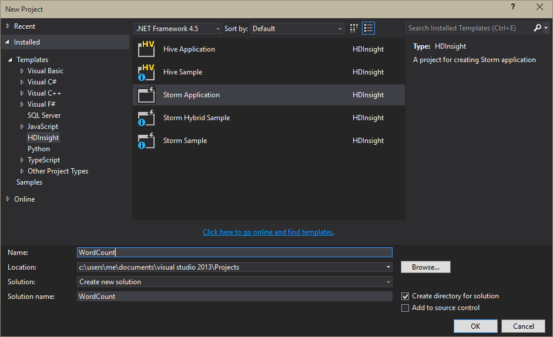

<properties
    pageTitle="在 HDInsight Apache 大量簡介 |Microsoft Azure"
    description="介紹 Apache 大量，並瞭解如何使用大量 HDInsight 上建立在雲端的即時資料分析解決方案。"
    services="hdinsight"
    documentationCenter=""
    authors="Blackmist"
    manager="jhubbard"
    editor="cgronlun"
    tags="azure-portal"/>

<tags
   ms.service="hdinsight"
   ms.devlang="na"
   ms.topic="get-started-article"
   ms.tgt_pltfrm="na"
   ms.workload="big-data"
   ms.date="10/11/2016"
   ms.author="larryfr"/>

#在 HDInsight Apache 大量簡介︰ Hadoop 即時狀況分析

在 HDInsight Apache 大量可讓您建立分散式、 即時分析解決方案 Azure 環境中，使用[Apache Hadoop](http://hadoop.apache.org)。

##什麼是 Apache 大量？

Apache 大量是不是可讓您處理程序中的資料分佈、 容錯開啟來源計算系統即時與 Hadoop。 大量解決方案也可以提供保證的處理的資料，可以重新執行並未順利處理第一次的資料。

##為什麼要使用大量 HDInsight 上？

在 HDInsight Apache 大量是受管理的叢集整合 Azure 環境。 會提供下列重要的好處︰

* 執行為受管理的服務與設定時間 99.9%的 SLA

* 使用您所選擇的語言︰ 提供撰寫**Java**、 **C#**和**Python**大量元件的功能支援

    * 支援的程式設計語言︰ 讀取資料使用 Java，然後 C 進行處理#
    
        > [AZURE.NOTE] 在 Windows 型 HDInsight 叢集上只支援 C# 拓撲。

    * 若要建立大量拓撲支援 「 完全後 」 的處理的郵件、 「 交易 」 的資料存放區保存及一組通用的資料流分析作業使用**戟**Java 介面

* 包含內建的縮放比例向上和向下調整功能︰ 不會影響 HDInsight 叢集，執行大量拓撲不按比例縮放

* 與其他 Azure 服務，包括事件中心、 Azure 虛擬網路、 SQL 資料庫、 Blob 儲存體，以及 DocumentDB 整合

    * 利用 Azure 虛擬網路合併多個 HDInsight 叢集的功能︰ 建立分析使用 HDInsight、 HBase 或 Hadoop 叢集的管線

使用即時分析解決方案 Apache 大量的公司的清單，請參閱[使用 Apache 大量的公司](https://storm.apache.org/documentation/Powered-By.html)。

若要開始使用大量，請參閱[開始使用大量上 HDInsight][gettingstarted]。

###輕鬆佈建

您可以提供 HDInsight 叢集上的新大量分鐘。 指定叢集名稱、 大小、 系統管理員帳戶，並儲存帳戶。 Azure 將會建立叢集，包括範例拓撲及網站管理儀表板。

> [AZURE.NOTE] 您也可以使用[Azure CLI](../xplat-cli-install.md)或[PowerShell 的 Azure](../powershell-install-configure.md)提供大量叢集。

15 分鐘內送出要求，則必須執行新大量叢集和供您的第一個即時分析管線。

###使用方便性

__將大量的 Linux 型 HDInsight 叢集上__，您可以連線至叢集使用 SSH 和使用`storm`啟動和管理拓撲] 命令。 此外，您可以使用 Ambari 監控大量服務與監控和管理執行拓撲在大量 ui。

使用 Linux 型大量叢集的詳細資訊，請參閱[上 Linux 型 HDInsight Apache 大量快速入門](hdinsight-apache-storm-tutorial-get-started-linux.md)。

__將大量的 windows 上 HDInsight 叢集__，Visual Studio HDInsight 工具可讓您建立 C# 和混合式 C# / Java 拓撲，然後將其傳送至您的大量 HDInsight 叢集上。  

Visual Studio HDInsight 工具也會提供可讓您監控和管理大量拓撲叢集上的介面。

如需使用 HDInsight 工具建立大量的應用程式的範例，請參閱[HDInsight 工具的 Visual Studio 開發 C# 大量拓撲](hdinsight-storm-develop-csharp-visual-studio-topology.md)。

Visual Studio 的 HDInsight 工具的相關詳細資訊，請參閱[開始使用 Visual Studio HDInsight 工具](../HDInsight/hdinsight-hadoop-visual-studio-tools-get-started.md)。

每個大量 HDInsight 叢集上的也會提供 web 大量儀表板，可讓您提交、 監控及管理大量拓撲叢集上執行。

如需有關如何使用大量儀表板的詳細資訊，請參閱[部署及管理 Apache 大量拓撲上 HDInsight](hdinsight-storm-deploy-monitor-topology.md)。

大量 HDInsight 上的也會提供簡單的**事件中心 Spout**透過 Azure 事件集線器整合。 此元件的最新版本的[https://github.com/hdinsight/hdinsight-storm-examples/tree/master/lib/eventhubs](https://github.com/hdinsight/hdinsight-storm-examples/tree/master/lib/eventhubs)。 如需有關如何使用此元件的詳細資訊，請參閱下列文件。

* [開發使用 Azure 事件集線器 C# 拓撲](hdinsight-storm-develop-csharp-event-hub-topology.md)

* [開發使用 Azure 事件集線器 Java 拓撲](hdinsight-storm-develop-java-event-hub-topology.md)

###可靠性

Apache 大量永遠保證的每個內送的郵件會完全處理，即使資料分析分散到下數百個節點。

**Nimbus 節點**Hadoop JobTracker 中，以提供類似的功能，並指派工作給到**動物園管理員**叢集其他節點。 動物園管理員節點提供協調叢集，並協助 Nimbus 和工作者節點**主管**程序之間的通訊。 如果一處理節點當機，Nimbus 節點會通知，並指派給另一個節點的工作和相關聯的資料。

Apache 大量的預設設定是只有一個 Nimbus 節點。 大量 HDInsight 上的執行兩個 Nimbus 節點。 如果主要節點失敗，請 HDInsight 叢集會切換至第二個節點時已復原的主要節點。

###縮放比例

雖然您可以在建立期間叢集中指定的節點數目，您可能要放大或縮小叢集符合工作量。 所有的 HDInsight 叢集可讓您處理資料時，甚至變更叢集的節點數目。

> [AZURE.NOTE] 若要善用新的節點透過縮放加入，您需要重新平衡拓撲啟動之前增加叢集大小。

###支援

在 HDInsight 大量隨附完整企業層級 24/7 支援。 大量 HDInsight 上的也有 99.9%的 SLA。 這表示我們保證叢集會有外部連線至少 99.9%的時間。

##常見的使用案例即時分析

以下是一些常見的案例，您可能使用 Apache 大量 HDInsight。 關於真實案例的資訊，請參閱[公司如何使用大量](https://storm.apache.org/documentation/Powered-By.html)。

* Internet 的項目 (IoT)
* 偵測網路詐騙
* 社交狀況分析
* 擷取、 轉換，載入 (ETL)
* 網路監視
* 搜尋
* 行動裝置的互動

##如何處理中 HDInsight 大量的資料？

Apache 大量執行**拓撲**，而不是您可能會很熟悉 HDInsight 或 Hadoop MapReduce 工作。 大量 HDInsight 叢集上的包含兩種類型的節點︰ 向執行**Nimbus**和背景工作執行**主管**的節點的節點。

* **Nimbus**︰ 類似於中 Hadoop JobTracker，它會負責發送整個叢集程式碼，指派工作給虛擬機器監控失敗。 HDInsight 會提供兩個 Nimbus 節點，因此沒有單一點上 HDInsight 大量失敗

* **主管**︰ 針對每個工作者節點主管負責啟動和停止節點上的 [**背景工作處理程序**。

* **背景工作程序**︰ 執行**拓撲**子集。 執行的拓撲分散到整個叢集許多工作處理程序。

* **拓撲**︰ 定義的計算處理**資料流**資料的圖形。 不同於 MapReduce 工作拓撲執行鍵，直到您停止它們。

* **資料流**︰ **tuple**的繫結的集合。 資料流時所產生的**spouts**和**螺栓**，他們由**螺栓**。

* **表示 Tuple**︰ 命名動態輸入值的清單。

* **Spout**︰ 使用資料來源的資料，並會發出一或多個**資料流**。

    > [AZURE.NOTE] 在許多情況下，從佇列中的，例如 Kafka、 Azure 服務匯流排佇列或事件集線器讀取資料。 佇列中可確保資料如果有中斷保存。

* **螺栓**︰ 使用**資料流時**，處理上執行**tuple**，並可能會發出**資料流**。 螺栓，也會負責寫入外部的儲存空間，例如佇列、 HDInsight、 HBase、 blob 或其他資料存放區中的資料。

* **Apache Thrift**︰ 可調整跨語言服務開發軟體架構。 其可讓您建立 c + +、 Java、 Python、 PHP]、 [注音標示、 Erlang、 Perl、 Haskell、 C#、 Cocoa、 JavaScript、 Node.js、 Smalltalk 和其他語言之間的服務。

    * **Nimbus** Thrift 服務，就必須**拓撲**Thrift 定義，因此可能開發拓撲使用各種不同的語言。

如需有關大量元件的詳細資訊，請參閱[大量教學課程][apachetutorial]在 apache.org。

##我可以使用哪些語言？

HDInsight 叢集上的大量提供支援 C#、 Java 和 Python。

### C & #35;

Visual Studio HDInsight 工具允許來設計及實作拓撲 C#.NET 開發人員]。 您也可以建立使用 Java 及 C# 元件的混合式拓撲。

如需詳細資訊，請參閱[在使用 Visual Studio HDInsight Apache 大量的開發 C# 拓撲](hdinsight-storm-develop-csharp-visual-studio-topology.md)。

###Java

純文字 Java 或戟，將會發生的大部分 Java 範例。 戟是高層級的抽象，可讓您更容易等聯結，彙總群組及篩選的項目。 不過，戟對於 tuple，而一批次而原始 Java 解決方案處理資料流一個 tuple 一次。

如需有關戟的詳細資訊，請參閱在 apache.org[戟教學課程](https://storm.apache.org/documentation/Trident-tutorial.html)。

Java 和戟拓撲的範例，請參閱[範例大量拓撲的清單](hdinsight-storm-example-topology.md)或大量入門範例 HDInsight 叢集上。

大量入門範例位於__/usr/hdp/current/storm-client/contrib/storm-starter__目錄上 Linux 型叢集和在 Windows 型叢集**%storm_home%\contrib\storm-starter**目錄。

##什麼是一些常見的開發模式？

###處理保證的訊息

大量可提供不同層級的保證的訊息處理。 例如 [基本的大量應用程式可確保在小次處理和戟可以完全保證-一次處理。

如需詳細資訊，請參閱在 apache.org 的[提供在處理資料](https://storm.apache.org/about/guarantees-data-processing.html)。

###IBasicBolt

讀取發出零或更多 tuple，然後輸入 execute 方法結尾處立即 tuple acking 輸入表示 tuple 的圖樣常見，而大量提供[IBasicBolt](https://storm.apache.org/apidocs/backtype/storm/topology/IBasicBolt.html)介面，來自動化這個模式。

###連接

加入兩個資料串流會視情況而定的應用程式之間。 例如，您無法將一個新的資料流加入每個 tuple 從多個資料流或您無法加入的特定的視窗 tuple 的批次。 兩種方式，加入可藉由使用[fieldsGrouping](http://javadox.com/org.apache.storm/storm-core/0.9.1-incubating/backtype/storm/topology/InputDeclarer.html#fieldsGrouping%28java.lang.String,%20backtype.storm.tuple.Fields%29)，這一種定義 tuple 路由至螺栓的方式。

在下列 Java 範例中，fieldsGrouping 用來路由 tuple 成**MyJoiner** ，否則來自元件 「 1 」、 「 2 」 和 「 3 」。

    builder.setBolt("join", new MyJoiner(), parallelism) .fieldsGrouping("1", new Fields("joinfield1", "joinfield2")) .fieldsGrouping("2", new Fields("joinfield1", "joinfield2")) .fieldsGrouping("3", new Fields("joinfield1", "joinfield2"));

###批次

批次處理可完成數種方式。 使用基本的大量 Java 拓撲，您可能會發出前,，先使用簡單計數器 tuple 的批次 X 數目，或使用稱為 「 刻度 tuple 」 發出以批次每 X 秒的內部預存時間機制。

如需使用刻度 tuple 的範例，請參閱[大量與上 HDInsight HBase 分析感應器資料](hdinsight-storm-sensor-data-analysis.md)。

如果您使用的戟，它會根據處理 tuple 一批次。

###快取

記憶體內快取最常用的機制加速處理因為它會將經常在記憶體中使用資產。 因為拓撲分散到多個節點，並在每個節點內的多個程序，您應該考慮使用[fieldsGrouping](http://javadox.com/org.apache.storm/storm-core/0.9.1-incubating/backtype/storm/topology/InputDeclarer.html#fieldsGrouping%28java.lang.String,%20backtype.storm.tuple.Fields%29) ，以確保 tuple 的快取查閱所使用的欄位之會永遠路由至相同的程序。 這是整個程序避免重複的快取項目。

###串流前 n 個

當您拓撲取決於計算 」 前 n 個 」 值，例如 Twitter 上的上方 5 趨勢應該計算平行的前 n 個值，然後將這些計算的輸出合併全域的值。 這可以經由使用[fieldsGrouping](http://javadox.com/org.apache.storm/storm-core/0.9.1-incubating/backtype/storm/topology/InputDeclarer.html#fieldsGrouping%28java.lang.String,%20backtype.storm.tuple.Fields%29)欄位平行螺栓 （其中分割的資料欄位值），以傳送及成全域決定前 n 個值，否則然後傳送。

如需這範例，請參閱[RollingTopWords](https://github.com/nathanmarz/storm-starter/blob/master/src/jvm/storm/starter/RollingTopWords.java)範例。

##何種類型的記錄會大量使用？

大量使用 Apache Log4j 記錄的資訊。 根據預設，請登大量的資料，且很難排序整個資訊。 您可以包含記錄設定檔案做為大量拓撲控制記錄行為的一部分。

如將示範如何設定記錄範例拓撲，請參閱上 HDInsight 大量[java WordCount](hdinsight-storm-develop-java-topology.md)範例。

##後續步驟

深入瞭解在 HDInsight Apache 大量的即時分析解決方案︰

* [在 HDInsight 大量快速入門][gettingstarted]

* [在 HDInsight 大量的範例拓撲](hdinsight-storm-example-topology.md)

[stormtrident]: https://storm.apache.org/documentation/Trident-API-Overview.html
[samoa]: http://yahooeng.tumblr.com/post/65453012905/introducing-samoa-an-open-source-platform-for-mining
[apachetutorial]: https://storm.apache.org/documentation/Tutorial.html
[gettingstarted]: hdinsight-apache-storm-tutorial-get-started-linux.md
