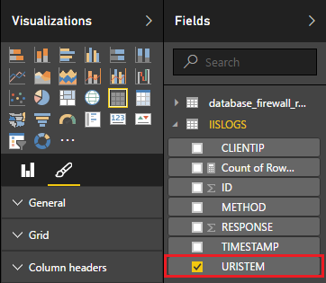

<properties
 pageTitle="使用 Power BI Apache 大量 |Microsoft Azure"
 description="建立 Power BI 報表使用 Apache 大量中叢集 HDInsight 上執行的 C# 拓撲中的資料。"
 services="hdinsight"
 documentationCenter=""
 authors="Blackmist"
 manager="jhubbard"
 editor="cgronlun"
    tags="azure-portal"/>

<tags
 ms.service="hdinsight"
 ms.devlang="dotnet"
 ms.topic="article"
 ms.tgt_pltfrm="na"
 ms.workload="big-data"
 ms.date="10/27/2016"
 ms.author="larryfr"/>

# 使用 Power BI 以視覺化方式呈現資料 Apache 大量拓撲

Power BI 可讓您以視覺化方式顯示資料的報表。 使用大量 HDInsight 在 Visual Studio 範本，可以輕鬆地使用資料儲存到 SQL Azure HDInsight 叢集上 Apache 大量上執行的拓撲，然後使用 Power BI 資料以視覺化方式呈現。

在此文件中，您將學習如何使用 Power BI 從 Apache 大量拓撲所產生的資料，並儲存在 Azure SQL 資料庫建立報表。

> [AZURE.NOTE] 雖然這份文件中的步驟依賴 Windows 開發環境中具有 Visual Studio，Linux 或 Windows 型 HDInsight 叢集能提交編譯的專案。 僅限 Linux 為基礎建立叢集後 10/28 2016年支援 SCP.NET 拓撲。
>
> 若要使用的 C# 拓撲與 Linux 叢集，您必須更新 Microsoft.SCP.Net.SDK NuGet 套件由版本 0.10.0.6 專案或更新版本。 封裝的版本也必須符合大量 HDInsight 上安裝的主要版本。 例如，大量 HDInsight 版本 3.3 和 3.4 使用大量版本 0.10.x，而 HDInsight 3.5 是使用大量 1.0.x。
> 
> C# 拓撲 Linux 型叢集上的必須使用.NET 4.5，並使用單聲道 HDInsight 叢集上執行。 將使用的大部分項目，不過您應該檢查可能不相容的[單聲道相容性](http://www.mono-project.com/docs/about-mono/compatibility/)文件。
>
> Java 版本的 [此專案，也會使用 Linux 或 Windows 叢集，請參閱[從 Azure 事件集線器大量 HDInsight (Java) 上與處理程序事件](hdinsight-storm-develop-java-event-hub-topology.md)。

## 必要條件

- Azure 的訂閱。 請參閱[取得 Azure 免費試用版](https://azure.microsoft.com/documentation/videos/get-azure-free-trial-for-testing-hadoop-in-hdinsight/)。

* 使用[Power BI](https://powerbi.com) access Azure Active Directory 使用者

* Visual Studio （其中一個下列版本）

    * 使用[更新 4](http://www.microsoft.com/download/details.aspx?id=39305)的 visual Studio 2012

    * Visual Studio 2013[更新 4](http://www.microsoft.com/download/details.aspx?id=44921)或[Visual Studio 2013 社群](http://go.microsoft.com/fwlink/?linkid=517284&clcid=0x409)

    * [Visual Studio 2015](https://www.visualstudio.com/downloads/download-visual-studio-vs.aspx)

* Visual Studio HDInsight 工具︰ 資訊，請參閱[開始使用 Visual Studio HDInsight 工具](../HDInsight/hdinsight-hadoop-visual-studio-tools-get-started.md)安裝的資訊。

## 運作方式

此範例中包含的 C# 大量拓撲的隨機產生網際網路服務 (IIS) 記錄的資料。 SQL 資料庫]，然後寫入此資料，然後從該處它用來產生 Power BI 中的 [報表]。

以下是實作此範例中的主要功能的檔案清單。

* **SqlAzureBolt.cs**︰ 將產生大量拓撲到 SQL 資料庫中的資訊。

* **IISLogsTable.sql**︰ 用來產生的資料會儲存在資料庫的 SQL 陳述式。

> [AZURE.WARNING] HDInsight 叢集上啟動拓撲之前，您必須在 SQL 資料庫建立資料表。

## 下載的範例

下載[HDInsight C# 大量 Power BI 範例](https://github.com/Azure-Samples/hdinsight-dotnet-storm-powerbi)。 若要下載它，請分叉/複本，並使用[給](http://git-scm.com/)，或使用 [**下載**] 連結下載封存的.zip。

## 建立資料庫

1. 使用[SQL 資料庫教學課程](../sql-database/sql-database-get-started.md)文件中的步驟，建立新的 SQL 資料庫。

2. 連線至資料庫[連線到 SQL 資料庫 Visual Studio 與](../sql-database/sql-database-connect-query.md)文件中的步驟進行連線至資料庫。

4. 以滑鼠右鍵按一下物件總管] 中的資料庫，然後建立__新的查詢__。 貼上到 [查詢] 視窗中，下載專案中包含__IISLogsTable.sql__檔案的內容，然後使用 Ctrl + Shift + E，來執行查詢。 您應該會收到郵件已成功完成命令。

    一旦完成後，會有新的資料表中名為 「 __IISLOGS__資料庫。

## 設定的範例

1. 從[Azure 入口網站](https://portal.azure.com)中，選取 [SQL 資料庫]。 從 [SQL 資料庫刀的 [__基本資訊__] 區段中，選取 [__顯示資料庫連線字串__]。 從出現的清單中，複製的__ADO.NET （SQL 驗證）__的資訊。

1. 開啟 Visual Studio 中的範例。 **方案總管**] 中，開啟**App.config**檔案，並找出下列項目︰

        <add key="SqlAzureConnectionString" value="##TOBEFILLED##" />
    
    __# # TOBEFILLED # #__值取代為在上一個步驟中複製的資料庫連線字串。 取代__{您\_username}__和__{您\_密碼}__的使用者名稱和資料庫密碼。

2. 儲存並關閉檔案。

## 部署範例

1. 從**方案總管**] 中，以滑鼠右鍵按一下**StormToSQL**專案並選取 [**提交]，在 HDInsight 大量**。 從 [**大量叢集**下拉式清單] 對話方塊中選取 [HDInsight 叢集]。

    > [AZURE.NOTE] 可能需要幾秒的時間**大量叢集**下拉式清單中填入伺服器名稱。
    >
    > 如果出現提示，請輸入 Azure 訂閱登入認證。 如果您有多個訂閱，請登入包含您大量 HDInsight 叢集上的項目。

2. 當您順利提交拓撲時，叢集大量拓撲應該會出現。 SqlAzureWriterTopology 項目清單中選取來檢視執行拓撲的相關資訊。

    

    您可以使用此檢視資訊請參閱拓撲，或項目 （例如 SqlAzureBolt) 上按兩下，請參閱拓撲元件的特定資訊。

3. 拓撲後執行幾分鐘，恢復成您用來建立資料庫的 SQL 查詢視窗。 以下列取代現有的陳述式。

        select * from iislogs;
    
    使用 Ctrl + Shift + E 來執行查詢，以及您應該會收到下列類似的結果。
    
        1   2016-05-27 17:57:14.797 255.255.255.255 /bar    GET 200
        2   2016-05-27 17:57:14.843 127.0.0.1   /spam/eggs  POST    500
        3   2016-05-27 17:57:14.850 123.123.123.123 /eggs   DELETE  200
        4   2016-05-27 17:57:14.853 127.0.0.1   /foo    POST    404
        5   2016-05-27 17:57:14.853 10.9.8.7    /bar    GET 200
        6   2016-05-27 17:57:14.857 192.168.1.1 /spam   DELETE  200

    這是從大量拓撲寫入的資料。

## 建立報表

1. 適用 Power BI，以連線至[Azure SQL 資料庫連接器](https://app.powerbi.com/getdata/bigdata/azure-sql-database-with-live-connect)。

2. __資料庫__中選取 [__開始__]。

3. 選取 [ __Azure SQL 資料庫__]，然後選取 [__連線__。

4. 輸入的資訊連線至 Azure SQL 資料庫。 您可以找到這造訪[Azure 入口網站](https://portal.azure.com)，然後選取 [SQL 資料庫。

    > [AZURE.NOTE] 您也可以使用 [連線] 對話方塊的 [__啟用進階選項__，設定的重新整理的間隔和自訂篩選。

5. 您已連線之後，您會看到新的資料集使用相同的名稱與您連線至資料庫。 選取要開始設計報表的資料集。

3. 從 [__欄位__] 中，展開 [ __IISLOGS__項目]。 選取__URISTEM__] 核取方塊。 這會建立新的報表，列出 URI 主體 (/ foo/橫條圖、 等) 記錄在資料庫中。

    

5. 接下來，請拖曳至報表的__方法__。 報表時都會更新成清單主體和 HTTP 要求所使用的對應 HTTP 方法。

    

4. 從 [__視覺效果__] 欄中，選取 [__欄位__] 圖示，然後選取__方法__] 旁的向下箭號 [__值__] 區段中。 從出現的清單中，選取 [__計數__]。 這會變更報表] 清單中的已存取特定的 URI 多少次計數。

    

6. 接下來，請選取 [__堆疊直條圖__，以變更顯示資訊的方式。

    

7. 一旦您有報表如何您的期望，使用__儲存__的項目] 功能表來輸入名稱，然後儲存報表。

## 停止拓撲

拓撲會繼續執行，直到您停止或刪除 HDInsight 叢集上的大量。 執行下列步驟，以停止拓撲。

1. 在 Visual Studio 中，返回 [拓撲檢視器] 並選取拓撲。

2. 選取 [**刪除**] 按鈕，以停止拓撲]。

    ![刪除上拓撲摘要] 按鈕](./media/hdinsight-storm-power-bi-topology/killtopology.png)

## 刪除叢集

[AZURE.INCLUDE [delete-cluster-warning](../../includes/hdinsight-delete-cluster-warning.md)]

## 後續步驟

在此文件中，您學到如何將資料從大量拓撲傳送到 SQL 資料庫，然後使用 Power BI 資料以視覺化方式呈現的內容。 如需如何使用其他 Azure HDInsight 上使用大量的技術資訊，請參閱下列各項︰

* [在 HDInsight 大量的範例拓撲](hdinsight-storm-example-topology.md)
