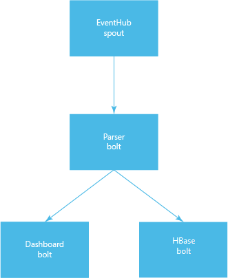
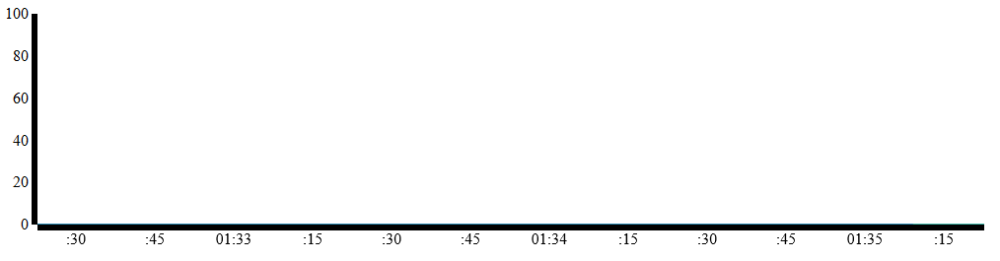

<properties
   pageTitle="分析 Apache 大量與 HBase 感應器資料 |Microsoft Azure"
   description="瞭解如何使用虛擬網路連線至 Apache 大量。 使用大量 HBase 程序感應器資料從事件中心，並以視覺化效果呈現與 D3.js。"
   services="hdinsight"
   documentationCenter=""
   authors="Blackmist"
   manager="jhubbard"
   editor="cgronlun"/>

<tags
   ms.service="hdinsight"
   ms.devlang="java"
   ms.topic="article"
   ms.tgt_pltfrm="na"
   ms.workload="big-data"
   ms.date="09/20/2016"
   ms.author="larryfr"/>

# 分析感應器 Apache 大量、 事件] 中心內，與 HBase HDInsight (Hadoop) 中的資料 

瞭解如何使用 Apache 大量上 HDInsight 程序感應器資料從 Azure] 事件中心、 將其儲存到 Apache HBase 上 HDInsight，並以視覺化方式呈現使用 D3.js Azure Web 應用程式以執行。

使用此文件中的 Azure 資源管理員範本示範如何建立多個 Azure 資源的 [資源] 群組中。 具體來說，它會建立 Azure 虛擬網路、 兩個 HDInsight 叢集 （大量和 HBase，） 和 Azure Web 應用程式。 即時 web 儀表板的 node.js 實作自動部署到 web 應用程式。

> [AZURE.NOTE] 使用 Linux 型 HDInsight 3.3 和 3.4 叢集版本測試此文件，並提供的範例中的資訊。

## 必要條件

* Azure 的訂閱。 請參閱[取得 Azure 免費試用版](http://azure.microsoft.com/documentation/videos/get-azure-free-trial-for-testing-hadoop-in-hdinsight/)。

    > [AZURE.IMPORTANT] 您不需要現有的 HDInsight 叢集;這份文件中的步驟，將會建立下列資源︰
    >
    > * Azure 虛擬網路
    > * HDInsight 叢集上的大量 (Linux 型 2 工作者節點)
    > * HDInsight 叢集上的 HBase (Linux 型 2 工作者節點)
    > * Azure Web 應用程式裝載的 web 儀表板

* [Node.js](http://nodejs.org/)︰ 這用來預覽您的開發環境在本機上的網頁儀表板。

* [Java 和 JDK 1.7](http://www.oracle.com/technetwork/java/javase/downloads/index.html)︰ 用於開發大量拓撲。

* [Maven](http://maven.apache.org/what-is-maven.html)︰ 用來建立和編譯專案。

* [給](http://git-scm.com/)︰ 用來從 GitHub 下載專案。

* __SSH__用戶端︰ 用來連線到 Linux 型 HDInsight 叢集。 如需有關如何使用 HDInsight SSH 的詳細資訊，請參閱下列文件。

    * [從 Windows 用戶端中使用 HDInsight SSH](hdinsight-hadoop-linux-use-ssh-windows.md)

    * [HDInsight SSH 使用從 Linux、 Unix 或 Mac 的用戶端](hdinsight-hadoop-linux-use-ssh-unix.md)

    > [AZURE.NOTE] 您也必須存取`scp`] 命令，可用於您的本機的開發環境和使用 SSH HDInsight 叢集之間複製檔案。

## 架構

此範例中包含下列元件︰

* **Azure 事件集線器**︰ 包含從感應器會收集的資料。 此範例中，應用程式是提供的產生的資料。

* **在 HDInsight 大量**︰ 從事件中心提供即時處理資料。

* **在 HDInsight HBase**︰ 提供常設 NoSQL 資料存放區資料以大量處理後。

* **Azure 虛擬網路服務**︰ 可讓上 HDInsight 大量以及 HBase HDInsight 叢集上的之間的安全通訊。

    > [AZURE.NOTE] 不會公開透過 HBase 叢集公用閘道器時，才能使用 Java HBase 用戶端 API，虛擬網路。 將相同的虛擬網路安裝 HBase 和大量叢集，可讓大量叢集 （或在虛擬的網路上的任何其他系統） 直接存取 HBase 使用用戶端 API。

* **儀表板網站**︰ 範例儀表板的圖表中進行即時資料。

    * 網站中 Node.js，實作，讓它可以作業系統上執行任何用戶端進行測試，或可以部署 Azure 網站。

    * [Socket.io](http://socket.io/)用於大量拓撲和網站之間的即時訊息。

        > [AZURE.NOTE] 這是實作詳細資料。 您可以使用任何通訊架構，例如原始 WebSockets 或 SignalR。

    * [D3.js](http://d3js.org/)用來繪製會傳送至網站的資料。

> [AZURE.IMPORTANT] 兩個叢集必，當有不支援的方法，以建立一個 HDInsight 叢集大量和 HBase 兩者均適用。

拓撲讀取事件中心中的資料，使用[org.apache.storm.eventhubs.spout.EventHubSpout](http://storm.apache.org/releases/0.10.1/javadocs/org/apache/storm/eventhubs/spout/class-use/EventHubSpout.html)類別，，以及寫入 HBase 使用[org.apache.storm.hbase.bolt.HBaseBolt](https://storm.apache.org/javadoc/apidocs/org/apache/storm/hbase/bolt/class-use/HBaseBolt.html)類別中的資料。 使用網站的通訊被透過使用[socket.io client.java](https://github.com/nkzawa/socket.io-client.java)。

以下是拓撲的圖表。

> [AZURE.NOTE] 這是拓撲的最簡單檢視。 在執行階段，每個元件執行個體是自動建立的每個資料分割正在讀取的 [事件] 中心。 這些執行個體分佈叢集，節點並資料路由傳送它們之間，如下所示︰
>
> * Spout 剖析器的資料是負載平衡。
> * 資料剖析器至的儀表板及 HBase 分組裝置識別碼，以便從同一個裝置的郵件一律流程同一個元件。

### 拓撲元件

* **EventHub Spout**: spout 是提供部分的 Apache 大量版本 0.10.0 及更新版本。

    > [AZURE.NOTE] 此範例中使用事件集線器 spout 需要大量 3.3 或 3.4 HDInsight 叢集版本上。 如何使用事件集線器上 HDInsight 大量的舊版本的資訊，請參閱[從 Azure 事件集線器與上 HDInsight 大量的程序事件](hdinsight-storm-develop-java-event-hub-topology.md)。

* **ParserBolt.java**: spout 發出的資料是原始 JSON，，有時候超過一個事件會發出一次。 此螺栓示範如何讀取資料發出 spout，並將它為包含多個欄位，表示 tuple 發出至新的資料流。

* **DashboardBolt.java**︰ 這會示範如何傳送資料即時網頁的儀表板使用 Java Socket.io 用戶端文件庫。

此範例使用[不斷流動](https://storm.apache.org/releases/0.10.0/flux.html)架構，，所以拓撲定義包含在 YAML 檔案。 有兩種︰

* __無 hbase.yaml__ -使用此檔案時在您的開發環境中測試拓撲。 由於您無法存取 HBase Java API 從叢集放在虛擬網路以外，它不使用 HBase 元件。

* __使用 hbase.yaml__ -使用此檔案，大量叢集部署拓撲時。 因為它執行相同的虛擬網路 HBase 叢集，它會使用 HBase 元件。

## 環境準備作業

您可以使用此範例之前，您必須建立 Azure 事件中心內，大量拓撲讀取。

### 設定事件中心

事件中心是這個範例中的資料來源。 若要建立新的事件中心中使用下列步驟。

1. 從[Azure 入口網站](https://portal.azure.com)中，選取 [ **+ 新增** -> __網際網路的項目__ -> __事件集線器__。

2. 在 [__建立命名空間__刀中，執行下列工作︰

    1. 命名空間中輸入的__名稱__。
    2. 選取 [價格層]。 __基本__不足，此範例。
    3. 選取要使用 Azure 的 [__訂閱__]。
    4. 選取現有的資源群組，或建立新的範本。
    5. 選取 [事件] 中心的__位置__。
    6. 選取 [__固定至儀表板__]，然後按一下 [__建立__。

3. 建立程序完成時，會顯示事件集線器刀，為您的命名空間。 從這裡開始，選取 [ __+ 新增事件中心__]。 在__建立事件中心__刀中，輸入__sensordata__的名稱，然後選取__建立__。 將其他欄位內的預設值。

4. 從您的命名空間事件集線器刀，選取 [__事件集線器__]。 選取__sensordata__項目。

5. 從 sensordata 事件中樞的刀，選取 [__共用存取原則__]。 您可以使用__+ 新增__連結，新增下列原則︰

  	| 原則名稱 | 宣告 |
  	| ----- | ----- |
  	| 裝置 | 傳送 |
  	| 大量 | 聆聽 |

5. 選取兩個原則，並記下的__主索引鍵__的值。 您必須在未來的步驟中的兩個原則的值。

## 下載並設定專案

使用下列從 GitHub 下載的專案。

    git clone https://github.com/Blackmist/hdinsight-eventhub-example

命令完成之後，您就必須下列目錄結構︰

    hdinsight-eventhub-example/
        TemperatureMonitor/ - this contains the topology
            resources/
                log4j2.xml - set logging to minimal
                no-hbase.yaml - topology definition for local testing
                with-hbase.yaml - topology definition that uses HBase in a virutal network
            src/ - the Java bolts
            dev.properties - contains configuration values for your environment
        dashboard/nodejs/ - this is the node.js web dashboard
        SendEvents/ - utilities to send fake sensor data

> [AZURE.NOTE] 這份文件不會移至本範例中; 包含的程式碼的完整詳細資料不過，程式碼是完整註解。

開啟**hdinsight-eventhub-example/TemperatureMonitor/dev.properties**檔案，並將您事件中樞的資訊新增至下列行︰

    eventhub.read.policy.name: storm
    eventhub.read.policy.key: KeyForTheStormPolicy
    eventhub.namespace: YourNamespace
    eventhub.name: sensordata

> [AZURE.NOTE] 假設您為名稱的原則含有__接聽__的宣告，請使用__大量__且事件中心名稱為__sensordata__。

 新增此資訊後，請儲存檔案。

## 編譯和本機測試

之前先測試，您必須啟動儀表板檢視的拓撲輸出並產生儲存在事件] 中心內的資料。

> [AZURE.IMPORTANT] 本機，測試 Java API HBase 叢集無法存取從 Azure 虛擬網路包含叢集以外時，無法作用中的此拓撲 HBase 元件。

### 啟動 web 應用程式

1. 開啟新的命令提示字元或 terminal 中，然後將目錄變更為**hdinsight-eventhub-範例/儀表板**，安裝相依性所需的 web 應用程式中使用下列命令︰

        npm install

2. 啟動 web 應用程式中使用下列命令︰

        node server.js

    您應該會看到類似以下訊息︰

        Server listening at port 3000

2. 開啟網頁瀏覽器，然後輸入**http://localhost:3000 /**為地址。 您應該會看到類似以下的頁面︰

    

    [離開這個命令提示字元 」 或 「 終端機開啟。 測試後，使用 Ctrl C 停止網頁伺服器。

### 開始產生的資料

> [AZURE.NOTE] 本節中的步驟會使用 Node.js，讓他們可以用任何平台上。 如需其他語言的範例，請參閱**SendEvents**目錄。

1. 開啟新的命令提示字元、 命令介面或 terminal 中，將目錄變更為**hdinsight-eventhub-範例/SendEvents/nodejs**，然後安裝相依性所需的應用程式中使用下列命令︰

        npm install

2. 文字編輯器中開啟**app.js**檔案，然後新增您先前取得的事件中樞資訊︰

        // ServiceBus Namespace
        var namespace = 'YourNamespace';
        // Event Hub Name
        var hubname ='sensordata';
        // Shared access Policy name and key (from Event Hub configuration)
        var my_key_name = 'devices';
        var my_key = 'YourKey';
    
    > [AZURE.NOTE] 假設您使用__sensordata__作為事件] 中心內，與__裝置__的名稱為 [已__傳送__的宣告原則的名稱。

2. 若要插入新的項目事件中心中使用下列命令︰

        node app.js

    您應該會看到幾行程式輸出包含傳送到 [事件] 中心內的資料。 這些看起來如下︰

        {"TimeStamp":"2015-02-10T14:43.05.00320Z","DeviceId":"0","Temperature":7}
        {"TimeStamp":"2015-02-10T14:43.05.00320Z","DeviceId":"1","Temperature":39}
        {"TimeStamp":"2015-02-10T14:43.05.00320Z","DeviceId":"2","Temperature":86}
        {"TimeStamp":"2015-02-10T14:43.05.00320Z","DeviceId":"3","Temperature":29}
        {"TimeStamp":"2015-02-10T14:43.05.00320Z","DeviceId":"4","Temperature":30}
        {"TimeStamp":"2015-02-10T14:43.05.00320Z","DeviceId":"5","Temperature":5}
        {"TimeStamp":"2015-02-10T14:43.05.00320Z","DeviceId":"6","Temperature":24}
        {"TimeStamp":"2015-02-10T14:43.05.00320Z","DeviceId":"7","Temperature":40}
        {"TimeStamp":"2015-02-10T14:43.05.00320Z","DeviceId":"8","Temperature":43}
        {"TimeStamp":"2015-02-10T14:43.05.00320Z","DeviceId":"9","Temperature":84}

### 啟動拓撲

2. 開啟新的命令提示字元、 命令介面或__Hdinsight eventhub 範例/TemperatureMonitor__，終端機和變更目錄，然後使用下列命令來啟動拓撲︰

        mvn compile exec:java -Dexec.args="--local -R /no-hbase.yaml --filter dev.properties"
    
    如果您使用 PowerShell，改用下列動作︰

        mvn compile exec:java "-Dexec.args=--local -R /no-hbase.yaml --filter dev.properties"

    > [AZURE.NOTE] 如果您是在 Linux/Unix/OS X 系統上，並[安裝大量的開發環境中](http://storm.apache.org/releases/0.10.0/Setting-up-development-environment.html)，您可以改用下列命令︰
    >
    > `mvn compile package`
    > `storm jar target/WordCount-1.0-SNAPSHOT.jar org.apache.storm.flux.Flux --local -R /no-hbase.yaml`

    此舉會啟動拓撲本機模式中__無 hbase.yaml__檔案中所定義。 __Dev.properties__檔案中所包含的值提供事件集線器的連線資訊。 啟動之後，拓撲讀取事件中心中的項目，並傳送給您的本機電腦上執行的儀表板。 您應該會看到會出現在 web 儀表板，類似下列行︰

    

3. 在儀表板執行時，使用`node app.js`指令從先前的步驟，傳送新資料至事件集線器。 隨機產生的溫度值，因為圖形應該會更新以顯示溫度大型的變更。

    > [AZURE.NOTE] 使用時，您必須是__Hdinsight-eventhub-範例/SendEvents/Nodejs__目錄中`node app.js`] 命令。

3. 驗證之後，適用於，停止拓撲使用 Ctrl + C。 若要也停止本機的網頁伺服器，您可以使用 Ctrl + C。

## 建立大量和 HBase 叢集

才能執行拓撲 HDInsight，並啟用 HBase 螺栓，您必須建立新的大量叢集和 HBase 叢集。 本節中的步驟來建立新的 Azure 虛擬網路的大量和 HBase 叢集虛擬網路上使用[Azure 資源管理員範本](../resource-group-template-deploy.md)。 範本也會建立 Azure Web 應用程式，並將其部署儀表板的複本。

> [AZURE.NOTE] 虛擬網路使用，因此大量叢集上執行拓撲可以直接與使用 HBase Java API HBase 叢集進行通訊。

使用此文件中的資源管理員範本位於__https://hditutorialdata.blob.core.windows.net/armtemplates/create-linux-based-hbase-storm-cluster-in-vnet.json__至公用 blob 容器。

1. 按一下登入 Azure 及開啟資源管理員範本 Azure 入口網站中的下列按鈕。

    

2. 從**參數**刀中，輸入下列資訊︰

    
    
    * **BASECLUSTERNAME**︰ 此值將用於作為大量的基底名稱並 HBase 叢集。 例如，輸入__hdi__會建立名為__大量 hdi__大量叢集和命名__hbase hdi__HBase 叢集。
    * __CLUSTERLOGINUSERNAME__︰ 大量和 HBase 叢集管理員的使用者名稱。
    * __CLUSTERLOGINPASSWORD__︰ 大量和 HBase 叢集管理員使用者的密碼。
    * __SSHUSERNAME__: SSH 使用者建立大量和 HBase 叢集。
    * __SSHPASSWORD__︰ 大量和 HBase 叢集 SSH 使用者的密碼。
    * __位置__︰ 叢集會在中建立的區域。
    
    按一下__[確定__] 儲存參數。
    
3. 用於建立新的資源群組，或選取現有的 [__資源群組__] 區段。

4. 在 [__資源] 群組中的位置__] 下拉式功能表中，選取同一個位置時選取__位置__參數。

5. 選取 [__法律條款__，，然後選取 [__建立__。

6. 最後，核取 [__固定至儀表板__，然後選取 [__建立__。 若要建立叢集需要關於 20 分鐘。

只要建立資源之後，會被重新導向至刀資源群組含有叢集與 web 儀表板。

> [AZURE.IMPORTANT] 請注意 HDInsight 叢集的名稱，將__大量 BASENAME__和__hbase BASENAME__，其中 BASENAME 是您提供的範本的名稱。 連線至叢集時，您會在稍後步驟中使用下列名稱。 也請注意，儀表板網站名稱__basename 儀表板__。 您會使用這個稍後時檢視儀表板。

## 設定儀表板螺栓

若要傳送資料至與 web 應用程式部署儀表板，您必須修改__dev.properties__檔案中的下列行︰

    dashboard.uri: http://localhost:3000

變更`http://localhost:3000`至`http://BASENAME-dashboard.azurewebsites.net`並儲存檔案。 您在上一個步驟中提供名取代__BASENAME__ 。 您也可以使用 [資源] 群組中，選取儀表板以及檢視 URL 先前所建立。

## 建立 HBase 資料表

若要將資料儲存在 HBase 中，我們必須先建立表格。 您通常要預先建立大量需要寫入的資源，為想要建立資源內的大量拓撲可能會導致，分散式的多份複本嘗試建立相同資源的程式碼。 建立外部拓撲的資源，並只大量讀取/寫入和使用狀況分析。

1. 使用 SSH 連線到 HBase 叢集使用 SSH 使用者與您的範本在叢集建立期間所提供的密碼。 例如，如果使用連線`ssh`命令，您可以使用下列語法︰

        ssh USERNAME@hbase-BASENAME-ssh.azurehdinsight.net
    
    這個命令中，__使用者名稱__取代為您提供您提供名建立叢集，以及__BASENAME__時 SSH 使用者名稱。 出現提示時，輸入 SSH 使用者的密碼。

2. 從 SSH 工作階段]，啟動 HBase 命令介面。

        hbase shell
    
    Shell 具有載入之後，您會看到`hbase(main):001:0>`提示。

3. 從 HBase 命令介面輸入下列命令以建立資料表儲存感應器資料︰

        create 'SensorData', 'cf'

4. 確認已使用下列命令來建立資料表︰

        scan 'SensorData'
        
    這會傳回類似下列範例中，表示資料表中 0 個資料列的資訊。
    
        ROW                   COLUMN+CELL                                       0 row(s) in 0.1900 seconds

5. 若要結束 HBase 命令介面輸入︰

        exit

## 設定 HBase 螺栓

要從大量叢集寫入 HBase，您必須提供 HBase 螺栓 HBase 叢集的設定詳細資料。 若要執行此動作的最簡單的方法是從叢集下載__hbase site.xml__ ，並將其加入您的專案中。 您也必須取消多個相依性__pom.xml__檔案中載入大量 hbase 元件和必要的相依性的註解。

> [AZURE.IMPORTANT] 您也必須下載您大量 HDInsight 叢集 3.3 或 3.4 叢集; 上所提供的大量 hbase.jar 檔案此版本編譯使用 HBase 1.1.x，用於 HBase HDInsight 3.3 和 3.4 叢集上。 如果您使用大量 hbase 元件從其他位置時，它可能會針對舊版 HBase 編譯。

### 下載 hbase site.xml

在命令提示字元中，使用 SCP 從叢集下載__hbase site.xml__檔案。 在下列範例中，將__使用者名稱__取代 SSH 使用者建立叢集，以及__BASENAME__名您提供更舊版本時提供了。 出現提示時，輸入 SSH 使用者的密碼。 取代`/path/to/TemperatureMonitor/resources/hbase-site.xml`使用此 TemperatureMonitor 專案中的檔案路徑。

    scp USERNAME@hbase-BASENAME-ssh.azurehdinsight.net:/etc/hbase/conf/hbase-site.xml /path/to/TemperatureMonitor/resources/hbase-site.xml

這會下載__hbase site.xml__指定的路徑。

### 下載並安裝大量 hbase 元件

1. 在命令提示字元中，使用 SCP 大量的下載__大量 hbase.jar__檔案。 在下列範例中，將__使用者名稱__取代 SSH 使用者建立叢集，以及__BASENAME__名您提供更舊版本時提供了。 出現提示時，輸入 SSH 使用者的密碼。

        scp USERNAME@storm-BASENAME-ssh.azurehdinsight.net:/usr/hdp/current/storm-client/contrib/storm-hbase/storm-hbase*.jar .

    這會下載檔案命名`storm-hbase-####.jar`，其中 # # # 是這個叢集大量的版本號碼。 記下這個數字，因為稍後使用它。

2. 若要將這個元件安裝至本機 Maven 存放庫，在您的開發環境中使用下列命令。 這可讓 Maven 編譯專案時，尋找套件。 取代__####__與檔案名稱中包含的版本號碼。

        mvn install:install-file -Dfile=storm-hbase-####.jar -DgroupId=org.apache.storm -DartifactId=storm-hbase -Dversion=#### -Dpackaging=jar
    
    如果您使用 PowerShell，請使用下列命令︰

        mvn install:install-file "-Dfile=storm-hbase-####.jar" "-DgroupId=org.apache.storm" "-DartifactId=storm-hbase" "-Dversion=####" "-Dpackaging=jar"

### 啟用專案中的大量 hbase 元件

1. 開啟__TemperatureMonitor/pom.xml__檔案，並刪除下列行︰

        <!-- uncomment this section to enable the hbase-bolt
        end comment for hbase-bolt section -->
    
    > [AZURE.IMPORTANT] 只刪除這兩行。不要刪除任何它們之間的線條。
    
    這可讓通訊與使用 hbase 螺栓 HBase 時所需的幾個元件。

2. 尋找下列幾行，然後取代__####__與您在先前下載大量 hbase 檔案的版本號碼。

        <dependency>
            <groupId>org.apache.storm</groupId>
            <artifactId>storm-hbase</artifactId>
            <version>####</version>
        </dependency>

    > [AZURE.IMPORTANT] 版本號碼必須符合您用來將本機的 Maven 存放庫，安裝元件時 Maven 使用此資訊來建立專案時載入的元件的版本。

2. 儲存__pom.xml__檔案。

## 建置套件及部署至 HDInsight 的解決方案

在您的開發環境中使用下列步驟來部署大量拓撲大量叢集。

1. 從__TemperatureMonitor__目錄，請執行新建置，並從您的專案建立 JAR 套件使用下列命令︰

        mvn clean compile package

    這會建立命名**TemperatureMonitor-1.0-SNAPSHOT.jar**專案的**目標**目錄中的檔案。

2. 使用 scp __TemperatureMonitor-1.0-SNAPSHOT.jar__檔案上傳到您的大量叢集。 在下列範例中，將__使用者名稱__取代 SSH 使用者建立叢集，以及__BASENAME__名您提供更舊版本時提供了。 出現提示時，輸入 SSH 使用者的密碼。

        scp target\TemperatureMonitor-1.0-SNAPSHOT.jar USERNAME@storm-BASENAME-ssh.azurehdinsight.net:TemperatureMonitor-1.0-SNAPSHOT.jar
    
    > [AZURE.NOTE] 可能需要幾分鐘上, 傳檔案，如可數 mb 大小。

    使用 scp 上傳__dev.properties__檔案，為此頁面包含用來連線到事件集線器和儀表板的資訊。

        scp dev.properties USERNAME@storm-BASENAME-ssh.azurehdinsight.net:dev.properties

3. 當已上傳檔案時，連線到使用 SSH 叢集。

        ssh USERNAME@storm-BASENAME-ssh.azurehdinsight.net

4. 從 SSH 工作階段，使用下列命令來啟動拓撲。

        storm jar TemperatureMonitor-1.0-SNAPSHOT.jar org.apache.storm.flux.Flux --remote -R /with-hbase.yaml --filter dev.properties
    
    此舉會啟動拓撲__dev.properties__檔案中使用拓撲中定義__的 hbase.yaml__檔案，並設定值。

3. 啟動拓撲後，開啟瀏覽器上 Azure 您發佈網站，然後使用`node app.js`傳送資料至事件中樞的命令。 您應該會看到更新以顯示資訊的 web 儀表板。

    

## 檢視 HBase 資料

您已經提交拓撲使用的資料後`node app.js`，連線到 HBase，並確認資料有已寫入您先前建立的資料表中使用下列步驟。

1. 使用 SSH HBase 叢集連線。

        ssh USERNAME@hbase-BASENAME-ssh.azurehdinsight.net

2. 從 SSH 工作階段]，啟動 HBase 命令介面。

        hbase shell
    
    Shell 具有載入之後，您會看到`hbase(main):001:0>`提示。

2. 檢視資料表的資料列︰

        scan 'SensorData'
        
    這應傳回資訊類似下列，表示資料表中 0 個資料列。
    
        hbase(main):002:0> scan 'SensorData'
        ROW                             COLUMN+CELL
        \x00\x00\x00\x00               column=cf:temperature, timestamp=1467290788277, value=\x00\x00\x00\x04
        \x00\x00\x00\x00               column=cf:timestamp, timestamp=1467290788277, value=2015-02-10T14:43.05.00320Z
        \x00\x00\x00\x01               column=cf:temperature, timestamp=1467290788348, value=\x00\x00\x00M
        \x00\x00\x00\x01               column=cf:timestamp, timestamp=1467290788348, value=2015-02-10T14:43.05.00320Z
        \x00\x00\x00\x02               column=cf:temperature, timestamp=1467290788268, value=\x00\x00\x00R
        \x00\x00\x00\x02               column=cf:timestamp, timestamp=1467290788268, value=2015-02-10T14:43.05.00320Z
        \x00\x00\x00\x03               column=cf:temperature, timestamp=1467290788269, value=\x00\x00\x00#
        \x00\x00\x00\x03               column=cf:timestamp, timestamp=1467290788269, value=2015-02-10T14:43.05.00320Z
        \x00\x00\x00\x04               column=cf:temperature, timestamp=1467290788356, value=\x00\x00\x00>
        \x00\x00\x00\x04               column=cf:timestamp, timestamp=1467290788356, value=2015-02-10T14:43.05.00320Z
        \x00\x00\x00\x05               column=cf:temperature, timestamp=1467290788326, value=\x00\x00\x00\x0D
        \x00\x00\x00\x05               column=cf:timestamp, timestamp=1467290788326, value=2015-02-10T14:43.05.00320Z
        \x00\x00\x00\x06               column=cf:temperature, timestamp=1467290788253, value=\x00\x00\x009
        \x00\x00\x00\x06               column=cf:timestamp, timestamp=1467290788253, value=2015-02-10T14:43.05.00320Z
        \x00\x00\x00\x07               column=cf:temperature, timestamp=1467290788229, value=\x00\x00\x00\x12
        \x00\x00\x00\x07               column=cf:timestamp, timestamp=1467290788229, value=2015-02-10T14:43.05.00320Z
        \x00\x00\x00\x08               column=cf:temperature, timestamp=1467290788336, value=\x00\x00\x00\x16
        \x00\x00\x00\x08               column=cf:timestamp, timestamp=1467290788336, value=2015-02-10T14:43.05.00320Z
        \x00\x00\x00\x09               column=cf:temperature, timestamp=1467290788246, value=\x00\x00\x001
        \x00\x00\x00\x09               column=cf:timestamp, timestamp=1467290788246, value=2015-02-10T14:43.05.00320Z
        10 row(s) in 0.1800 seconds

    > [AZURE.NOTE] 此掃描作業只會傳回最大值 10 個資料列的資料表。

## 刪除您的叢集

[AZURE.INCLUDE [delete-cluster-warning](../../includes/hdinsight-delete-cluster-warning.md)]

若要一次刪除叢集、 儲存及 web 應用程式，請刪除包含這些資源群組。

## 後續步驟

您現在已經學會如何使用大量資料從讀取事件集線器、 將其儲存到 HBase，並以視覺化方式呈現使用 Socket.io 和 D3.js 的外部儀表板上的資訊。

* 更多範例與 HDInsight 大量拓撲的詳細資訊，請參閱︰

    * [在 HDInsight 大量的範例拓撲](hdinsight-storm-example-topology.md)

* 如需有關 Apache 大量的詳細資訊，請參閱[Apache 大量](https://storm.incubator.apache.org/)網站。

* 如需更多有關 HDInsight HBase 的詳細資訊，請參閱[HBase 與 HDInsight 概觀](hdinsight-hbase-overview.md)。

* 如需有關 Socket.io 的詳細資訊，請參閱[socket.io](http://socket.io/)網站。

* 如需有關 D3.js 的詳細資訊，請參閱[D3.js 的資料導向的文件](http://d3js.org/)。

* 建立拓撲 java 相關資訊，請參閱[上 HDInsight Apache 大量的開發 Java 拓撲](hdinsight-storm-develop-java-topology.md)。

* 建立拓撲.net 相關資訊，請參閱[的 Apache 大量上 HDInsight 使用 Visual Studio 開發 C# 拓撲](hdinsight-storm-develop-csharp-visual-studio-topology.md)。

[azure-portal]: https://portal.azure.com
