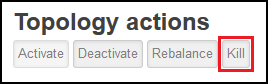

<properties
pageTitle="使用 Azure 資料湖存放區 Apache 大量上 Azure HDInsight"
description="瞭解如何將資料從 Apache 大量拓撲 HDInsight 的資料夾，寫入至 Azure 資料湖存放區。 此文件，與相關聯的範例中，將示範如何使用 HdfsBolt 元件寫入到資料湖存放區。"
services="hdinsight"
documentationCenter="na"
authors="Blackmist"
manager="jhubbard"
editor="cgronlun"/>

<tags
ms.service="hdinsight"
ms.devlang="na"
ms.topic="article"
ms.tgt_pltfrm="na"
ms.workload="big-data"
ms.date="09/06/2016"
ms.author="larryfr"/>

#使用 Azure 資料湖存放 Apache 大量 HDInsight 與使用

Azure 資料湖存放是 HDFS 相容的雲端儲存服務，提供高處理量可用性、 和可靠性適合您的資料。 在此文件中，您將學習如何使用 java 大量拓撲寫入 Azure 資料湖存放區中的資料使用所提供的 Apache 大量的[HdfsBolt](http://storm.apache.org/javadoc/apidocs/org/apache/storm/hdfs/bolt/HdfsBolt.html)元件。

> [AZURE.IMPORTANT] 在這份文件中使用範例拓撲依賴隨附 HDInsight 叢集上大量並可能需要修改使用 Azure 資料湖儲存時使用其他 Apache 大量叢集元件。

##必要條件

* [Java JDK 1.7](https://www.oracle.com/technetwork/java/javase/downloads/jdk7-downloads-1880260.html)或更新版本
* [Maven 3.x](https://maven.apache.org/download.cgi)
* Azure 的訂閱
* 大量 HDInsight 叢集版本 3.2 捨位。 若要建立新的大量 HDInsight 叢集上，使用[與資料湖存放區的使用 HDInsight 使用 Azure](../data-lake-store/data-lake-store-hdinsight-hadoop-use-portal.md)文件中的步驟。 這份文件中的步驟會引導您完成建立新的 HDInsight 叢集和 Azure 資料湖存放區。  

    > [AZURE.IMPORTANT] 當您建立 HDInsight 叢集時，您必須先選取__大量__叢集類型，以及版本__3.2 捨位__。 在 Windows 或 Linux，可以是 OS。  

###設定環境變數

當您安裝 Java 和 JDK 開發工作站時，可以設定下列環境變數。 不過，您應該檢查其存在於，並在其包含您的系統的正確值。

* __JAVA_HOME__ -指向 Java 執行階段環境 (JRE) 安裝目錄。 例如，Unix 或 Linux 的通訊群組，它應該的值類似`/usr/lib/jvm/java-7-oracle`。 在 Windows 中，它會有類似值`c:\Program Files (x86)\Java\jre1.7`。

* __路徑__-應該包含下列路徑︰

    * __JAVA\_常用__（或相當於路徑）
    
    * __JAVA\_HOME\bin__（或相當於路徑）
    
    * 安裝 Maven 目錄

##拓撲實作

在這份文件中使用範例 Java 中，以撰寫，並使用下列元件︰

* __TickSpout__︰ 產生其他元件拓撲中所使用的資料。

* __PartialCount__︰ 計算 TickSpout 所產生的事件。

* __FinalCount__︰ 彙總計算 PartialCount 的資料。

* __ADLStoreBolt__︰ 將資料寫入 Azure 資料湖存放區使用[HdfsBolt](http://storm.apache.org/javadoc/apidocs/org/apache/storm/hdfs/bolt/HdfsBolt.html)元件。

包含此拓撲的專案是從[https://github.com/Azure-Samples/hdinsight-storm-azure-data-lake-store](https://github.com/Azure-Samples/hdinsight-storm-azure-data-lake-store)下載。

###了解 ADLStoreBolt

ADLStoreBolt 是 HdfsBolt 執行個體寫入 Azure 資料湖拓撲中所使用的名稱。 這不是 HdfsBolt Microsoft; 所建立的特殊版本不過它會依賴核心網站設定值，以及隨附與資料湖通訊的 Azure HDInsight Hadoop 元件。

具體來說，當您建立 HDInsight 叢集，您可以與產生關聯 Azure 資料湖存放區。 這將元件，例如 hadoop 用戶端和 hadoop hdfs 用來啟用與資料湖存放通訊核心網站資料湖市集選取]，將項目。

> [AZURE.NOTE] Microsoft 有提供 Apache Hadoop 和大量專案可讓與 Azure 資料湖存放和 Azure Blob 儲存體通訊的程式碼，但這項功能可能不會包含在其他 Hadoop 和大量散佈中預設。

HdfsBolt 拓撲中的設定如下所示︰

    // 1. Create sync and rotation policies to control when data is synched
    //    (written) to the file system and when to roll over into a new file.
    SyncPolicy syncPolicy = new CountSyncPolicy(1000);
    FileRotationPolicy rotationPolicy = new FileSizeRotationPolicy(0.5f, Units.KB);
    // 2. Set the format. In this case, comma delimited
    RecordFormat recordFormat = new DelimitedRecordFormat().withFieldDelimiter(",");
    // 3. Set the directory name. In this case, '/stormdata/'
    FileNameFormat fileNameFormat = new DefaultFileNameFormat().withPath("/stormdata/");
    // 4. Create the bolt using the previously created settings,
    //    and also tell it the base URL to your Data Lake Store.
    // NOTE! Replace 'MYDATALAKE' below with the name of your data lake store.
    HdfsBolt adlsBolt = new HdfsBolt()
        .withFsUrl("adl://MYDATALAKE.azuredatalakestore.net/")
        .withRecordFormat(recordFormat)
        .withFileNameFormat(fileNameFormat)
        .withRotationPolicy(rotationPolicy)
        .withSyncPolicy(syncPolicy);
    // 4. Give it a name and wire it up to the bolt it accepts data
    //    from. NOTE: The name used here is also used as part of the
    //    file name for the files written to Data Lake Store.
    builder.setBolt("ADLStoreBolt", adlsBolt, 1)
      .globalGrouping("finalcount");
      
如果您是使用 HdfsBolt 熟悉，您會注意到，這是除了 URL 的所有相當標準設定。 URL 提供 Azure 資料湖存放區的根目錄的路徑。

由於寫入資料湖存放區使用 HdfsBolt，且只 URL 變更，您應該可以採取任何現有的拓撲撰寫 HDFS 或 WASB 使用 HdfsBolt，並輕鬆地將其變更為使用 Azure 資料湖存放區。

##建立及封裝拓撲

1. 從[https://github.com/Azure-Samples/hdinsight-storm-azure-data-lake-store](https://github.com/Azure-Samples/hdinsight-storm-azure-data-lake-store
)的範例專案下載到您的開發環境中。

2. 開啟`StormToDataLake\src\main\java\com\microsoft\example\StormToDataLakeStore.java`編輯器中的檔案，並尋找內含`.withFsUrl("adl://MYDATALAKE.azuredatalakestore.net/")`。 變更__MYDATALAKE__ Azure 資料湖市集建立 HDInsight 伺服器時，您使用的名稱。

3. 從命令提示，terminal 中或命令介面工作階段，變更目錄根目錄的下載的專案，然後執行下列命令以建立及封裝拓撲。

        mvn compile
        mvn package
    
    建立與包裝完成後，會有命名的新目錄`target`，包含一個名為檔案的`StormToDataLakeStore-1.0-SNAPSHOT.jar`。 此頁面包含已編譯的拓撲。

##部署及 Linux 型 HDInsight 上執行

如果您建立 Linux 為基礎的大量 HDInsight 叢集上時，請使用以下步驟部署，並執行拓撲。

1. 若要將拓撲複製 HDInsight 叢集使用下列命令。 取代 SSH 使用者名稱時建立叢集使用中的__使用者__。 取代__CLUSTERNAME__叢集的名稱。

        scp target\StormToDataLakeStore-1.0-SNAPSHOT.jar USER@CLUSTERNAME-ssh.azurehdinsight.net:StormToDataLakeStore-1.0-SNAPSHOT.jar
    
    出現提示時，請輸入時建立叢集 SSH 使用者使用的密碼。 如果您使用公開金鑰，而不是密碼時，您可能需要使用`-i`參數指定相符的私密金鑰的路徑。
    
    > [AZURE.NOTE] 如果您使用的 Windows 用戶端開發，您可能不會有`scp`] 命令。 如果是這樣，您可以使用`pscp`，從[http://www.chiark.greenend.org.uk/~sgtatham/putty/download.html](http://www.chiark.greenend.org.uk/~sgtatham/putty/download.html)。

2. 上傳完成後，請使用下列連線到使用 SSH HDInsight 叢集。 取代 SSH 使用者名稱時建立叢集使用中的__使用者__。 取代__CLUSTERNAME__叢集的名稱。

        ssh USER@CLUSTERNAME-ssh.azurehdinsight.net

    出現提示時，請輸入時建立叢集 SSH 使用者使用的密碼。 如果您使用公開金鑰，而不是密碼時，您可能需要使用`-i`參數指定相符的私密金鑰的路徑。
    
    > [AZURE.NOTE] 如果您使用開發 Windows 用戶端，請依照資訊[至 Linux 為基礎的 HDInsight SSH 從 Windows 的 [連線](hdinsight-hadoop-linux-use-ssh-windows.md)] 中的資訊上使用 PuTTY 用戶端連線至叢集。
    
3. 連線之後，請使用下列啟動拓撲︰

        storm jar StormToDataLakeStore-1.0-SNAPSHOT.jar com.microsoft.example.StormToDataLakeStore datalakewriter
    
    這會啟動拓撲易記的名稱`datalakewriter`。

##部署，並且在 Windows 型 HDInsight 上執行

1. 開啟網頁瀏覽器並移至 HTTPS://CLUSTERNAME.azurehdinsight.net，其中__CLUSTERNAME__是 HDInsight 叢集的名稱。 出現提示時，提供管理員的使用者名稱 (`admin`) 和建立叢集時使用此帳戶的密碼。

2. 從大量儀表板從__Jar 檔案__] 下拉式清單，選取 [__瀏覽]__ ，然後選取 [從 StormToDataLakeStore-1.0-SNAPSHOT.jar 檔案`target`目錄。 在表單上的其他項目，請使用下列的值︰

    * 類別名稱︰ com.microsoft.example.StormToDataLakeStore
    * 其他參數︰ datalakewriter
    
    

3. 選取 [上傳並啟動拓撲__送出__] 按鈕。 已啟動拓撲後，__送出__] 按鈕下方的 [結果] 欄位應顯示類似下列資訊︰

        Process exit code: 0
        Currently running topologies:
        Topology_name        Status     Num_tasks  Num_workers  Uptime_secs
        -------------------------------------------------------------------
        datalakewriter       ACTIVE     68         8            10        

##檢視輸出資料

有數種方式檢視資料。 在此區段中，我們使用 Azure 入口網站和`hdfs`命令，以檢視資料。

> [AZURE.NOTE] 您應該允許拓撲執行檢查輸出資料前, 幾分鐘，好讓 Azure 資料湖存放區上的多個檔案，已同步處理資料。

* __從[Azure 入口網站](https://portal.azure.com)__︰ 在入口網站中，選取 [使用與 HDInsight Azure 資料湖存放區。

    > [AZURE.NOTE] 如果您不是固定至 Azure 入口網站的儀表板資料湖存放區，您可以選取左側，然後__資料湖存放__區上的清單底部的 [__瀏覽]__ ，最後選取存放區找到它。
    
    從上方的資料湖存放圖示，選取 [__資料檔案總管__]。
    
    ![資料瀏覽] 圖示](./media/hdinsight-storm-write-data-lake-store/dataexplorer.png)
    
    接下來，請選取 [ __stormdata__資料夾]。 應該顯示的文字檔案清單。
    
    
    
    選取其中一個要檢視其內容的檔案。

* __從叢集__︰ 如果您已連線至 HDInsight 叢集使用 SSH （Linux 叢集） 或遠端桌面 （Windows 叢集），您可以使用下列來檢視資料。 __DATALAKE__取代您的資料湖存放區的名稱

        hdfs dfs -cat adl://DATALAKE.azuredatalakestore.net/stormdata/*.txt

    這會串連儲存在目錄，並顯示資訊類似下列的文字檔案︰
    
        406000000
        407000000
        408000000
        409000000
        410000000
        411000000
        412000000
        413000000
        414000000
        415000000
        
##停止拓撲

大量拓撲會執行，直到停止]，或叢集會刪除。 若要停止拓撲，請使用下列資訊。

__Linux 型 HDInsight 的__︰

從叢集 SSH 工作階段，請使用下列命令︰

    storm kill datalakewriter

__Windows 型 HDInsight 的__︰

1. 從大量儀表板 (https://CLUSTERNAME.azurehdinsight.net)，選取 [在頁面頂端的 [__大量 UI__ ] 連結]。

2. 大量 UI 載入後，選取 [ __datalakewriter__ ] 連結。

    

3. 在 [__拓撲動作__] 區段中，選取 [__刪除__，然後選取出現的對話方塊上的 [確定]。

    

## 刪除叢集

[AZURE.INCLUDE [delete-cluster-warning](../../includes/hdinsight-delete-cluster-warning.md)]

##後續步驟

現在，您已經學會如何使用大量寫入 Azure 資料湖存放區，請探索其他[的 HDInsight 的大量範例](hdinsight-storm-example-topology.md)。
