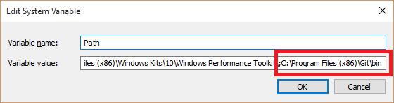
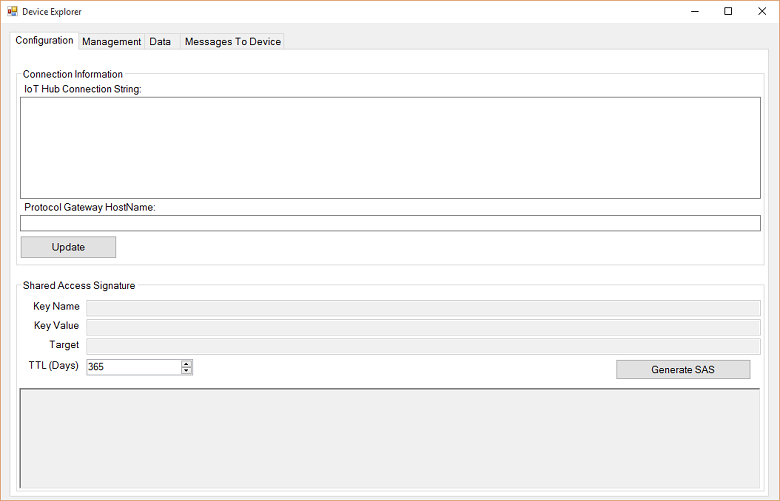
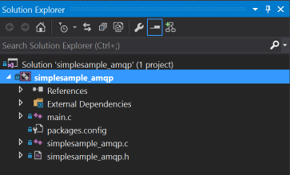

<properties
    pageTitle="Azure IoT 裝置 SDK 用 C |Microsoft Azure"
    description="瞭解並開始使用範例中的程式碼 Azure IoT 裝置 SDK 的 c。"
    services="iot-hub"
    documentationCenter=""
    authors="olivierbloch"
    manager="timlt"
    editor=""/>

<tags
     ms.service="iot-hub"
     ms.devlang="cpp"
     ms.topic="article"
     ms.tgt_pltfrm="na"
     ms.workload="na"
     ms.date="09/06/2016"
     ms.author="obloch"/>

# <a name="introducing-the-azure-iot-device-sdk-for-c"></a>介紹 Azure IoT 裝置 SDK 的 C

**Azure IoT 裝置 SDK**是設計用來簡化傳送事件和**Azure IoT 中心**服務接收郵件的程序的文件庫的一組。 各種不同的 SDK，每個目標特定平台，但本文將說明**Azure IoT 裝置 SDK C**。

C Azure IoT 裝置 SDK 是撰寫 ANSI C (C99) 攜。 這樣就適合用來操作的平台和裝置，尤其是在最小化的磁碟位置和記憶體使用量是優先順序。  

有各式各樣的平台 SDK 經過 （請參閱[Azure IoT 裝置目錄的認證](https://catalog.azureiotsuite.com/)以取得詳細資料）。 雖然這份文件包含的 Windows 平台上執行的範例程式碼的逐步解說，請記住，本文所述的程式碼會完全相同的支援平台的範圍。

本文中您將會介紹 Azure IoT 裝置 SDK 架構的 c。我們會示範如何初始化裝置文件庫、 傳送至 IoT 中樞的事件，以及接收訊息。 本文中的資訊應該可以使用 sdk，您可以快速入門，但也提供其他資訊的文件庫的指標。

## <a name="sdk-architecture"></a>SDK 架構

您可以將[Microsoft Azure IoT Sdk](https://github.com/Azure/azure-iot-sdks) GitHub 存放庫內尋找**Azure IoT 裝置 SDK C** ，並檢視[C API 參照](http://azure.github.io/azure-iot-sdks/c/api_reference/index.html)中的 API 的詳細資料。

**主版**分支此存放庫中，您可以找到最新版本的文件庫︰

  

此存放庫包含 Azure IoT 裝置 Sdk 的整個系列。 不過，這篇文章的 Azure IoT 裝置 SDK*的 C* ，就可以找到**c**資料夾中。

  

* 核心實作 SDK 的請參閱**iothub\_用戶端**資料夾中包含的最低 API 層 SDK 中實作︰ **IoTHubClient**文件庫。 **IoTHubClient**文件庫包含 Api 實作原始訊息的傳送訊息給 IoT 中心，以及從其接收郵件。 時使用此文件庫，您負責實作訊息序列化 （最後使用序列化範例如下所述），但您處理與 IoT 中樞通訊的其他詳細資料。
* **序列化**資料夾包含協助函數顯示如何使用用戶端程式庫 Azure IoT 中樞傳送之前，先序列化資料的範例。 請注意，序列化程式使用強制和只提供為方便。 如果您使用的**序列化**文件庫，您會先定義的模型，指定您想要傳送給 IoT 中心，以及您希望它所收到的郵件的事件。 一旦定義模型後，SDK 會提供您 API 介面，可讓您輕鬆地處理事件和郵件而不需擔心序列化詳細資料。
文件庫取決於實作使用多個通訊協定 （MQTT、 AMQP） 傳輸其他開啟來源文件庫。
* **IoTHubClient**文件庫，取決於其他開啟來源文件庫︰
   * [Azure C 共用公用程式](https://github.com/Azure/azure-c-shared-utility)庫的基本工作提供的一般功能 （例如字串，清單管理、 IO，等...） 需要跨多個 Azure 相關 C Sdk
   * [Azure uAMQP](https://github.com/Azure/azure-uamqp-c)文件庫所用戶端側實作 AMQP 最佳化資源限制式裝置。
   * [Azure uMQTT](https://github.com/Azure/azure-umqtt-c)文件庫是用途的文件庫實作 MQTT 通訊協定和最佳化資源限制式裝置。

這是更容易理解查看範例程式碼。 下列各節會引導您幾個範例應用程式所含的 SDK。 此應提供您建議的風格建築的圖層的 SDK 以及簡介 Api 的運作方式的各種功能。

## <a name="before-running-the-samples"></a>之前執行範例

範例 Azure IoT 裝置 SDK 中執行的 C 之前如果您必須建立該服務的執行個體 Azure 訂閱不已經有一個並完成 2 工作︰
* 開發環境準備作業
* 取得裝置認證。

如果您需要建立 Azure IoT 中樞的執行個體 Azure 訂閱，請依照下列指示進行[以下](https://github.com/Azure/azure-iot-sdks/blob/master/doc/setup_iothub.md)。

隨附 SDK 的[讀我檔案](https://github.com/Azure/azure-iot-sdks/tree/master/c)提供準備您的開發環境的指示，並取得裝置認證。
下列各節會包含在這些指示一些其他評論。

### <a name="preparing-your-development-environment"></a>準備您的開發環境

封裝所提供的某些平台 （例如 Windows 的 NuGet 或 Debian 和 Ubuntu apt_get） 而範例使用這些套件時，下列指示詳細說明如何建立文件庫，並直接範例表單的程式碼。

首先，您會需要從 GitHub 取得 SDK 的複本，然後建立 [來源。 您應該[GitHub 存放庫](https://github.com/Azure/azure-iot-sdks)的**主版**分支取得來源的複本。

當您已下載複本的來源時，您必須完成[「 準備您的開發環境 」](https://github.com/Azure/azure-iot-sdks/blob/master/c/doc/devbox_setup.md)SDK 本文所述的步驟。


以下是一些秘訣，可協助您完成準備指南所述的程序︰

-   當您安裝**CMake**公用程式時，請選擇 [新增**CMake**系統路徑 （新增至**目前的使用者**會運作） 的**所有使用者**的選項︰

  


-   開啟**命令提示字元開發人員 VS2015**之前，請安裝給命令列工具。 若要安裝這些工具，請完成下列步驟︰

    1. 啟動 [ **Visual Studio 2015**安裝程式 （或從**[程式和功能**[控制台] 並選取**變更**選擇**Microsoft Visual Studio 2015** ）]。
    
    2. 確認**Windows 給**功能已安裝程式中，但您也可以核取 [提供 IDE 整合**GitHub Visual Studio 副檔名**選項︰

        

    3. 完成設定精靈來安裝工具。

    4. 將給工具**bin**目錄新增至 [系統**PATH**環境變數。 在 Windows 上，這看起來如下所示︰

        


當您完成所有[「 準備您的開發環境 」](https://github.com/Azure/azure-iot-sdks/blob/master/c/doc/devbox_setup.md)頁面所述的步驟時，您準備好要編譯範例應用程式。

### <a name="obtaining-device-credentials"></a>取得裝置認證

現在您的開發環境設定後，請執行下一個項目就是取得裝置認證集。  若要能夠存取 IoT 中樞的裝置，您必須先 IoT 中心裝置登錄新增裝置。 當您新增您的裝置時，您會收到一組裝置認證所需的裝置，都能連線至 IoT 中樞的順序。 我們將在下一節中的範例應用程式的預期這些**裝置連線字串**的表單中的認證。

有幾個可協助管理 IoT 中心 SDK 開啟來源存放庫中提供的工具。 其中一個是呼叫裝置總管] 中，第二個應用程式是以 node.js 基礎跨平台 CLI 工具稱為 iothub 檔案總管] 視窗。 您可以進一步瞭解這些工具[在這裡](https://github.com/Azure/azure-iot-sdks/blob/master/doc/manage_iot_hub.md)。

我們會透過本主題中，在 Windows 上執行的範例，如我們使用裝置總管工具。 但您也可以使用 iothub 檔案總管，如果您偏好使用 CLI 工具。

[裝置總管](https://github.com/Azure/azure-iot-sdks/tree/master/tools/DeviceExplorer)工具使用 Azure IoT 服務文件庫以 IoT] 中心內，包括新增裝置執行各種不同的功能。 如果您使用的裝置總管] 新增裝置時，就會出現對應的連接字串。 您需要進行的應用程式執行範例此連線字串。

以防您不熟悉程序，下列程序會說明如何使用裝置總管新增裝置，並取得裝置連線字串。

您可以找到 Windows installer [SDK 發行] 頁面](https://github.com/Azure/azure-iot-sdks/releases)上的 [裝置的檔案總管] 工具。 但您也可以直接從**Visual Studio 2015**中開啟**[DeviceExplorer.sln](https://github.com/Azure/azure-iot-sdks/blob/master/tools/DeviceExplorer/DeviceExplorer.sln)**和建置解決方案，其程式碼執行工具。

當您執行程式將會看到這個介面︰

  

輸入您**IoT 中心連線字串**的第一個欄位，然後按一下 [**更新]**。 此設定工具，讓它可以與 IoT 中樞通訊。

設定 IoT 中心連接字串之後按一下 [**管理**] 索引標籤︰

  

這是您會在哪裡管理您 IoT 中心中註冊裝置。

按一下 [**建立**] 按鈕，您可以建立一個裝置。 對話方塊會顯示一組預先填入索引鍵 （主要和次要）。 您只需要是輸入的**裝置識別碼**，然後按一下 [**建立**]。

  

裝置建立之後，[裝置] 清單會更新所有已註冊的裝置，包括您剛建立。 如果您以滑鼠右鍵按一下新裝置，您會看到此功能表︰

  

如果您選擇 [**複製選取的裝置之連線字串**] 選項，您的裝置的連接字串會複製到剪貼簿。 保留一份連線字串。 執行下一節所述的範例應用程式時，您將需要它。

一旦您完成上述步驟後，就可以準備開始執行某些程式碼。 兩個範例會有頂端的主要來源檔案可讓您輸入連線字串常數。 例如，從對應行**iothub\_用戶端\_範例\_amqp**應用程式出現，如下所示。

```
static const char* connectionString = "[device connection string]";
```

如果您想要遵循、 輸入您的裝置連線的字串、 編譯方案，您就可以執行範例。

## <a name="iothubclient"></a>IoTHubClient

內**iothub\_用戶端**資料夾 azure-iot-sdk 存放庫中有包含呼叫的應用程式的**範例**資料夾**iothub\_用戶端\_範例\_amqp**。

Windows 版本的**iothub\_用戶端\_範例\_ampq**應用程式包含下列的 Visual Studio 方案︰

  

此方案包含單一專案。 值得是安裝在本方案中的四個 NuGet 套件︰

- Microsoft.Azure.C.SharedUtility
- Microsoft.Azure.IoTHub.AmqpTransport
- Microsoft.Azure.IoTHub.IoTHubClient
- Microsoft.Azure.uamqp

當您正在使用 SDK 時，一律需要**Microsoft.Azure.C.SharedUtility**套件。 由於此範例依賴 AMQP，您也必須包含**Microsoft.Azure.uamqp**和**Microsoft.Azure.IoTHub.AmqpTransport**封裝 （有相同的封包 MQTT 和 HTTP）。 由於此範例使用**IoTHubClient**文件庫，您也必須包含**Microsoft.Azure.IoTHub.IoTHubClient**套件方案中。

您可以找到範例應用程式中實作**iothub\_用戶端\_範例\_amqp.c**來源檔案。

我們會逐步引導您完成什麼所需使用**IoTHubClient**文件庫中使用這個範例應用程式。

### <a name="initializing-the-library"></a>初始化文件庫

> [AZURE.NOTE] 您使用的文件庫中開始使用之前，您可能需要執行一些平台的初始化。 例如，如果您打算使用 AMQP linux 您必須初始化 OpenSSL 文件庫。 用戶端啟動和結束前呼叫**platform_deinit**函數時， [GitHub 存放庫](https://github.com/Azure/azure-iot-sdks)中的範例呼叫公用程式函數**platform_init** 。 在 「 platform.h 」 標頭檔宣告這些函數。 目標平台來判斷您是否需要您的用戶端中包含任何平台初始化程式碼[存放庫](https://github.com/Azure/azure-iot-sdks)中，您應該檢查這些函數的定義。

開始使用文件庫您必須先配置 IoT 中樞用戶端控點︰

```
IOTHUB_CLIENT_HANDLE iotHubClientHandle;
iotHubClientHandle = IoTHubClient_CreateFromConnectionString(connectionString, AMQP_Protocol);
```

請注意，我們正在傳遞我們裝置的連線字串複本 （一個我們取自裝置總管） 此函數。 我們也會指定要使用的通訊協定。 此範例使用 AMQP，但 MQTT 與 HTTP 也是其中一個選項。

當您有一個有效**IOTHUB\_用戶端\_處理**，您就可以開始呼叫事件收發郵件從 IoT 中心 Api。 我們會查看的下一步]。

### <a name="sending-events"></a>傳送事件

事件傳送至 IoT 中心需要您先完成下列步驟︰

首先，建立一則訊息︰

```
EVENT_INSTANCE message;
sprintf_s(msgText, sizeof(msgText), "Message_%d_From_IoTHubClient_Over_AMQP", i);
message.messageHandle = IoTHubMessage_CreateFromByteArray((const unsigned char*)msgText, strlen(msgText);
```

接下來，請傳送訊息︰

```
IoTHubClient_SendEventAsync(iotHubClientHandle, message.messageHandle, SendConfirmationCallback, &message);
```

每當您傳送郵件時，您可以指定時傳送資料叫用的回撥函數的參照︰

```
static void SendConfirmationCallback(IOTHUB_CLIENT_CONFIRMATION_RESULT result, void* userContextCallback)
{
    EVENT_INSTANCE* eventInstance = (EVENT_INSTANCE*)userContextCallback;
    (void)printf("Confirmation[%d] received for message tracking id = %d with result = %s\r\n", callbackCounter, eventInstance->messageTrackingId, ENUM_TO_STRING(IOTHUB_CLIENT_CONFIRMATION_RESULT, result));
    /* Some device specific action code goes here... */
    callbackCounter++;
    IoTHubMessage_Destroy(eventInstance->messageHandle);
}
```

請注意通話**IoTHubMessage\_損毀**函數當您完成訊息。 您必須進行此通話以釋配置您建立郵件時的資源。

### <a name="receiving-messages"></a>接收郵件

接收郵件是非同步作業。 首先，您註冊回撥到叫用裝置收到一則訊息︰

```
int receiveContext = 0;
IoTHubClient_SetMessageCallback(iotHubClientHandle, ReceiveMessageCallback, &receiveContext);
```

最後的參數是 void 指標至您想要的項目。 在範例中，則為整數的指標，但可能是較複雜的資料結構的指標。 這可讓回撥函數，來共用狀態來電者使用此函數的操作。

當裝置收到一則訊息時，會叫用已註冊的回撥函數︰

```
static IOTHUBMESSAGE_DISPOSITION_RESULT ReceiveMessageCallback(IOTHUB_MESSAGE_HANDLE message, void* userContextCallback)
{
    int* counter = (int*)userContextCallback;
    const char* buffer;
    size_t size;
    if (IoTHubMessage_GetByteArray(message, (const unsigned char**)&buffer, &size) == IOTHUB_MESSAGE_OK)
    {
        (void)printf("Received Message [%d] with Data: <<<%.*s>>> & Size=%d\r\n", *counter, (int)size, buffer, (int)size);
    }

    /* Some device specific action code goes here... */
    (*counter)++;
    return IOTHUBMESSAGE_ACCEPTED;
}
```

請注意，您使用**IoTHubMessage\_GetByteArray**函數來擷取的郵件，在此範例中是字串。

### <a name="uninitializing-the-library"></a>反初始化文件庫

當您完成事件傳送及接收訊息時，您可以取消初始化 IoT 文件庫。 若要這麼做，請下列函數呼叫︰

```
IoTHubClient_Destroy(iotHubClientHandle);
```

釋放先前配置的資源**IoTHubClient\_CreateFromConnectionString**函數。

如您所見，輕鬆傳送事件及接收郵件**IoTHubClient**文件庫。 文件庫控點與 IoT] 中心內，包括所要使用的通訊協定通訊的詳細資料 （從開發人員的觀點來看，這是一個簡單的設定選項）。

**IoTHubClient**文件庫也會提供精確地控制如何序列化您的裝置傳送給 IoT 中樞的事件。 在某些情況下，這是一項優點，但在其他情況下，這是與您不想要考慮實作詳細資料。 如果是這樣，您可以考慮使用 [下一步] 區段中，我們會說明**序列化**文件庫。

## <a name="serializer"></a>序列化程式

概念**序列化**文件庫會位於頂端 sdk **IoTHubClient**文件庫。 使用**IoTHubClient**文件庫的基本通訊與 IoT 中心內，但它會加入移除的訊息序列化處理負擔開發人員的模型功能。 如何此文件庫運作最佳示範範例。

內**序列化**azure-iot-sdk 存放庫中的資料夾會包含呼叫的應用程式的**範例**資料夾**simplesample\_amqp**。 此範例的 Windows 版本包含下列的 Visual Studio 方案︰

  

與上一個範例中，此項目包含多個 NuGet 套件︰

- Microsoft.Azure.C.SharedUtility
- Microsoft.Azure.IoTHub.AmqpTransport
- Microsoft.Azure.IoTHub.IoTHubClient
- Microsoft.Azure.IoTHub.Serializer
- Microsoft.Azure.uamqp

我們看到這些在上一個範例中，但**Microsoft.Azure.IoTHub.Serializer**新。 我們使用**序列化**文件庫時，這是必要。

您可以找到中的範例應用程式實作**simplesample\_amqp.c**檔案。

下列各節會引導您的主要部分的這個範例。

### <a name="initializing-the-library"></a>初始化文件庫

若要開始使用**序列化**文件庫，您必須撥打初始化 Api:

```
serializer_init(NULL);

IOTHUB_CLIENT_HANDLE iotHubClientHandle = IoTHubClient_CreateFromConnectionString(connectionString, AMQP_Protocol);

ContosoAnemometer* myWeather = CREATE_MODEL_INSTANCE(WeatherStation, ContosoAnemometer);
```

通話**序列化\_初始化**函數是一次性通話，並用於初始化基礎的文件庫。 然後，呼叫**IoTHubClient\_CreateFromConnectionString**函數，也就是相同的 API，如**IoTHubClient**範例所示。 此通話設定您的裝置連接字串 (這也是您在其中選擇通訊協定您想要使用)。 請注意，此範例使用 AMQP 為傳輸，但也可以使用 HTTP。

最後，來電**建立\_模型\_執行個體**函數。 請注意， **WeatherStation**是模型的命名空間**ContosoAnemometer**是模型的名稱。 模型執行個體建立之後，您可以使用其啟動事件傳送及接收訊息。 不過，請務必瞭解哪些模型。

### <a name="defining-the-model"></a>定義模型

**序列化**文件庫中的模型定義您的裝置可以傳送到 IoT 中樞和訊息，並在模組化語言，其可接收呼叫*動作*的事件。 定義使用一組 C 巨集，以在模型**simplesample\_amqp**範例應用程式︰

```
BEGIN_NAMESPACE(WeatherStation);

DECLARE_MODEL(ContosoAnemometer,
WITH_DATA(ascii_char_ptr, DeviceId),
WITH_DATA(double, WindSpeed),
WITH_ACTION(TurnFanOn),
WITH_ACTION(TurnFanOff),
WITH_ACTION(SetAirResistance, int, Position)
);

END_NAMESPACE(WeatherStation);
```

**開始\_命名空間**和**結束\_命名空間**巨集兩個需要做為引數的模型的命名空間。 預期之間這些巨集的任何項目是您的模型和模型所使用的資料結構的定義。

在此範例中，有一部分**ContosoAnemometer**單一模型。 此模型定義您的裝置可以傳送到 IoT 中心的兩個事件︰ **DeviceId**和**WindSpeed**。 也會定義您的裝置可接收的三個動作 （郵件）︰ **TurnFanOn** **TurnFanOff**，與**SetAirResistance**。 每項事件有類型，而且每個動作有名稱 （您也可以選擇一組參數）。

事件與模型中定義的動作定義您可以使用傳送到 IoT 集線器的事件，以及回覆郵件傳送到裝置 API 曲面圖。 這是最佳方式瞭解透過範例。

### <a name="sending-events"></a>傳送事件

模型定義您可以傳送給 IoT 中樞的事件。 在此範例中，這表示定義使用**WITH_DATA**巨集的兩個事件之一。 例如，如果您想要傳送到 IoT 集線器**WindSpeed**事件，有幾個步驟進行這項工作所需。 第一種是設定我們想要傳送的資料︰

```
myWeather->WindSpeed = 15;
```

我們先前定義的模型，可讓我們來設定**結構**的成員執行這項。 接下來，我們將序列化我們要傳送的事件︰

```
unsigned char* destination;
size_t destinationSize;

SERIALIZE(&destination, &destinationSize, myWeather->WindSpeed);
```

將此程式碼序列化 （**目的地**所參考） 緩衝事件。 最後，我們會傳送事件到 IoT 集線器此程式碼︰

```
sendMessage(iotHubClientHandle, destination, destinationSize);
```

這是一個協助函數會將我們序列的事件傳送 IoT 中樞的範例應用程式中︰

```
static void sendMessage(IOTHUB_CLIENT_HANDLE iotHubClientHandle, const unsigned char* buffer, size_t size)
{
    static unsigned int messageTrackingId;
    IOTHUB_MESSAGE_HANDLE messageHandle = IoTHubMessage_CreateFromByteArray(buffer, size);
    if (messageHandle != NULL)
    {
        if (IoTHubClient_SendEventAsync(iotHubClientHandle, messageHandle, sendCallback, (void*)(uintptr_t)messageTrackingId) != IOTHUB_CLIENT_OK)
        {
            printf("failed to hand over the message to IoTHubClient");
        }
        else
        {
            printf("IoTHubClient accepted the message for delivery\r\n");
        }

        IoTHubMessage_Destroy(messageHandle);
    }
    free((void*)buffer);
    messageTrackingId++;
}
```

將此程式碼是非常類似，我們中看到**iothub\_用戶端\_範例\_amqp**應用程式，我們建立位元組陣列中的訊息，然後使用**IoTHubClient\_SendEventAsync**要傳送給 IoT 中心。 之後，我們只要有以釋訊息控點，然後序列化資料緩衝我們配置較舊版本。

第二個的最後一個參數**IoTHubClient\_SendEventAsync**是稱為資料成功傳送郵件時的回撥函數的參照。 以下是回撥函數的範例︰

```
void sendCallback(IOTHUB_CLIENT_CONFIRMATION_RESULT result, void* userContextCallback)
{
    int messageTrackingId = (intptr_t)userContextCallback;

    (void)printf("Message Id: %d Received.\r\n", messageTrackingId);

    (void)printf("Result Call Back Called! Result is: %s \r\n", ENUM_TO_STRING(IOTHUB_CLIENT_CONFIRMATION_RESULT, result));
}
```

第二個參數值是使用者內容; 的指標我們傳遞至相同的指標**IoTHubClient\_SendEventAsync**。 在此情況下的內容是簡單計數器，但它可以您想要的任何項目。

這就是有傳送事件。 從左到封面是如何將接收訊息。

### <a name="receiving-messages"></a>接收郵件

接收運作同樣的訊息的方式來使用**IoTHubClient**文件庫中的郵件。 首先，您註冊郵件回撥函數︰

```
IoTHubClient_SetMessageCallback(iotHubClientHandle, IoTHubMessage, myWeather)
```

然後，您撰寫時收到的郵件叫用的回撥函數︰

```
static IOTHUBMESSAGE_DISPOSITION_RESULT IoTHubMessage(IOTHUB_MESSAGE_HANDLE message, void* userContextCallback)
{
    IOTHUBMESSAGE_DISPOSITION_RESULT result;
    const unsigned char* buffer;
    size_t size;
    if (IoTHubMessage_GetByteArray(message, &buffer, &size) != IOTHUB_MESSAGE_OK)
    {
        printf("unable to IoTHubMessage_GetByteArray\r\n");
        result = EXECUTE_COMMAND_ERROR;
    }
    else
    {
        /*buffer is not zero terminated*/
        char* temp = malloc(size + 1);
        if (temp == NULL)
        {
            printf("failed to malloc\r\n");
            result = EXECUTE_COMMAND_ERROR;
        }
        else
        {
            memcpy(temp, buffer, size);
            temp[size] = '\0';
            EXECUTE_COMMAND_RESULT executeCommandResult = EXECUTE_COMMAND(userContextCallback, temp);
            result =
                (executeCommandResult == EXECUTE_COMMAND_ERROR) ? IOTHUBMESSAGE_ABANDONED :
                (executeCommandResult == EXECUTE_COMMAND_SUCCESS) ? IOTHUBMESSAGE_ACCEPTED :
                IOTHUBMESSAGE_REJECTED;
            free(temp);
        }
    }
    return result;
}
```

將此程式碼是樣本--任何方案的相同。 此函數會收到訊息，並負責路由傳送到適當的函數，透過呼叫**執行\_命令**。 呼叫函數此時取決於在模型中的動作的定義。

當您模型中定義的動作時，被才能實作稱為您的裝置收到對應的訊息時的函數。 例如，如果您的模型定義此動作︰

```
WITH_ACTION(SetAirResistance, int, Position)
```

您必須定義此簽章的函數︰

```
EXECUTE_COMMAND_RESULT SetAirResistance(ContosoAnemometer* device, int Position)
{
    (void)device;
    (void)printf("Setting Air Resistance Position to %d.\r\n", Position);
    return EXECUTE_COMMAND_SUCCESS;
}
```

附註的函數名稱符合模型中的動作的名稱，該函數的參數符合指定的巨集指令的參數。 第一個參數必須，並包含的指標，我們的模型的執行個體。

當裝置收到一則訊息，比對此簽章時，稱為相對應的函數。 因此，除了要包含的指令碼，從**IoTHubMessage**方面接收訊息是只不過定義簡單函數的每個模型中定義的動作。

### <a name="uninitializing-the-library"></a>反初始化文件庫

當您完成時傳送及接收郵件時，您可以取消初始化 IoT 文件庫︰

```
        DESTROY_MODEL_INSTANCE(myWeather);
    }
    IoTHubClient_Destroy(iotHubClientHandle);
}
serializer_deinit();
```

每個下列三種功能對齊先前所述的三個初始化函數。 呼叫這些 Api，可確保您空閒先前配置的資源。

## <a name="next-steps"></a>後續步驟

本文涵蓋使用**Azure IoT 裝置 SDK C**中的文件庫的基本概念。提供您的資訊不足，若要瞭解什麼包含 sdk，您可以在其結構，並瞭解如何開始使用 Windows 範例。 下一篇文章說[更多關於 IoTHubClient 文件庫](iot-hub-device-sdk-c-iothubclient.md)，繼續 SDK 的描述。

若要進一步瞭解開發 IoT 集線器，請參閱[IoT 中心 Sdk][lnk-sdks]。

若要進一步探索 IoT 中樞的功能，請參閱︰

- [模擬 IoT 閘道器 SDK 的裝置][lnk-gateway]


[lnk-file upload]: iot-hub-csharp-csharp-file-upload.md
[lnk-create-hub]: iot-hub-rm-template-powershell.md
[lnk-c-sdk]: iot-hub-device-sdk-c-intro.md
[lnk-sdks]: iot-hub-devguide-sdks.md

[lnk-gateway]: iot-hub-linux-gateway-sdk-simulated-device.md
