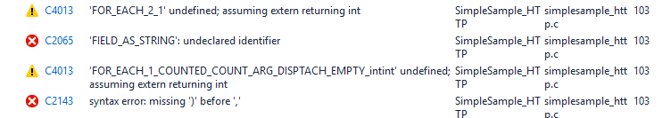

<properties
    pageTitle="Azure IoT 裝置 SDK C-序列化 |Microsoft Azure"
    description="進一步瞭解使用序列化文件庫中的 Azure IoT 裝置 SDK 的 C"
    services="iot-hub"
    documentationCenter=""
    authors="olivierbloch"
    manager="timlt"
    editor=""/>

<tags
     ms.service="iot-hub"
     ms.devlang="cpp"
     ms.topic="article"
     ms.tgt_pltfrm="na"
     ms.workload="na"
     ms.date="09/06/2016"
     ms.author="obloch"/>

# <a name="microsoft-azure-iot-device-sdk-for-c--more-about-serializer"></a>Microsoft Azure IoT 裝置 SDK C – 更多關於序列化資訊

本系列的[第一篇文章](iot-hub-device-sdk-c-intro.md)推出**Azure IoT 裝置 SDK C**。下一篇文章提供[**IoTHubClient**](iot-hub-device-sdk-c-iothubclient.md)的詳細的描述。 本文提供詳細的描述的剩餘的元件完成 SDK 的範圍︰**序列化**文件庫。

簡介文章說明如何使用事件來收發郵件從 IoT 中心**序列化**文件庫。 本文中，我們會提供更完整的說明如何建立您的資料以**序列化**巨集語言的模型的延伸的討論。 本文也包含更多詳細資料的相關文件庫序列化郵件的方式，並在某些情況下您如何控制序列化行為。 我們也會說明您可以修改決定您建立的模型大小某些參數。

最後，本文會再次一些訊息和內容處理等文章中包含的主題。 我們會發現，這些功能的運作方式與**IoTHubClient**文件庫一樣，請使用**序列化**文件庫的方式相同。

本文所述的所有項目根據**序列化**SDK 範例。 如果您想要邊，請參閱**simplesample\_amqp**和**simplesample\_http**應用程式中 Azure IoT 裝置 SDK 包含 c。

您可以將[Microsoft Azure IoT Sdk](https://github.com/Azure/azure-iot-sdks) GitHub 存放庫內尋找**Azure IoT 裝置 SDK C** ，並檢視[C API 參照](http://azure.github.io/azure-iot-sdks/c/api_reference/index.html)中的 API 的詳細資料。

## <a name="the-modeling-language"></a>模組化語言

本系列[簡介文章](iot-hub-device-sdk-c-intro.md)推出模組化語言中提供的範例透過**Azure IoT 裝置 SDK C** **simplesample\_amqp**應用程式︰

```
BEGIN_NAMESPACE(WeatherStation);

DECLARE_MODEL(ContosoAnemometer,
WITH_DATA(ascii_char_ptr, DeviceId),
WITH_DATA(double, WindSpeed),
WITH_ACTION(TurnFanOn),
WITH_ACTION(TurnFanOff),
WITH_ACTION(SetAirResistance, int, Position)
);

END_NAMESPACE(WeatherStation);
```

如您所見，模組化語言根據 C 巨集。 您永遠開始使用您定義**開始\_命名空間**和結尾一律**結束\_命名空間**。 通常會為您的公司，或與此範例中，您正在處理的專案名稱命名空間。

什麼資料可以放命名空間是模型定義。 在此情況下，有單一 anemometer 的模型。 同樣地，模型可以命名任何項目，但通常這稱為裝置或您想要與 IoT 中心交換的資料類型。  

模型包含您可以輸入 IoT 集線器 （*資料*） 以及您可以從 IoT 中心 （*動作*） 接收的郵件的事件的定義。 您可以看到範例中，事件有類型與欄位名稱。動作有的名稱，以及選擇性參數 （與類型的每一個）。

並不會在這個範例示範是 SDK 所支援的其他資料類型。 我們會的下一步]。

> [AZURE.NOTE] IoT 中心是指裝置會傳送至該*事件*時模組化語言參照做為*資料*（使用**WITH_DATA**定義）, 的資料。 同樣地，IoT 中心是指您傳送至 [裝置] 為 [*郵件*] 模組化語言參照為*動作*（定義**WITH_ACTION**） 的資料。 請注意，這些條款可能交換使用本文中。

### <a name="supported-data-types"></a>支援的資料類型

建立與**序列化**文件庫的模型中支援下列資料類型︰

| 類型                    | 描述                            |
|-------------------------|----------------------------------------|
| 雙引號                  | 雙精確度浮點數字 |
| int                     | 32 位元整數                         |
| 浮動時間                   | 單一精準浮點數字 |
| 長                    | 長整數                           |
| int8\_t                 | 8 位元整數                          |
| int16\_t                | 16 位元整數                         |
| int32\_t                | 32 位元整數                         |
| int64\_t                | 64 位元整數                         |
| bool                    | 布林值                                |
| ascii\_char\_ptr        | ASCII 字串                           |
| EDM\_日期\_時間\_位移 | 日期時間位移                       |
| EDM\_GUID               | GUID                                   |
| EDM\_二進位             | 二進位                                 |
| 宣告\_結構         | 複雜的資料類型                      |

現在就讓我們開始的最後一個資料類型。 **DECLARE\_結構**可讓您定義複雜的資料類型，也就是基本類型的群組。 這些群組，讓我們定義的模型，看起來像這樣︰

```
DECLARE_STRUCT(TestType,
double, aDouble,
int, aInt,
float, aFloat,
long, aLong,
int8_t, aInt8,
uint8_t, auInt8,
int16_t, aInt16,
int32_t, aInt32,
int64_t, aInt64,
bool, aBool,
ascii_char_ptr, aAsciiCharPtr,
EDM_DATE_TIME_OFFSET, aDateTimeOffset,
EDM_GUID, aGuid,
EDM_BINARY, aBinary
);

DECLARE_MODEL(TestModel,
WITH_DATA(TestType, Test)
);
```

我們的模型包含類型**準則**的單一資料事件。 **準則**是一種複雜類型，其中包含多個成員，共同示範**序列化**模組化語言支援的基本類型。

就像這樣的模型，我們可以撰寫程式碼傳送資料至 IoT 中心出現，如下所示︰

```
TestModel* testModel = CREATE_MODEL_INSTANCE(MyThermostat, TestModel);

testModel->Test.aDouble = 1.1;
testModel->Test.aInt = 2;
testModel->Test.aFloat = 3.0f;
testModel->Test.aLong = 4;
testModel->Test.aInt8 = 5;
testModel->Test.auInt8 = 6;
testModel->Test.aInt16 = 7;
testModel->Test.aInt32 = 8;
testModel->Test.aInt64 = 9;
testModel->Test.aBool = true;
testModel->Test.aAsciiCharPtr = "ascii string 1";

time_t now;
time(&now);
testModel->Test.aDateTimeOffset = GetDateTimeOffset(now);

EDM_GUID guid = { { 0x00, 0x01, 0x02, 0x03, 0x04, 0x05, 0x06, 0x07, 0x08, 0x09, 0x0A, 0x0B, 0x0C, 0x0D, 0x0E, 0x0F } };
testModel->Test.aGuid = guid;

unsigned char binaryArray[3] = { 0x01, 0x02, 0x03 };
EDM_BINARY binaryData = { sizeof(binaryArray), &binaryArray };
testModel->Test.aBinary = binaryData;

SendAsync(iotHubClientHandle, (const void*)&(testModel->Test));
```

基本上，我們要指派**測試**結構的每一個成員的值，然後呼叫 [ **SendAsync** **測試**資料事件傳送至雲端。 **SendAsync**是將單一資料事件傳送至 IoT 中心協助函數︰

```
void SendAsync(IOTHUB_CLIENT_LL_HANDLE iotHubClientHandle, const void *dataEvent)
{
    unsigned char* destination;
    size_t destinationSize;
    if (SERIALIZE(&destination, &destinationSize, *(const unsigned char*)dataEvent) ==
    {
        // null terminate the string
        char* destinationAsString = (char*)malloc(destinationSize + 1);
        if (destinationAsString != NULL)
        {
            memcpy(destinationAsString, destination, destinationSize);
            destinationAsString[destinationSize] = '\0';
            IOTHUB_MESSAGE_HANDLE messageHandle = IoTHubMessage_CreateFromString(destinationAsString);
            if (messageHandle != NULL)
            {
                IoTHubClient_SendEventAsync(iotHubClientHandle, messageHandle, sendCallback, (void*)0);

                IoTHubMessage_Destroy(messageHandle);
            }
            free(destinationAsString);
        }
        free(destination);
    }
}
```

此函數將序列化指定的資料事件，並將它傳送到 IoT 集線器使用**IoTHubClient\_SendEventAsync**。 這是相同 （**SendAsync**封裝到方便函數邏輯） 的上一個文件中所討論的程式碼。

一個先前的程式碼中使用其他協助函數是**GetDateTimeOffset**。 此函數會將指定的時間轉換為的值類型**EDM\_日期\_時間\_位移**:

```
EDM_DATE_TIME_OFFSET GetDateTimeOffset(time_t time)
{
    struct tm newTime;
    gmtime_s(&newTime, &time);
    EDM_DATE_TIME_OFFSET dateTimeOffset;
    dateTimeOffset.dateTime = newTime;
    dateTimeOffset.fractionalSecond = 0;
    dateTimeOffset.hasFractionalSecond = 0;
    dateTimeOffset.hasTimeZone = 0;
    dateTimeOffset.timeZoneHour = 0;
    dateTimeOffset.timeZoneMinute = 0;
    return dateTimeOffset;
}
```

如果您執行這個程式碼，下列訊息會傳送至 IoT 中心中︰

```
{"aDouble":1.100000000000000, "aInt":2, "aFloat":3.000000, "aLong":4, "aInt8":5, "auInt8":6, "aInt16":7, "aInt32":8, "aInt64":9, "aBool":true, "aAsciiCharPtr":"ascii string 1", "aDateTimeOffset":"2015-09-14T21:18:21Z", "aGuid":"00010203-0405-0607-0809-0A0B0C0D0E0F", "aBinary":"AQID"}
```

請注意序列化為 JSON，也就是**序列化**文件庫所產生的格式。 另請注意序列 JSON 物件的每一個成員符合**準則**的我們在模型中所定義的成員。 值也會完全符合所使用的程式碼。 不過，請注意，二進位資料 base64 編碼: 「 AQID 」 是 base64 編碼的 {0x01、 0x02、 0x03}。

此範例會示範使用**序列化**文件庫的優點--可讓我們傳送至雲端，JSON，而不必明確地處理序列化應用程式。 我們只需要擔心我們的模型，然後呼叫 [傳送這些事件至雲端的簡單 Api 中設定資料事件的值。

此資訊，我們可以定義包含支援的資料類型，其中包括複雜類型 （我們甚至可能包含在其他複雜型別複雜型別） 的範圍的模型。 不過，他序列化所產生的 JSON 上述範例顯示很重要的一點。 *我們如何*傳送與**序列化**文件庫的資料會決定完全如何 JSON 的正確。 該特定點是什麼會為您介紹下一步。

## <a name="more-about-serialization"></a>更多關於序列化

上一節會醒目提示的**序列化**文件庫所產生的輸出的範例。 在此區段中，我們會說明如何文件庫序列化資料，以及您如何控制使用序列化 Api 的行為。

才能進入序列化討論，我們將使用新的模型，根據 thermostat。 首先，我們嘗試地址的案例現在就讓我們提供一些背景。

我們想要測量溫度和濕度 thermostat 的模型。 將每一筆資料以不同的方式傳送至 IoT 中心。 根據預設，thermostat ingresses 溫度事件一次每 2 分鐘;濕度事件是一次每 15 分鐘 ingressed。 Ingressed 任一事件時，它必須包含已測量的相對應的溫度或濕度會顯示的時間戳記。

這種情況下，我們會示範模型資料，兩種不同方式，我們會說明效果模型具有序列輸出上。

### <a name="model-1"></a>模型 1

以下是模型的支援前一個案例的第一個版本︰

```
BEGIN_NAMESPACE(Contoso);

DECLARE_STRUCT(TemperatureEvent,
int, Temperature,
EDM_DATE_TIME_OFFSET, Time);

DECLARE_STRUCT(HumidityEvent,
int, Humidity,
EDM_DATE_TIME_OFFSET, Time);

DECLARE_MODEL(Thermostat,
WITH_DATA(TemperatureEvent, Temperature),
WITH_DATA(HumidityEvent, Humidity)
);

END_NAMESPACE(Contoso);
```

請注意模型包含兩個資料事件︰**溫度**和**濕度**。 與上一個範例中，每項事件類型是使用所定義的結構**DECLARE\_結構**。 **TemperatureEvent**包含溫度測量和時間戳記。**HumidityEvent**包含濕度測量和時間戳記。 此模型會提供我們自然的方式來建立上述情況的資料模型。 當我們傳送至雲端的事件時，我們可能會傳送溫度/時間戳記或濕度/時間戳記配對。

我們可以傳送溫度事件至雲端使用程式碼，如下所示︰

```
time_t now;
time(&now);
thermostat->Temperature.Temperature = 75;
thermostat->Temperature.Time = GetDateTimeOffset(now);

unsigned char* destination;
size_t destinationSize;
if (SERIALIZE(&destination, &destinationSize, thermostat->Temperature) == IOT_AGENT_OK)
{
    sendMessage(iotHubClientHandle, destination, destinationSize);
}
```

我們要使用的溫度和濕度範例程式碼的硬式編碼值，但想像我們實際上擷取這些值以取樣上 thermostat 對應感應器。

上述的程式碼會使用先前已推出**GetDateTimeOffset**協助。 基於變成清除之後，將此程式碼明確分隔序列化和傳送事件的工作。 先前的程式碼會將溫度事件序列化緩衝。 然後， **sendMessage**是協助函數 (包含在**simplesample\_amqp**)，傳送給 IoT 中樞的事件︰

```
static void sendMessage(IOTHUB_CLIENT_HANDLE iotHubClientHandle, const unsigned char* buffer, size_t size)
{
    static unsigned int messageTrackingId;
    IOTHUB_MESSAGE_HANDLE messageHandle = IoTHubMessage_CreateFromByteArray(buffer, size);
    if (messageHandle != NULL)
    {
        IoTHubClient_SendEventAsync(iotHubClientHandle, messageHandle, sendCallback, (void*)(uintptr_t)messageTrackingId);

        IoTHubMessage_Destroy(messageHandle);
    }
    free((void*)buffer);
}
```

將此程式碼是述前一節中，因此我們不會在其上再次移以下的**SendAsync**協助程式子集合。

執行先前的程式碼，若要傳送的溫度事件，此序列的表單的事件會傳送至 IoT 中心中︰

```
{"Temperature":75, "Time":"2015-09-17T18:45:56Z"}
```

我們正在傳送即類型**TemperatureEvent**的溫度，該結構內含**溫度**和**時間**的成員。 這是直接會反映在序列的資料。

同樣地，我們可以傳送此程式碼濕度事件︰

```
thermostat->Humidity.Humidity = 45;
thermostat->Humidity.Time = GetDateTimeOffset(now);
if (SERIALIZE(&destination, &destinationSize, thermostat->Humidity) == IOT_AGENT_OK)
{
    sendMessage(iotHubClientHandle, destination, destinationSize);
}
```

傳送至 IoT 中心序列的表單如下所示︰

```
{"Humidity":45, "Time":"2015-09-17T18:45:56Z"}
```

同樣地，這是如預期般。

使用這個模型，您可以想像如何其他事件可以輕鬆地新增。 您定義當您使用的詳細結構**DECLARE\_結構**，並將對應的事件包含在模型使用**與\_資料**。

現在讓我們來修改模型，使其包含相同的資料，但使用不同的結構。

### <a name="model-2"></a>模型 2

請考慮以上此替代模型︰

```
DECLARE_MODEL(Thermostat,
WITH_DATA(int, Temperature),
WITH_DATA(int, Humidity),
WITH_DATA(EDM_DATE_TIME_OFFSET, Time)
);
```

在此情況下，我們已排除**DECLARE\_結構**巨集，只要定義資料中的項目我們使用簡單的類型，從模組化語言的情況。

現在就讓我們只會針對目前略過**時間**事件。 使用該另外，以下是程式碼，輸入**溫度**︰

```
time_t now;
time(&now);
thermostat->Temperature = 75;

unsigned char* destination;
size_t destinationSize;
if (SERIALIZE(&destination, &destinationSize, thermostat->Temperature) == IOT_AGENT_OK)
{
    sendMessage(iotHubClientHandle, destination, destinationSize);
}
```

將此程式碼會將下列序列的事件傳送 IoT 中心︰

```
{"Temperature":75}
```

並傳送濕度事件的程式碼，如下所示︰

```
thermostat->Humidity = 45;
if (SERIALIZE(&destination, &destinationSize, thermostat->Humidity) == IOT_AGENT_OK)
{
    sendMessage(iotHubClientHandle, destination, destinationSize);
}
```

將此程式碼傳送給 IoT 中心︰

```
{"Humidity":45}
```

到目前為止仍有任何意外。 現在讓我們來變更 [我們如何使用 SERIALIZE 巨集。

**SERIALIZE**巨集可能需要多個資料事件做為引數。 這可讓我們來共同序列化**溫度**和**濕度**事件和一個通話中傳送給 IoT 中心︰

```
if (SERIALIZE(&destination, &destinationSize, thermostat->Temperature, thermostat->Humidity) == IOT_AGENT_OK)
{
    sendMessage(iotHubClientHandle, destination, destinationSize);
}
```

您可能會想將此程式碼的結果是兩個資料事件會傳送到 IoT 集線器︰

[

{」 溫度 」: 75}，

{」 濕度 」: 45}

]

換句話說，您可能會將此程式碼會分別傳送**溫度**和**濕度**相同。 這是只在相同的通話時，將這兩個事件傳遞到**SERIALIZE**便利性。 不過，這不是大小寫。 不過，以上的程式碼會傳送此單一資料事件到 IoT 中心︰

{」 溫度 」: 75，"濕度 」: 45}

這可能奇怪因為我們模型定義**溫度**和**濕度**為兩個*不同*的事件︰

```
DECLARE_MODEL(Thermostat,
WITH_DATA(int, Temperature),
WITH_DATA(int, Humidity),
WITH_DATA(EDM_DATE_TIME_OFFSET, Time)
);
```

更多的點，我們未模型**溫度**和**濕度**中所在的相同的結構這些事件︰

```
DECLARE_STRUCT(TemperatureAndHumidityEvent,
int, Temperature,
int, Humidity,
);

DECLARE_MODEL(Thermostat,
WITH_DATA(TemperatureAndHumidityEvent, TemperatureAndHumidity),
);
```

如果我們使用此模型時，它就會更容易理解**溫度**和**濕度**想要傳送的方式相同的序列訊息。 不過，可能不是清除運作的方式時，這兩個資料事件至**SERIALIZE**使用模型 2 的原因。

這是更容易理解是否您知道假設進行**序列化**文件庫。 若要讓此回到我們的模型具有意義︰

```
DECLARE_MODEL(Thermostat,
WITH_DATA(int, Temperature),
WITH_DATA(int, Humidity),
WITH_DATA(EDM_DATE_TIME_OFFSET, Time)
);
```

將此模型物件導向條款。 在此情況下我們模型實體裝置 (thermostat)，及該裝置包括**溫度**和**濕度**等的屬性。

我們可以傳送給我們的模型，如下所示的程式碼的整個狀態︰

```
if (SERIALIZE(&destination, &destinationSize, thermostat->Temperature, thermostat->Humidity, thermostat->Time) == IOT_AGENT_OK)
{
    sendMessage(iotHubClientHandle, destination, destinationSize);
}
```

假設溫度的值，濕度與時間設定，我們就會看到如下傳送至 IoT 中心事件︰

```
{"Temperature":75, "Humidity":45, "Time":"2015-09-17T18:45:56Z"}
```

有時您可能只想傳送至雲端 （特別是如果您的模型包含大量的資料事件） 的模型的*一些*屬性。 會在先前範例中，例如傳送資料事件的子集很有用︰

```
{"Temperature":75, "Time":"2015-09-17T18:45:56Z"}
```

這會產生完全相同的序列的事件如同我們已定義**TemperatureEvent**與**溫度**和**時間**的成員，如我們模型 1。 在此情況下，我們可以使用不同的模型 （模型 2），因為我們稱為**SERIALIZE**中使用不同的方式來產生完全相同的序列的事件。

很重要的一點是，如果將多個資料事件傳遞給**SERIALIZE，**其假設每項事件是單一 JSON 物件的屬性。

最好的方法取決於您以及思考您的模型。 如果您要傳送至雲端的 「 活動 」，且每項事件包含一組定義的屬性，第一種方法可讓您很實用。 在此情況下您想要使用**DECLARE\_結構**來定義每項事件的結構，然後將其包含的模型中**與\_資料**巨集。 然後您傳送每項事件我們在第一個以上的範例。 在這種方法會只在單一資料事件為了**序列化程式**。

如果您認為您模型物件導向的方式，然後第二個方法可能適合您。 使用 [在此案例中，項目定義功能**與\_資料**是 「 屬性 」 的物件。 您以您想取決於您想要傳送至雲端的 「 物件的 「 狀態中有多少**SERIALIZE**傳遞事件的任何子集合。

Nether 的方法是向右或錯誤。 只要**序列化**文件庫的運作方式，請注意，然後選擇最適合您需求的模型方法。

## <a name="message-handling"></a>郵件處理

到目前為止本文只討論傳送事件 IoT] 中心內，並接收郵件尚未收件者。 原因是，我們需要知道接收訊息主要已涵蓋在[舊版的文件](iot-hub-device-sdk-c-intro.md)中。 您在註冊郵件回撥函數處理郵件回收的文章︰

```
IoTHubClient_SetMessageCallback(iotHubClientHandle, IoTHubMessage, myWeather)
```

然後，您會撰寫時收到的郵件叫用的回撥函數︰

```
static IOTHUBMESSAGE_DISPOSITION_RESULT IoTHubMessage(IOTHUB_MESSAGE_HANDLE message, void* userContextCallback)
{
    IOTHUBMESSAGE_DISPOSITION_RESULT result;
    const unsigned char* buffer;
    size_t size;
    if (IoTHubMessage_GetByteArray(message, &buffer, &size) != IOTHUB_MESSAGE_OK)
    {
        printf("unable to IoTHubMessage_GetByteArray\r\n");
        result = EXECUTE_COMMAND_ERROR;
    }
    else
    {
        /*buffer is not zero terminated*/
        char* temp = malloc(size + 1);
        if (temp == NULL)
        {
            printf("failed to malloc\r\n");
            result = EXECUTE_COMMAND_ERROR;
        }
        else
        {
            memcpy(temp, buffer, size);
            temp[size] = '\0';
            EXECUTE_COMMAND_RESULT executeCommandResult = EXECUTE_COMMAND(userContextCallback, temp);
            result =
                (executeCommandResult == EXECUTE_COMMAND_ERROR) ? IOTHUBMESSAGE_ABANDONED :
                (executeCommandResult == EXECUTE_COMMAND_SUCCESS) ? IOTHUBMESSAGE_ACCEPTED :
                IOTHUBMESSAGE_REJECTED;
            free(temp);
        }
    }
    return result;
}
```

此實作**IoTHubMessage**通話特定函數的模型中的每個動作。 例如，如果您的模型定義此動作︰

```
WITH_ACTION(SetAirResistance, int, Position)
```

您必須定義此簽章的函數︰

```
EXECUTE_COMMAND_RESULT SetAirResistance(ContosoAnemometer* device, int Position)
{
    (void)device;
    (void)printf("Setting Air Resistance Position to %d.\r\n", Position);
    return EXECUTE_COMMAND_SUCCESS;
}
```

當郵件傳送至您的裝置，然後呼叫**SetAirResistance** 。

我們尚未說明尚未是訊息的序列的版本的外觀。 換句話說，如果您想要傳送**SetAirResistance**訊息給您的裝置的外觀為何？

如果您要傳送郵件到裝置，您可以透過 Azure IoT 服務 SDK 來執行此動作。 您仍需要知道什麼字串傳送給叫用特定的動作。 在傳送郵件的一般格式如下所示︰

```
{"Name" : "", "Parameters" : "" }
```

您要傳送的兩個屬性的序列的 JSON 物件︰**名稱**動作 （郵件） 的名稱，而**參數**包含該巨集指令的參數。

例如，叫用**SetAirResistance**中，您可以傳送此郵件到裝置︰

```
{"Name" : "SetAirResistance", "Parameters" : { "Position" : 5 }}
```

巨集指令名稱必須確實符合您的模型中定義的動作。 參數名稱必須符合以及。 另請注意區分大小寫。 **名稱**和**參數**一律是大寫。 請確定您的巨集指令名稱和模型中的參數的大小寫須相符。 在此範例中，動作名稱為 「 SetAirResistance 」 和不是 「 setairresistance 」。

本節描述您必須知道當事件傳送及接收訊息與**序列化**文件庫的所有項目。 再繼續，讓我們來覆蓋某些參數您可以設定的控制模型的大小。

## <a name="macro-configuration"></a>巨集設定

如果您使用的**序列化**文件庫的 azure-c-共用-公用程式文件庫中找到的 SDK，您必須知道的重要部分。
如果您有複製 GitHub 使用-遞迴選項從 Azure-iot-sdk 存放庫，您會看到這個共用公用程式庫︰

```
.\\c\\azure-c-shared-utility
```

如果您有不會複製文件庫，您可以找到[以下](https://github.com/Azure/azure-c-shared-utility)。

共用公用程式文件庫中，您會看到下列資料夾︰

```
azure-c-shared-utility\\macro\_utils\_h\_generator.
```

這個資料夾包含 Visual Studio 解決方案稱為**巨集\_utils\_h\_generator.sln**:

  

在本方案中的程式會產生**巨集\_utils.h**檔案。 有預設巨集\_utils.h SDK 隨附的檔案。 此方案可讓您修改某些參數，然後重新建立根據下列參數的標頭檔。

考慮的兩個主要的參數是**nArithmetic**和**nMacroParameters**巨集中找到這兩行中定義的\_utils.tt:

```
<#int nArithmetic=1024;#>
<#int nMacroParameters=124;/*127 parameters in one macro definition in C99 in chapter 5.2.4.1 Translation limits*/#>

```

這些值是 SDK 隨附的預設參數。 每個參數具有下列意義︰

-   nMacroParameters – 控制多少參數，您可以有一個 DECLARE\_模型巨集的定義。

-   nArithmetic – 控制項總數允許模型中的成員。

這些參數是重要的原因是因為他們控制模型可大小。 例如，請考慮此模型定義︰

```
DECLARE_MODEL(MyModel,
WITH_DATA(int, MyData)
);
```

如前述， **DECLARE\_模型**只使用 C 巨集。 模型的名稱和**與\_資料**陳述式 （但另一個巨集） 的參數**DECLARE\_模型**。 **nMacroParameters**定義多少參數可以包含在**DECLARE\_模型**。 實際上，此定義多少資料事件與動作宣告您可以讓。 因此，與 124 的預設限制這表示您可以定義含有關於 60 的動作與資料事件的組合的模型。 如果您嘗試超過此限制，您會收到編譯器錯誤的看起來像這樣︰

  

**NArithmetic**參數是超過內部運作的巨集語言的相關應用程式。  控制的成員可以有模型，包括**DECLARE_STRUCT**巨集的總數。 如果您啟動看到這類編譯器錯誤，您應該嘗試增加**nArithmetic**:

   

如果您想要變更這些參數，修改的值，在巨集\_utils.tt 檔案、 重新編譯巨集\_utils\_h\_generator.sln 解決方案，並執行編譯程式。 當您這麼做，新巨集\_產生 utils.h 檔案並將其放在。\\常見\\inc 目錄。

若要使用巨集的新版本\_utils.h，移除您的方案的**序列化**NuGet 套件，並在其位置中包含**序列化**Visual Studio 專案。 這可讓您來對來源程式碼的序列化文件庫編譯的程式碼。 這包含更新的巨集\_utils.h。 如果您想要的執行這個動作**simplesample\_amqp**，首先 NuGet 套件序列化文件庫移除方案︰

   

然後將 [此專案加入 Visual Studio 方案︰

> .\\c\\序列化\\建立\\windows\\serializer.vcxproj

當您完成時，您的方案看起來應該像這樣︰

   

現在當您編譯方案時，更新的巨集\_utils.h 會包含您的二進位。

請注意增加夠這些值可能會超過編譯器限制。 此點**nMacroParameters**會是要考慮的主要參數。 C99 規格指定的巨集定義中允許 127 參數的最小值。 Microsoft 編譯器完全如下規格 （並有 127 的限制），讓您將無法增加**nMacroParameters**超出預設值。 其他編譯器可能會讓您執行此作業 （例如，GNU 編譯器支援更高的上限）。

目前我們已涵蓋幾乎所有項目必須知道如何撰寫程式碼與**序列化**文件庫。 前多久，讓我們來重新瀏覽從先前的文件，您可能會想知道一些主題。

## <a name="the-lower-level-apis"></a>較低層級 Api

本文著重在其上的範例應用程式**simplesample\_amqp**。 此範例使用較高層級 （非-「 LL 」） Api 事件的傳送及接收訊息。 如果您使用這些 Api，背景執行緒執行其負責事件傳送和接收郵件。 不過，您可以使用較低層級 (LL) Api，以利消除背景執行緒並採取明確控制當您傳送的事件或接收來自雲端的訊息。

[前一篇文章](iot-hub-device-sdk-c-iothubclient.md)所述，有一組功能所組成的高層級的 Api:

-   IoTHubClient\_CreateFromConnectionString

-   IoTHubClient\_SendEventAsync

-   IoTHubClient\_SetMessageCallback

-   IoTHubClient\_損毀

這些 Api 所示範**simplesample\_amqp**。

也有類似的較低層級 Api 的設定。

-   IoTHubClient\_LL\_CreateFromConnectionString

-   IoTHubClient\_LL\_SendEventAsync

-   IoTHubClient\_LL\_SetMessageCallback

-   IoTHubClient\_LL\_損毀

請注意較低層級的 Api 使用完全相同的方式，在先前的文件中所述。 如果您希望背景執行緒處理事件傳送及接收郵件，您可以使用 Api 第一組。 如果您想要明確控制當您傳送和接收 IoT 中心中的資料，您可以使用第二個設定的 Api。 設定的 Api 工作正常與**序列化**文件庫。

如需如何較低層級 Api 搭配使用的是**序列化**文件庫的範例，請參閱**simplesample\_http**應用程式。

## <a name="additional-topics"></a>其他主題

值得的一些其他主題一次為處理時，使用其他裝置的認證，以及設定選項。 這些是[前一篇文章](iot-hub-device-sdk-c-iothubclient.md)中包含的所有主題。 主要是，所有這些功能的運作方式與**序列化**文件庫相同的方式與**IoTHubClient**文件庫。 例如，如果您想要從您的模型附加事件的內容，您使用**IoTHubMessage\_屬性**和**地圖**\_**AddorUpdate**，相同的方式如先前所述︰

```
MAP_HANDLE propMap = IoTHubMessage_Properties(message.messageHandle);
sprintf_s(propText, sizeof(propText), "%d", i);
Map_AddOrUpdate(propMap, "SequenceNumber", propText);
```

是否從**序列化**文件庫產生或手動使用**IoTHubClient**文件庫建立事件並不重要。

對於其他裝置的認證，請使用**IoTHubClient\_LL\_建立**好運作為**IoTHubClient\_CreateFromConnectionString**配置**IOTHUB\_用戶端\_處理**。

最後，如果您使用的**序列化**文件庫，您可以設定的設定選項**IoTHubClient\_LL\_高效**就像您並未使用**IoTHubClient**文件庫。

唯一**序列化**文件庫的功能是初始化 Api。 您可以開始使用文件庫之前，您必須撥打**序列化\_初始化**:

```
serializer_init(NULL);
```

這是您撥打之前**IoTHubClient\_CreateFromConnectionString**。

同樣地，當您完成使用文件庫，就能讓的最後一個呼叫是**序列化\_deinit**:

```
serializer_deinit();
```

否則，所有上述的其他功能的運作方式相同**序列化**文件庫中在**IoTHubClient**文件庫中。 如需這些主題的相關資訊，請參閱[前一篇文章](iot-hub-device-sdk-c-iothubclient.md)本系列。

## <a name="next-steps"></a>後續步驟

本文說明的詳細資料**序列化**文件庫中**Azure IoT 裝置 SDK C**所包含的獨特作業。使用資訊提供您應該瞭解如何使用事件收發郵件從 IoT 中心模型。

這也包含三個部分系列如何開發應用程式與**Azure IoT 裝置 SDK C**。應該是足夠的資訊可協助您入門不僅讓您深入瞭解 Api 的運作方式。 如需詳細資訊，有幾個範例 SDK 未提及。 否則， [SDK 文件](https://github.com/Azure/azure-iot-sdks)是很好的資源，如需詳細資訊。


若要進一步瞭解開發 IoT 集線器，請參閱[IoT 中心 Sdk][lnk-sdks]。

若要進一步探索 IoT 中樞的功能，請參閱︰

- [模擬 IoT 閘道器 SDK 的裝置][lnk-gateway]

[lnk-sdks]: iot-hub-devguide-sdks.md

[lnk-gateway]: iot-hub-linux-gateway-sdk-simulated-device.md
