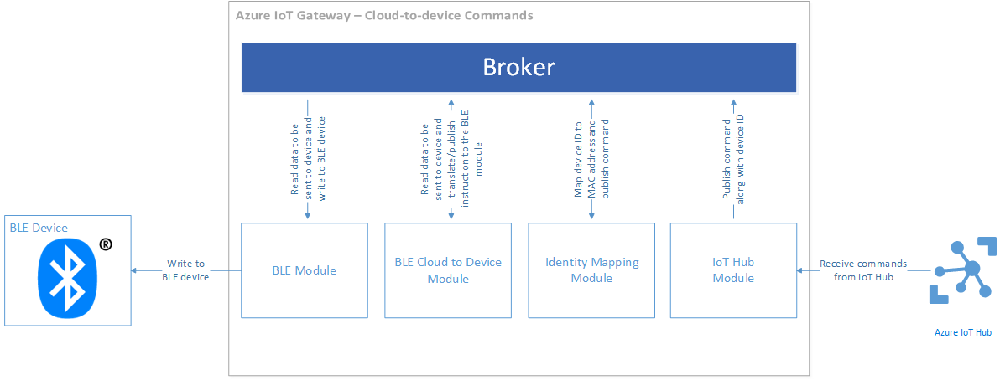

<properties
    pageTitle="使用 IoT 閘道器 SDK 的實際裝置 |Microsoft Azure"
    description="Azure IoT 閘道器 SDK 逐步解說，使用德州樂器 SensorTag 裝置來傳送資料至 IoT 中心，透過 Intel Edison 計算模組上執行的閘道器"
    services="iot-hub"
    documentationCenter=""
    authors="chipalost"
    manager="timlt"
    editor=""/>

<tags
     ms.service="iot-hub"
     ms.devlang="cpp"
     ms.topic="article"
     ms.tgt_pltfrm="na"
     ms.workload="na"
     ms.date="08/29/2016"
     ms.author="andbuc"/>


# <a name="azure-iot-gateway-sdk-beta--send-device-to-cloud-messages-with-a-real-device-using-linux"></a>Azure IoT 閘道器 SDK （beta 版）︰ 使用實際裝置使用 Linux 傳送裝置至雲端的郵件

這個逐步解說中的 [ [Bluetooth 低能源範例][lnk-ble-samplecode]示範如何使用[Azure IoT 閘道器 SDK] [lnk-sdk]要轉寄裝置至雲端遙測 IoT 集線器從實體裝置，以及如何將傳送到實體裝置 IoT 中心] 命令。

此逐步解說涵蓋︰

* **架構**︰ 重要資訊架構 Bluetooth 低能源範例。

* **建立和執行**︰ 建立和執行範例所需的步驟。

## <a name="architecture"></a>架構

逐步解說會示範如何建立和執行 Intel Edison 計算模組，可執行 Linux IoT 閘道器。 使用 IoT 閘道器 SDK 建立閘道器。 此範例使用德州樂器 SensorTag Bluetooth 低能源 （ble.s 使用） 裝置收集的溫度資料。

當您執行的閘道器它︰

- 連線到 SensorTag 裝置使用 Bluetooth 低能源 （ble.s 使用） 通訊協定。
- 連線到 IoT 集線器使用 HTTP 通訊協定。
- 從 SensorTag 裝置遙測送給 IoT 中心。
- 路由從 IoT 中心 SensorTag 裝置的命令。

閘道器會包含下列模組︰

- *Ble.s 使用模組*與 ble.s 使用裝置的溫度資料接收到裝置的裝置] 及 [傳送命令介面。
- *裝置模組 ble.s 使用雲端*翻譯成 ble.s 使用指示*ble.s 使用模組*來自雲端的 JSON 郵件。
- *記錄器模組*記錄所有閘道器的訊息。
- *識別對應模組*轉譯 ble.s 使用裝置 MAC 地址和 Azure IoT 中心裝置身分識別。
- *IoT 中心模組*上傳到 IoT 集線器的遙測資料，並從 IoT 中心接收裝置命令。
- *Ble.s 使用的印表機模組*的解譯遙測從 ble.s 使用的裝置，並列印格式設定來啟用疑難排解與偵錯主控台的資料。

### <a name="how-data-flows-through-the-gateway"></a>透過 [閘道器的資料流動

下列區塊圖說明遙測上傳資料流程管線︰


遙測的項目會從 ble.s 使用裝置前往 IoT 中樞的步驟如下︰

1. Ble.s 使用裝置產生溫度樣本，並傳送給 ble.s 使用模組中閘道器 Bluetooth。
2. Ble.s 使用模組接收樣本，並將其發佈至裝置的 MAC 地址以及代理人。
3. 身分識別對應模組挑選這則訊息，並使用內部資料表裝置的 MAC 地址轉譯 IoT 中心裝置身分識別 （裝置識別碼和裝置鍵）。 然後發佈時包含的溫度範例資料、 裝置與裝置識別碼，裝置機碼的 MAC 地址的新郵件。
4. IoT 中心模組接收新郵件 （產生的身分識別對應模組），並將它發佈到 IoT 中心。
5. 記錄器模組會記錄磁碟檔案從代理人的所有郵件。

下列區塊圖說明裝置命令資料流程管線︰



1. IoT 中心模組定期輪詢 IoT 中樞新命令郵件。
2. 當 IoT 中心模組接收新命令郵件時，它將發佈它為代理人。
3. 身分識別對應模組挑選命令訊息，並使用內部資料表翻譯至裝置 MAC 地址的 IoT 中心裝置識別碼。 然後將發佈屬性對應的郵件中包含目標裝置的 MAC 地址的新郵件。
4. 裝置模組 ble.s 使用雲端挑選這則訊息，並將它轉換成適當 ble.s 使用指示 ble.s 使用模組。 然後將發佈新郵件。
5. Ble.s 使用模組挑選這則訊息，並執行 I/O 指示 ble.s 使用裝置與通訊。
6. 記錄器模組會記錄磁碟檔案從代理人的所有郵件。

## <a name="prepare-your-hardware"></a>準備您的硬體

本教學課程，假設您使用的連線至 Intel Edison 區[德州樂器 SensorTag](http://www.ti.com/ww/en/wireless_connectivity/sensortag2015/index.html)裝置。

### <a name="set-up-the-edison-board"></a>設定 Edison 區

在您開始之前，請確定您可以連線到您的無線網路 Edison 裝置。 若要設定 Edison 裝置，必須先將其連線至主機電腦。 Intel 提供快速入門指南以下作業系統︰

- [開始使用 Windows 64 位元上 Intel Edison 開發區][lnk-setup-win64]。
- [開始使用 Windows 32 位元上 Intel Edison 開發區][lnk-setup-win32]。
- [開始使用 Mac OS X 上 Intel Edison 開發區][lnk-setup-osx]。
- [快速入門 Intel® Edison 上區 Linux][lnk-setup-linux]。

若要設定 Edison 裝置並熟悉它，您應該先完成所有這些中的步驟，「 開始 」 文件除了最後一個步驟中，「 選擇 IDE 」，這是目前教學課程不必要。 結尾的 Edison 設定程序中，您可以︰

- 快閃您 Edison 最新韌體。
- 建立序列連線到 Edison 您主機。
- 執行設定的密碼，並啟用 WiFi 上您 Edison **configure_edison**指令碼。

### <a name="enable-connectivity-to-the-sensortag-device-from-your-edison-board"></a>從您 Edison 區啟用 SensorTag 裝置的連線

之前執行範例，您必須以驗證您的 Edison 區可以連線至 SensorTag 裝置。

首先，您必須確認您 Edison 可以連線至 SensorTag 裝置。

1. 解除封鎖 bluetooth Edison 上的並核取 [版本號碼會**5.37**。
    
    ```
    rfkill unblock bluetooth
    bluetoothctl --version
    ```

2. 執行**bluetoothctl**命令。 現在您已於互動式 bluetooth 命令介面。 

3. 輸入] 命令**上的 power** bluetooth 控制站的乘冪。 您應該會看到類似的輸出︰
    
    ```
    [NEW] Controller 98:4F:EE:04:1F:DF edison [default]
    ```

4. 仍在互動式 bluetooth 命令介面輸入命令**在掃描**到掃描 bluetooth 裝置。 您應該會看到類似的輸出︰
    
    ```
    Discovery started
    [CHG] Controller 98:4F:EE:04:1F:DF Discovering: yes
    ```

5. 按下 [小] 按鈕 (綠色的 LED 應該 flash)，讓 SensorTag 裝置可搜尋。 Edison 應該探索 SensorTag 裝置︰
    
    ```
    [NEW] Device A0:E6:F8:B5:F6:00 CC2650 SensorTag
    [CHG] Device A0:E6:F8:B5:F6:00 TxPower: 0
    [CHG] Device A0:E6:F8:B5:F6:00 RSSI: -43
    ```
    
    在此範例中，您可以看到 SensorTag 裝置的 MAC 地址是**A0:E6:F8:B5:F6:00**。

6. 關閉掃描輸入**關閉瀏覽**] 命令。
    
    ```
    [CHG] Controller 98:4F:EE:04:1F:DF Discovering: no
    Discovery stopped
    ```

7. 連線到 SensorTag 裝置使用 MAC 位址輸入**連線\<MAC 位址 >**。 請注意以下的範例輸出縮寫︰
    
    ```
    Attempting to connect to A0:E6:F8:B5:F6:00
    [CHG] Device A0:E6:F8:B5:F6:00 Connected: yes
    Connection successful
    [CHG] Device A0:E6:F8:B5:F6:00 UUIDs: 00001800-0000-1000-8000-00805f9b34fb
    ...
    [NEW] Primary Service
            /org/bluez/hci0/dev_A0_E6_F8_B5_F6_00/service000c
            Device Information
    ...
    [CHG] Device A0:E6:F8:B5:F6:00 GattServices: /org/bluez/hci0/dev_A0_E6_F8_B5_F6_00/service000c
    ...
    [CHG] Device A0:E6:F8:B5:F6:00 Name: SensorTag 2.0
    [CHG] Device A0:E6:F8:B5:F6:00 Alias: SensorTag 2.0
    [CHG] Device A0:E6:F8:B5:F6:00 Modalias: bluetooth:v000Dp0000d0110
    ```
    
    注意︰ 您可以列出 GATT 特性，再使用 [**清單屬性**] 命令的裝置。

8. 您可以立即中斷裝置的 [**中斷連線**] 命令，並使用 [**結束**] 命令 bluetooth 命令介面然後結束︰
    
    ```
    Attempting to disconnect from A0:E6:F8:B5:F6:00
    Successful disconnected
    [CHG] Device A0:E6:F8:B5:F6:00 Connected: no
    ```

現在，您準備好要 Edison 裝置上執行 ble.s 使用閘道器範例。

## <a name="run-the-ble-gateway-sample"></a>執行 ble.s 使用閘道器範例

若要在您 Edison 執行 ble.s 使用範例，您需要完成三項工作︰

- 在您 IoT 中心內設定兩個樣本的裝置。
- 建立 IoT 閘道器 SDK Edison 裝置上。
- 設定並執行 ble.s 使用範例 Edison 裝置上。

在撰寫時，IoT 閘道器 SDK 只支援使用 ble.s 使用模組 linux 的閘道器。

### <a name="configure-two-sample-devices-in-your-iot-hub"></a>在您 IoT 中心內設定兩個範例裝置

- [建立 IoT 中心][ lnk-create-hub] Azure 訂閱，您需要完成此逐步解說中心的名稱。 如果您沒有帳戶，您可以建立一個[免費的帳戶][lnk-free-trial]在幾分鐘。
- 新增到您 IoT 集線器稱為**SensorTag_01**裝置並使其識別碼和裝置索引鍵的記事。 您可以使用的[裝置總管或 iothub 總管][lnk-explorer-tools]工具將此裝置新增至您在上一個步驟中建立 [IoT 中心，以及擷取它的索引鍵。 當您設定閘道器時，您會將此裝置對應至 SensorTag 裝置。

### <a name="build-the-iot-gateway-sdk-on-your-edison-device"></a>建立 IoT 閘道器 SDK Edison 裝置上

**給**Edsion 上的版本不支援 submodules。 若要下載的完整的來源 Edison IoT 閘道器 SDK 的您有兩個選項︰

- 選項 1︰ 複製[Azure IoT 閘道器 SDK] [lnk-sdk]上您 Edison 存放庫，然後手動複製的每個 submodule 存放庫。
- 選項 2︰ 複製[Azure IoT 閘道器 SDK] [lnk-sdk]存放在桌上型電腦裝置**給**支援 submodules，然後將複製到您 Edison submodules 與完成存放庫的位置。

如果您選擇 #2] 選項，請使用下列**給**命令複製 IoT 閘道器 SDK 和其所有 submodules:

```
git clone --recursive https://github.com/Azure/azure-iot-gateway-sdk.git 
git submodule update --init --recursive
```

您將它複製到 Edison 之前，應該然後到單一封存檔案 zip 整個本機存放庫。 您可以使用的公用程式，例如**pscp**隨附於**Putty**將封存的檔案複製到 Edison。 例如︰

```
pscp .\gatewaysdk.zip root@192.168.0.45:/home/root
```

當您在您 Edison IoT 閘道器 SDK 存放庫的完整複本時，您可以建立包含 SDK 的資料夾中使用下列命令︰

```
./tools/build.sh
```

### <a name="configure-and-run-the-ble-sample-on-your-edison-device"></a>設定和 Edison 裝置上執行 ble.s 使用範例

若要啟動載入並執行範例，必須先設定 [閘道器中的 [加入每一個模組。 此設定會提供 JSON 檔案中，您需要設定所有的五個參與模組。 有稱為**gateway_sample.json**您可以使用的起點，建立您自己的設定檔將存放庫中提供的範例 JSON 檔案。 此檔案中的**範例/ble_gateway_hl/src**資料夾位於 IoT 閘道器 SDK 存放庫的本機複本。

下列各節說明如何編輯此設定檔 ble.s 使用範例，假設 IoT 閘道器 SDK 存放庫中**/home/root/azure-iot-gateway-sdk /** Edison 裝置上的資料夾。 如果將存放庫其他位置時，您應該會相應地調整路徑︰

#### <a name="logger-configuration"></a>記錄器設定

在資料夾位於假設閘道器存放庫**/home/root/azure-iot-gateway-sdk /**，設定記錄器模組，如下所示︰

```json
{
    "module name": "logger",
    "module path": "/home/root/azure-iot-gateway-sdk/build/modules/logger/liblogger_hl.so",
    "args":
    {
        "filename":"/home/root/gw_logger.log"
    }
}
```

#### <a name="ble-module-configuration"></a>Ble.s 使用模組設定

範例設定 ble.s 使用裝置假設德州樂器 SensorTag 裝置。 任何標準 ble.s 使用裝置的周邊 GATT 應該工作時，可以運作，但您需要更新 GATT 特性識別碼] 和 [資料 （寫入指示）。 新增 SensorTag 裝置的 MAC 地址︰ 

```json
{
  "module name": "SensorTag",
  "module path": "/home/root/azure-iot-gateway-sdk/build/modules/ble/libble_hl.so",
  "args": {
    "controller_index": 0,
    "device_mac_address": "<<AA:BB:CC:DD:EE:FF>>",
    "instructions": [
      {
        "type": "read_once",
        "characteristic_uuid": "00002A24-0000-1000-8000-00805F9B34FB"
      },
      {
        "type": "read_once",
        "characteristic_uuid": "00002A25-0000-1000-8000-00805F9B34FB"
      },
      {
        "type": "read_once",
        "characteristic_uuid": "00002A26-0000-1000-8000-00805F9B34FB"
      },
      {
        "type": "read_once",
        "characteristic_uuid": "00002A27-0000-1000-8000-00805F9B34FB"
      },
      {
        "type": "read_once",
        "characteristic_uuid": "00002A28-0000-1000-8000-00805F9B34FB"
      },
      {
        "type": "read_once",
        "characteristic_uuid": "00002A29-0000-1000-8000-00805F9B34FB"
      },
      {
        "type": "write_at_init",
        "characteristic_uuid": "F000AA02-0451-4000-B000-000000000000",
        "data": "AQ=="
      },
      {
        "type": "read_periodic",
        "characteristic_uuid": "F000AA01-0451-4000-B000-000000000000",
        "interval_in_ms": 1000
      },
      {
        "type": "write_at_exit",
        "characteristic_uuid": "F000AA02-0451-4000-B000-000000000000",
        "data": "AA=="
      }
    ]
  }
}
```

#### <a name="iot-hub-module"></a>IoT 中心模組

新增您 IoT 中樞的名稱。 [尾碼] 的值，通常是**azure devices.net**:

```json
{
  "module name": "IoTHub",
  "module path": "/home/root/azure-iot-gateway-sdk/build/modules/iothub/libiothub_hl.so",
  "args": {
    "IoTHubName": "<<Azure IoT Hub Name>>",
    "IoTHubSuffix": "<<Azure IoT Hub Suffix>>",
    "Transport": "HTTP"
  }
}
```

#### <a name="identity-mapping-module-configuration"></a>身分識別對應模組設定

新增 SensorTag 裝置和裝置識別碼 MAC 地址及您新增至您的 IoT 集散地**SensorTag_01**裝置的機碼︰

```json
{
  "module name": "mapping",
  "module path": "/home/root/azure-iot-gateway-sdk/build/modules/identitymap/libidentity_map_hl.so",
  "args": [
    {
      "macAddress": "<<AA:BB:CC:DD:EE:FF>>",
      "deviceId": "<<Azure IoT Hub Device ID>>",
      "deviceKey": "<<Azure IoT Hub Device Key>>"
    }
  ]
}
```

#### <a name="ble-printer-module-configuration"></a>Ble.s 使用印表機模組設定

```json
{
    "module name": "BLE Printer",
    "module path": "/home/root/azure-iot-gateway-sdk/build/samples/ble_gateway_hl/ble_printer/libble_printer.so",
    "args": null
}
```

#### <a name="routing-configuration"></a>路由設定

下列步驟，以確保下列設定︰
- **記錄器**模組接收，並登入的所有郵件。
- **SensorTag**模組**對應**與**Ble.s 使用印表機**模組傳送訊息。
- **對應**模組**IoTHub**模組傳送到您 IoT] 中心傳送訊息。
- **IoTHub**模組回到**對應**模組傳送訊息。
- **對應**模組回到**SensorTag**模組傳送訊息。

```json
"links" : [
    {"source" : "*", "sink" : "Logger" },
    {"source" : "SensorTag", "sink" : "mapping" },
    {"source" : "SensorTag", "sink" : "BLE Printer" },
    {"source" : "mapping", "sink" : "IoTHub" },
    {"source" : "IoTHub", "sink" : "mapping" },
    {"source" : "mapping", "sink" : "SensorTag" }
  ]
```

若要執行範例您可以執行**ble_gateway_hl**二進位傳遞路徑 JSON 設定檔。 如果您使用**gateway_sample.json**檔案時，要執行的命令看起來像這樣︰

```
./build/samples/ble_gateway_hl/ble_gateway_hl ./samples/ble_gateway_hl/src/gateway_sample.json
```

您可能需要按，使其可搜尋之前執行範例 SensorTag 裝置上的 [小] 按鈕。

當您執行的範例時，您可以使用的[裝置總管或 iothub 總管][lnk-explorer-tools]工具來監控從 SensorTag 裝置的閘道器轉寄的郵件。

## <a name="send-cloud-to-device-messages"></a>傳送雲端-裝置訊息

Ble.s 使用模組也支援從 Azure IoT 中心傳送指示裝置。 您可以使用[Azure IoT 中心裝置的檔案總管](https://github.com/Azure/azure-iot-sdks/blob/master/tools/DeviceExplorer/doc/how_to_use_device_explorer.md)] 或 [ [IoT 中心總管](https://github.com/Azure/azure-iot-sdks/tree/master/tools/iothub-explorer)傳送 ble.s 使用閘道器模組傳送到 ble.s 使用裝置的 JSON 郵件。 例如，如果您使用的德州樂器 SensorTag 裝置然後您可以傳送下列 JSON 訊息裝置從 IoT 中心。

- 重設所有 Led 和呼嚕 （關閉）

    ```json
    {
      "type": "write_once",
      "characteristic_uuid": "F000AA65-0451-4000-B000-000000000000",
      "data": "AA=="
    }
    ```

- 將 I/O 設定為 [遠端 」

    ```json
    {
      "type": "write_once",
      "characteristic_uuid": "F000AA66-0451-4000-B000-000000000000",
      "data": "AQ=="
    }
    ```

- 開啟 [紅色 LED

    ```json
    {
      "type": "write_once",
      "characteristic_uuid": "F000AA65-0451-4000-B000-000000000000",
      "data": "AQ=="
    }
    ```

- 開啟 [綠色的 LED

    ```json
    {
      "type": "write_once",
      "characteristic_uuid": "F000AA65-0451-4000-B000-000000000000",
      "data": "Ag=="
    }
    ```

- 開啟 [呼嚕

    ```json
    {
      "type": "write_once",
      "characteristic_uuid": "F000AA65-0451-4000-B000-000000000000",
      "data": "BA=="
    }
    ```

使用連線至 IoT 中樞的 HTTP 通訊協定的裝置的預設行為是檢查新命令每 25 分鐘。 因此，如果您要傳送個別的數個命令必須等候 25 分鐘裝置接收的每一個命令。

> [AZURE.NOTE] 閘道器也會在啟動，您可以強制它停止並啟動閘道器處理命令時，檢查新的命令。

## <a name="next-steps"></a>後續步驟

如果您想要瞭解更多進階的 IoT 閘道器 SDK 及下嘗試使用 [程式碼範例，請造訪下列開發人員教學課程和資源︰

- [Azure IoT 閘道器 SDK][lnk-sdk]

若要進一步探索 IoT 中樞的功能，請參閱︰

- [開發人員指南][lnk-devguide]

<!-- Links -->
[lnk-ble-samplecode]: https://github.com/Azure/azure-iot-gateway-sdk/blob/master/samples/ble_gateway_hl
[lnk-free-trial]: https://azure.microsoft.com/pricing/free-trial/
[lnk-explorer-tools]: https://github.com/Azure/azure-iot-sdks/blob/master/doc/manage_iot_hub.md
[lnk-setup-win64]: https://software.intel.com/get-started-edison-windows
[lnk-setup-win32]: https://software.intel.com/get-started-edison-windows-32
[lnk-setup-osx]: https://software.intel.com/get-started-edison-osx
[lnk-setup-linux]: https://software.intel.com/get-started-edison-linux
[lnk-sdk]: https://github.com/Azure/azure-iot-gateway-sdk/


[lnk-devguide]: iot-hub-devguide.md
[lnk-create-hub]: iot-hub-create-through-portal.md 
