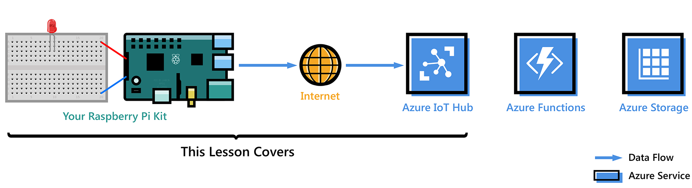

<properties
 pageTitle="快速入門木莓澆 Pi 3 |Microsoft Azure"
 description="快速入門覆盆子 Pi 3、 建立 Azure IoT 中心以及連接您 Pi 到 IoT 中心"
 services="iot-hub"
 documentationCenter=""
 authors="shizn"
 manager="timlt"
 tags=""
 keywords=""/>

<tags
 ms.service="iot-hub"
 ms.devlang="multiple"
 ms.topic="article"
 ms.tgt_pltfrm="na"
 ms.workload="na"
 ms.date="10/21/2016"
 ms.author="xshi"/>

# 快速入門木莓澆 Pi 3

在本教學課程，請先學習使用該執行 Raspbian 覆盆子 Pi 3 的基本概念。 然後，您會學習如何流暢地連接雲端[Azure IoT 中心](iot-hub-what-is-iot-hub.md)與您的裝置。 如需 Windows 10 IoT 核心範例，請造訪[windowsondevices.com](http://www.windowsondevices.com/)。

## 課程 1︰ 設定您的裝置

在本課程中，您可以使用系統設定覆盆子 Pi 3 裝置、 設定您的開發環境，及部署 Pi 的應用程式。

### 設定您的裝置

設定您的第一次使用的覆盆子 Pi 3，並安裝 Raspbian OS，最適合覆盆子 Pi 硬體免費的作業系統。

*估計完成時間︰ 30 分鐘* 

[移至 [設定您的裝置 」](iot-hub-raspberry-pi-kit-node-lesson1-configure-your-device.md)

### 取得工具
下載的工具和建立並部署覆盆子 Pi 3 的第一個應用程式的軟體。

*估計完成時間︰ 20 分鐘* 

[移至 ['取得工具]](iot-hub-raspberry-pi-kit-node-lesson1-get-the-tools-win32.md)

### 建立並部署閃爍應用程式

複製 Github，範例 Node.js 應用程式，然後 gulp 部署至您的覆盆子 Pi 3 區這個應用程式]。 此範例應用程式閃爍連線至該版面每兩秒，LED。

*估計完成時間︰ 5 分鐘* 

[移至 [建立並部署閃爍應用程式 」](iot-hub-raspberry-pi-kit-node-lesson1-deploy-blink-app.md)

## 課程 2︰ 建立您 IoT 中心

在本課程中，您可以建立您的免費 Azure 帳戶、 佈建 Azure IoT 中心和 Azure IoT 中心中建立您的第一個裝置。

在開始此課程之前，請完成教學單元 1。

### 取得 Azure 工具

安裝 Azure 命令列介面 (Azure CLI)。

*估計完成時間︰ 10 分鐘的時間* 

[移至 [取得 Azure 工具]](iot-hub-raspberry-pi-kit-node-lesson2-get-azure-tools-win32.md)

### 建立您 IoT 中心和註冊您覆盆子 Pi 3

建立資源群組、 佈建您第一份 Azure IoT 中心內，並將您的第一個裝置加入使用 Azure CLI Azure IoT 中心。 

*估計完成時間︰ 10 分鐘的時間* 

[移至 [建立 IoT 中心及註冊您覆盆子 Pi 3]](iot-hub-raspberry-pi-kit-node-lesson2-prepare-azure-iot-hub.md)

## 課程 3︰ 傳送裝置至雲端的郵件

在本課程中，您傳送郵件從您 Pi 給您 IoT 集散地。 您也可以建立 Azure 函數應用程式的挑選從您 IoT] 中心內送郵件，並將它們寫入 Azure 資料表儲存體。

本課程開始之前，請完成教學單元 1 和 2。

### 建立 Azure 函數應用程式和 Azure 儲存體帳戶

您可以使用 [Azure 資源管理員範本來建立 Azure 函數應用程式和 Azure 儲存體帳戶。

*估計完成時間︰ 10 分鐘的時間* 

[移至 [建立 Azure 函數應用程式和 Azure 儲存體帳戶]](iot-hub-raspberry-pi-kit-node-lesson3-deploy-resource-manager-template.md)

### 執行範例應用程式傳送裝置至雲端的郵件

部署，並執行覆盆子 Pi 3 裝置傳送訊息給 IoT 中樞的範例應用程式。

*估計完成時間︰ 10 分鐘的時間* 

[移至 [執行範例應用程式傳送裝置至雲端的郵件]](iot-hub-raspberry-pi-kit-node-lesson3-run-azure-blink.md)

### 讀取郵件保存在 Azure 儲存體
當寫入 Azure 儲存空間，請監控裝置至雲端的郵件。

*估計完成時間︰ 5 分鐘* 

[移至 [讀取郵件保存在 Azure 儲存體]](iot-hub-raspberry-pi-kit-node-lesson3-read-table-storage.md)

## 課程 4︰ 傳送雲端-裝置郵件

本課程中會示範如何將郵件從 Azure IoT 中心傳送到您覆盆子 Pi 3。 郵件控制開啟和關閉 [已連線至您 Pi LED 的行為。 範例應用程式已準備好要完成這項工作。

完成的課程 1，2 和 3，開始此課程之前

### 執行範例應用程式將接收訊息雲端-裝置

在教學單元 4 範例應用程式會在您 Pi 上執行，和監視從您 IoT] 中心內送郵件。 大工作會從您的 IoT 中心以閃爍 LED 傳送給您 Pi 的郵件。

*估計完成時間︰ 10 分鐘的時間* 

[移至 [執行範例應用程式將接收訊息雲端-裝置]](iot-hub-raspberry-pi-kit-node-lesson4-send-cloud-to-device-messages.md)

### 選擇性區段︰ 開啟和關閉的 LED 行為變更

自訂郵件變更 LED 的開啟和關閉行為。

*估計完成時間︰ 10 分鐘的時間* 

[移至 [「 選擇性區段︰ 變更開啟和關閉會出現什麼行為，LED 」](iot-hub-raspberry-pi-kit-node-lesson4-change-led-behavior.md)

## 疑難排解

如果您在教學單元符合任何麻煩，可以搜尋此頁面中的解決方案。

[移至 [疑難排解]](iot-hub-raspberry-pi-kit-node-troubleshooting.md)
