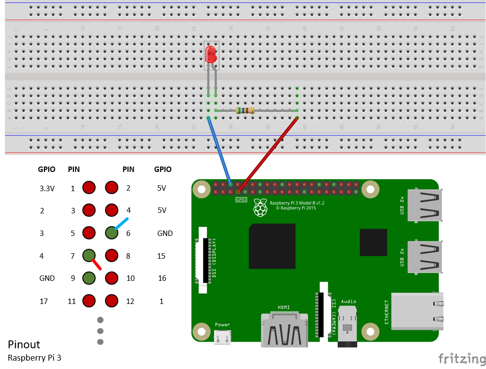

<properties
 pageTitle="設定您的裝置 |Microsoft Azure"
 description="設定您的第一次時間使用的覆盆子 Pi 3，並安裝 Raspbian OS，最適合覆盆子 Pi 硬體免費的作業系統。"
 services="iot-hub"
 documentationCenter=""
 authors="shizn"
 manager="timlt"
 tags=""
 keywords=""/>

<tags
 ms.service="iot-hub"
 ms.devlang="multiple"
 ms.topic="article"
 ms.tgt_pltfrm="na"
 ms.workload="na"
 ms.date="10/21/2016"
 ms.author="xshi"/>

# 1.1 （英文） 設定您的裝置

## 1.1.1 您將會執行的動作

設定您的第一次使用 Pi 並安裝 Raspbian 作業系統，最適合覆盆子 Pi 硬體免費的作業系統。 如果您符合任何問題，請搜尋中的[疑難排解頁面](iot-hub-raspberry-pi-kit-node-troubleshooting.md)的解決方案。

## 1.1.2 您將學習什麼

在此區段中，您將瞭解︰

- 如何在您 Pi 安裝 Raspbian
- 如何設定使用 USB 纜線您 Pi 的乘冪
- 如何使用乙太網路纜線或需使用 Wi-fi 網路連線您 Pi
- 如何新增 breadboard LED，並將其連線至您 Pi

## 1.1.3 您需要的什麼

若要完成此區段中，您會需要下列部分從覆盆子 Pi 3 入門套件︰

- 覆盆子 Pi 3 區
- 16 GB MicroSD 卡片
- 5V 2A power 提供的六個英呎微 USB 纜線
- Breadboard
- 連接器線路
- 560 Ohm 電阻
- 分散 10 mm LED
- 將乙太網路纜線

您也需要︰

- 連線到您 Pi 有線或無線連線
- 將 MicroSD 卡片燒錄 OS 圖像 USB SD 介面卡或迷你 SD 卡片。
- 執行 Windows、 Mac 或 Linux 電腦。 在電腦用於安裝 Raspbian MicroSD 卡片上。
- 若要下載的必要工具和軟體網際網路連線

## 1.1.4 安裝 Raspbian MicroSD 卡片

準備撰寫 Raspbian 圖像 MicroSD 卡片。

1. 下載 Raspbian。
  1. 請[下載](https://www.raspberrypi.org/downloads/raspbian/)和像素 Raspbian 潔 zip 檔案。
  2. 擷取 Raspbian 圖像至您的電腦上的資料夾。
2. 安裝 Raspbian 至 MicroSD 卡片。
  1. [下載](https://www.etcher.io)並安裝 Etcher SD 卡片燒錄機公用程式。
  2. 執行 Etcher，並在 [步驟 1 中選取您所擷取 Raspbian 圖像。
  3. 選取 [MicroSD 卡片磁碟機]。
    附註︰ Etcher 可能已選取正確的磁碟機。
  4. 按一下 [安裝 Raspbian MicroSD 卡 Flash]。
  5. 從您的電腦，完成後，移除 MicroSD 卡片。
    附註:，則若要直接移除 MicroSD 卡片，因為 Etcher 自動退出或卸載 MicroSD 卡片完成。
  6. 插入您 Pi MicroSD 卡片。

## 1.1.5 在您 Pi power

在您使用的微的 USB 纜線和電源 Pi power。

> [AZURE.NOTE] 請務必使用電源至少套件中 2A，請確定您覆盆子進紙有足夠的電力正常運作。

## 1.1.6 連線至網路您覆盆子 Pi 3

您可以在有線網路或無線網路連線您 Pi。 請確定您 Pi 已連線至您的電腦相同的網路。 例如，您可以連線您 Pi 至您的電腦已連線至相同切換。

### 1.1.6.1 連線到有線網路

若要將您 Pi 連線到您的網路使用乙太網路纜線。 在您 Pi 上的兩個 Led 開啟如果已建立連線。

### 1.1.6.2 連線到無線網路

從您 Pi 連線至無線網路覆盆子 Pi Foundation 依照[指示進行](https://www.raspberrypi.org/learning/software-guide/wifi/)。 這些指示需要先連線到您 Pi 的 [監視器和鍵盤。

## 1.1.7 連線到您 Pi 的 LED

若要完成此工作，使用[breadboard](https://learn.sparkfun.com/tutorials/how-to-use-a-breadboard)、 連接器線路、 LED 及電阻。 將它們連接到您 Pi 的[一般用途輸入輸出](https://www.raspberrypi.org/documentation/usage/gpio/)(GPIO) 連接埠。 

1. 連接 LED 短的腳**GPIO GND (釘選 6)**。
2. 連接電阻的一側邊的 LED 更長的時間腳。
3. 連線其他腳的電阻**GPIO**4 (釘選 7)。

請注意，LED 信號重要。 此信號設定通常稱為作用中的低。

Congratulation ！ 您已成功設定您的 Pi。

## 1.1.8 摘要

在此區段中，您學到如何安裝 Raspbian、 您 Pi 連線至網路，並連線到您 Pi 的 LED 設定您的 Pi。 請注意，LED 還不會亮起。 在下一個區段中，您必須安裝必要的工具和軟體準備您 Pi 上執行的範例應用程式中。

## 後續步驟

[1.2 取得工具](iot-hub-raspberry-pi-kit-node-lesson1-get-the-tools-win32.md)
