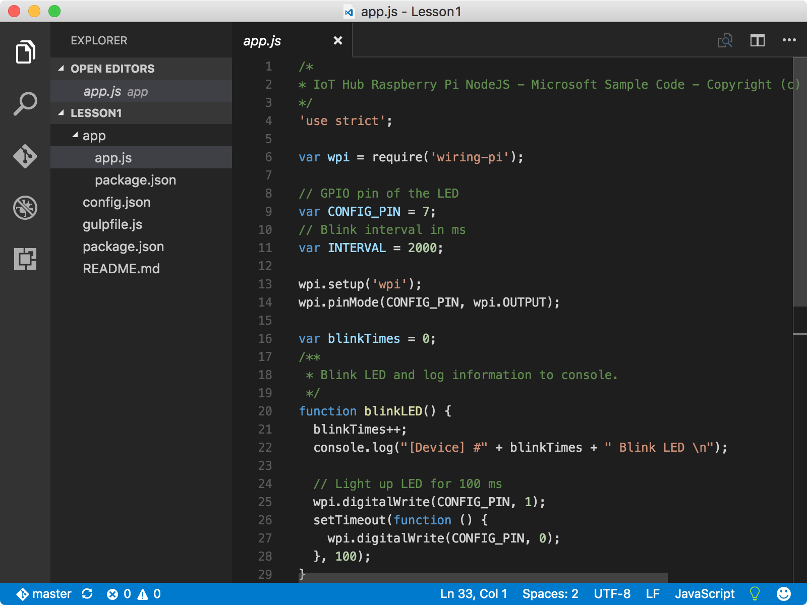
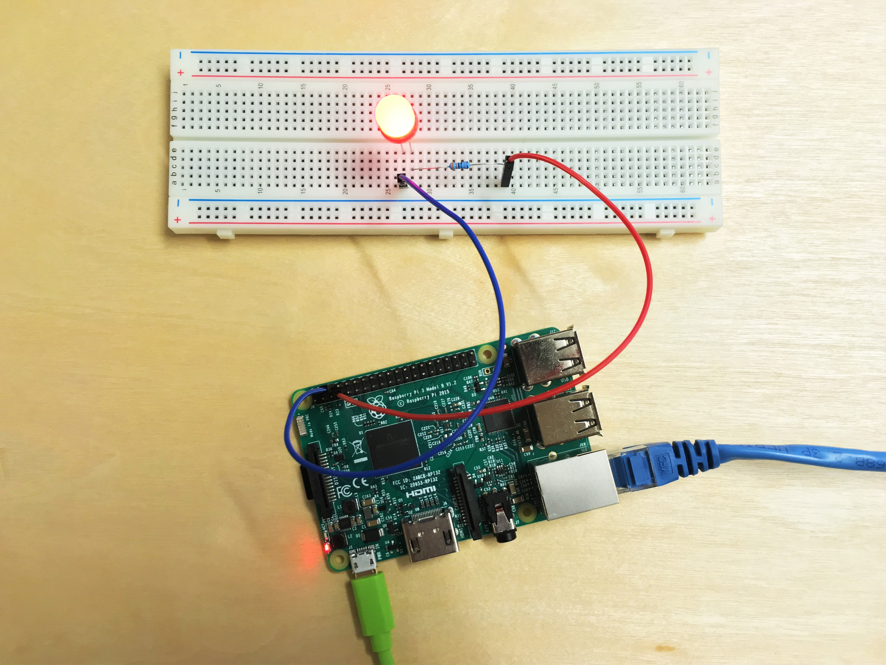

<properties
 pageTitle="建立並部署閃爍應用程式 |Microsoft Azure"
 description="複製 Github，範例 Node.js 應用程式，然後 gulp 部署至您的覆盆子 Pi 3 區這個應用程式]。 此範例應用程式閃爍連線至該版面每兩秒，LED。"
 services="iot-hub"
 documentationCenter=""
 authors="shizn"
 manager="timlt"
 tags=""
 keywords=""/>

<tags
 ms.service="iot-hub"
 ms.devlang="multiple"
 ms.topic="article"
 ms.tgt_pltfrm="na"
 ms.workload="na"
 ms.date="10/21/2016"
 ms.author="xshi"/>

# <a name="13-create-and-deploy-the-blink-application"></a>1.3 建立並部署閃爍應用程式

## <a name="131-what-you-will-do"></a>1.3.1 您將會執行的動作

複製 Github，範例 Node.js 應用程式，並使用 [大] 工具部署範例應用程式至您的覆盆子 Pi 3。 範例應用程式閃爍連線至該版面每兩秒，LED。 如果您符合任何問題，請搜尋中的[疑難排解頁面](iot-hub-raspberry-pi-kit-node-troubleshooting.md)的解決方案。

## <a name="132-what-you-will-learn"></a>1.3.2 您將學習什麼

- 如何使用`device-discover-cli`擷取您 Pi 的網路資訊的工具。
- 如何部署，並在您 Pi 執行範例應用程式。
- 如何部署和偵錯上您 Pi 從遠端執行應用程式。

## <a name="133-what-you-need"></a>1.3.3 您需要的什麼

您必須已順利完成課程 1 中的 [追蹤] 區段︰

- [設定您的裝置](iot-hub-raspberry-pi-kit-node-lesson1-configure-your-device.md)
- [取得工具](iot-hub-raspberry-pi-kit-node-lesson1-get-the-tools-win32.md)

## <a name="134-obtain-the-ip-address-and-host-name-of-your-pi"></a>1.3.4 取得您 Pi 的 IP 位址和主機名稱

在 Windows 或終端機 macOS 或 Ubuntu，視窗中開啟命令提示字元，並執行下列命令︰

```bash
devdisco list --eth
```

您應該會看到類似以下的成果︰


請注意`IP address`和`hostname`您 Pi。 您需要本節稍後這項資訊。

> [AZURE.NOTE] 請確定您 Pi 已連線至您的電腦相同的網路。 例如，如果您的電腦已連線到無線網路，您 Pi 連線到有線網路時，您可能不會出現在 devdisco 輸出 IP 位址。

## <a name="135-clone-the-sample-application"></a>1.3.5 複製範例應用程式

若要開啟 [程式碼範例，請遵循下列步驟︰

1. 執行下列命令以複製從 Github 範例存放庫︰

    ```bash
    git clone https://github.com/Azure-Samples/iot-hub-node-raspberrypi-getting-started.git
    ```

2. 開啟 Visual Studio 程式碼中的範例應用程式，執行下列命令︰

    ```bash
    cd iot-hub-node-raspberrypi-getting-started
    cd Lesson1
    code .
    ```



`app.js`檔案中`app`子資料夾是包含控制項 LED 的程式碼的重要的來源檔案。

### <a name="136-install-application-dependencies"></a>1.3.6 安裝應用程式相依性

安裝的文件庫和其他模組，您需要範例應用程式，執行下列命令︰

```bash
npm install
```

## <a name="137-configure-the-device-connection"></a>1.3.7 設定裝置連線

若要設定裝置連線，請遵循下列步驟︰

1. 執行下列命令以產生裝置設定檔︰

    ```bash
    gulp init
    ```

    設定檔`config-raspberrypi.json`包含您用來登入您 Pi 的使用者認證。 若要避免使用者認證的遺漏，設定檔案會產生的子資料夾中`.iot-hub-getting-started`的電腦上的主資料夾。

2. 開啟 Visual Studio 程式碼中的裝置設定檔，藉由執行下列命令︰

    ```bash
    # For Windows command prompt
    code %USERPROFILE%\.iot-hub-getting-started\config-raspberrypi.json

    # For macOS or Ubuntu
    code ~/.iot-hub-getting-started/config-raspberrypi.json
    ```

3. 取代預留位置`[device hostname or IP address]`的 IP 位址或您收到 1.3.4] 區段中的主機名稱。

    

恭喜您 ！ 您已成功建立您 Pi 的第一個範例應用程式。

## <a name="138-deploy-and-run-the-sample-application"></a>1.3.8 部署及執行範例應用程式

### <a name="1381-install-nodejs-and-npm-on-your-pi"></a>1.3.8.1 Node.js 和 NPM 安裝在您 Pi

安裝 Node.js 和 NPM 您 Pi 藉由執行下列命令︰

```bash
gulp install-tools
```

可能需要十分鐘，才能完成第一次執行這項工作。

### <a name="1382-deploy-and-run-the-sample-app"></a>1.3.8.2 部署及執行範例應用程式

部署並上執行的範例應用程式，執行下列命令︰

```bash
gulp deploy && gulp run
```

### <a name="1383-verify-the-app-works"></a>1.3.8.3 驗證應用程式適用於

您現在應該會看到 LED 閃爍每兩秒您 pi。  如果您沒有看到 LED 閃爍，請參閱[疑難排解指南](iot-hub-raspberry-pi-kit-node-troubleshooting.md)常見問題的解決方案。


> [AZURE.NOTE] 使用`Ctrl + C`結束應用程式。

## <a name="139-summary"></a>1.3.9 摘要

您已安裝的所需的工具，可使用您 Pi 並部署的範例應用程式至您 Pi 閃爍 LED。 您可以立即移至下一個課程來建立、 部署及執行您 Pi 連線到 Azure IoT 集線器傳送及接收郵件的其他範例應用程式。

## <a name="next-steps"></a>後續步驟

您已準備好要開始[取得 Azure 的工具](iot-hub-raspberry-pi-kit-node-lesson2-get-azure-tools-win32.md)開始的教學單元 2
