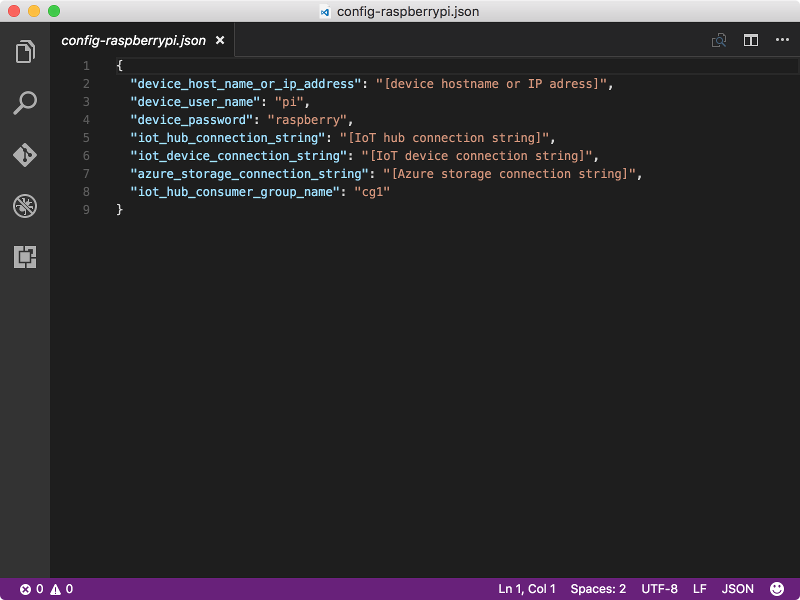

<properties
 pageTitle="執行傳送裝置至雲端的郵件範例應用程式 |Microsoft Azure"
 description="部署，並執行的傳送訊息給 IoT 中心閃爍 LED 您覆盆子 Pi 3 的範例應用程式。"
 services="iot-hub"
 documentationCenter=""
 authors="shizn"
 manager="timlt"
 tags=""
 keywords=""/>

<tags
 ms.service="iot-hub"
 ms.devlang="multiple"
 ms.topic="article"
 ms.tgt_pltfrm="na"
 ms.workload="na"
 ms.date="10/21/2016"
 ms.author="xshi"/>

# <a name="32-run-sample-application-to-send-device-to-cloud-messages"></a>3.2 捨位執行傳送裝置至雲端郵件的範例應用程式

## <a name="321-what-you-will-do"></a>3.2.1 您將會執行的動作

部署，並傳送訊息給您 IoT 中心您覆盆子 Pi 3 上執行的範例應用程式。 如果您符合任何問題，請搜尋中的[疑難排解頁面](iot-hub-raspberry-pi-kit-node-troubleshooting.md)的解決方案。

## <a name="322-what-you-will-learn"></a>3.2.2 您將學習什麼

- 如何使用 [大] 工具部署，並在您 Pi 執行範例 Node.js 應用程式。

## <a name="323-what-you-need"></a>3.2.3 您需要的什麼

- 您必須已順利完成前一節在本課程︰[建立 Azure 函數應用程式和 Azure 儲存體帳戶來處理程序及儲存 IoT 中樞的郵件](iot-hub-raspberry-pi-kit-node-lesson3-deploy-resource-manager-template.md)。

## <a name="324-get-your-iot-hub-and-device-connection-strings"></a>3.2.4 取得 IoT 中樞和裝置連接字串

裝置連接字串用來連線到您 IoT 集線器的 Pi。 [IoT 中心連接字串用來連線到裝置身分識別，表示您在 IoT 中心 Pi 的 IoT 中心。

- 執行下列 Azure CLI 命令以取得 IoT 中心連線字串︰

```bash
az iot hub show-connection-string --name {my hub name} --resource-group iot-sample
```

`{my hub name}`是您在教學單元 2 所指定的名稱。 使用`iot-sample`為的值`{resource group name}`如果您沒有變更課程 2 中的值。

- 執行下列命令以取得裝置連線字串︰

```bash
az iot device show-connection-string --hub {my hub name} --device-id myraspberrypi --resource-group iot-sample
```

`{my hub name}`會使用上一個命令時所用的值相同。 使用`iot-sample`為的值`{resource group name}`並使用`myraspberrypi`為的值`{device id}`如果您沒有變更課程 2 中的值。

## <a name="325-configure-the-device-connection"></a>3.2.5 設定裝置連線

1. 藉由執行下列命令初始化設定檔︰

    ```bash
    npm install
    gulp init
    ```

2. 開啟裝置設定檔`config-raspberrypi.json`Visual Studio 程式碼，藉由執行下列命令︰

    ```bash
    # For Windows command prompt
    code %USERPROFILE%\.iot-hub-getting-started\config-raspberrypi.json
  
    # For macOS or Ubuntu
    code ~/.iot-hub-getting-started/config-raspberrypi.json
    ```

    

3. 進行中的下列取代`config-raspberrypi.json`檔案︰

  - 取代**[裝置主機名稱或 IP 位址]**的裝置的 IP 位址或主機名稱您向`device-discovery-cli`或繼承自您在教學單元 1 中所設定的值。
  - 取代**[IoT 裝置連線字串]** `device connection string`您取得。
  - 取代**[IoT 中心連線字串]** `iot hub connection string`您取得。

您更新`config-raspberrypi.json`檔案，好讓您可以部署範例應用程式從您的電腦。

## <a name="326-deploy-and-run-the-sample-application"></a>3.2.6 部署及執行範例應用程式

部署，並在您 Pi 上執行範例應用程式，執行下列命令︰

```bash
gulp
```

> [AZURE.NOTE] 執行預設大工作`install-tools`， `deploy`，及`run`循序工作。 在[教學單元 1](iot-hub-raspberry-pi-kit-node-lesson1-deploy-blink-app.md)中，您要逐一個別執行這些工作。

## <a name="327-verify-the-sample-application-works"></a>3.2.7 驗證範例應用程式適用於

您應該會看到已連線至您 Pi 閃爍每兩秒，LED。 每次 LED 閃爍，範例應用程式就會傳送訊息給您 IoT 中心，並確認郵件具有已成功傳送至您的 IoT 集散地。 此外，每個 IoT 中心所收到的訊息，郵件會列印主控台視窗中。 範例應用程式會自動結束之後傳送 20 的郵件。


## <a name="328-summary"></a>3.2.8 摘要

您已部署，並將裝置至雲端訊息傳送至您 IoT 中心您 Pi 上執行的新閃爍範例應用程式。 監控您的郵件，當寫入 Azure 儲存體帳戶，您可以移至下一節。

## <a name="next-steps"></a>後續步驟

[3.3 讀取的郵件保存在 Azure 儲存體](iot-hub-raspberry-pi-kit-node-lesson3-read-table-storage.md)