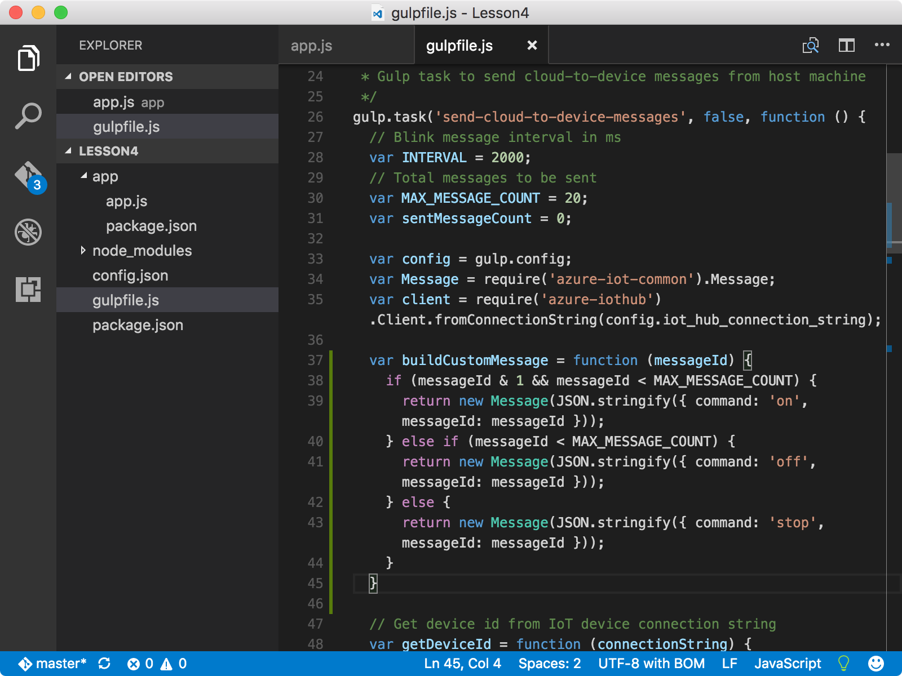
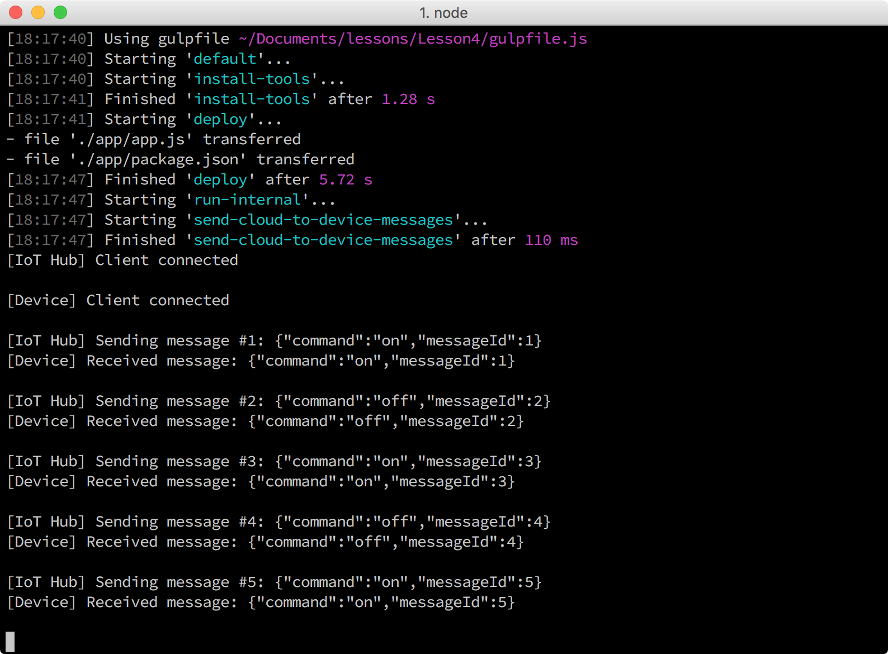

<properties
 pageTitle="選擇性區段-變更開啟和關閉會出現什麼行為，LED |Microsoft Azure"
 description="自訂郵件變更 LED 的開啟和關閉行為。"
 services="iot-hub"
 documentationCenter=""
 authors="shizn"
 manager="timlt"
 tags=""
 keywords=""/>

<tags
 ms.service="iot-hub"
 ms.devlang="multiple"
 ms.topic="article"
 ms.tgt_pltfrm="na"
 ms.workload="na"
 ms.date="10/21/2016"
 ms.author="xshi"/>

# <a name="42-optional-section-change-the-on-and-off-behavior-of-the-led"></a>4.2 選擇性區段︰ 開啟和關閉的 LED 行為變更

## <a name="421-what-you-will-do"></a>4.2.1 您將會執行的動作

自訂郵件變更 LED 的開啟和關閉行為。 如果您符合任何問題，請搜尋中的[疑難排解頁面](iot-hub-raspberry-pi-kit-node-troubleshooting.md)的解決方案。

## <a name="422-what-you-will-learn"></a>4.2.2 您將學習什麼

您可以使用其他 Node.js 函數來變更 LED 的開啟和關閉行為。

## <a name="423-what-you-need"></a>4.2.3 您需要的什麼

您必須已順利完成[4.1 範例上執行應用程式收到裝置郵件雲端您覆盆子 Pi](iot-hub-raspberry-pi-kit-node-lesson4-send-cloud-to-device-messages.md)。

## <a name="424-add-nodejs-functions"></a>4.2.4 加入 Node.js 函數

1. 開啟 Visual Studio 程式碼中的範例應用程式，執行下列命令︰

    ```bash
    cd Lesson4
    code .
    ```

2. 開啟`app.js`檔案，然後再結尾新增下列功能︰

    ```javascript
    function turnOnLED() {
      wpi.digitalWrite(CONFIG_PIN, 1);
    }

    function turnOffLED() {
      wpi.digitalWrite(CONFIG_PIN, 0);
    }
    ```

    

3. 新增下列條件，預設值，切換大小寫區塊中的前`receiveMessageCallback`函數︰

    ```javascript
    case 'on':
      turnOnLED();
      break;
    case 'off':
      turnOffLED();
      break;
    ```

    現在您已設定範例應用程式回應透過訊息的詳細指示。 「 在 「 指令開啟 LED 並 「 關閉 「 指令關閉 LED。

4. 開啟 gulpfile.js 的檔案]，然後新增之前函數的新函數`sendMessage`:

    ```javascript
    var buildCustomMessage = function (messageId) {
      if ((messageId & 1) && (messageId < MAX_MESSAGE_COUNT)) {
        return new Message(JSON.stringify({ command: 'on', messageId: messageId }));
      } else if (messageId < MAX_MESSAGE_COUNT) {
        return new Message(JSON.stringify({ command: 'off', messageId: messageId }));
      } else {
        return new Message(JSON.stringify({ command: 'stop', messageId: messageId }));
      }
    }
    ```

    

5. 在`sendMessage`函數、 取代線條`var message = buildMessage(sentMessageCount);`使用新的一行，下列程式碼片段所示︰

    ```javascript
    var message = buildCustomMessage(sentMessageCount);
    ```

6. 儲存所有變更。

### <a name="425-deploy-and-run-the-sample-application"></a>4.2.5 部署及執行範例應用程式

部署，並在您 Pi 上執行範例應用程式，執行下列命令︰

```bash
gulp
```

您應該會看到兩秒，開機，而且再關閉，另一個兩秒，LED。 最後的 「 停止 」 訊息會停止執行範例應用程式。



恭喜您 ！ 您已成功自訂郵件寄來的 Pi IoT 中心。

### <a name="427-summary"></a>4.2.7 摘要

此選擇性區段示範如何將自訂的訊息，以便範例應用程式可以控制開啟和關閉的 LED 行為不同的方式。

