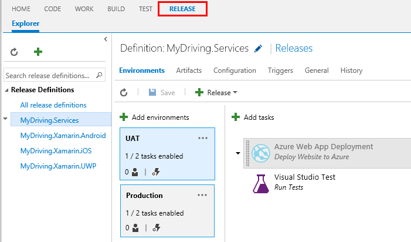
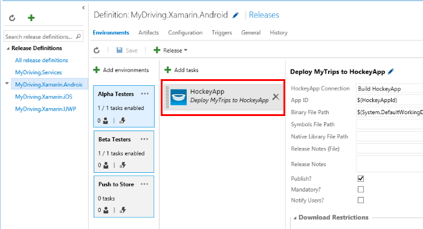
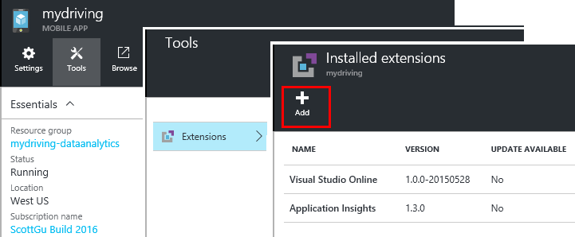

<properties
    pageTitle="MyDriving Azure IoT 範例︰ 建立 |Microsoft Azure"
    description="建立應用程式的完整示範如何使用 Microsoft Azure，包括串流分析、 電腦學習及事件集線器設計 IoT 系統。"
    services=""
    documentationCenter=".net"
    suite=""
    authors="harikmenon"
    manager="douge"/>

<tags
    ms.service="multiple"
    ms.workload="tbd"
    ms.tgt_pltfrm="ibiza"
    ms.devlang="dotnet"
    ms.topic="article"
    ms.date="03/25/2016"
    ms.author="harikm"/>


# <a name="build-and-deploy-the-mydriving-solution-to-your-environment"></a>建立並部署 MyDriving 解決方案，您的環境

MyDriving 是從您的汽車收集資料、 使用電腦學習程序，而就會出現在您的行動電話上的網際網路的項目 (IoT) 解決方案。 後端包含各種不同的 Microsoft Azure 所提供的服務。 用戶端可以是 Android、 iOS 或在 Windows 10 手機。

我們建立 MyDriving 解決方案，讓您在建立您自己的 IoT 系統啟動。 從[上 GitHub MyDriving 存放庫](https://github.com/Azure-Samples/MyDriving)中，您可以取得 Azure 資源管理員指令碼至您自己的 Azure 帳戶部署後端架構。 從該時間點，您可以重新設定不同的服務，修改查詢，以符合您自己的資料，依此類推。 您可以找到這些指令碼，以及行動應用程式、 Azure 應用程式服務 API 專案，和其他項目的-MyDriving 存放庫中的程式碼。

如果您尚未嘗試應用程式，看看 [[快速入門的指南](iot-solution-get-started.md)。

有[MyDriving 參考指南](http://aka.ms/mydrivingdocs)中架構詳細的帳戶。 在 [摘要] 有好幾我們設定，而您想要設為建立類似的專案︰

* 在 Windows 10、 iOS 和 Android 手機上執行，**用戶端應用程式**。 我們使用 Xamarin 平台共用的程式碼，它會儲存在 GitHub 下`src/MobileApp`。 應用程式實際上會執行兩個不同的功能︰
 * 它轉接遙測從板診斷 (OBD) 裝置和系統的雲端後端自己位置服務。
 * 這是使用者可以查詢其錄製的道路往返相關的位置使用者介面。
* **雲端服務**ingests 即時道路差旅費資料，並加以處理。 建立這項服務的主要工作是選擇、 參數化，以及電線設定不同的 Azure 服務。 某些部分需要指令碼篩選與程序的內送的資料。 我們會使用 Azure 資源管理員範本來設定所有部分。
* **行動訊息服務應用程式**是後面的裝置應用程式使用者介面一部分之 web 服務。 主要工作是查詢儲存的處理資料的資料庫。 其程式碼位於下 GitHub `src/MobileAppService`。
* **Visual Studio 與 Xamarin**是我們的開發環境。 Xamarin 存在於元件的 Visual Studio 和為獨立的整合式環境 (IDE)，這用來建立跨平台裝置程式碼。 若要建立 iOS 程式碼，則必須有 Xamarin OS X 電腦上執行的執行個體。 必要時，它可以為代理人，可從 Visual Studio 管理執行。
* 裝置的應用程式的 [**測試單位**是 Xamarin 測試雲端中執行。
* **GitHub**是我們儲存所有的程式碼，指令碼和範本儲存機制。
* **Visual Studio 小組服務**是雲端服務，可用來管理連續建置和 web 服務與裝置應用程式的測試。
* **HockeyApp**用來發送裝置程式碼的版本。 也會收集當機及使用情況報表和使用者意見反應。
* **Visual Studio 應用程式獲得深入見解**監視行動 web 服務。

因此我們來看看如何設定的。 請注意，許多步驟選用。

## <a name="sign-up-for-accounts"></a>帳戶註冊

-   [Visual Studio 開發的基礎](https://www.visualstudio.com/products/visual-studio-dev-essentials-vs.aspx)。 這個免費程式提供許多開發人員工具和服務，包括 Visual Studio、 Visual Studio 小組服務，以及 Azure 輕鬆存取。 提供您，讓 $25/月正在等待信用 Azure 12 個月。 也包含 Pluralsight 訓練和 Xamarin 大專院校版的訂閱。 您可以也註冊分別[Azure](https://azure.com)和[Visual Studio 小組服務](https://www.visualstudio.com/products/visual-studio-team-services-vs.aspx)的免費層級，但這些不提供 Azure 貸項總計。

-   [HockeyApp](https://rink.hockeyapp.net/)（選用），來管理測試通訊群組的行動應用程式和收集遙測。

-   [Xamarin](https://xamarin.com/)（必填），建置行動應用程式及執行偵錯執行及測試[Xamarin 測試雲端](https://xamarin.com/test-cloud)上。

-   [GitHub](https://github.com/Azure-Samples/MyDriving/)（選用），建立您自己 （付款私人存放庫） 的程式碼的免費公用存放庫。 或者，您可以使用基本的計劃中的私人存放庫的 Visual Studio 小組服務。

-   [Power BI](https://powerbi.microsoft.com/)（選用），整個系統建立資料的豐富視覺效果。

> [AZURE.NOTE] 您不需要存取 MyDriving 中的程式碼[GitHub MyDriving 存放庫](https://github.com/Azure-Samples/MyDriving)GitHub 帳戶。

## <a name="install-development-tools"></a>安裝開發工具

適用於開發完整的解決方案的下列設定︰ iOS、 Android 和 Windows 10 行動裝置跨平台的應用程式，與 Azure 後端。

或者，您可以使用 Xamarin Studio 在 Mac 或 Windows 開發行動應用程式，如果您不使用上 Azure 後端。

沒有[此設定的較長的描述](https://msdn.microsoft.com/library/mt613162.aspx)。

### <a name="windows-development-machine"></a>Windows 開發電腦

在 Windows 上的中央工具為 Visual Studio 中，使用 Android 和 Windows MyDriving 應用程式、 應用程式服務 API 專案和 microservice 副檔名。

Xamarin、 給、 模擬器和其他實用的元件全部整合在一起 Visual Studio。

安裝︰

-   [使用 Xamarin visual Studio 2015](https://www.visualstudio.com/products/visual-studio-community-vs)（任何版本-社群是可用）。

-   [SQLite 通用 Windows 平台](https://visualstudiogallery.msdn.microsoft.com/4913e7d5-96c9-4dde-a1a1-69820d615936)。 若要建立 Windows 10 行動裝置的程式碼，必須具備。

-   [Azure SDK Visual Studio 2015](https://go.microsoft.com/fwlink/?linkid=518003&clcid=0x409)。 可讓您 SDK Azure 中執行應用程式，以及管理 Azure 的命令列工具。

-   [Azure 服務布料的轉印圖樣 SDK](http://www.microsoft.com/web/handlers/webpi.ashx?command=getinstallerredirect&appid=MicrosoftAzure-ServiceFabric)。 需要建立[microservice](../service-fabric/service-fabric-get-started.md)副檔名。

此外，請確定您有正確的 Visual Studio 副檔名。 核取 [，在 [**工具**] 底下，您會看到**Android、 iOS，Xamarin...**]。 如果不是，開啟 [控制台]，然後按一下**[程式和功能** > **Microsoft** > **Visual Studio 2015** > **修改**。 **跨平台**，請選取**C\#/.Net (Xamarin)**。 當您有時，核取已安裝**Windows 版給**。

### <a name="mac-development-machine"></a>Mac 開發電腦

Mac (Yosemite 或更新版本) 如果您想要開發 iOS 版，則需要。 雖然我們使用與 Windows 上 Xamarin 的 Visual Studio 開發和管理所有的程式碼，Xamarin 會使用建立並登入 iOS 代碼才能在 Mac 上安裝代理程式。


（或者，您可以使用 Xamarin Studio 直接在 Mac 上開發跨平台應用程式。）

如果您不想要包含 iOS 做為目標平台，您不需要 Mac。

安裝︰

-   [IOS 版 Xamarin Studio](https://developer.xamarin.com/guides/ios/getting_started/installation/mac/)。 您也可以設定 Visual Studio 與 Xamarin 正在執行 Windows 虛擬機器在 Mac 上。 請參閱 MSDN 上的[設定、 安裝和 Mac 使用者的驗證](https://msdn.microsoft.com/library/mt488770.aspx)。

-   [Azure 開發工具](https://azure.microsoft.com/downloads/)（選擇性）。

啟用遠端在 mac 上的登入 開啟 [**系統偏好設定** > **共用**]，然後選取**遠端登入**。

當您在 Windows 上的 Visual Studio 中開啟的 iOS 專案時，外掛程式 Xamarin 會提示您輸入的 mac 識別碼

## <a name="fetch-the-github-repository"></a>擷取 GitHub 存放庫

使用中的 [**下載 ZIP**按鈕 GitHub、 Visual Studio 中或另一個給用戶端電腦[GitHub MyDriving 存放庫](https://github.com/Azure-Samples/MyDriving)的本機複本。

解壓縮檔案到資料夾與短路徑名稱，例如 c:\\程式碼。

或者，如果您想要保持在最新的或參與我們的程式碼，複製存放庫，如下所示︰

**給複製 https://github.com/Azure-Samples/MyDriving.git**

## <a name="get-a-bing-maps-api-key"></a>取得 Bing 地圖服務 API 金鑰

[註冊的 Bing 地圖服務 API 金鑰](https://msdn.microsoft.com/library/ff428642.aspx)。

您需要將此中一行 22 `src/MobileApps/MyDriving/MyDriving.Utils/Logger.cs`。


## <a name="build-the-demo-app"></a>建立示範應用程式

Visual Studio 中開啟這些方案︰

-   src\MobileApps\MyDriving.sln

-   src\MobileAppService\MyDrivingService.sln

-   src\Extensions\ServiceFabric\VINLookUpApplication\VINLookUpApplication.sln

您會看到提示︰

-   信任一些可能不受信任的專案。 選擇此選項，以開啟檔案，如果您想要繼續進行。

-   如果您使用全新的 Windows 10 電腦上，請設定 [開發人員模式。

-   提供 Xamarin 認證。

-   連線至 Xamarin mac 如果您沒有安裝 Mac，iOS 專案在 Visual Studio 中，以滑鼠右鍵按一下，然後選取 [**卸載專案**。

重建方案。

如果您無法建立，請嘗試解決方案我們找到的缺點︰

-   *無法載入 VINLookupApplication project*︰ 請確定您已安裝的[Visual Studio 2015 Azure SDK](https://go.microsoft.com/fwlink/?linkid=518003&clcid=0x409)。

-   *無法建立服務布料的轉印圖樣專案*︰ 建置介面專案，並確定您將服務布料的轉印圖樣 SDK 安裝。

-   *無法建立 android 應用程式*︰

    -   開啟 [**工具**] > **Android** > **Android SDK 管理員**，並確定該 Android 6 (API 23) / SDK 平台安裝。

    -   刪除此目錄，然後再重新建立︰<br/>
        `%LocalAppData%\Xamarin\zips`

## <a name="get-to-know-the-code"></a>認識程式碼

在方案中，您會發現︰

-   Azure 副檔名︰ 服務布料的轉印圖樣。

-   Azure HDInsight︰ 指令碼處理差旅費 Azure 中的資料。

-   行動應用程式︰ 裝置應用程式。

-   MobileAppsService/MyDrivingService: Web 回結尾。

-   Power BI︰ 報表定義。

-   指令碼︰

    -   資源管理員︰ 範本來建立 Azure 資源。

    -   PowerShell︰ 指令碼執行資源管理員範本。

    -   Azure SQL 資料庫︰ 偵錯資料庫。

-   SQL 資料庫︰ CreateTables︰ 結構描述定義。

-   Azure 資料流分析︰ 查詢轉換的內送的資料流。

## <a name="run-the-apps-in-development-mode"></a>在開發模式中執行應用程式

若要執行的應用程式，根據您使用的裝置的動作︰

-  後端︰ 設定 MyDrivingService 做為啟動專案，並按 F5 執行的後端 web 服務。 隨即會開啟瀏覽器檢視的 API 清單。

-  行動用戶端︰[行動應用程式開發 Xamarin 中](https://developer.xamarin.com/guides/cross-platform/deployment,_testing,_and_metrics/debugging_with_xamarin/)。
 -  Android︰ 如需詳細資訊，請參閱[Android 中 Xamarin 偵錯](http://developer.xamarin.com/guides/android/deployment,_testing,_and_metrics/debugging_with_xamarin_android/)。

 -  iOS︰ 如需詳細資訊，請參閱[ios 的偵錯](http://developer.xamarin.com/guides/ios/deployment,_testing,_and_metrics/debugging_in_xamarin_ios/)。

 -  Windows Phone︰ 如需詳細資訊，請參閱[Xamarin + Windows Phone](https://developer.xamarin.com/guides/cross-platform/windows/phone/)。

## <a name="upload-the-mobile-app-to-hockeyapp"></a>上傳至 HockeyApp 的行動應用程式

HockeyApp 管理通訊群組，若要測試的使用者，請在 Android、 iOS 或 Windows 應用程式通知使用者新的版本。 也會收集實用當機報表、 使用者的螢幕擷取畫面及使用方式標準的意見反應。

[開始上傳](http://support.hockeyapp.net/kb/app-management-2/how-to-create-a-new-app)您建立的應用程式。 然後登入[HockeyApp](https://rink.hockeyapp.net)從您的部署電腦。 在開發人員儀表板中，按一下**新的應用程式**]，，然後拖曳的內建的檔案拖曳到視窗。 （之後，您可以自動執行此動作您建立的服務。）

現在您已在應用程式儀表板中。

![在應用程式儀表板上的 [概觀] 索引標籤](./media/iot-solution-build-system/image2.png)

每個平台上執行應用程式的重複此程序。 然後您可以執行下列動作︰

-  使用[應用程式識別碼](http://support.hockeyapp.net/kb/app-management-2/how-to-find-the-app-id)，從儀表板傳送您的應用程式當機資料和意見反應。 在 MyDriving，更新 src/MobileApps/MyDriving/MyDriving.Utils/Logger.cs 中的識別碼。

-  [邀請測試使用者](http://support.hockeyapp.net/kb/app-management-2/how-to-invite-beta-testers)。 您會收到雇人員使用者的 URL。 對方可以註冊您的小組，下載應用程式，並傳送給您的意見反應。

-  如果您想開啟的 beta 版，請將分配為公用。 按一下 [**管理應用程式** > **分配** > **下載 = 公用**。 現在任何人都可以下載您的應用程式，並傳送給您的意見反應，並張貼新版本時，就會看到通知。 您也可能會收到某些當機報表從這些。

    

-  [Visual Studio 小組服務連結損毀報表](http://support.hockeyapp.net/kb/third-party-bug-trackers-services-and-webhooks/how-to-use-hockeyapp-with-visual-studio-team-services-vsts-or-team-foundation-server-tfs)。 按一下 [**管理應用程式** > **Visual Studio 小組服務**。 HockeyApp 即可自動建立的工作項目中小組服務時當機報表或時收到的意見反應。

閱讀更多， [HockeyApp 網站](https://hockeyapp.net)。

## <a name="test-the-mobile-app-on-xamarin-test-cloud"></a>測試上 Xamarin 測試雲端的行動應用程式

[Xamarin 測試雲端](https://developer.xamarin.com/guides/testcloud/introduction-to-test-cloud/)自動化使用者介面測試實數裝置在雲端上。 藉由使用 NUnit 架構，您撰寫執行您的應用程式使用者介面的測試。

若要使用 Xamarin，您可以將[Xamarin.UITests](https://developer.xamarin.com/guides/testcloud/uitest/intro-to-uitest/) SDK 到您的應用程式，會出現為 NuGet 套件。 您會發現示範應用程式中，具有所包含的 Xamarin 範本建立新的測試專案時。


範例測試專案會隨附存放庫中的應用程式。 在[MyDriving](https://github.com/Azure-Samples/MyDriving/tree/master/src/MobileAppService)，尋找下[src](https://github.com/Azure-Samples/MyDriving/tree/master/src)/MobileApps/[MyDriving](https://github.com/Azure-Samples/MyDriving/tree/master/src/MobileApps/MyDriving)/MyDriving.UITests/。

如果您使用 Visual Studio 小組服務建立，您可以輕鬆撰寫 Xamarin UI 單位測試並執行這些做為您建立的一部分。

## <a name="deploy-azure-services"></a>部署 Azure 服務

若要執行的自動部署 Azure 服務及小組服務建立服務，請參閱**scripts/README.md**的詳細指示。

Microsoft Azure 會提供許多不同的服務，您可以使用建置雲端應用程式。 雖然可以用許多個別 （例如應用程式服務/Web 應用程式），就會在其最佳時它們相互連接的整合式的系統等，我們使用 MyDriving 的表單。

可以建立並手動相互 Azure 服務的連線，但它會更快且更可靠使用 Azure 資源管理員的範本。 [資源管理員](../azure-resource-manager/resource-group-overview.md)會自動執行解決方案的資源，讓它們之間相對的部署。

您可以找到的 MyDriving 系統的範本，在 [[指令碼/ARM](https://github.com/Azure-Samples/MyDriving/tree/master/scripts/ARM)下 GitHub 存放庫中。 會提供我們架構中不同的服務的互相的全面涵蓋所有內容和精簡檢視。 我們會說明這些全部的[MyDriving 參考指南](http://aka.ms/mydrivingdocs)中的詳細資料，但您可以瞭解大量只要閱讀範本本身。

> [AZURE.NOTE] 最 Azure 服務會有相關聯的成本，根據價格層。 如果您是新 Azure，可以[免費試用這個功能](https://azure.microsoft.com/free/)。 不過，如果您不打算使用 MyDriving 系統中的某些元件，請務必移除，以避免支付成本。 本文稍後的 「 估計營運成本 」 一節提供一般服務費用的摘要。

### <a name="edit-the-template"></a>編輯範本

若要自訂您的部署，移除不需要的元件，或新增其他人，請先複本案例\_complete.params.json 和案例\_complete.json 要進行的變更。

您可以使用此案例\_complete.params.json 檔案，以覆寫各種不同的預設值，SKU 的服務或儲存空間複寫類型，例如下, 表所述。 預設值選取 [最低成本選項。

| **參數**         | **描述**                | **預設值** |
|--------|---------|-------|
| IoT 中心 SKU           | Azure IoT 中心服務層 | F1                |
| 儲存帳戶類型  | 儲存複寫類型       | 標準 LRS      |
| SQL 服務方針 | 並行位置消耗   | DW100             |
| 主機服務方案 SKU      | 應用程式服務的服務方案   | F1                |

在案例\_complete.json:

-   搜尋 「 baseName 」，並將其變更為您想要的名稱。

-   搜尋 「 建立 」。 每一個區段來建立資源。

-   設定 sqlServerAdminLogin 和 sqlServerAdminPassword 適當的值。

-   刪除節建立資源之前，請檢查其是否有從屬參照，藉由搜尋名稱檔案中的其他位置。 請注意建立服務每個區段包含*dependsOn*章節會列出相依性。

以下是範本的設定。 詳細資料位於[參考指南](http://aka.ms/mydrivingdocs)。

| **服務**                 | **說明與詳細資料**  
|---|----
| 儲存帳戶            | 範本會建立三個帳戶︰                                                                                                                                                                       
|| -SQL 資料庫的彙總的遙測接收串流分析，並做為資料透過 API 端點公開的 Azure 應用程式服務資料表的支援存放區。                      
|| -累積從另一個資料流分析作業，處理 HDInsight 的歷史資料的 blob 儲存體。                                                                                         
|| -接收結果 HDInsight 處理用於 Power BI SQL 資料庫。                                                                                                                 
| Azure IoT 中心                     | 建立的雙向連線至每個連線的裝置。 MyDriving 解決方案，請在行動應用程式會做為欄位的閘道器傳送資料至 Azure IoT 中心。 Azure IoT 中心接著做為資料流分析的輸入。 |
| Azure 事件集線器                   | 佇列中的副檔名建立 Azure 服務布料的轉印圖樣的輸出資料流分析工作成果。                                                                                               
| Azure SQL Data Warehouse          |                                                                                                                                                                                                            
| 資料流分析工作 | 使用查詢，這用來彙總同時即時和歷史資料的應用程式服務 Api、 Azure 電腦學習、 延伸及 Power BI 連線輸入和輸出。                               
| 電腦學習工作區  | 包含實驗、 R 和 API 服務。                                                                                                                                                              
| Azure 資料工廠                | 排定的重新電腦學習訓練。                                                                                                                                                                     
| 服務布料的轉印圖樣裝載計劃 | 延伸。                                                                                                                                                                                            
| 應用程式服務 （「 行動應用程式 」）  | 管理行動應用程式 API 專案的結束點提供的行動應用程式。 從 Visual Studio，必須先 API 程式碼部署至應用程式服務。                                                         
| 通知的規則                 | 傳送給您電子郵件傳送如果應用程式回覆表示失敗。                                                                                                                                            
| 應用程式的深入見解        | 監視的應用程式服務中的 Api 效能。 您必須在 Visual Studio 中設定連線。                                                                                          
| Azure 鍵保存庫                   | 用來儲存 web 服務叢集憑證。                                                                                                                                                                

### <a name="run-the-template"></a>執行範本

在**scripts/README.md**，有執行範本的詳細的指示。

若要使用的指令碼佈建 Azure 帳戶中的所有這些服務，請執行下列其中一項︰

-   使用 PowerShell:

    ```

    cd scripts/PowerShell;
    deploy.ps1 *location* *resourceGroupName*
    ```

 -   *是[Azure 的位置](https://azure.microsoft.com/regions/)，例如*`North Europe`或`West US`。 使用`Get-AzureLocation`若要尋找的可用的位置清單。

 -   *resourceGroupName*就是您想要授與給所有的資源將會所屬群組的名稱。 當您完成的資源時，您可以刪除它們一起刪除此群組。

-   執行艦隊 DeploymentScripts/Bash/deploy.sh。

-   開啟並建立 Visual Studio 方案 DeploymentScripts/VS/DeployARM.sln。

請注意，每次執行範本，建立一組新的資源以新名稱。 若要刪除的資源，請移至入口網站及刪除資源群組。

如果指令碼無法基於任何原因，您可以重新執行。

指令碼可讓您在 Visual Studio 小組服務設定持續整合的選項。 如果您已設定小組服務專案，您將需要 URL: https://yourAccountName.visualstudio.com。 當系統詢問時，請輸入完整的 URL。 您可以指定新的或現有的名稱，小組 Services 專案。

## <a name="set-up-build-and-test-definitions-in-visual-studio-team-services"></a>建立設定並測試定義在 Visual Studio 小組服務

我們使用此專案的小組服務大多為其建立並測試功能。 但也會提供絕佳的共同作業的支援，例如 Kanban 區與任務管理、 程式碼的檢閱工作與來源控制整合，以及閘建置。 它整合以及其他工具，例如 GitHub、 Xamarin、 HockeyApp，及當然，Visual Studio。 您可以透過網頁介面或 Visual Studio 存取它，以更方便隨時。

建立和發行定義中的步驟，使用各種不同的外掛程式小組服務[商場](https://marketplace.visualstudio.com/VSTS)提供的服務。 除了執行命令列，或複製檔案的基本公用程式，有的叫用建置 Xamarin、 Android 和其他樣式，並連線到 HockeyApp 的服務。


### <a name="build-definitions"></a>建立定義

我們已建立的每個主要的目標的定義。 我們也有變化功能和迴歸分析測試。 如此一來︰

-   MyDriving.Services （行動應用程式後端 web 應用程式）

-   MyDriving.Xamarin.Android

    -   MyDriving.Xamarin.Android 功能

    -   MyDriving.Xamarin.Android 迴歸

-   MyDriving.Xamarin.iOS

    -   MyDriving.Xamarin.iOS 功能

    -   MyDriving.Xamarin.iOS 迴歸

-   MyDriving.Xamarin.UWP

    -   MyDriving.Xamarin.UWP 功能

    -   MyDriving.Xamarin.UWP 迴歸

如果您想要查看我們設定的完整詳細資料，請參閱一節 4.7 [MyDriving 參考指南](http://aka.ms/mydrivingdocs)中，「 建立和發行設定 」。 他們遵循的相同的一般模式。 指令碼︰

1.  還原 NuGet 套件。 讓每一個建立的第一個步驟是還原所需的 NuGet 封裝，我們不將存放庫內，保留編譯程式碼。

2.  啟動授權。 執行建立在雲端，因此位置我們需要授權，特別是 Xamarin 建立服務，我們需要啟動我們目前建立電腦上的授權。 然後我們停用立即之後，讓它在另一部電腦上使用。

3.  建立使用適當的服務。 我們在行動應用程式中，使用 Xamarin 建置和 Visual Studio 組建後端 web 服務。

4.  建置測試。

5.  執行測試。 我們執行行動應用程式中的測試 Xamarin 測試雲端。

6.  若要放置的位置發佈建立結果。

主要建置的觸發程序會設定為 [接續本頁] 分整合。 就是建立執行每次程式碼主分支存回。

![觸發程序設定為 [接續本頁] 分整合位置的介面](./media/iot-solution-build-system/image6.png)

### <a name="release-definitions"></a>發行定義

發行定義已設定在許多相同的方式。

Web 服務，我們設定為 Azure web 應用程式部署︰



我們連續部署設定發行觸發程序。 就是每個核取的後面再加上更新成功建立結果 web 應用程式。


為行動應用程式，我們將部署至 HockeyApp:



## <a name="explore-telemetry-by-using-application-insights"></a>使用應用程式的深入見解探索遙測

[應用程式的深入見解](../application-insights/app-insights-overview.md)收集遙測相關的效能及 web 服務使用方式。 應用程式的深入見解 SDK 會傳送遙測服務應用程式的深入見解資源 Azure 中。

瀏覽至範本設定應用程式的深入見解資源。 那里，您可以瀏覽圖表的[行動應用程式服務專案](https://github.com/Azure-Samples/MyDriving/tree/master/src/MobileAppService)的效能。 即會顯示伺服器要求與回應的時間，失敗次數，及例外狀況的計算。 此外，還有的相依性回應時間，也就是來電資料庫，例如電腦學習 REST Api 到圖表。 如果有任何效能問題，您可以看到您的系統哪一段，檢視造成。


如果您擁有您設定手動 web 服務時，您可以輕鬆上手相同的圖表。 在 web 服務刀中，按一下 [**工具** > **副檔名** > **新增**。 選取**應用程式的深入見解**。



此功能的運作方式操作應用程式的深入見解 SDK 應用程式。

您可以藉由[新增應用程式的深入見解 SDK](../application-insights/app-insights-asp-net.md)新增自訂遙測 （或樂器應用程式正在進行的某處外 Azure），在開發階段。 這是很有用的選項而定，請在應用程式，例如使用者的平均差旅費長度或總里程數記錄指標。 在 Visual Studio 中，專案中，以滑鼠右鍵按一下，然後選取 [**新增應用程式深入資訊**。


應用程式的深入見解會傳送通知電子郵件，如果它發現失敗回應的異常的數字。 您也可以設定您自己的提醒上各種不同的度量，例如回應時間。

只以確定您的 web 服務永遠是最，以及執行，您可以設定[可用性測試](../application-insights/app-insights-monitor-web-app-availability.md)。 這些測試偵測 （ping) 從各種不同位置世界各地的網站每 15 分鐘。 同樣地，您會收到電子郵件，如果似乎那里問題。

## <a name="estimate-operational-costs"></a>估計操作成本

這是非常金錢來執行如下所示，小型應用程式。 許多服務都有免費入門層級，以便開發和小型作業成本很少。 但您自己的應用程式沒有當然，使用 MyDriving 所示的所有功能。

以下是我們在 MyDriving 的開發組態設定成本估計。 我們也請注意，我們一些替代方案*無法*使用。 當您評估您自己的成本，這項資訊可能會很有幫助。

我們假設︰

-   不超過五個小組 （加上觀察專案關係人）。

-   執行適用於瞭解每個月。

-   每日的四個往返 100 使用者。

>[AZURE.NOTE] 如果您是新 Azure，有是[免費的帳戶](https://azure.microsoft.com/free/)。

| **服務/元件**  | **備忘稿** | **成本/月** |
|--------|--------|----------------|
| [Visual Studio 2015 社群](https://www.visualstudio.com/products/visual-studio-community-vs) [Xamarin](https://visualstudiogallery.msdn.microsoft.com/dcd5b7bd-48f0-4245-80b6-002d22ea6eee) <br/>跨平台的開發環境| Visual Studio 社群。 （需要[Xamarin.Forms](https://xamarin.com/forms)，設計從單一程式跨平台版的[Visual Studio 專業版](https://www.visualstudio.com/vs-2015-product-editions)）。  | $ 0   |
| [Azure IoT 中心](https://azure.microsoft.com/pricing/details/iot-hub/) <br/>雙向資料連線，裝置 | 8000 訊息 + 0.5 的 KB 郵件免費。 | $ 0             |
| [資料流狀況分析](https://azure.microsoft.com/pricing/details/stream-analytics/)  <br/>   大量的資料流處理資料                                                                                                                                                              | 另外收費的每個時啟用串流單位每小時，$0.031。 選擇您想要; 的串流單位數量更多] 以調整。 | $ 23            |
| [電腦學習](https://azure.microsoft.com/documentation/services/machine-learning/)<br/> 調整回覆                                                                                                                                                                              |  $10/座位/月。 <br/>                                                                                                                                                                                 + 3 小時實驗\*$1 / 嘗試小時。 <br/>                                                                                                                                                           + 3.5 小時 API CPU \* $2 / 生產 CPU 小時。 <br/>                                                                                                                                                          API CPU 時間會假設 5 分鐘/日重新訓練，雖然這會增加更多輸入資料。                   <br/>                                                                                                                                                                     + 2 分鐘/日計分處理 400 的往返天。  | 為 $ 20            |
| [應用程式服務](https://azure.microsoft.com/pricing/details/app-service/)  <br/> Host （主機) 的行動裝置的後端                                                                                                                                                                              | 層 B1-生產 web 應用程式。 | $ 56            |
| [Visual Studio 小組服務](https://azure.microsoft.com/pricing/details/visual-studio-team-services/)  <br/> 建立單位測試 」 及 「 版本管理;工作管理 | 私人代理程式五個使用者。| $ 0             |
| [應用程式的深入見解](https://azure.microsoft.com/pricing/details/application-insights/) <br/>監視效能及使用方式 web 服務和網站| 免費層。  | $ 0             |
| [HockeyApp](http://hockeyapp.net/pricing/) <br/> 測試版應用程式，以及使用狀況、 意見反應當機資料的集合的通訊群組                                                                                                                                      | 兩個新使用者的免費應用程式。<br/> $30/月之後。  | $ 0    |
| [Xamarin](https://store.xamarin.com/)<br/> 多個裝置統一的平台上的程式碼 | 免費的試用版。 <br/>$25/月之後。| $ 0    |
| Azure 應用程式服務的[SQL 資料庫](https://azure.microsoft.com/pricing/details/sql-database/)| 基本層;單一資料庫模型。 | $ 5             |
| [服務布料的轉印圖樣](https://azure.microsoft.com/pricing/details/service-fabric/)（選用）  | 執行本機叢集。 | $ 0             |
| [Power BI](https://powerbi.microsoft.com/pricing/)<br/> 多功能顯示和調查串流和靜態資料| 免費層︰ 1 GB 10000 列/小時、 每日的重新整理。 <br/> $10/使用者/月[較高的限制](https://powerbi.microsoft.com/documentation/powerbi-power-bi-pro-content-what-is-it/)、 多個連線選項、 共同作業。    | $ 0             |
| [儲存空間](https://azure.microsoft.com/pricing/details/storage/)   | L （本機多餘） &lt; 100 G $0.024/GB。  | $ 3             |
| [資料工廠](https://azure.microsoft.com/pricing/details/data-factory/)                                                                                                                       | 每個活動 $0.60 \* (8-5 FOC)。| $ 2             |
| [HDInsight](https://azure.microsoft.com/pricing/details/hdinsight/) <br/>  視需要叢集每日重新訓練   | 在 $0.32/小時 （1 小時） 每天的三個 A3 節點 * 31 天。 | $ 30            |
| [事件集線器](https://azure.microsoft.com/pricing/details/event-hubs/)  | 基本使用 $11/月處理量單位 + $0.028 輸入。 | $ 11            |
| OBD 盜用  || $ 12            |
| **總計**|    | **$ 157**       |

如需詳細資訊，請參閱︰

-   [Azure 服務配額和限制](../azure-subscription-service-limits.md#iot-hub-limits)的摘要

-   Azure[價格計算機](https://azure.microsoft.com/pricing/calculator/)

## <a name="send-us-your-feedback"></a>將您的意見反應傳送給我們

因為我們建立以協助啟動 MyDriving IoT 系統，我們確實想要瞭解您的想法其運作方式。 讓我們知道︰

-  遇到困難或問題。

-  有延伸點，讓更多適用於您的狀況。

-  您找到更有效率的方法完成特定需求。

-  您有任何其他建議改善 MyDriving] 或 [此文件。

若要提供意見反應，檔案的 [問題上 GitHub]，或離開註解下方 (短-我們 edition)。

期待聽力您 ！

## <a name="next-steps"></a>後續步驟

我們建議您[MyDriving 參考指南](http://aka.ms/mydrivingdocs)，這是全面涵蓋所有內容的系統及其元件設計的描述。
