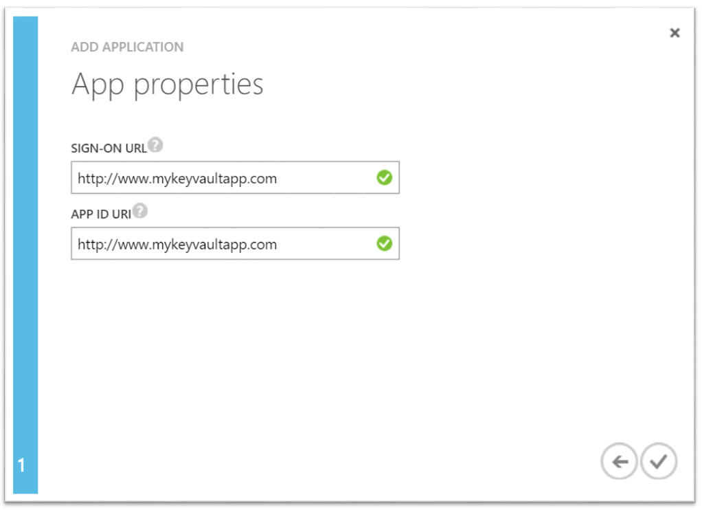

<properties
    pageTitle="如何與端對端鍵旋轉稽核設定金鑰保存庫 |Microsoft Azure"
    description="使用此相關協助您取得與索引鍵的旋轉和監視金鑰保存庫記錄檔的設定"
    services="key-vault"
    documentationCenter=""
    authors="swgriffith"
    manager="mbaldwin"
    tags=""/>

<tags
    ms.service="key-vault"
    ms.workload="identity"
    ms.tgt_pltfrm="na"
    ms.devlang="na"
    ms.topic="article"
    ms.date="07/05/2016"
    ms.author="jodehavi;stgriffi"/>
#<a name="how-to-setup-key-vault-with-end-to-end-key-rotation-and-auditing"></a>如何與端對端鍵旋轉稽核設定金鑰保存庫

##<a name="introduction"></a>簡介

建立之後您 Azure 金鑰保存庫，您可以開始使用該保存庫來儲存您的索引鍵和密碼。 應用程式不再需要保存您鍵或機密資料，但不是會要求他們從主要的保存庫視。 這個選項可讓您更新索引鍵和機密資料，而不會影響的行為，開啟您的金鑰周圍的可能性各種此應用程式與私人管理行為。

本文將引導範例充分使用儲存在此例 Azure 儲存體帳戶金鑰] 應用程式存取的機密，Azure 金鑰保存庫。 它也會示範實作排程的儲存空間的 [帳戶金鑰的旋轉。 最後，它會逐步示範如何監控金鑰保存庫稽核記錄和非預期要求時發出警告。

> \[AZURE。請注意\]本教學課程中不是要說明的詳細資料一組初始設定的 Azure 的金鑰保存庫。 這項資訊，請參閱[開始使用 Azure 金鑰保存庫](key-vault-get-started.md)。 或者，跨平台命令列介面指示，請參閱[本教學課程中相同](key-vault-manage-with-cli.md)。

##<a name="setting-up-keyvault"></a>設定 KeyVault

若要啟用從 Azure 金鑰保存庫擷取密碼的應用程式，必須先建立密碼，然後上傳至您保存庫。 這可以完成輕鬆地透過 PowerShell 如下所示。

啟動 Azure PowerShell 工作階段，並登入您 Azure 帳戶使用了下列命令︰

```powershell
Login-AzureRmAccount
```

在快顯的瀏覽器視窗中，輸入您的 Azure 帳戶使用者名稱和密碼。 Azure PowerShell 會收到所有的訂閱，此帳戶與預設相關聯，會使用第一個。

如果您有多個訂閱，您可能必須指定用來建立您的 Azure 金鑰保存庫的特定項目。 輸入下列命令以查看您的帳戶的訂閱︰

```powershell
Get-AzureRmSubscription
```

然後，如果要指定您將會記錄您金鑰保存庫與相關聯的訂閱，請輸入︰

```powershell
Set-AzureRmContext -SubscriptionId <subscriptionID> 
```

本文將示範如何儲存為私人的儲存空間帳戶金鑰，因為您必須取得該儲存帳戶金鑰]。

```powershell
Get-AzureRmStorageAccountKey -ResourceGroupName <resourceGroupName> -Name <storageAccountName>
```

擷取您的密碼之後, 在此情況下您儲存帳戶金鑰]，您必須將的轉換為安全的字串，然後使用您的主要保存庫中的值建立密碼。

```powershell
$secretvalue = ConvertTo-SecureString <storageAccountKey> -AsPlainText -Force

Set-AzureKeyVaultSecret -VaultName <vaultName> -Name <secretName> -SecretValue $secretvalue
```
接下來，您會想 URI 取得您剛剛建立的密碼。 這會在稍後時使用撥號鍵保存庫來擷取您的密碼。 執行下列 PowerShell 命令，並記下 'Id' 值，也就是私人 URI。

```powershell
Get-AzureKeyVaultSecret –VaultName <vaultName>
```

##<a name="setting-up-application"></a>設定應用程式

您已經有私人，儲存您會想要擷取的密碼，並用於從程式碼。 有幾個步驟，才能完成這，第一個和最重要的 Azure Active Directory 註冊您的應用程式，然後告知 Azure 金鑰保存庫您應用程式的資訊，讓它可以讓您的應用程式要求。

> \[AZURE。請注意\]必須與您的金鑰保存庫相同的 Azure Active Directory 租用戶上建立您的應用程式。 

第一次開啟 Azure Active Directory 中的 [應用程式] 索引標籤


選擇 [新增]，若要新增至您 Azure AD 新的應用程式


離開 ' Web 應用程式和/或 WEB API 」 應用程式類型，並為您的應用程式名稱。


登入 URL] 和 [應用程式識別碼 URI'，讓您的應用程式。 這些可以是任何您想要用於此示範，並視可以稍後再變更。



Azure ad 加入應用程式後，您會納入的應用程式頁面。 從該點按一下 [設定] 索引標籤上的 [然後尋找，並複製的 「 用戶端識別碼 」 值。 請記下稍後步驟的用戶端識別碼。

接下來，您必須產生都能互動 Azure AD 應用程式的金鑰。 您可以將它建立的 「 設定 」 索引標籤中的 '鍵 」 區段下。 請記下從 Azure AD 應用程式的後續步驟中使用新產生的金鑰。


建立應用程式鍵保存庫中的任何呼叫之前您需要您的應用程式的資訊告知鍵保存庫及其 」 權限。 下列命令會採用保存庫名稱] 和 [從 Azure AD 應用程式的用戶端識別碼，並授與 'Get' 存取您的主要保存庫應用程式。

```powershell
Set-AzureRmKeyVaultAccessPolicy -VaultName <vaultName> -ServicePrincipalName <clientIDfromAzureAD> -PermissionsToSecrets Get
```

此時您準備好開始建立您的應用程式接聽來電。 在應用程式中您必須安裝才能互動 Azure 金鑰保存庫與 Azure Active Directory NuGet 套件。 從 Visual Studio 封裝管理員主控台中，輸入下列命令。 請注意，在撰寫本文的目前版本的 active Directory 套件 3.10.305231913，，因此您可能要確認最新版本，並依此更新。

```powershell
Install-Package Microsoft.IdentityModel.Clients.ActiveDirectory -Version 3.10.305231913

Install-Package Microsoft.Azure.KeyVault
```

在應用程式碼中，建立類別，以保留您的 Active Directory 驗證方法。 在此範例中，類別稱為 「 Utils 」。 然後您必須新增下列使用。

```csharp
using Microsoft.IdentityModel.Clients.ActiveDirectory;
```

接下來，新增下列方法以從 Azure AD 擷取 JWT 權杖。 您可能會想要移動硬碟維護的編碼字串值至您的網頁或應用程式設定。

```csharp
public async static Task<string> GetToken(string authority, string resource, string scope)
{
    var authContext = new AuthenticationContext(authority);

    ClientCredential clientCred = new ClientCredential("<AzureADApplicationClientID>","<AzureADApplicationClientKey>");

    AuthenticationResult result = await authContext.AcquireTokenAsync(resource, clientCred);

    if (result == null)

    throw new InvalidOperationException("Failed to obtain the JWT token");

    return result.AccessToken;
}
```

最後，您可以新增必要的程式碼呼叫鍵保存庫，並擷取您私人的值。 您必須在第一次新增下列使用陳述式。

```csharp
using Microsoft.Azure.KeyVault;
```

接下來，您將加入叫用金鑰保存庫，並可擷取您私人的方法呼叫。 在此方法，其中提供 URI 您儲存在上一個步驟中的密碼。 請注意使用從先前所建立的 Utils 類別 GetToken 方法。
    
```csharp
var kv = new KeyVaultClient(new KeyVaultClient.AuthenticationCallback(Utils.GetToken));

var sec = kv.GetSecretAsync(<SecretID>).Result.Value;
```

當您執行您的應用程式時，您現在應該 Azure Active Directory 驗證，從您的 Azure 金鑰保存庫擷取您私人的值。

##<a name="key-rotation-using-azure-automation"></a>使用 Azure 自動化鍵旋轉

有不同的選項實作旋轉策略您儲存為 Azure 金鑰保存庫機密資料的值。 密碼可以旋轉手動程序的一部分，他們利用 API 呼叫可能會以程式設計方式旋轉或他們可能會透過自動化指令碼旋轉。 這篇文章的我們將會運用結合 Azure 自動化，若要變更 Azure 儲存體帳戶便捷鍵與 PowerShell 的 Azure，我們會使用該新的金鑰的更新金鑰保存庫私人。 

若要允許 Azure 自動化來設定您的主要保存庫中的私人的值，您必須用戶端識別碼取得名為 「 AzureRunAsConnection 「 建立您的 Azure 自動化執行個體時所建立的連線。 您可以選擇從 Azure 自動化執行個體的 「 資產 」，就可取得此識別碼。 從這裡您可以選擇 [連線]，然後選取 ['AzureRunAsConnection' 服務原則。 您會想要注意的應用程式識別碼。 


當您仍在 [資產] 視窗中您也要選擇 [模組]。 從模組，您會選取 [圖庫]，然後搜尋，「 匯入 「 更新下列模組的每個版本。

    Azure
    Azure.Storage   
    AzureRM.Profile
    AzureRM.KeyVault
    AzureRM.Automation
    AzureRM.Storage
    
> \[AZURE。請注意\]本文的撰寫只以上記下需要更新共用下方的指令碼的模組。 如果您發現您自動化工作會失敗，您應該確認您擁有所有必要的模組和匯入其相依性。

在您擷取的應用程式識別碼 Azure 自動化連線之後，您必須判斷您 Azure 金鑰保存庫這個應用程式有更新您保存庫中的機密存取權。 這可以使用下列 PowerShell 命令完成。

```powershell
Set-AzureRmKeyVaultAccessPolicy -VaultName <vaultName> -ServicePrincipalName <applicationIDfromAzureAutomation> -PermissionsToSecrets Set
```

下一步您會選取 「 Runbooks 」 資源下 Azure 自動化執行個體，然後選取 [新增 Runbook]。 選取 [快速建立]。 命名您 runbook，然後選取 [PowerShell 」 作為 runbook 類型]。 您也可以加入描述。 最後，按一下 [建立]。


在您的新 runbook 的 [編輯器] 窗格中，您將貼上下列的 PowerShell 指令碼。

```powershell
$connectionName = "AzureRunAsConnection"
try
{
    # Get the connection "AzureRunAsConnection "
    $servicePrincipalConnection=Get-AutomationConnection -Name $connectionName         

    "Logging in to Azure..."
    Add-AzureRmAccount `
        -ServicePrincipal `
        -TenantId $servicePrincipalConnection.TenantId `
        -ApplicationId $servicePrincipalConnection.ApplicationId `
        -CertificateThumbprint $servicePrincipalConnection.CertificateThumbprint 
    "Login complete."
}
catch {
    if (!$servicePrincipalConnection)
    {
        $ErrorMessage = "Connection $connectionName not found."
        throw $ErrorMessage
    } else{
        Write-Error -Message $_.Exception
        throw $_.Exception
    }
}

#Optionally you may set the following as parameters
$StorageAccountName = <storageAccountName>
$RGName = <storageAccountResourceGroupName>
$VaultName = <keyVaultName>
$SecretName = <keyVaultSecretName>

#Key name. For example key1 or key2 for the storage account
New-AzureRmStorageAccountKey -ResourceGroupName $RGName -StorageAccountName $StorageAccountName -KeyName "key2" -Verbose
$SAKeys = Get-AzureRmStorageAccountKey -ResourceGroupName $RGName -Name $StorageAccountName

$secretvalue = ConvertTo-SecureString $SAKeys[1].Value -AsPlainText -Force

$secret = Set-AzureKeyVaultSecret -VaultName $VaultName -Name $SecretName -SecretValue $secretvalue
```

從 [編輯器] 窗格中，您可以選擇 '測試窗格] 來測試您的指令碼。 當正在執行指令碼不會發生錯誤，您可以選取 [發行] 選項中，然後您可以套用回在 runbook 設定窗格 runbook 的排程。

##<a name="key-vault-auditing-pipeline"></a>索引鍵保存庫稽核管線

當您設定 Azure 金鑰保存庫您可以開啟 [稽核記錄收集對金鑰保存庫的存取要求。 這些記錄儲存於指定的 Azure 儲存體帳戶，且可以再提取，監視和分析。 透過運用 Azure 函數的情況查核行程，下方 Azure 邏輯應用程式與索引鍵保存庫稽核記錄檔給建立管線從保存庫機密資料擷取相符的 web 應用程式的應用程式識別碼應用程式時，傳送電子郵件。

首先，您必須啟用登入您的金鑰保存庫。 這可以透過下列 PowerShell 命令 (能看到完整的詳細資料[以下](key-vault-logging.md)):

```powershell
$sa = New-AzureRmStorageAccount -ResourceGroupName <resourceGroupName> -Name <storageAccountName> -Type Standard\_LRS -Location 'East US'
$kv = Get-AzureRmKeyVault -VaultName '<vaultName>' 
Set-AzureRmDiagnosticSetting -ResourceId $kv.ResourceId -StorageAccountId $sa.Id -Enabled $true -Categories AuditEvent
```

一旦啟用，則會開始稽核記錄，收集到指定的儲存空間帳戶。 這些記錄將包含如何與您的金鑰保存庫的存取，以及由誰的事件。 

> \[AZURE。請注意\]您最多可以存取您的記錄資訊、 10 分鐘後鍵地窖作業。 在大部分情況下，就會更快速地超過此。

下一步是[建立 Azure 服務匯流排佇列](../service-bus-messaging/service-bus-dotnet-get-started-with-queues.md)。 這將會在推入金鑰保存庫稽核記錄。 一次在佇列中，邏輯應用程式會看，然後在其上執行動作。 若要建立服務匯流排是相當直覺，以下是高層級的步驟執行︰

1. （如果您已經有一個您要使用這個，請跳至步驟 2），請建立服務匯流排命名空間。
2. 瀏覽至服務匯流排，在入口網站，然後選取您想要建立佇列中的命名空間。
3. 選取 [新增]，然後選擇 [服務匯流排]-> [佇列中，輸入必要的詳細資訊。
4. 選擇命名空間，按一下 [_連線資訊_擷取服務匯流排連線資訊。 您會需要此資訊的下一個組件。

接下來，您將會[建立一個 Azure 函數](../azure-functions/functions-create-first-azure-function.md)投票內的儲存空間帳戶金鑰保存庫記錄，然後選擇 [新事件。 這會觸發排程的函數。

建立 Azure 函數 (選擇 [新增]-> [在入口網站中的函數應用程式)。 建立期間，您可以使用現有的主機服務方案，或建立新的。 您也可以選擇的動態主機服務。 您可以找到裝載選項的函數的詳細[以下](../azure-functions/functions-scale.md)。

建立 Azure 函數時，瀏覽至該，然後選擇計時器函數及 C\#從 [開始] 畫面，然後按一下 [**建立**。


在_開發_] 索引標籤的 run.csx 程式碼取代下列動作︰

```csharp
#r "Newtonsoft.Json"

using System;
using Microsoft.WindowsAzure.Storage;
using Microsoft.WindowsAzure.Storage.Auth;
using Microsoft.WindowsAzure.Storage.Blob;
using Microsoft.ServiceBus.Messaging; 
using System.Text;

public static void Run(TimerInfo myTimer, TextReader inputBlob, TextWriter outputBlob, TraceWriter log) 
{ 
    log.Info("Starting");

    CloudStorageAccount sourceStorageAccount = new CloudStorageAccount(new StorageCredentials("<STORAGE_ACCOUNT_NAME>", "<STORAGE_ACCOUNT_KEY>"), true);

    CloudBlobClient sourceCloudBlobClient = sourceStorageAccount.CreateCloudBlobClient();

    var connectionString = "<SERVICE_BUS_CONNECTION_STRING>";
    var queueName = "<SERVICE_BUS_QUEUE_NAME>";

    var sbClient = QueueClient.CreateFromConnectionString(connectionString, queueName);

    DateTime dtPrev = DateTime.UtcNow;
    if(inputBlob != null)
    {
        var txt = inputBlob.ReadToEnd();

        if(!string.IsNullOrEmpty(txt))
        {
            dtPrev = DateTime.Parse(txt);
            log.Verbose($"SyncPoint: {dtPrev.ToString("O")}");
        }
        else
        {
            dtPrev = DateTime.UtcNow;
            log.Verbose($"Sync point file didnt have a date. Setting to now.");
        }
    }

    var now = DateTime.UtcNow;

    string blobPrefix = "insights-logs-auditevent/resourceId=/SUBSCRIPTIONS/<SUBSCRIPTION_ID>/RESOURCEGROUPS/<RESOURCE_GROUP_NAME>/PROVIDERS/MICROSOFT.KEYVAULT/VAULTS/<KEY_VAULT_NAME>/y=" + now.Year +"/m="+now.Month.ToString("D2")+"/d="+ (now.Day).ToString("D2")+"/h="+(now.Hour).ToString("D2")+"/m=00/";

    log.Info($"Scanning:  {blobPrefix}");

    IEnumerable<IListBlobItem> blobs = sourceCloudBlobClient.ListBlobs(blobPrefix, true);

    log.Info($"found {blobs.Count()} blobs");

    foreach(var item in blobs)
    {
        if (item is CloudBlockBlob)
        {
            CloudBlockBlob blockBlob = (CloudBlockBlob)item;

            log.Info($"Syncing: {item.Uri}");

            string sharedAccessUri = GetContainerSasUri(blockBlob);

            CloudBlockBlob sourceBlob = new CloudBlockBlob(new Uri(sharedAccessUri));

            string text;
            using (var memoryStream = new MemoryStream())
            {
                sourceBlob.DownloadToStream(memoryStream);
                text = System.Text.Encoding.UTF8.GetString(memoryStream.ToArray());
            }

            dynamic dynJson = JsonConvert.DeserializeObject(text);

            //required to order by time as they may not be in the file
            var results = ((IEnumerable<dynamic>) dynJson.records).OrderBy(p => p.time);

            foreach (var jsonItem in results)
            {
                DateTime dt = Convert.ToDateTime(jsonItem.time);

                if(dt>dtPrev){
                    log.Info($"{jsonItem.ToString()}");

                    var payloadStream = new MemoryStream(Encoding.UTF8.GetBytes(jsonItem.ToString()));
                    //When sending to ServiceBus, use the payloadStream and set keeporiginal to true
                    var message = new BrokeredMessage(payloadStream, true);
                    sbClient.Send(message);
                    dtPrev = dt;
                }
            }
        }
    }
    outputBlob.Write(dtPrev.ToString("o"));
}

static string GetContainerSasUri(CloudBlockBlob blob) 
{
    SharedAccessBlobPolicy sasConstraints = new SharedAccessBlobPolicy();

    sasConstraints.SharedAccessStartTime = DateTime.UtcNow.AddMinutes(-5);
    sasConstraints.SharedAccessExpiryTime = DateTime.UtcNow.AddHours(24);
    sasConstraints.Permissions = SharedAccessBlobPermissions.Read;

    //Generate the shared access signature on the container, setting the constraints directly on the signature.
    string sasBlobToken = blob.GetSharedAccessSignature(sasConstraints);

    //Return the URI string for the container, including the SAS token.
    return blob.Uri + sasBlobToken;
}
```
> \[AZURE。請注意\]請務必將上述指向鍵保存庫記錄寫入的位置儲存帳戶、 您先前建立的服務匯流排和金鑰保存庫儲存記錄的特定路徑的程式碼中的變數。

函數，挑選最新的記錄檔儲存帳戶金鑰保存庫記錄寫入的位置、 抓取的最新的事件，從該檔案並將服務匯流排佇列。 由於單一檔案可能有多個事件，例如透過完整的小時，然後我們建立函數也會決定所挑選的最後一個事件的時間戳記_sync.txt_檔案。 這樣就能確定，我們不推播相同的事件多次。 此_sync.txt_檔案只包含時間戳記的最後一個發生的事件。 記錄檔，載入時，必須排序依據的時間戳記，以確保正確順序排列。

此函數，我們會參考幾個不是直接 Azure 函數中提供的其他文件庫。 若要包含這些，我們需要提取它們 Azure 函數使用 nuget。 選擇 [_檢視檔案_] 選項 

![檢視 [檔案] 選項](./media/keyvault-keyrotation/Azure_Functions_ViewFiles.png)

再新增新的檔案，稱為_project.json_與下列內容︰

```json
    {
      "frameworks": {
        "net46":{
          "dependencies": {
                "WindowsAzure.Storage": "7.0.0",
                "WindowsAzure.ServiceBus":"3.2.2"
          }
        }
       }
    }
```
在_儲存_這樣會觸發 Azure 函數，下載所需的二進位檔案。 

切換至 [**整合**] 索引標籤，並為計時器參數函數中使用有意義的名稱。 在上述的程式碼，它會預期呼叫_myTimer_計時器。 指定[CRON 運算式](../app-service-web/web-sites-create-web-jobs.md#CreateScheduledCRON)，如下所示︰ 0 \* \* \* \* \*計時器會導致執行一次為分鐘函數。 

在相同的**整合**索引標籤上，新增會類型_Azure Blob 儲存體_的輸入。 這會指向_sync.txt_檔案包含函數所檢視的最後一個事件的時間戳記。 這將可供函數中的參數名稱。 在上述的程式碼，Azure Blob 儲存體輸入預期要_inputBlob_參數名稱。 選擇_sync.txt_檔案所在儲存空間帳戶 （可能是相同或不同儲存帳戶），並在 [路徑] 欄位中，提供 {container-name}/path/to/sync.txt 的格式，檔案存放位置路徑。

新增會類型_Azure Blob 儲存體_輸出的輸出。 這也會指向您輸入中定義的_sync.txt_檔案。 這將會用於函數撰寫看過的最後一個事件的時間戳記。 上述的程式碼預期呼叫_outputBlob_此參數。

此時函數已準備好。 請確定切換回**開發**] 索引標籤，_將_程式碼。 檢查輸出視窗中的任何編譯錯誤，並根據這一點來修正這些。 如果在編譯，然後現在應該執行程式碼並每分鐘會檢查金鑰保存庫記錄推入到 [已定義之服務匯流排佇列中的任何新事件。 您應該會看到寫入記錄檔視窗表單，函數會觸發的記錄資訊。

###<a name="azure-logic-app"></a>Azure 邏輯應用程式

接下來，我們需要建立 Azure 邏輯應用程式將拿函數發送至服務匯流排佇列中的事件，剖析內容並傳送電子郵件根據條件的相符。

[建立邏輯應用程式](../app-service-logic/app-service-logic-create-a-logic-app.md)移至 [新增]-> [邏輯應用程式。 

邏輯應用程式建立後，請瀏覽至它，然後選擇 [_編輯_]。 在 [邏輯應用程式編輯器] 中，選擇_服務匯流排佇列中_受管理的 api 並輸入您的服務匯流排認證以連線至佇列中。


接下來，選擇 [新增_條件_。 在條件，切換至_進階的編輯器_中，輸入下列，使用您的 web 應用程式的實際 APP_ID 取代 APP_ID:

```
@equals('<APP_ID>', json(decodeBase64(triggerBody()['ContentData']))['identity']['claim']['appid'])
```

此運算式基本上會傳回**false**如果的連入事件 （這是服務匯流排郵件的本文） **appid**屬性不是**appid**的應用程式。 

現在，建立 [_如果沒有，請執行任何..._ ] 選項底下的動作。


動作，選擇 [ _Office 365-電子郵件傳送_]。 填寫欄位以建立以已定義之的條件會傳回 false 時，傳送電子郵件。 如果您沒有 Office 365 無法查看達成相同的替代方案。

現在您有端對端管線，一次一分鐘，將會尋找新的金鑰保存庫稽核記錄。 找到任何新記錄，其會傳送至服務匯流排佇列中。 落在佇列中的新郵件時，如果事件內 appid 不符合呼叫的應用程式的應用程式識別碼然後傳送電子郵件，將會觸發邏輯應用程式。 
