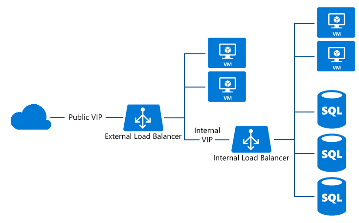

<properties
   pageTitle="設定負載平衡器 sql 永遠 |Microsoft Azure"
   description="若要使用的 SQL 永遠負載平衡器，以及如何使用 powershell 來建立 SQL 實作負載平衡器設定"
   services="load-balancer"
   documentationCenter="na"
   authors="sdwheeler"
   manager="carmonm"
   editor="tysonn" />
<tags
   ms.service="load-balancer"
   ms.devlang="na"
   ms.topic="article"
   ms.tgt_pltfrm="na"
   ms.workload="infrastructure-services"
   ms.date="10/24/2016"
   ms.author="sewhee" />

# SQL 上，永遠設定負載平衡器

ILB 您可以立即執行 SQL Server AlwaysOn 可用性群組。 可用性群組是高可用性和損毀復原的 SQL Server 旗艦解決方案。 可用群組接聽程式可讓用戶端應用程式完美連接至主要的複本，不管設定的複本數目資料。

接聽 (DNS) 名稱對應到負載平衡 IP 位址，並 Azure 的負載平衡器指示主要的伺服器的連入流量集的複本。

您可以使用 ILB 支援的 SQL Server AlwaysOn （接聽） 結束點。 您現在可以控制接聽程式的協助工具，並選擇的負載平衡 IP 位址從特定子網路虛擬網路 (VNet)。

使用 ILB 接聽程式，SQL server 端點上 (例如伺服器 = tcp:ListenerName，1433; 資料庫 = [資料庫名稱) 只能由存取︰

- 服務和 Vm 中相同的虛擬網路
- 服務和 Vm 從連線的內部部署網路
- 服務並從 [互連式 VNets Vm

圖 1-SQL AlwaysOn 設定具網際網路負載平衡器

## 新增內部負載平衡服務

1. 在下列範例中，我們將會設定虛擬網路包含名稱為 「 子網路 1' 子網路︰

        Add-AzureInternalLoadBalancer -InternalLoadBalancerName ILB_SQL_AO -SubnetName Subnet-1 -ServiceName SqlSvc

2. 新增每個 VM 上 ILB 負載平衡端點

        Get-AzureVM -ServiceName SqlSvc -Name sqlsvc1 | Add-AzureEndpoint -Name "LisEUep" -LBSetName "ILBSet1" -Protocol tcp -LocalPort 1433 -PublicPort 1433 -ProbePort 59999 -ProbeProtocol tcp -ProbeIntervalInSeconds 10 –
        DirectServerReturn $true -InternalLoadBalancerName ILB_SQL_AO | Update-AzureVM

        Get-AzureVM -ServiceName SqlSvc -Name sqlsvc2 | Add-AzureEndpoint -Name "LisEUep" -LBSetName "ILBSet1" -Protocol tcp -LocalPort 1433 -PublicPort 1433 -ProbePort 59999 -ProbeProtocol tcp -ProbeIntervalInSeconds 10 –DirectServerReturn $true -InternalLoadBalancerName ILB_SQL_AO | Update-AzureVM

    在上述範例中，您有 2 VM 稱為 「 sqlsvc1 」 和 「 sqlsvc2 」 執行在雲端服務 「 Sqlsvc 」。 建立 ILB 含有 「 DirectServerReturn 」 參數之後, 您允許設定可用性群組的接聽 SQL ILB 加入負載平衡結束點。

如需有關 SQL AlwaysOn 的詳細資訊，請參閱[Azure 中 AlwaysOn 可用性群組內部負載平衡器設定](../virtual-machines/virtual-machines-windows-portal-sql-alwayson-int-listener.md)。

## 另請參閱

[開始設定網際網路圖示的負載平衡器](load-balancer-get-started-internet-arm-ps.md)

[開始設定內部負載平衡器](load-balancer-get-started-ilb-arm-ps.md)

[設定負載平衡器分配模式](load-balancer-distribution-mode.md)

[設定您的負載平衡器的空閒 TCP 逾時設定](load-balancer-tcp-idle-timeout.md)
