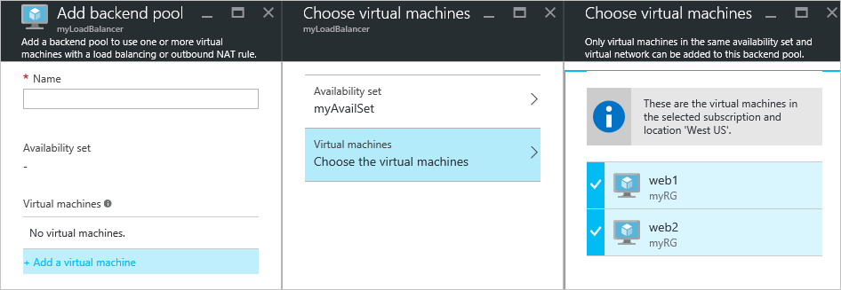
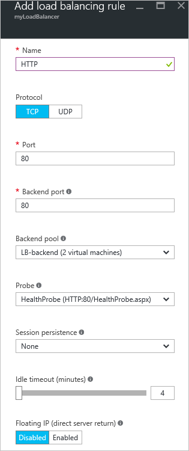
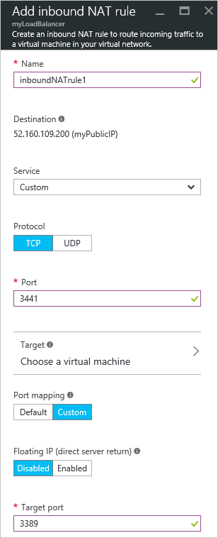

<properties
   pageTitle="資源管理員] 中使用 [Azure 入口網站建立具網際網路負載平衡器 |Microsoft Azure"
   description="瞭解如何建立具網際網路負載平衡器資源管理員] 中使用 [Azure 入口網站"
   services="load-balancer"
   documentationCenter="na"
   authors="anavinahar"
   manager="narayan"
   editor=""
   tags="azure-resource-manager"
/>
<tags
   ms.service="load-balancer"
   ms.devlang="na"
   ms.topic="hero-article"
   ms.tgt_pltfrm="na"
   ms.workload="infrastructure-services"
   ms.date="09/14/2016"
   ms.author="annahar" />

# 建立使用 Azure 入口網站具網際網路負載平衡器

[AZURE.INCLUDE [load-balancer-get-started-internet-arm-selectors-include.md](../../includes/load-balancer-get-started-internet-arm-selectors-include.md)]

[AZURE.INCLUDE [load-balancer-get-started-internet-intro-include.md](../../includes/load-balancer-get-started-internet-intro-include.md)]

[AZURE.INCLUDE [azure-arm-classic-important-include](../../includes/azure-arm-classic-important-include.md)]本文涵蓋資源管理員部署模型。 您也可以[瞭解如何建立使用傳統的部署具網際網路負載平衡器](load-balancer-get-started-internet-classic-portal.md)

[AZURE.INCLUDE [load-balancer-get-started-internet-scenario-include.md](../../includes/load-balancer-get-started-internet-scenario-include.md)]

這包含的個別工作的完成建立負載平衡器，並說明請見執行什麼達成目標的順序。

## 為何需要建立具網際網路負載平衡器？

您需要建立及設定下列部署負載平衡器物件。

- 前端 IP 設定-包含傳入網路流量的公用 IP 位址。

- 位址後端資料庫-包含從負載平衡器接收網路流量的虛擬機器網路介面 (Nic)。

- 負載平衡規則-包含對應公用的連接埠負載平衡器位址後端資料庫中的連接埠的規則。

- 連入 NAT 規則-包含對應到特定虛擬機器位址後端資料庫中的連接埠的負載平衡器公用的連接埠的規則。

- 探查-包含用來查看虛擬機器中的執行個體的後端位址集區的顯示狀態的狀況檢查]。

您可以在[Azure 資源管理員支援負載平衡器](load-balancer-arm.md)取得深入瞭解負載平衡器元素與 Azure 資源管理員。

## 設定負載平衡器 Azure 入口網站中

> [AZURE.IMPORTANT] 假設您有稱為**myVNet**虛擬網路。 請參閱執行此動作的 [[建立虛擬網路](../virtual-network/virtual-networks-create-vnet-arm-pportal.md)。 同時假設有的子網路中稱為**myVNet** **LB 子網路是**而稱為**web1**和**web2**分別中相同的可用性組的兩個 Vm 稱為**myAvailSet** **myVNet**中。 請參閱建立 Vm[這個連結](../virtual-machines/virtual-machines-windows-hero-tutorial.md)。

1. 從瀏覽器瀏覽至 Azure 入口網站︰ [http://portal.azure.com](http://portal.azure.com)和您 Azure 帳戶登入。

2. 選取在畫面的頂端的左邊的 [**新增** > **網路** > **負載平衡器。**

3. 在**建立負載平衡器**刀中，輸入您的負載平衡器的名稱。 以下稱為**myLoadBalancer**。

4. 在 [**類型**] 底下，選取 [**公用**]。

5. 在**公用 IP 位址**] 底下建立新的公用 IP 稱為**myPublicIP**。

6. 在 [資源] 群組中，選取 [ **myRG**]。 然後選取適當的**位置**，然後再按一下**[確定]**。 負載平衡器會啟動 [部署，並將需要幾分鐘順利完成部署。

![更新負載平衡器的 [資源] 群組](./media/load-balancer-get-started-internet-portal/1-load-balancer.png)

## 建立位址後端資料庫

1. 當您負載平衡器已成功部署時，請選取它從中您的資源。 選取 [設定] 底下的後端資料庫。 輸入您的後端資料庫的名稱。 然後按一下 [**新增**] 按鈕，頂端的 [顯示刀。

2. 按一下 [**加入虛擬機器**中**新增後端資料庫**刀。  選取 [**可用性集合**下的 [**選擇 [可用性設定**，然後選取**myAvailSet**。 接下來，請選取 [虛擬機器中的一節刀底下的 [**選擇虛擬機器**，然後按一下**web1**和**web2**，兩個 Vm 建立負載平衡。 確定兩者都有藍色左邊的核取記號下, 圖所示。 然後中,，按一下**選取接著**選擇虛擬機器**刀的 [確定] 和**[確定]**中**新增後端資料庫**刀該刀**。

    

3. 請確定您的通知的下拉式清單中的核取有更新關於儲存負載平衡器後端資料庫，除了更新 Vm **web1**和**web2**的網路介面。

## 建立檢查、 LB 規則，以及 NAT 規則

1. 建立狀況檢查。

    設定您的負載平衡器] 底下選取探查。 然後按一下 [**新增**位於刀頂端。

    有兩種方式來設定檢查︰ HTTP 或 TCP。 此範例顯示 HTTP]，但 TCP 可以設定以類似的方式。
    更新所需的資訊。 如上所述， **myLoadBalancer**會載入連接埠 80 平衡流量。 選取的路徑 HealthProbe.aspx、 間隔是 15 秒數，而不佳的閥值是 2。 完成之後，按一下**[確定**] 以建立探查。

    將指標停留 「 i 」 圖示，若要進一步瞭解這些個別的設定，以及如何變更其滿足您的需求。

    

2. 建立負載平衡器規則。

    按一下負載平衡您負載平衡器的 [設定] 區段中的規則。 在新刀中，按一下**新增**。 命名您的規則。 在這裡，則 HTTP。 選擇 frontend 連接埠與後端連接埠。 在這裡，80 選擇兩者。 選擇您的後端資料庫，並為探查先前建立的**HealthProbe** **LB 後端**。 根據您的需求，可以設定其他設定。 然後按一下 [確定] 儲存負載平衡規則。

    

3. 建立連入的 NAT 規則

    按一下您的負載平衡器的 [設定] 區段底下的連入 NAT 規則。 在新刀中，按一下 [**新增**。 然後命名您輸入的 NAT 規則。 以下稱為**inboundNATrule1**。 目的地應該先前建立的公用 IP。 選取 [自訂] 底下服務，然後選取您想要使用的通訊協定。 以下被選取 TCP。 輸入的連接埠 3441 和目標連接埠時，在此情況下，3389。 然後按一下 [確定] 儲存此規則。

    一旦建立第一個規則，請從連接埠 3442 呼叫目標連接埠 3389 inboundNATrule2 的第二個輸入 NAT 規則重複此步驟。

    

## 移除負載平衡器

若要刪除負載平衡器，請選取您想要移除的負載平衡器。 在*負載平衡器*刀中，按一下**刪除**位於刀頂端。 然後選取 [ **]**出現提示時。

## 後續步驟

[開始設定內部負載平衡器](load-balancer-get-started-ilb-arm-cli.md)

[設定負載平衡器分配模式](load-balancer-distribution-mode.md)

[設定您的負載平衡器閒置 TCP 逾時設定](load-balancer-tcp-idle-timeout.md)
