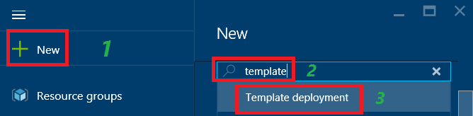

<properties
    pageTitle="部署具網際網路負載平衡方案的 IPv6 使用範本 |Microsoft Azure"
    description="如何部署 Azure 負載平衡器和負載平衡 Vm 的 IPv6 支援。"
    services="load-balancer"
    documentationCenter="na"
    authors="sdwheeler"
    manager="carmonm"
    editor=""
    tags="azure-resource-manager"
    keywords="ipv6 azure 負載平衡器、 雙堆疊、 公用 ip、 原生 ipv6、 行動電話、 iot"
/>
<tags
    ms.service="load-balancer"
    ms.devlang="na"
    ms.topic="article"
    ms.tgt_pltfrm="na"
    ms.workload="infrastructure-services"
    ms.date="09/14/2016"
    ms.author="sewhee"
/>

# 部署具網際網路負載平衡器方案的 IPv6 使用範本

> [AZURE.SELECTOR]
- [PowerShell](./load-balancer-ipv6-internet-ps.md)
- [Azure CLI](./load-balancer-ipv6-internet-cli.md)
- [範本](./load-balancer-ipv6-internet-template.md)

Azure 負載平衡器是層級 4 （TCP、 UDP） 負載平衡器。 負載平衡器提供高可用性來發送連入流量的各項在雲端服務的健康服務執行個體或虛擬機器中負載平衡器設定。 Azure 負載平衡器也可以顯示多個連接埠、 多個 IP 位址，或兩者皆這些服務。

## 部署案例

下圖說明負載平衡解決方案部署使用本文所述的範例範本。

在這個案例中，您會建立下列 Azure 資源︰

- 每個 VM IPv4 和 IPv6 位址指派虛擬網路介面
- 具網際網路負載平衡器 IPv4 與 IPv6 公用 IP 位址
- 兩個負載平衡規則，將公用 Vip 對應到私人的端點
- 包含兩個 Vm 可用性設定
- 兩個虛擬機器 (Vm)

## 部署使用 Azure 入口網站範本

本文參照刊登在[Azure 快速入門](https://azure.microsoft.com/documentation/templates/201-load-balancer-ipv6-create/)範本庫中的範本。 您可以從庫下載範本，或啟動 Azure 直接從圖庫中的部署。 本文假設您有下載範本至您的本機電腦。

1. 開啟 [Azure 入口網站以具有權限可建立 Vm 和 Azure 訂閱中的網路資源的帳戶登入。 此外，除非您使用現有的資源的帳戶必須建立資源群組和儲存帳戶的權限。

2. 按一下 [+ 新增] 的功能表，然後輸入 「 範本 」 的搜尋方塊中。 從搜尋結果中選取 「 範本部署 」。

    

3. 在所有項目刀，按一下 [」 範本部署]。

    

4. 按一下 [建立]。

    

5. 按一下 [編輯樣板]。 刪除現有的內容並複製/貼上整個內容中的範本檔案 （若要包含的開始和結束 {}）]，然後按一下 [儲存]。

    > [AZURE.NOTE] 如果您使用的 Microsoft Internet Explorer 中，當您貼上您會收到要求您允許存取到 Windows 剪貼簿] 對話方塊。 按一下 [允許存取]。

    

6. 按一下 [編輯參數 」。 在參數刀中，在 [範本參數] 區段中，指定每本指南中的值，然後按一下 [儲存] 以關閉參數刀]。 在自訂部署刀中，選取您的訂閱，與現有的資源群組或建立一個。 如果您正在建立資源群組，然後選取 [資源] 群組的位置。 接下來，按一下**法律條款**]，然後按一下 [法律規定的 [**購買**。 Azure 開始部署資源。 需要幾分鐘部署的所有資源的時間。

    

    如需有關這些參數的詳細資訊，請參閱本文稍後的 [[範本參數和變數](#template-parameters-and-variables)] 區段。

7. 若要查看的範本所建立的資源，請按一下 [瀏覽，清單中向下捲動，直到您看到 「 資源群組 」，然後按一下它。

    

8. 按一下 [資源群組刀中，您在步驟 6 中指定的 [資源] 群組的名稱。 您會看到已部署的所有資源的清單。 如果一切順利，它應該 「 成功 」 在 「 上次部署]。 如果不確定您使用的帳戶有權限可建立所需的資源。

    

    > [AZURE.NOTE] 如果完成步驟 6 之後，立即瀏覽 [資源群組]，「 上次部署 」 會顯示 「 部署 」 的狀態時所要部署資源。

9. 按一下 [「 myIPv6PublicIP 」 清單中的 [資源]。 您會看到它有 IPv6 位址 IP 位址] 下的，其 DNS 名稱是您在步驟 6 中 dnsNameforIPv6LbIP 參數指定的值。 這項資源是網際網路用戶端可以存取的公用 IPv6 位址和主機名稱。

    

## 驗證連線

當已成功部署範本時，您可以驗證連線完成下列工作︰

1. 登入 Azure 入口網站，並連線到每一個建立的範本部署 Vm。 如果您部署執行 ipconfig Windows Server VM/所有的命令提示字元。 您會看到 Vm 有 IPv4 和 IPv6 位址。 如果您部署 Linux Vm，必須先設定 Linux OS 接收動態的 IPv6 位址使用您 Linux 分配所提供的指示。
2. 從 IPv6 網際網路連線的用戶端，啟動公用 IPv6 位址負載平衡器的連線。 若要確認負載平衡器平衡兩個 Vm 之間，您可能會在每一 Vm 安裝網頁伺服器等 Microsoft 網際網路資訊服務 (IIS)。 預設網頁上的每個伺服器可能會包含 「 Server0 」 或 「 Server1 」 唯一識別它的文字。 然後，開啟網際網路瀏覽器 IPv6 網際網路連線的用戶端上，並瀏覽至主機名稱您指定給 dnsNameforIPv6LbIP 參數負載平衡器，以確認每個 vm 的端對端 IPv6 連線。 如果您只會看到從只有一個伺服器網頁，您可能需要清除瀏覽器快取。 開啟多個私人瀏覽工作階段。 您應該會看到每個伺服器的回應。
3. 從 IPv4 網際網路連線的用戶端，啟動公用 IPv4 位址負載平衡器的連線。 若要確認負載平衡器負載平衡兩個 Vm，您可以測試為詳細步驟 2 中使用 IIS。
4. 從每個 VM，啟動輸出連線至 IPv6 或 IPv4 連線網際網路的裝置。 在這兩種情況下，公用 IPv4 或 IPv6 位址負載平衡器是來源 IP 看到目的裝置。

>[AZURE.NOTE]
Azure 網路封鎖 ICMP IPv4 和 IPv6。 如此一來，ICMP 工具等偵測 （ping） 一律會失敗。 若要測試連線，請使用 TCP 替代方案，例如 TCPing 或 PowerShell 測試 NetConnection 指令程式。 請注意，在圖表中顯示的 IP 位址的值，您可能會看到範例。 因為的 IPv6 位址都以動態方式指派，您會收到的地址會因為不同，並依地區而有所不同。 此外，也是常見的公用 IPv6 位址，啟動與不同的前置詞與後端資料庫中的私人 IPv6 位址負載平衡器上。

## 範本參數和變數

Azure 資源管理員範本包含多個變數和參數，您可以自訂您的需求。 變數用固定不想讓使用者變更的值。 參數使用您想要的使用者提供部署範本時的值。 範例範本設定為在本文中所描述的案例。 您可以自訂這個環境的需求。

本文所用的範例範本包含下列的變數和參數︰

| 參數 / 變數 | 備忘稿 |
|-----------|-------|
| adminUsername | 指定用來登入的虛擬機器的管理員帳戶的名稱。 |
| adminPassword | 指定用來登入的虛擬機器的管理員帳戶的密碼。 |
| dnsNameforIPv4LbIP | 指定您想要指派為公用負載平衡器名稱的 DNS 主機名稱。 這個名稱會解析成負載平衡器公用 IPv4 位址。 名稱必須是小寫，並使其符合 regex: ^ [a-z][a-z0-9-]{1,61}[a-z0-9]$。 |
| dnsNameforIPv6LbIP | 指定您想要指派為公用負載平衡器名稱的 DNS 主機名稱。 這個名稱會解析成負載平衡器公用 IPv6 位址。 名稱必須是小寫，並使其符合 regex: ^ [a-z][a-z0-9-]{1,61}[a-z0-9]$。 這可能是 IPv4 位址相同的名稱。 當用戶端傳送此名稱的 DNS 查詢會傳回 Azure A 和 AAAA 會記錄時共用名稱。 |
| vmNamePrefix | 指定 VM 名稱前置字元。 範本會將數字 (0、 1] 等) 建立 Vm 時的名稱。 |
| nicNamePrefix | 指定網路介面名稱前置字元。 範本會將數字 (0、 1] 等) 的名稱時所建立之網路介面。 |
| storageAccountName | 輸入現有儲存體帳戶名稱，或指定一個新的範本所建立的名稱。 |
| availabilitySetName | 然後輸入名稱來搭配 Vm 設定的可用性 |
| addressPrefix | 地址前置詞，用於定義虛擬網路的位址範圍 |
| subnetName | 在 [子網路的名稱建立 VNet |
| subnetPrefix | 若要定義子網路的地址範圍使用的地址前置詞 |
| vnetName | 指定使用 Vm VNet 的名稱。 |
| ipv4PrivateIPAddressType | 用於 [私用的 IP 位址 （靜態或動態） 的配置方法 |
| ipv6PrivateIPAddressType | 配置用的方法為私人的 IP 位址 （動態）。 IPv6 只支援動態配置。 |
| numberOfInstances | 部署範本的負載平衡執行個體數目 |
| ipv4PublicIPAddressName | 指定您想要使用與負載平衡器公用 IPv4 位址通訊 DNS 名稱。 |
| ipv4PublicIPAddressType | 使用的公用 IP 位址 （靜態或動態） 的配置方法 |
| Ipv6PublicIPAddressName | 指定您想要使用與負載平衡器公用 IPv6 位址通訊 DNS 名稱。 |
| ipv6PublicIPAddressType | 配置用的方法的公用 IP 位址 （動態）。 IPv6 只支援動態配置。 |
| lbName | 指定負載平衡器的名稱。 此名稱會顯示在入口網站，或使用時使用 CLI 或 PowerShell 命令，其參照。 |

範本中的剩餘變數包含衍生的 Azure 建立資源分派的值。 不會變更這些變數。
