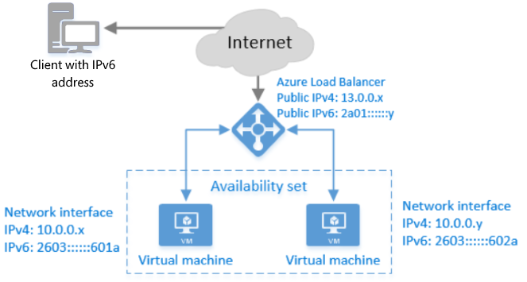

<properties
    pageTitle="Azure 負載平衡器的 IPv6 概觀 |Microsoft Azure"
    description="了解 Azure 負載平衡器和負載平衡 Vm 的 IPv6 支援。"
    services="load-balancer"
    documentationCenter="na"
    authors="sdwheeler"
    manager="carmonm"
    editor=""
    keywords="ipv6 azure 負載平衡器、 雙堆疊、 公用 ip、 原生 ipv6、 行動電話、 iot"
/>
<tags
    ms.service="load-balancer"
    ms.devlang="na"
    ms.topic="article"
    ms.tgt_pltfrm="na"
    ms.workload="infrastructure-services"
    ms.date="09/14/2016"
    ms.author="sewhee"
/>

# Azure 負載平衡器的 IPv6 的概觀

具網際網路負載平衡器可以部署 IPv6 地址。 除了 IPv4 連線，這會啟用下列功能︰

* 原生端對端 IPv6 連線公用網際網路用戶端和 Azure 虛擬機器 (Vm) 之間透過負載平衡器。
* 原生端對端 IPv6 輸出連線 Vm 與公用網際網路 IPv6 功能的用戶端之間。

下圖說明 IPv6 功能的 Azure 負載平衡器。

部署，IPv4 或 IPv6 啟用網際網路用戶端可以 Azure 網際網路的負載平衡器通訊與公用 IPv4 或 IPv6 位址 （或主機名稱）。 負載平衡器路由 IPv6 封包為私人的 IPv6 位址的 Vm 使用網路位址轉譯 (NAT)。 IPv6 網際網路用戶端無法進行通訊，直接與 Vm 的 IPv6 位址。

## 功能

原生 Vm 部署透過 Azure 資源管理員的 IPv6 支援提供︰

1. 適用於在網際網路上的 IPv6 用戶端負載平衡 IPv6 服務
2. 原生 IPv6 和 IPv4 Vm （「 雙堆疊直條圖]） 上的端點
3. 輸入與輸出啟動原生的 IPv6 連線
4. 支援的通訊協定，例如 TCP、 UDP 及 HTTP (S) 可讓全方位的服務架構提供

## 優點

此功能會啟用下列主要好處︰

* 符合政府法規要求新的應用程式可存取 IPv6 專用的用戶端
* 啟用行動和網際網路的項目 (IOT) 開發人員使用雙堆疊 (IPv4 + IPv6) Azure 虛擬機器成長的行動電話與 IOT 市場地址

## 詳細資料和限制

詳細資料

* Azure 在 DNS 服務包含 IPV4 和 IPv6 AAAA 名稱記錄及回應的負載平衡器兩筆記錄。 用戶端選擇哪個地址 （IPv4 或 IPv6） 與通訊。
* 當 VM 初始公用網際網路 IPv6 連線裝置的連線時，VM 的來源 IPv6 位址是網路位址翻譯 (NAT) 為公用 IPv6 位址負載平衡器。
* 執行 Linux 作業系統 Vm 必須設定為收到透過 DHCP IPv6 IP 位址。 Linux 圖像 Azure 圖庫中的許多已設定為支援 IPv6 不需要修改。 如需詳細資訊，請參閱[設定 DHCPv6 的 Linux Vm](load-balancer-ipv6-for-linux.md)
* 如果您選擇使用您的負載平衡器的狀況檢查，請建立 IPv4 探查，並使用該 IPv4 和 IPv6 結束點。 如果您 VM 上的服務會當機，IPv4 和 IPv6 結束點會採用登出旋轉。

限制

* 您無法新增 IPv6 負載平衡規則 Azure 入口網站中。 僅會透過 CLI、 PowerShell 的範本建立規則。
* 您可能會升級現有的 Vm 使用 IPv6 位址。 您必須部署新 Vm。
* 為單一網路介面中每個 VM 可以指定單一的 IPv6 位址。
* 無法為 VM 指定公用 IPv6 位址。 他們可以只指派給負載平衡器。
* 您無法設定反向 DNS 查閱公用 IPv6 地址。
* 使用 IPv6 位址 Vm 無法 Azure 雲端服務的成員。 他們可以連接至 Azure 虛擬網路 (VNet)，並在其 IPv4 位址彼此。
* 私人 IPv6 位址可在 [資源] 群組中的個別 Vm 部署，但無法透過縮放比例設定為資源群組部署。
* Azure Vm 無法透過其他 Vm、 其他 Azure 服務，或內部部署裝置的 IPv6 連線。 他們只可與 Azure 負載平衡器通訊，透過 IPv6。 不過，他們可以通訊與使用 IPv4 這些其他資源。
* 雙重堆疊 (IPv4 + IPv6) 部署支援 ipv4 網路安全性群組 (NSG) 保護。 NSGs 不適用於 IPv6 結束點。
* VM 的 IPv6 端點是不會直接存取網際網路。 這是前負載平衡器。 負載平衡器規則中指定的連接埠就可以存取透過 IPv6。
* 變更時間參數 ipv6 是**目前不支援**。 預設值為 4 個分鐘。

## 後續步驟

瞭解如何部署 IPv6 的負載平衡器。

* [依地區 IPv6 的可用性](https://go.microsoft.com/fwlink/?linkid=828357)
* [部署負載平衡器 IPv6 使用範本](load-balancer-ipv6-internet-template.md)
* [部署使用 PowerShell 的 Azure 使用 IPv6 負載平衡器](load-balancer-ipv6-internet-ps.md)
* [部署使用 Azure CLI 使用 IPv6 負載平衡器](load-balancer-ipv6-internet-cli.md)
