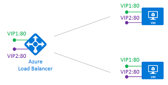

<properties
   pageTitle="Azure 的多個 Vip 負載平衡器 |Microsoft Azure"
   description="Azure 負載平衡器上的多個 Vip 的概觀"
   services="load-balancer"
   documentationCenter="na"
   authors="chkuhtz"
   manager="narayan"
   editor=""
/>
<tags
   ms.service="load-balancer"
   ms.devlang="na"
   ms.topic="article"
   ms.tgt_pltfrm="na"
   ms.workload="infrastructure-services"
   ms.date="08/11/2016"
   ms.author="chkuhtz"
/>

# Azure 的多個 Vip 負載平衡器

Azure 負載平衡器可讓您負載平衡服務上多個連接埠、 多個 IP 位址，或兩者。 您可以使用內部及公用的負載平衡器定義一組 Vm 載入平衡流。

本文將說明這項功能、 重要概念，以及限制式的基本概念。 如果您只想要公開上一個 IP 位址的服務，您可以找到簡化的指示[公用](load-balancer-get-started-internet-portal.md)或[內部](load-balancer-get-started-ilb-arm-portal.md)負載平衡器設定。 新增多個 Vip 是累加到單一 VIP 設定。 您可以使用本文中的概念，展開隨時簡化的設定。

當您定義 Azure 負載平衡器時，frontend 與後端設定均已連線的規則。 規則所參照的狀況探查用來決定如何新的流量會傳送到後端資料庫中的節點。 Frontend 定義的虛擬 IP (VIP)，也就是 3-tuple IP 位址 （公用或內部）、 傳輸通訊協定 （UDP 或 TCP） 和連接埠號碼。 DIP 是附加到後端資料庫中 VM Azure 虛擬 NIC 的 IP 位址。

下表包含一些範例 frontend 設定︰

| VIP | IP 位址 | 通訊協定 | 連接埠 |
|-----|------------|----------|------|
|1|65.52.0.1|TCP|80|
|2|65.52.0.1|TCP|_8080_|
|3|65.52.0.1|_UDP_|80|
|4|_65.52.0.2_|TCP|80|

下表顯示四個不同的 frontends。 Frontends #1，2 和 3 是單一 VIP 具有多個規則。 使用相同的 IP 位址，但連接埠或通訊協定的每個 frontend 不同。 Frontends #1 和 #4 為多個 Vip，跨多個 Vip 位置重複使用的相同 frontend 通訊協定和連接埠的範例。

Azure 負載平衡器 」 讓您在定義負載平衡規則。 規則宣告方式的地址和主選單上的連接埠] 已對應至目的地位址和連接埠後端上。 後端連接埠重複使用的規則，則規則的類型而定。 每個類型的規則有可能會影響主機設定及探查設計的特定需求。 有兩種規則類型︰

1. 預設的規則與沒有後端連接埠重複使用
2. 浮動 IP 規則會在重複使用後端連接埠

Azure 負載平衡器可讓您混合相同的負載平衡器設定這兩種規則類型。 負載平衡器可以使用這些同時指定的 VM，或任何組合，只要您遵守規則的條件約束。 您選擇的規則類型而定的應用程式的需求及複雜的支援的設定。 您應該評估的規則類型是最適合您的狀況。

我們會探索進一步這些案例︰ 開始使用的預設行為。

## 規則類型 #1︰ 沒有後端連接埠重複使用

在此案例中，frontend Vip 設定，如下所示︰

| VIP | IP 位址 | 通訊協定 | 連接埠 |
|-----|------------|----------|------|
| 1|65.52.0.1|TCP|80|
| 2|*65.52.0.2*|TCP|80|

DIP 是連入流量的目的地。 在後端資料庫中，每個 VM 公開上 DIP 唯一的連接埠的所需的服務。 這項服務是透過規則定義 frontend 與相關聯。

我們定義兩個規則︰

| 規則 | 對應 frontend | 若要後端資料庫 |
|------|--------------|-----------------|
| 1 |  VIP1:80 |  DIP1:80，  DIP2:80 |
| 2 |  VIP2:80 |  DIP1:81，  DIP2:81 |

完整的對應中 Azure 負載平衡器現，如下所示︰

| 規則 | VIP IP 位址 | 通訊協定 | 連接埠 | 目的地 | 連接埠 |
|------|----------------|----------|------|-----|------|
| 1|65.52.0.1|TCP|80|DIP IP 位址|80|
| 2|65.52.0.2|TCP|80|DIP IP 位址|81|

每個規則必須產生唯一的目的地 IP 位址和目的地連接埠組合的流程。 不同的目的地連接埠流程，多個規則就可以將流傳送至相同的 DIP 上不同的連接埠。

狀況探查永遠傳送給的 VM DIP。 您必須確定您將探查反映 VM 的狀況。

## 規則類型 #2︰ 使用浮動 IP 後端連接埠重複使用

Azure 負載平衡器提供彈性，若要在多個 Vip 無論使用的規則類型間重複使用的主選單連接埠。 此外，某些應用程式的情況下想要或需要在單一 VM 後端資料庫中的多個應用程式執行個體所使用相同的連接埠。 連接埠重複使用的常見範例包括叢集高可用性、 網路虛擬應用裝置和公開多個 TLS 端點，而不重新加密。

如果您想要重複使用的後端連接埠，跨多個規則，您必須先啟用浮動 IP 規則定義中。

浮動 IP 是什麼即為直接伺服器傳回 (DSR) 的一部分。 DSR 包含兩個部分︰ 流程拓撲以及 IP 位址對應配置。 在平台層級 Azure 負載平衡器永遠運作的 DSR 流程拓撲，不論是否浮動 IP 是否已啟用。 這表示外寄流量的部分一定正確重寫回到原點直接傳送。

使用預設的規則類型 Azure 公開傳統負載平衡以便於使用的 IP 位址對應配置。 啟用浮動 IP 變更允許的更多的彈性，如下所述的 IP 位址對應配置。

下圖說明這項設定︰

此案例中，每個 VM 後端資料庫中的有三個網路介面︰

* DIP: 虛擬 NIC VM （Azure 的 NIC 資源） 相關聯
* VIP1: 迴路內的介面來賓 OS VIP1 的 IP 位址的設定
* VIP2: 迴路內的介面來賓 OS VIP2 的 IP 位址的設定

>[AZURE.IMPORTANT] 來賓 OS 中執行的邏輯介面設定。 此設定不會執行，或由 Azure 管理。 沒有此組態中，將無法運作的規則。 狀況探查定義使用 VM，而不是邏輯 VIP DIP。 因此，您的服務必須提供探查回應思考邏輯 VIP 提供服務的狀態 DIP 連接埠。

假設相同的 frontend 設定，如前一個案例中所示︰

| VIP | IP 位址 | 通訊協定 | 連接埠 |
|-----|------------|----------|------|
| 1|65.52.0.1|TCP|80|
| 2|*65.52.0.2*|TCP|80|

我們定義兩個規則︰

| 規則 | 對應 frontend | 若要後端資料庫 |
|------|--------------|-----------------|
| 1 |  VIP1:80 |  VIP1:80 （在 VM1 和 VM2） |
| 2 |  VIP2:80 |  VIP2:80 （在 VM1 和 VM2） |

下表顯示完整的對應中負載平衡器︰

| 規則 | VIP IP 位址 | 通訊協定 | 連接埠 | 目的地 | 連接埠 |
|------|----------------|----------|------|-------------|------|
| 1|65.52.0.1|TCP|80|相同 VIP (65.52.0.1)|相同 VIP (80)|
| 2|65.52.0.2|TCP|80|相同 VIP (65.52.0.2)|相同 VIP (80)|

輸入流量的目的地是在 VM 迴路介面上的 VIP 位址。 每個規則必須產生唯一的目的地 IP 位址和目的地連接埠組合的流程。 以不同的目的地 IP 位址流程，連接埠重複使用可在相同的 VM。 您的服務公開的負載平衡器繫結至 VIP 的 IP 位址和連接埠分別迴路介面。

請注意此範例中不會變更的目的地連接埠。 雖然這是浮動 IP 案例，Azure 負載平衡器也支援定義規則重寫的後端目的地連接埠和，使其不同的主選單目的地連接埠。

浮動 IP 規則類型是幾個負載平衡器設定模式的基礎。 目前提供的其中一個範例是[使用多個接聽程式的 SQL AlwaysOn](../virtual-machines/virtual-machines-windows-portal-sql-ps-alwayson-int-listener.md)的設定。 一段時間，我們將文件的多個這些案例。

## 限制

* IaaS Vm 只支援多個 VIP 設定。
* 浮動 IP 規則，與您的應用程式必須使用 DIP 的輸出。 如果您的應用程式繫結至迴路介面來賓 OS 上所設定的 VIP 位址，然後 SNAT 和不提供重寫外寄流量流程會失敗。
* 公用 IP 位址對帳單上的影響。 如需詳細資訊，請參閱[IP 位址的價格](https://azure.microsoft.com/pricing/details/ip-addresses/)
* 訂閱限制適用於。 如需詳細資訊，請參閱[服務限制](../azure-subscription-service-limits.md#networking-limits)的詳細資料。
