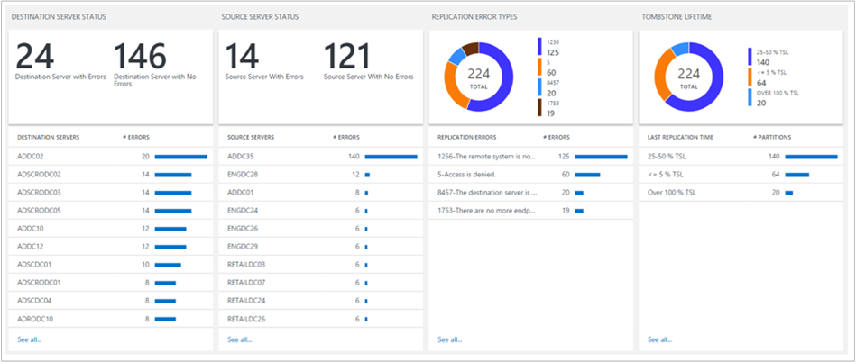

<properties
    pageTitle="在記錄檔分析中使用中的目錄複寫狀態方案 |Microsoft Azure"
    description="Active Directory 複寫狀態解決方案套件定期監視 Active Directory 環境的任何複寫失敗，並 OMS 儀表板上的報表結果。"
    services="log-analytics"
    documentationCenter=""
    authors="bandersmsft"
    manager="jwhit"
    editor=""/>

<tags
    ms.service="log-analytics"
    ms.workload="na"
    ms.tgt_pltfrm="na"
    ms.devlang="na"
    ms.topic="article"
    ms.date="10/10/2016"
    ms.author="banders"/>

# 在記錄檔分析中使用中的目錄複寫狀態方案

Active Directory 是企業 IT 環境的主要元件。 若要確保高可用性和高效能，每個網域控制站會有自己的 Active Directory 資料庫的複本。 網域控制站彼此才能變更傳播企業。 此複寫程序中的錯誤導致企業的各種不同的問題。

AD 複寫狀態解決方案套件定期監視 Active Directory 環境的任何複寫失敗，並 OMS 儀表板上的報表結果。

## 安裝及設定解決方案
安裝和設定方案，請使用下列資訊。

- 在網域控制站的成員的網域會評估，或設為 AD 複寫資料傳送至 OMS 的成員伺服器上必須安裝代理程式。 若要瞭解如何在 Windows 電腦連線到 OMS，請參閱[連線的 Windows 電腦記錄分析](log-analytics-windows-agents.md)。 如果您的網域控制站已經是您想要連線至 OMS 的現有系統管理中心 Operations Manager 環境的一部分，請參閱[連線至記錄分析的 Operations Manager](log-analytics-om-agents.md)。
- 新增到使用中[新增記錄分析解決方案從方案庫](log-analytics-add-solutions.md)所述的程序 OMS 工作區的 Active Directory 複寫狀態解決方案。  有不需要進行其他設定。

## AD 複寫狀態集合 [詳細資料

下表顯示資料集合方法和其他詳細資料的 AD 複寫狀態會收集的資料。

| 平台 | 直接代理程式 | 是 SCOM 代理程式 | Azure 儲存體 | 必要時，是 SCOM 嗎？ | 透過管理群組傳送是 SCOM 代理程式的資料 | 集合頻率 |
|---|---|---|---|---|---|---|
|Windows|![[是]](./media/log-analytics-ad-replication-status/oms-bullet-green.png)|![[是]](./media/log-analytics-ad-replication-status/oms-bullet-green.png)|||![[是]](./media/log-analytics-ad-replication-status/oms-bullet-green.png)| 每個 5 天|

## 您也可以啟用非網域控制站 AD 資料傳送至 OMS
如果您不希望任何網域控制站直接連接到 OMS，您可以使用您網域中的任何其他 OMS 連線的電腦收集 AD 複寫狀態解決方案套件的資料，並將其傳送資料。

### 若要啟用非網域控制站 AD 資料傳送至 OMS
1.  確認電腦的網域，您想要監視使用 AD 複寫狀態解決方案的成員。
2.  [連線至 OMS 的 Windows 電腦](log-analytics-windows-agents.md)或[連線並使用您現有的 Operations Manager 環境 OMS](log-analytics-om-agents.md)，如果未連線。
3.  在該電腦上設定下列登錄機碼︰
    - 索引鍵︰ **HKEY_LOCAL_MACHINE\SYSTEM\CurrentControlSet\Services\HealthService\Parameters\Management 群組\<ManagementGroupName > \Solutions\ADReplication**
    - 值︰ **IsTarge**
    - 數值資料︰ **，則為 true**

    >[AZURE.NOTE]這些變更會不生效直到您重新啟動 Microsoft 監控代理程式服務 (HealthService.exe)。

## 了解複寫錯誤
傳送至 OMS AD 複寫狀態資料之後，您會看到類似以下的磚，表示目前有多少複寫錯誤 OMS 儀表板上。  
![AD 複寫狀態] 磚](./media/log-analytics-ad-replication-status/oms-ad-replication-tile.png)

**要徑複寫錯誤**是指在或上方的[標記存留時間](https://technet.microsoft.com/library/cc784932%28v=ws.10%29.aspx)為 Active Directory 樹系 75%。

當您按一下磚時，您會看到錯誤的相關詳細資訊。

### 目的地伺服器和來源伺服器的狀態
這些刀顯示的目的伺服器發生複寫錯誤的來源伺服器的狀態。 每個網域控制站名稱後面的數字會指出在該網域控制站的數目。

會顯示目的地伺服器與來源伺服器的錯誤，因為某些問題是從目的地伺服器的觀點來疑難排解從來源伺服器的觀點來看，與其他人更容易。

在此範例中，您可以看到的許多目的地伺服器大致數相同的錯誤，但有一個的來源伺服器 (ADDC35) 有許多比所有其他的多個錯誤。 很可能導致失敗其複寫的合作夥伴，才能傳送資料的 ADDC35 上有一些問題。 在 ADDC35 修正問題可能會解決許多會出現在目的地伺服器刀錯誤。

### 複寫錯誤類型
此刀可讓您的錯誤偵測到您的企業類型的相關資訊。 每個錯誤都有唯一的數字代碼與可協助您判斷根本原因的錯誤訊息。

按一下頂端的甜甜圈可讓您了解更多會出現的錯誤和較少您的環境中。

這可以顯示多個網域控制站時遇到相同的複寫錯誤。 在此情況下，您可能可以探索識別某個網域控制站，方案，然後重複相同的錯誤會受到其他網域控制站。

### 標記存留時間
標記存留時間會決定多久已刪除的物件，稱為標記，會保留在 Active Directory 資料庫中。 當已刪除的物件傳標記存留時間時，記憶體回收處理自動將其從資料庫中移除 Active Directory。

預設標記生命週期 180 天最新版本的 Windows，但是較舊的版本，60 天，而該 Active Directory 系統管理員可以明確地變更。

很重要事項如果您無法複製錯誤即將，或逾期標記存留時間。 如果兩個網域控制站體驗複寫錯誤保存過去的標記存留時間，複寫會停用之間的兩個網域控制站，即使基礎複寫錯誤修正。

標記存留時間刀可協助您識別哪裡將可能發生的位置。 在每個錯誤**超過 100 %tsl**類別代表尚未複寫其來源與目的地伺服器之間至少樹系標記生命週期的磁碟分割。

在此情況下，只要修正複寫錯誤不會夠。 至少必須手動檢查以找出並清除之前的延遲物件可以重新啟動複寫。 您可能也需要解除委任網域控制站。

除了識別保存過去的標記生命週期的任何複寫錯誤，您也要注意落入**50 75 %tsl**或**75 100 %tsl**類別任何錯誤。

這些是明確延遲、 不暫時性，因此可能需要解決您互動的錯誤。 是，他們尚未到達標記生命週期。 如果您應盡速修正這些問題並*之前*達到標記生命週期複寫可以重新啟動的最小的手動操作。

如先前所述，AD 複寫狀態解決方案的儀表板磚顯示的*要徑*複寫錯誤您環境中，定義為錯誤的超過 75%的標記存留時間 （包括超過 100%的 TSL 錯誤）。 盡量，將這個數字 0。

>[AZURE.NOTE] 全部標記為單位的週期百分比計算根據實際標記存留時間為 Active Directory 樹系，因此您可以信任這些百分比是正確的即使您已經設定自訂標記存留時間值。

### AD 複寫狀態的詳細資料
當您按一下其中一個清單中的任何項目時，您會看到有關使用搜尋記錄其他詳細資料。 結果會篩選以僅顯示錯誤相關的項目。 例如，如果您按一下**目的地伺服器狀態 (ADDC02)**下所列的第一個網域控制站，您會看到篩選搜尋結果的目的伺服器的方式列出該網域控制站顯示錯誤︰

從這裡開始，您可以進一步篩選，修改搜尋查詢，依此類推。 如需有關如何使用記錄搜尋的詳細資訊，請參閱[記錄搜尋](log-analytics-log-searches.md)。

[ **HelpLink** ] 欄位會顯示 TechNet 的其他相關的特定的錯誤詳細資料頁面的 URL。 您可以複製並貼上此的連結到您在瀏覽器視窗中查看疑難排解並修正錯誤的相關資訊。

您也可以按一下 [匯出結果至 Excel 的 [**匯出**。 這個選項可讓您以視覺化方式呈現複寫錯誤資料中任何您想要的方式。

## AD 複寫狀態的常見問題集
**問︰ 如何通常是 AD 複寫狀態資料更新？**
答︰ 資訊會更新每個 5 天。

**問︰ 有設定此資料更新的頻率的方式嗎？**
答︰ 不行。

**問︰ 我需要將所有我的網域新增至我 OMS 工作區中，才能查看複寫狀態？**
A︰ 否，您必須新增只有一個網域控制站。 如果您有多個網域控制站 OMS 工作區中時，所有這些資料會傳送至 OMS。

**問︰ 我不想要將任何網域新增至我的 OMS 工作區。仍然可以使用 AD 複寫狀態解決方案嗎？**
A: [是]。 您可以設定啟用此登錄機碼的值。 請參閱[啟用非網域控制站傳送至 OMS AD 資料](#to-enable-a-non-domain-controller-to-send-ad-data-to-oms)。

**問︰ 什麼是資料收集的程序的名稱？**
答︰ AdvisorAssessment.exe

**問︰ 如何時間收集的資料？**
答︰ 資料收集時間的 Active Directory 環境大小而定，但通常會 15 分鐘。

**問︰ 什麼類型的資料會收集嗎？**
答︰ 複寫資訊會收集透過 LDAP。

**問︰ 有設定時收集資料的方式嗎？**
答︰ 不行。

**問︰ 我需要收集資料哪些權限？**
答︰ 標準的使用者權限到 Active Directory 通常就足夠。

## 資料集合問題進行疑難排解
收集資料，才能 AD 複寫狀態解決方案套件需要至少有一個網域控制站連線到您的 OMS 工作區。 這麼一來，直到您會看到訊息，指出**仍收集的資料**。

如果您需要協助您的網域控制站的其中一個連線，您可以檢視在[記錄檔分析連線的 Windows 電腦](log-analytics-windows-agents.md)的文件。 或者，如果您的網域已連線至現有的系統管理中心 Operations Manager 環境中，您可以檢視文件，[以記錄分析連線系統管理中心 Operations Manager](log-analytics-om-agents.md)。

如果您不想要直接 OMS 或是 SCOM 連線任何網域控制站，請參閱[啟用非網域控制站傳送至 OMS AD 資料](#to-enable-a-non-domain-controller-to-send-ad-data-to-oms)。

## 後續步驟

- 您可以使用[記錄分析中的記錄檔搜尋](log-analytics-log-searches.md)來檢視 Active Directory 複寫狀態的詳細的資料。
