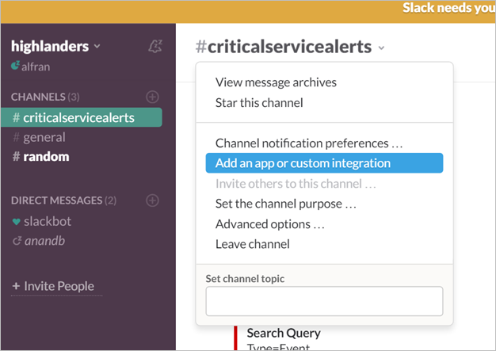

<properties
   pageTitle="記錄檔分析通知 webhook 範例"
   description="記錄檔分析警示，您可以執行的動作是*webhook*，可讓您叫用透過單一 HTTP 要求外部程序。 本文將引導建立 webhook 動作記錄分析提醒使用可寬延時間的範例。"
   services="log-analytics"
   documentationCenter=""
   authors="bwren"
   manager="jwhit"
   editor="tysonn" />
<tags
   ms.service="log-analytics"
   ms.devlang="na"
   ms.topic="article"
   ms.tgt_pltfrm="na"
   ms.workload="infrastructure-services"
   ms.date="10/27/2016"
   ms.author="bwren" />

# <a name="webhooks-in-log-analytics-alerts"></a>在記錄檔分析通知 Webhooks

[記錄檔分析通知](log-analytics-alerts.md)，您可以執行的動作是*webhook*，可讓您叫用透過單一 HTTP 要求外部程序。  您可以閱讀通知和 webhooks[記錄分析的警示](log-analytics-alerts.md)中的詳細資料

本文中，我們會逐步建立 webhook 動作，使用寬限時間，也就是訊息服務的記錄檔分析警示中的範例。

>[AZURE.NOTE] 您必須完成此範例可寬延時間的帳戶。  您可以在[slack.com](http://slack.com)免費帳戶登入。

## <a name="step-1---enable-webhooks-in-slack"></a>步驟 1-啟用 webhooks 中可寬延時間
2.  在[slack.com](http://slack.com)可寬延時間，請登入。
3.  在左窗格中的 [**頻道**] 區段中，選取頻道。  這是郵件會傳送到該頻道。  您可以選取其中一個預設通道，例如 [**一般**] 或 [**隨機**。  在生產案例中，您很可能會建立**criticalservicealerts**例如特殊頻道。 <br>

    

3. 按一下 [**新增應用程式或自訂整合**以開啟應用程式目錄]。
3.  在 [搜尋] 方塊中輸入*webhooks* ，然後選取 [**內送 WebHooks**。 <br>

    

4.  您的小組名稱旁，按一下 [**安裝**]。
5.  按一下 [**新增設定**]。
6.  選取您要用於此範例中，，然後按一下 [**新增傳入 WebHooks 整合**的頻道。  
6. 複製**Webhook URL**。  您將會貼上此將通知設定。 <br>

    

## <a name="step-2---create-alert-rule-in-log-analytics"></a>步驟 2-記錄分析中建立提醒的規則
1.  [建立提醒的規則](log-analytics-alerts.md)使用下列設定。
    - 查詢︰```    Type=Event EventLevelName=error ```
    - 核取此提醒的每個︰ 5 分鐘
    - 結果是︰ 大於 10
    - 在此時間範圍︰ 60 分鐘的時間
    - 選取 [**是** **Webhook**並**無**需採取其他動作。
7. 可寬延時間 URL 貼到 [ **Webhook URL** ] 欄位。
8. 選取要**包含的自訂 JSON 內容**的選項。
9. Slack 預期格式化 JSON 中名為*文字*的參數使用的內容。  這是它會顯示，它會建立的訊息中的文字。  您可以使用一或多個提醒參數使用*#*符號例如，如下列範例所示。

    ```
    {
    "text":"#alertrulename fired with #searchresultcount records which exceeds the over threshold of #thresholdvalue ."
    }
    ```

    

9.  按一下 [儲存警示規則的 [**儲存**]。

10. 請等候足夠的時間，取得建立和然後檢查可寬延時間會類似下列訊息通知。

    


### <a name="advanced-webhook-payload-for-slack"></a>進階 webhook 裝載的可寬延時間

您可以全面自訂輸入與可寬延時間的郵件。 如需詳細資訊，請參閱在寬限時間的網站上的[連入 Webhooks](https://api.slack.com/incoming-webhooks) 。 以下是更複雜的內容，以建立具有格式設定的豐富的郵件︰

    {
        "attachments": [
            {
                "title":"OMS Alerts Custom Payload",
                "fields": [
                    {
                        "title": "Alert Rule Name",
                        "value": "#alertrulename"},
                    {
                        "title": "Link To SearchResults",
                        "value": "<#linktosearchresults|OMS Search Results>"},
                    {
                        "title": "Search Interval",
                        "value": "#searchinterval"},
                    {
                        "title": "Threshold Operator",
                        "value": "#thresholdoperator"},
                    {
                        "title": "Threshold Value",
                        "value": "#thresholdvalue"}
                ],
                "color": "#F35A00"
            }
        ]
    }


這會產生一則訊息中可寬延時間類似下列。


## <a name="summary"></a>摘要

在此通知規則，您就必須傳送給可寬延時間，每次在符合準則的郵件。  

這是動作的只有一個範例執行，您可以建立警示。  您可以建立打電話給其他的外部服務 webhook 動作、 啟動 Azure 自動化 runbook runbook 巨集指令或傳送郵件給自己或其他收件者的電子郵件動作。   

## <a name="next-steps"></a>後續步驟

- 深入了解更多關於[記錄分析的警示](log-analytics-alerts.md)，包括其他動作。
- [建立 runbooks 中 Azure 自動化](../automation/automation-webhooks.md)，可以從 webhook 呼叫。
