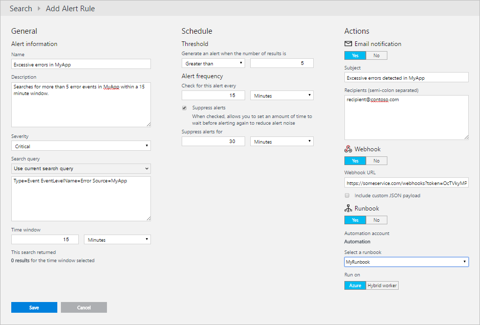

<properties 
   pageTitle="記錄檔分析的警示 |Microsoft Azure"
   description="記錄檔分析的警示識別您 OMS 存放庫中的重要資訊和可以主動時通知您的問題或啟動動作來嘗試修正。  本文將說明如何建立提醒的規則和詳細資料的不同他們可採取的動作。"
   services="log-analytics"
   documentationCenter=""
   authors="bwren"
   manager="jwhit"
   editor="tysonn" />
<tags 
   ms.service="log-analytics"
   ms.devlang="na"
   ms.topic="article"
   ms.tgt_pltfrm="na"
   ms.workload="infrastructure-services"
   ms.date="08/22/2016"
   ms.author="bwren" />

# 記錄檔分析的警示

通知中記錄分析找出您 OMS 存放庫中的重要資訊。  通知規則會自動執行記錄搜尋根據排程，並建立提醒的記錄，如果的結果符合特定準則。  規則，即可自動執行主動通知您的通知，或是叫用其他處理程序的一或多個動作。   

## 建立提醒的規則
若要建立提醒的規則，您開始建立記錄檔中搜尋應該叫用提醒的記錄。  [**提醒**] 按鈕，會出現，讓您可以建立並設定提醒的規則。

1.  從 [OMS 概觀] 頁面上，按一下 [**記錄搜尋**]。
2.  建立新的記錄檔搜尋查詢，或選取 [儲存記錄檔搜尋。 
3.  按一下 [**提醒**] 頁面的頂端以開啟 [**新增提醒的規則**] 畫面。
4. 請參閱設定提醒選項的詳細資訊] 下方的資料表。
5. 當您通知規則提供 [時間] 視窗時，將會顯示現有相符的時間範圍的搜尋準則的記錄數目。  這可以協助您決定可讓您預期的結果數目的頻率。
4.  按一下 [完成通知規則的 [**儲存**]。  它會啟動 [立即執行。

| 屬性 | 描述 |
|:--|:--|
| **通知的資訊** | |
| 名稱 |  若要識別警示規則的唯一名稱。 |
| 重要性 | 建立此規則的警示的嚴重性。 |
| 搜尋查詢 | 選取 [使用目前的查詢，或從清單中選取現有的儲存的搜尋的 [**使用目前的搜尋查詢**。  讓您可以修改，如有必要的 [文字] 方塊中提供的查詢語法。  |
| 時間範圍 | 指定查詢的時間範圍。  查詢會傳回此目前的時間範圍內建立的記錄。  這可能是 5 分鐘數與 24 小時之間的任何值。  應大於或等於提醒的頻率。     例如，如果時間範圍設定為 [60 分鐘，1:15 PM 時執行查詢時，會傳回 「 12:15 PM 」 和 「 1:15 PM 之間建立的記錄。 |
| **排程** |     
| 閥值 | 若要建立提醒的準則。  如果查詢所傳回的記錄數目符合這個準則，則建立提醒。 |
| 提醒頻率 | 指定應該執行查詢的頻率。  可以是介於 5 分鐘數與 24 小時的任何值。  應該等於或小於 [時間] 視窗。 |
| 隱藏通知 | 當您開啟隱藏通知的規則時，規則的動作已停用定義之後建立新的提醒的時間長度。  此規則仍在執行，並符合準則時，將會建立提醒的記錄。  這是允許您的時間要修正這個問題，而不執行重複的動作。 |
| **動作** | |
| 電子郵件通知 | 如果您想要觸發提醒時傳送電子郵件，請指定**[是]** 。 |
| 主旨    | 在電子郵件的主旨。  您無法修改郵件的本文。 |
| 收件者 | 所有的電子郵件收件者地址。  如果您指定一個以上的地址，然後以分號 （;） 分隔地址。 |
| Webhook | 如果您想要通話 webhook 觸發提醒時，請指定**[是]** 。 |
| Webhook URL | Webhook URL。 |
| 包含自訂 JSON 內容 | 如果您想要使用自訂的內容取代預設內容，請選取這個選項。 |
| 輸入您的自訂 JSON 內容 | Webhook 的自訂內容。  請參閱前一節，詳細資料。 |
| Runbook | 如果您想要啟動 Azure 自動化 runbook 觸發提醒時，請指定**[是]** 。 |
| 選取 runbook | 選取以開始在自動化方案中設定自動化帳戶 runbooks runbook。 |
| 在上執行 | 選取 [ **Azure**執行 runbook Azure 雲端]。  選取 [執行您的本機環境中的[混合式 Runbook 工作者](..\automation\automation-hybrid-runbook-worker.md)runbook**混合式背景工作**]。 |

## 管理提醒的規則
您可以在記錄檔分析**設定**] 中的 [**通知**] 功能表中取得所有通知規則清單。  

1. OMS 主控台中選取 [**設定**] 方塊。
2. 選取 [**通知**]。

您可以執行多個動作，從這個檢視。

- 停用選取旁邊的 [**關閉**的規則。
- 編輯提醒的規則，按一下旁邊的 [鉛筆] 圖示。
- 按一下旁邊的 [ **X** ] 圖示，以移除警示規則。 

## 設定時間 windows 

### 事件的提醒

事件包含的資料來源，例如 Windows 事件記錄，系統，並將自訂的記錄。  若要取得建立特定的錯誤事件，或在特定時間範圍內建立多個錯誤事件時建立提醒。

若要在單一事件的提醒，將結果的數目為大於 0 同時頻率和為 5 分鐘的時間範圍。  將每 5 分鐘執行查詢並檢查單一事件建立一次執行查詢的結果。  較長的頻率可以延遲之間收集事件，並建立提醒的時間。

部分應用程式可能會記錄不一定會發出警示偶爾發生錯誤。  例如，應用程式可能會再試一次建立錯誤事件的程序和再繼續下一次。  在此情況下，您可能不想要建立提醒，除非特定時間範圍內建立多個事件。  

在某些情況下，您可能會想要建立沒有使用事件的提醒。  例如，處理程序可能會記錄指出正常運作的一般事件。  如果它不會記錄下列事件特定時間範圍內的其中一個，應該會建立提醒。  在此情況下您想要設定臨界值*小於*1。

### 效能通知

[效能資料](log-analytics-data-sources-performance-counters.md)會儲存為類似於事件 OMS 存放庫中的記錄。  每一筆記錄中的值是透過前 30 分鐘為單位的平均值。  如果您想要通知效能計數器超過特定閾值時，應該會在查詢中包含該臨界值。

例如，如果您想要通知處理器執行時超過 90 %30 分鐘，您可以使用查詢*類型 = 效能從 = 處理器 CounterName ="%處理器時間 」 CounterValue > 90*和通知規則*大於 0*的臨界值。  

 [效能記錄](log-analytics-data-sources-performance-counters.md)會彙總每 30 分鐘，無論您收集每個計數器的頻率，因為小於 30 分鐘的時間間隔，可能會傳回任何記錄。  設定為 30 分鐘的時間範圍，就能確定單一記錄取得每個連線的來源，表示在一段時間的平均值。

## 通知的動作

除了建立提醒的記錄，您可以設定提醒的規則，自動執行一個或多個動作。  動作主動可以通知您的通知，或是叫用嘗試修正問題偵測到的一些程序。  下列各節說明目前可用的動作。

### 電子郵件動作
電子郵件動作傳送一或多個收件者的電子郵件通知的詳細資料。  您可以指定主題的郵件，但它的內容是由記錄分析的標準格式。  其包含例如名稱的警示，除了記錄搜尋傳回的最多 10 筆記錄的詳細資料的摘要資訊。  會傳回該查詢中的整組記錄的記錄檔分析中也包含連結記錄搜尋。   郵件的寄件者是*Microsoft 作業管理套件小組&lt; noreply@oms.microsoft.com *。 

### Webhook 動作

Webhook 動作可讓您叫用透過單一 HTTP 文章要求外部程序。  支援 webhooks 及決定如何使用任何內容呼叫的服務應該接收。  您也可以把，只要邀請 API 瞭解的格式，則特別不支援 webhooks REST API。  使用 webhook 回應警示中的範例使用[可寬延時間](http://slack.com)等服務來傳送含有提醒或[PagerDuty](http://pagerduty.com/)等服務中建立的事件的詳細資料的郵件。  

建立提醒的規則與 webhook 呼叫範例服務的完整逐步引導的[Webhooks 中記錄分析通知](log-analytics-alerts-webhooks.md)。

Webhooks 包含 URL 及格式化 JSON 是傳送給外部服務的資料中的內容。  根據預設，內容會包含下列表格中的值。  您可以選擇此裝載換成您自己的自訂項目。  在此情況下您可以使用變數資料表中每個參數以您自訂的內容中包含其值。

| 參數 | 變數 | 描述 |
|:--|:--|:--|
| AlertRuleName | #alertrulename | 通知規則的名稱。 |
| AlertThresholdOperator | #thresholdoperator | 通知規則閥值運算子。  *大於*或*小於*。 |
| AlertThresholdValue | #thresholdvalue | 臨界值的通知的規則。 |
| LinkToSearchResults | #linktosearchresults | 連結至記錄分析記錄搜尋從建立提醒的查詢傳回的記錄。 |
| ResultCount  | #searchresultcount | 搜尋結果中的記錄數目。 |
| SearchIntervalEndtimeUtc  | #searchintervalendtimeutc | 查詢 UTC 格式的結束時間。 |
| SearchIntervalInSeconds | #searchinterval | 通知規則的時間範圍。 |
| SearchIntervalStartTimeUtc  | #searchintervalstarttimeutc | 開始時間查詢 UTC 格式。 |
| SearchQuery | #searchquery | 記錄通知規則所使用的搜尋查詢。 |
| SearchResults | 請參閱下面的 | JSON 格式查詢所傳回的記錄。  第一次 5000 記錄限制。 |
| WorkspaceID | #workspaceid | OMS 工作區的識別碼。 |

例如，您可以指定包含單一的參數，稱為 「*文字*」 的下列自訂內容。  此 webhook 通話的服務就必須是此參數。

    {
        "text":"#alertrulename fired with #searchresultcount over threshold of #thresholdvalue."
    }

此範例中的內容會解析為像下面傳送至 webhook。

    {
        "text":"My Alert Rule fired with 18 records over threshold of 10 ."
    }

若要搜尋結果中的自訂內容，請新增下列行為 json 內容中的最上層屬性。  

    "IncludeSearchResults":true

例如，若要建立自訂的內容，其中包含提醒的名稱和搜尋結果，您可以使用下列。 

    {
       "alertname":"#alertrulename",
       "IncludeSearchResults":true
    }

您可以逐步執行建立提醒的規則與 webhook 若要開始在[記錄檔分析提醒 webhook 範例](log-analytics-alerts-webhooks.md)的外部服務的完整的範例。

### Runbook 動作

Runbook 動作啟動 Azure 自動化 runbook。  若要使用此類型的動作，您必須[自動化解決方案](log-analytics-add-solutions.md)安裝並設定 OMS 工作區中。  如果您沒有安裝當您建立新的通知規則時，會顯示其安裝的連結。  您可以從您設定自動化方案中的自動化帳戶中 runbooks 進行選取。

Runbook 動作開始使用[webhook](../automation/automation-webhooks.md)runbook。  當您建立提醒的規則時，它會自動建立新的 runbook webhook **OMS 提醒補救**後面 GUID 的名稱。  

您無法直接填入的 runbook，任何參數，但[$WebhookData 參數](../automation/automation-webhooks.md)會包含提醒中，包括建立的記錄檔搜尋結果的詳細資料。  Runbook 需要定義**$WebhookData**做為參數，即可存取提醒的屬性。  使用 json 格式，在單一屬性**$WebhookData** **RequestBody**屬性中名為**SearchResults**通知的資料。  這會有使用下表中的屬性。

| 節點 | 描述 |
|:--|:--|
| 識別碼         | 路徑和 GUID 的搜尋]。 |
| __metadata | 包括記錄數] 及 [搜尋結果的狀態通知的相關資訊。 |
|  值     |  不同的搜尋結果中的每一筆記錄的項目。  摘要資訊與記錄的值相符的項目詳細資料。   |

例如，下列 runbook 會擷取記錄搜尋傳回的記錄，並指定不同的每一筆記錄類型為根據的屬性。  請注意，runbook 開始從 json 轉換**RequestBody** ，以便可以使用中工作為 PowerShell 中的物件。

    param ( 
        [object]$WebhookData
    )

    $RequestBody = ConvertFrom-JSON -InputObject $WebhookData.RequestBody
    $Records     = $RequestBody.SearchResults.value
    
    foreach ($Record in $Records)
    {
        $Computer = $Record.Computer
        
        if ($Record.Type -eq 'Event')
        {
            $EventNo    = $Record.EventID
            $EventLevel = $Record.EventLevelName
            $EventData  = $Record.EventData
        }
        
        if ($Record.Type -eq 'Perf')
        {
            $Object    = $Record.ObjectName
            $Counter   = $Record.CounterName
            $Instance  = $Record.InstanceName
            $Value     = $Record.CounterValue
        }
    }

## 通知的記錄

提醒通知的規則，在記錄檔分析中建立的記錄具有的**提醒****類型**和**OMS**的**SourceSystem** 。  下表中有屬性。

| 屬性 | 描述 |
|:--|:--|
| 類型          | *提醒* |
| SourceSystem  | *OMS* |
| AlertSeverity | 提醒的重要性層級。 |
| AlertName     | 提醒的名稱。 |
| 查詢         | 執行查詢的文字。  |
| QueryExecutionEndTime   | 查詢的時間範圍的結尾。 |
| QueryExecutionStartTime | 查詢的時間範圍的開頭。  |
| TimeGenerated | 建立提醒日期和時間。 |

有其他種類的通知建立[提醒管理解決方案](log-analytics-solution-alert-management.md)及[Power BI 匯出](log-analytics-powerbi.md)的記錄。  這些所有都有一種**類型**的**通知**，但其**SourceSystem**來區別。

## 後續步驟

- 安裝[通知管理解決方案](log-analytics-solution-alert-management.md)，以分析通知收集從系統管理中心的作業管理員 (是 SCOM) 以及建立記錄檔分析的通知。
- 進一步瞭解[記錄搜尋](log-analytics-log-searches.md)可以產生提醒。
- 完成[設定 webook](log-analytics-alerts-webhooks.md)通知的規則的逐步解說。  
- 瞭解如何將撰寫[中 Azure 自動化 runbooks](https://azure.microsoft.com/documentation/services/automation)補救通知可由的問題。