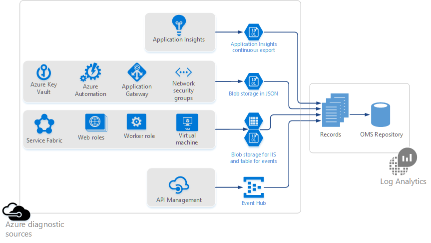

<properties
    pageTitle="收集 Azure 儲存體中的資料記錄分析概觀 |Microsoft Azure"
    description="Azure 資源可以寫入記錄檔和指標 Azure 儲存體帳戶，請經常使用 Azure 診斷。 記錄檔分析可以索引此資料，並使其可搜尋。"
    services="log-analytics"
    documentationCenter=""
    authors="bandersmsft"
    manager="jwhit"
    editor=""/>

<tags
    ms.service="log-analytics"
    ms.workload="na"
    ms.tgt_pltfrm="na"
    ms.devlang="na"
    ms.topic="article"
    ms.date="10/10/2016"
    ms.author="banders"/>

# 收集 Azure 儲存體中的資料記錄分析概觀

許多 Azure 資源可寫入記錄檔和指標 Azure 儲存體帳戶。 記錄分析，可以使用此資料並輕鬆地監控 Azure 資源。

若要撰寫至 Azure 儲存體資源可能會使用 Azure 診斷，或擁有自己的方式來撰寫資料。 此資料可能會寫入到下列位置的各種格式︰

+ Azure 資料表
+ Azure blob
+ EventHub

記錄檔分析支援寫入的資料使用[Azure 診斷記錄](../monitoring-and-diagnostics/monitoring-overview-of-diagnostic-logs.md)的 Azure 服務。 此外，記錄分析支援輸出記錄檔和中不同的格式和位置的指標其他服務。  

>[AZURE.NOTE] 您會標準 Azure 資料費率儲存與交易當您儲存帳戶傳送診斷和記錄分析時資料讀取您儲存的帳戶。

## 支援 Azure 資源

記錄檔分析會收集下列 Azure 資源的資料︰

| 資源類型 | 記錄 （診斷類別） | 記錄檔分析解決方案 |
| --------------------------------------- | -------------------------------- | --------------- |
| 應用程式的深入見解 | 顯示狀態   自訂事件   例外狀況   要求   | 應用程式的深入見解 （預覽版本） |
| API 管理 | | *無*（預覽版本） |
| 自動化   Microsoft.Automation/AutomationAccounts | JobLogs   JobStreams          | AzureAutomation （預覽版本） |
| 索引鍵保存庫   Microsoft.KeyVault/Vaults               | AuditEvent                       | KeyVault （預覽版本） |
| 應用程式的閘道器   Microsoft.Network/ApplicationGateways   | ApplicationGatewayAccessLog   ApplicationGatewayPerformanceLog | AzureNetworking （預覽版本） |
| 網路安全性群組   Microsoft.Network/NetworkSecurityGroups | NetworkSecurityGroupEvent   NetworkSecurityGroupRuleCounter | AzureNetworking （預覽版本） |
| 服務布料的轉印圖樣                          | ETWEvent   作業事件   可靠的動作項目事件   可靠的服務事件| ServiceFabric （預覽版本） |
| 虛擬機器 | Linux 系統   Windows 事件   IIS 記錄檔   Windows ETWEvent | *無* |
| Web 角色   工作者角色 | Linux 系統   Windows 事件   IIS 記錄檔   Windows ETWEvent | *無* |

>[AZURE.NOTE] 監視 Azure 虛擬機器 （Linux 及 Windows），我們建議您安裝[記錄分析 VM 副檔名](log-analytics-azure-vm-extension.md)。 代理程式為您提供更深入的深入見解上您的虛擬機器比您使用的診斷寫入儲存空間。

您可以協助我們排列優先順序 OMS 分析投票我們[意見反應] 頁面](http://feedback.azure.com/forums/267889-azure-log-analytics/category/88086-log-management-and-log-collection-policy)上的其他記錄。

- 若要進一步瞭解如何記錄分析資料時，可以從 Azure 服務支援[Azure 診斷記錄](../monitoring-and-diagnostics/monitoring-overview-of-diagnostic-logs.md)的讀取記錄，請參閱[使用記錄分析的分析 Azure 診斷記錄](log-analytics-azure-storage-json.md)︰
  - Azure 鍵保存庫
  - Azure 自動化
  - 應用程式的閘道器
  - 網路安全性群組
- 請參閱[使用 blob 儲存體 iis 和事件的資料表儲存體](log-analytics-azure-storage-iis-table.md)若要進一步瞭解如何記錄分析可以讀取記錄 Azure 服務資料表儲存體或 IIS 記錄寫入 blob 儲存體，該寫入診斷包括︰
  - 服務布料的轉印圖樣
  - Web 角色
  - 工作者角色
  - 虛擬機器

應用程式的深入見解位於私人的預覽，而且會使用連續匯出至 blob 儲存體。 若要加入私人的預覽，請連絡您的 Microsoft 帳戶的小組或參照[的意見反應網站](https://feedback.azure.com/forums/267889-log-analytics/suggestions/6519248-integration-with-app-insights)上的詳細資料。

## 後續步驟

- 從 Azure 讀取記錄[分析 Azure 診斷記錄使用記錄分析](log-analytics-azure-storage-json.md)服務至 blob 儲存體 JSON 格式的寫入診斷。
- [使用 blob 儲存體 iis 和資料表儲存體的事件](log-analytics-azure-storage-iis-table.md)記錄的 Azure 服務資料表儲存體或寫入 blob 儲存體 IIS 記錄的寫入診斷。
- [啟用解決方案](log-analytics-add-solutions.md)提供深入資料。
- [使用搜尋查詢](log-analytics-log-searches.md)，以分析的資料。
