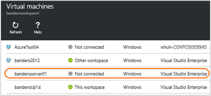

<properties
    pageTitle="將 Azure 虛擬機器連線到記錄分析 |Microsoft Azure"
    description="Azure 中執行的 Windows 和 Linux 虛擬機器，收集記錄檔和指標的建議的方式是安裝記錄分析 Azure VM 副檔名。 您可以使用 PowerShell 的 Azure 入口網站，安裝至 Azure Vm 副檔名為記錄分析虛擬機器。"
    services="log-analytics"
    documentationCenter=""
    authors="richrundmsft"
    manager="jochan"
    editor=""/>

<tags
    ms.service="log-analytics"
    ms.workload="na"
    ms.tgt_pltfrm="na"
    ms.devlang="na"
    ms.topic="article"
    ms.date="10/10/2016"
    ms.author="richrund"/>

# <a name="connect-azure-virtual-machines-to-log-analytics"></a>將 Azure 虛擬機器連線到記錄狀況分析

Windows 和 Linux 電腦上，用來收集記錄檔和指標建議的方法是安裝記錄分析代理程式。

Azure 虛擬機器上安裝記錄分析代理程式的最簡單方法是透過記錄分析 VM 副檔名。  使用副檔名為簡化安裝程序，並自動設定 [代理程式傳送資料至您指定的記錄檔分析工作區。 代理程式也自動升級，確保您有最新功能和修正。

Windows 虛擬機器中，您可以啟用*Microsoft 監控代理程式*的虛擬機器副檔名。
Linux 虛擬機器中，您可以啟用*OMS 代理程式的 Linux*虛擬機器副檔名。

進一步瞭解[Azure 虛擬機器副檔名]](../virtual-machines/virtual-machines-windows-extensions-features.md)和 [Linux 代理程式] (.../ virtual-machines/virtual-machines-linux-agent-user-guide.md）。

當您使用代理程式型集合記錄資料時，您必須設定[記錄分析的資料來源](log-analytics-data-sources.md)來指定的記錄與您想要收集的指標。

>[AZURE.IMPORTANT] 如果您記錄分析索引記錄資料使用設定[Azure 診斷](log-analytics-azure-storage.md)，以及設定，收集在相同記錄代理程式，然後記錄收集按兩次。 您會針對兩個資料來源。 如果您有安裝代理程式，那麼您應該使用了解單獨使用代理程式收集記錄資料-沒有設定記錄分析，從 Azure 診斷收集記錄資料。

有三個簡單的方法，若要啟用記錄分析虛擬機器分機號碼︰

+ 使用 [Azure 入口網站
+ 使用 PowerShell 的 Azure
+ 使用 Azure 資源管理員範本

## <a name="enable-the-vm-extension-in-the-azure-portal"></a>啟用 VM 延伸模組 Azure 入口網站中

您可以安裝記錄分析代理程式，並連接 Azure 虛擬機器上使用[Azure 入口網站](https://portal.azure.com)執行。

### <a name="to-install-the-log-analytics-agent-and-connect-the-virtual-machine-to-a-log-analytics-workspace"></a>安裝記錄分析代理程式，並連線到記錄分析工作區的虛擬機器

1.  登入[Azure 入口網站](http://portal.azure.com)。
2.  選取 [左側的入口網站中的 [**瀏覽]**然後移至**記錄分析 (OMS)** ，並加以選取。
3.  在記錄檔分析工作區的清單中，選取您想要使用 Azure VM 的項目。  
    
4.  在**記錄檔分析管理**] 底下選取**虛擬機器**。  
    
5.  在**虛擬機器**清單中，選取您要安裝代理程式的虛擬機器。 **OMS 連線狀態**vm 表示**未連線**。  
    
6.  虛擬機器的詳細資訊，請選擇 [**連線**]。 代理程式會自動安裝並設定您的記錄檔分析工作區。 此程序需要幾分鐘，在這段期間 OMS 連線狀態是*連線...*  
    
7.  安裝後，當您連線代理程式時，就會顯示**此工作區**更新**OMS 連線**狀態。  
    


## <a name="enable-the-vm-extension-using-powershell"></a>啟用使用 PowerShell VM 副檔名

有不同的命令，如傳統的 Azure 虛擬機器和資源管理員虛擬機器。 以下是範例傳統和資源管理員虛擬機器兩者均適用。

傳統的虛擬機器中，使用下列 PowerShell 範例︰

```
Add-AzureAccount

$workspaceId = "enter workspace ID here"
$workspaceKey = "enter workspace key here"
$hostedService = "enter hosted service here"

$vm = Get-AzureVM –ServiceName $hostedService

# For Windows VM uncomment the following line
# Set-AzureVMExtension -VM $vm -Publisher 'Microsoft.EnterpriseCloud.Monitoring' -ExtensionName 'MicrosoftMonitoringAgent' -Version '1.*' -PublicConfiguration "{'workspaceId': '$workspaceId'}" -PrivateConfiguration "{'workspaceKey': '$workspaceKey' }" | Update-AzureVM -Verbose

# For Linux VM uncomment the following line
# Set-AzureVMExtension -VM $vm -Publisher 'Microsoft.EnterpriseCloud.Monitoring' -ExtensionName 'OmsAgentForLinux' -Version '1.*' -PublicConfiguration "{'workspaceId': '$workspaceId'}" -PrivateConfiguration "{'workspaceKey': '$workspaceKey' }" | Update-AzureVM -Verbose
```

資源管理員虛擬機器，請使用下列 PowerShell 範例︰

```
Login-AzureRMAccount
Select-AzureSubscription -SubscriptionId "**"

$workspaceName = "your workspace name"
$VMresourcegroup = "**"
$VMresourcename = "**"

$workspace = (Get-AzureRmOperationalInsightsWorkspace).Where({$_.Name -eq $workspaceName})

if ($workspace.Name -ne $workspaceName)
{
    Write-Error "Unable to find OMS Workspace $workspaceName. Do you need to run Select-AzureRMSubscription?"
}

$workspaceId = $workspace.CustomerId
$workspaceKey = (Get-AzureRmOperationalInsightsWorkspaceSharedKeys -ResourceGroupName $workspace.ResourceGroupName -Name $workspace.Name).PrimarySharedKey

$vm = Get-AzureRmVM -ResourceGroupName $VMresourcegroup -Name $VMresourcename
$location = $vm.Location

# For Windows VM uncomment the following line
# Set-AzureRmVMExtension -ResourceGroupName $VMresourcegroup -VMName $VMresourcename -Name 'MicrosoftMonitoringAgent' -Publisher 'Microsoft.EnterpriseCloud.Monitoring' -ExtensionType 'MicrosoftMonitoringAgent' -TypeHandlerVersion '1.0' -Location $location -SettingString "{'workspaceId': '$workspaceId'}" -ProtectedSettingString "{'workspaceKey': '$workspaceKey'}"

# For Linux VM uncomment the following line
# Set-AzureRmVMExtension -ResourceGroupName $VMresourcegroup -VMName $VMresourcename -Name 'OmsAgentForLinux' -Publisher 'Microsoft.EnterpriseCloud.Monitoring' -ExtensionType 'OmsAgentForLinux' -TypeHandlerVersion '1.0' -Location $location -SettingString "{'workspaceId': '$workspaceId'}" -ProtectedSettingString "{'workspaceKey': '$workspaceKey'}"


```
當您使用 PowerShell 來設定您的虛擬機器時，您需要提供的**工作區編號**及**主索引鍵**。 您可以找到 Id 和金鑰 OMS 入口網站，或在上述範例所示，使用 PowerShell 中的 [**設定**] 頁面上。


## <a name="deploy-the-vm-extension-using-a-template"></a>部署 VM 副檔名使用範本

藉由使用 Azure 資源管理員，您可以建立簡單範本 （使用 JSON 格式），以定義的部署及應用程式的設定。 此範本稱為資源管理員範本，並提供用宣告方式定義部署。 使用範本，您可以重複部署整個應用程式生命週期應用程式並信賴一致的部署您的資源。

藉由記錄分析代理程式的資源管理員範本的一部分，您可以確保每個虛擬機器為預先設定，回報記錄分析工作區。

如需有關資源管理員範本的詳細資訊，請參閱[撰寫 Azure 資源管理員範本](../resource-group-authoring-templates.md)。

下列是用於部署虛擬機器執行 Windows 安裝 Microsoft 監控代理程式副檔名為資源管理員範本的範例。 此範本是一般虛擬機器範本，以加入下列各項︰

+ workspaceId 和 workspaceName 參數
+ Microsoft.EnterpriseCloud.Monitoring 資源的副檔名] 區段
+ 查閱 workspaceId 和 workspaceSharedKey 輸出


```
{
  "$schema": "https://schema.management.azure.com/schemas/2015-01-01/deploymentTemplate.json#",
  "contentVersion": "1.0.0.0",
  "parameters": {
    "adminUsername": {
      "type": "string",
      "metadata": {
        "description": "Username for the Virtual Machine."
      }
    },
    "adminPassword": {
      "type": "securestring",
      "metadata": {
        "description": "Password for the Virtual Machine."
      }
    },
    "dnsLabelPrefix": {
       "type": "string",
       "metadata": {
          "description": "DNS Label for the Public IP. Must be lowercase. It should match with the following regular expression: ^[a-z][a-z0-9-]{1,61}[a-z0-9]$ or it will raise an error."
       }
    },
    "workspaceId": {
      "type": "string",
      "metadata": {
        "description": "OMS workspace ID"
      }
    },
    "workspaceName": {
      "type": "string",
      "metadata": {
         "description": "OMD workspace name"
      }
    },
    "windowsOSVersion": {
      "type": "string",
      "defaultValue": "2012-R2-Datacenter",
      "allowedValues": [
        "2008-R2-SP1",
        "2012-Datacenter",
        "2012-R2-Datacenter",
        "Windows-Server-Technical-Preview"
      ],
      "metadata": {
        "description": "The Windows version for the VM. This will pick a fully patched image of this given Windows version. Allowed values: 2008-R2-SP1, 2012-Datacenter, 2012-R2-Datacenter, Windows-Server-Technical-Preview."
      }
    }
  },
  "variables": {
    "storageAccountName": "[concat(uniquestring(resourceGroup().id), 'standardsa')]",
    "apiVersion": "2015-06-15",
    "imagePublisher": "MicrosoftWindowsServer",
    "imageOffer": "WindowsServer",
    "OSDiskName": "osdiskforwindowssimple",
    "nicName": "myVMNic",
    "addressPrefix": "10.0.0.0/16",
    "subnetName": "Subnet",
    "subnetPrefix": "10.0.0.0/24",
    "storageAccountType": "Standard_LRS",
    "publicIPAddressName": "myPublicIP",
    "publicIPAddressType": "Dynamic",
    "vmStorageAccountContainerName": "vhds",
    "vmName": "MyWindowsVM",
    "vmSize": "Standard_DS1",
    "virtualNetworkName": "MyVNET",
    "resourceId": "[resourceGroup().id]",
    "vnetID": "[resourceId('Microsoft.Network/virtualNetworks',variables('virtualNetworkName'))]",
    "subnetRef": "[concat(variables('vnetID'),'/subnets/',variables('subnetName'))]"
  },
  "resources": [
    {
      "type": "Microsoft.Storage/storageAccounts",
      "name": "[variables('storageAccountName')]",
      "apiVersion": "[variables('apiVersion')]",
      "location": "[resourceGroup().location]",
      "properties": {
        "accountType": "[variables('storageAccountType')]"
      }
    },
    {
      "apiVersion": "[variables('apiVersion')]",
      "type": "Microsoft.Network/publicIPAddresses",
      "name": "[variables('publicIPAddressName')]",
      "location": "[resourceGroup().location]",
      "properties": {
        "publicIPAllocationMethod": "[variables('publicIPAddressType')]",
        "dnsSettings": {
          "domainNameLabel": "[parameters('dnsLabelPrefix')]"
        }
      }
    },
    {
      "apiVersion": "[variables('apiVersion')]",
      "type": "Microsoft.Network/virtualNetworks",
      "name": "[variables('virtualNetworkName')]",
      "location": "[resourceGroup().location]",
      "properties": {
        "addressSpace": {
          "addressPrefixes": [
            "[variables('addressPrefix')]"
          ]
        },
        "subnets": [
          {
            "name": "[variables('subnetName')]",
            "properties": {
              "addressPrefix": "[variables('subnetPrefix')]"
            }
          }
        ]
      }
    },
    {
      "apiVersion": "[variables('apiVersion')]",
      "type": "Microsoft.Network/networkInterfaces",
      "name": "[variables('nicName')]",
      "location": "[resourceGroup().location]",
      "dependsOn": [
        "[concat('Microsoft.Network/publicIPAddresses/', variables('publicIPAddressName'))]",
        "[concat('Microsoft.Network/virtualNetworks/', variables('virtualNetworkName'))]"
      ],
      "properties": {
        "ipConfigurations": [
          {
            "name": "ipconfig1",
            "properties": {
              "privateIPAllocationMethod": "Dynamic",
              "publicIPAddress": {
                "id": "[resourceId('Microsoft.Network/publicIPAddresses',variables('publicIPAddressName'))]"
              },
              "subnet": {
                "id": "[variables('subnetRef')]"
              }
            }
          }
        ]
      }
    },
    {
      "apiVersion": "2015-06-15",
      "type": "Microsoft.Compute/virtualMachines",
      "name": "[variables('vmName')]",
      "location": "[resourceGroup().location]",
      "dependsOn": [
        "[concat('Microsoft.Storage/storageAccounts/', variables('storageAccountName'))]",
        "[concat('Microsoft.Network/networkInterfaces/', variables('nicName'))]"
      ],
      "properties": {
        "hardwareProfile": {
          "vmSize": "[variables('vmSize')]"
        },
        "osProfile": {
          "computername": "[variables('vmName')]",
          "adminUsername": "[parameters('adminUsername')]",
          "adminPassword": "[parameters('adminPassword')]"
        },
        "storageProfile": {
          "imageReference": {
            "publisher": "[variables('imagePublisher')]",
            "offer": "[variables('imageOffer')]",
            "sku": "[parameters('windowsOSVersion')]",
            "version": "latest"
          },
          "osDisk": {
            "name": "osdisk",
            "vhd": {
              "uri": "[concat('http://',variables('storageAccountName'),'.blob.core.windows.net/',variables('vmStorageAccountContainerName'),'/',variables('OSDiskName'),'.vhd')]"
            },
            "caching": "ReadWrite",
            "createOption": "FromImage"
          }
        },
        "networkProfile": {
          "networkInterfaces": [
            {
              "id": "[resourceId('Microsoft.Network/networkInterfaces',variables('nicName'))]"
            }
          ]
        },
        "diagnosticsProfile": {
          "bootDiagnostics": {
             "enabled": "true",
             "storageUri": "[concat('http://',variables('storageAccountName'),'.blob.core.windows.net')]"
          }
        }
      },
      "resources": [
        {
          "type": "extensions",
          "name": "Microsoft.EnterpriseCloud.Monitoring",
          "apiVersion": "[variables('apiVersion')]",
          "location": "[resourceGroup().location]",
          "dependsOn": [
            "[concat('Microsoft.Compute/virtualMachines/', variables('vmName'))]"
          ],
          "properties": {
            "publisher": "Microsoft.EnterpriseCloud.Monitoring",
            "type": "MicrosoftMonitoringAgent",
            "typeHandlerVersion": "1.0",
            "autoUpgradeMinorVersion": true,
            "settings": {
              "workspaceId": "[parameters('workspaceId')]"
            },
            "protectedSettings": {
              "workspaceKey": "[listKeys(resourceId('Microsoft.OperationalInsights/workspaces', parameters('workspaceName')), '2015-03-20').primarySharedKey]"
            }
          }
        }
      ]
    }
  ],
  "outputs": {
      "sharedKeyOutput": {
         "value": "[listKeys(resourceId('Microsoft.OperationalInsights/workspaces/', parameters('workspaceName')), '2015-03-20').primarySharedKey]",
         "type": "string"
      },
      "workspaceIdOutput": {
         "value": "[reference(concat('Microsoft.OperationalInsights/workspaces/', parameters('workspaceName')), '2015-03-20').customerId]",
        "type" : "string"
      }
  }
}
```

您可以使用下列 PowerShell 命令部署範本︰

```
New-AzureRmResourceGroupDeployment -ResourceGroupName $resourceGroupName -TemplateFile $templateFilePath
```

## <a name="troubleshooting-windows-virtual-machines"></a>疑難排解 Windows 虛擬機器

如果 VM 代理程式副檔名為*Microsoft 監控代理程式*無法安裝或報告您可以執行下列步驟，以解決這個問題。

1. 如果安裝 Azure VM 代理程式的核取及使用正確的使用[KB 2965986](https://support.microsoft.com/kb/2965986#mt1)中的步驟。
  + 您也可以檢閱 VM 代理程式的記錄檔`C:\WindowsAzure\logs\WaAppAgent.log`
  + 如果記錄不存在，未安裝 VM 代理程式。
    - [在 [傳統 Vm 上安裝 Azure VM 代理程式](../virtual-machines/virtual-machines-windows-classic-agents-and-extensions.md)
2. 確認 Microsoft 監控代理程式副檔名活動訊號工作使用下列步驟執行︰
  + 登入虛擬機器
  + 開啟工作排程器，然後尋找`update_azureoperationalinsight_agent_heartbeat`工作
  + 確認工作已啟用，而且正在執行每分鐘
  + 存回活動訊號記錄檔`C:\WindowsAzure\Logs\Plugins\Microsoft.EnterpriseCloud.Monitoring.MicrosoftMonitoringAgent\heartbeat.log`
3. 檢閱 Microsoft 監控代理程式 VM 副檔名記錄檔中`C:\Packages\Plugins\Microsoft.EnterpriseCloud.Monitoring.MicrosoftMonitoringAgent`
3. 確保虛擬機器可以執行 PowerShell 指令碼
4. 請確定未變更 C:\Windows\temp 權限
5. 輸入下列命令虛擬機器上提高權限 PowerShell 視窗中檢視 Microsoft 監控代理程式的狀態`  (New-Object -ComObject 'AgentConfigManager.MgmtSvcCfg').GetCloudWorkspaces() | Format-List`
6. 檢閱在 Microsoft 監控代理程式安裝記錄檔`C:\Windows\System32\config\systemprofile\AppData\Local\SCOM\Logs`

如需詳細資訊，請參閱[疑難排解 Windows 副檔名](../virtual-machines/virtual-machines-windows-extensions-troubleshoot.md)。

## <a name="troubleshooting-linux-virtual-machines"></a>疑難排解 Linux 虛擬機器

如果未安裝或報告*Linux OMS 代理人*VM 代理副檔名，您可以執行下列步驟，以解決這個問題。

1. 如果副檔名狀態為*未知*的核取如果 Azure VM 代理程式已安裝和使用正確的檢閱 VM 代理程式的記錄檔`/var/log/waagent.log`
  + 如果記錄不存在，未安裝 VM 代理程式。
  - [在 [Linux Vm 上安裝 Azure VM 代理程式](../virtual-machines/virtual-machines-linux-agent-user-guide.md)
2. 其他不佳的狀態，檢閱 OMS 代理程式的 Linux VM 副檔名記錄檔`/var/log/azure/Microsoft.EnterpriseCloud.Monitoring.OmsAgentForLinux/*/extension.log`和`/var/log/azure/Microsoft.EnterpriseCloud.Monitoring.OmsAgentForLinux/*/CommandExecution.log`
3. 如果副檔名狀態狀況良好，但不上載資料檢閱 OMS 代理程式 Linux 記錄中的檔案`/var/opt/microsoft/omsagent/log/omsagent.log`

如需詳細資訊，請參閱[疑難排解 Linux 副檔名](../virtual-machines/virtual-machines-linux-extensions-troubleshoot.md)。


## <a name="next-steps"></a>後續步驟

+ 設定[記錄分析的資料來源](log-analytics-data-sources.md)來指定的記錄與度量收集的資訊。
+ 若要從虛擬收集資料的電腦上[新增記錄分析解決方案從方案庫](log-analytics-add-solutions.md)。
+ [收集資料使用 Azure 診斷](log-analytics-azure-storage.md)Azure 中執行的其他資源。

Azure 中的電腦上，您可以使用下列文章中所描述的方法安裝記錄分析代理程式︰

+ [在 Windows 電腦連線到記錄狀況分析](log-analytics-windows-agents.md)
+ [Linux 電腦連線到記錄狀況分析](log-analytics-linux-agents.md)
