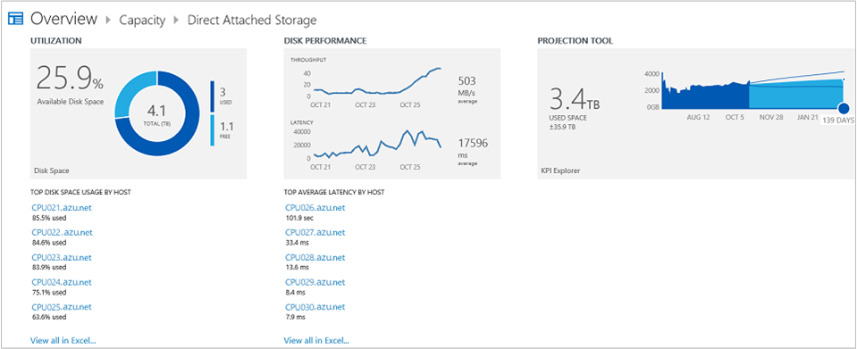

<properties
    pageTitle="在記錄檔分析容量管理解決方案 |Microsoft Azure"
    description="您可以使用容量規劃解決方案中記錄分析可協助您瞭解 HYPER-V 伺服器管理系統管理中心虛擬機器管理員的容量"
    services="log-analytics"
    documentationCenter=""
    authors="bandersmsft"
    manager="jwhit"
    editor=""/>

<tags
    ms.service="log-analytics"
    ms.workload="na"
    ms.tgt_pltfrm="na"
    ms.devlang="na"
    ms.topic="article"
    ms.date="10/10/2016"
    ms.author="banders"/>

# 在記錄檔分析容量管理解決方案

您可以使用容量規劃解決方案中記錄分析，可協助您瞭解 HYPER-V 伺服器管理系統管理中心虛擬機器管理員的容量。 本方案需要同時系統管理中心 Operations Manager 與系統管理中心虛擬機器管理員。 容量規劃無法如果您只使用直接連線代理程式。 您安裝更新 Operations Manager 代理程式的解決方案。 解決方案讀取效能計數器監控伺服器上的，並會使用資料傳送至雲端的 OMS 服務處理。 邏輯會套用至之使用狀況，且雲端服務記錄的資料。 一段時間，使用模式識別並容量規劃，根據目前消耗。

例如額外的處理器核心或額外的記憶體會需要的個別的伺服器時，可能會找出預測。 在此範例中，投影可能表示，30 天伺服器需要額外的記憶體。 這可以協助您規劃記憶體升級期間伺服器的下一個進行的維修作業] 視窗中，這可能是一次每兩週才能完成。

>[AZURE.NOTE] 無法使用都會新增至工作區容量管理解決方案。 安裝容量管理解決方案的客戶可以繼續使用解決方案。  

容量計畫解決方案在更新為地址下列客戶提報的挑戰︰

- 若要使用虛擬機器管理員及 Operations Manager 需求
- 無法將自訂/篩選依據群組
- 每小時資料彙總不常用夠
- 沒有 VM 層級的深入見解
- 資料可靠性

新的容量方案的優勢︰

- 改善的可靠性與正確性支援細緻的資料收集
- 不需要 VMM 支援 HYPER-V
- 計量中的視覺效果
- 獲得深入見解有關 VM 層級的使用狀況

## 安裝及設定解決方案
安裝和設定方案，請使用下列資訊。

- Operations Manager 是必要的容量管理解決方案。
- 虛擬機器管理員，才能容量管理解決方案。
- 需要作業管理員連線與虛擬機器管理員 (VMM)。 如需連線系統的詳細資訊，請參閱[如何連線與 Operations Manager VMM](http://technet.microsoft.com/library/hh882396.aspx)。
- Operations Manager 必須連接到記錄分析。
- 新增到使用中[新增記錄分析解決方案從方案庫](log-analytics-add-solutions.md)所述的程序 OMS 工作區的容量管理解決方案。  有不需要進行其他設定。

## 容量管理的詳細資料集合

容量管理收集效能資料、 中繼資料，並使用您已啟用代理程式的 [狀態] 資料。

下表顯示資料集合方法和其他詳細資料收集容量管理的方式。

| 平台 | 直接代理程式 | 是 SCOM 代理程式 | Azure 儲存體 | 必要時，是 SCOM 嗎？ | 透過管理群組傳送是 SCOM 代理程式的資料 | 集合頻率 |
|---|---|---|---|---|---|---|
|Windows||![[是]](./media/log-analytics-capacity/oms-bullet-green.png)||            ![[是]](./media/log-analytics-capacity/oms-bullet-green.png)|![[是]](./media/log-analytics-capacity/oms-bullet-green.png)| 每小時|

下表顯示容量管理所收集的資料類型的範例︰

|**資料類型**|**欄位**|
|---|---|
|中繼資料|BaseManagedEntityId、 ObjectStatus、 OrganizationalUnit、 ActiveDirectoryObjectSid、 PhysicalProcessors、 NetworkName、 IPAddress、 ForestDNSName、 NetbiosComputerName、 VirtualMachineName、 LastInventoryDate、 HostServerNameIsVirtualMachine、 IP 位址、 NetbiosDomainName、 LogicalProcessors、 DNSName、 顯示名稱、 DomainDnsName、 ActiveDirectorySite、 PrincipalName、 OffsetInMinuteFromGreenwichTime|
|效能|從 CounterName、 PerfmonInstanceName、 PerformanceDataId、 PerformanceSourceInternalID、 SampleValue、 TimeSampled、 TimeAdded|
|狀態|StateChangeEventId、 StateId、 NewHealthState、 OldHealthState、 內容、 TimeGenerated、 TimeAdded、 StateId2、 BaseManagedEntityId、 MonitorId、 HealthState、 上次修改、 LastGreenAlertGenerated、 DatabaseTimeModified|

## 容量管理頁面

 安裝容量規劃解決方案之後，您可以檢視監控伺服器的容量 OMS 中的 [**概觀**] 頁面上使用 [**容量計劃**] 磚。

![容量計劃] 方塊的圖像](./media/log-analytics-capacity/oms-capacity01.png)

並排顯示開啟您可以在此檢視您的伺服器容量摘要的**容量管理**儀表板。 頁面會顯示下列方塊，您可以按一下︰

- *虛擬機器計數*︰ 顯示剩餘的虛擬機器容量的天數
- *計算*︰ 顯示處理器核心和可用的記憶體
- *儲存空間*︰ 會顯示使用的空間，並計算平均值磁碟延遲
- *搜尋*︰ 您可以使用任何資料搜尋 OMS 系統中的資料瀏覽器

### 若要檢視容量頁面

- 在 [**概觀**] 頁面上按一下 [**容量管理**]，然後按一下**計算**或**儲存空間**。

## 計算頁面

若要檢視使用情況，例如投射的容量、 天和效率與您相關的容量資訊，您可以在 Microsoft Azure OMS 中使用**計算**儀表板。 您可以使用 [**使用情況**] 區域以檢視您的虛擬機器主機 CPU 核心和記憶體使用率。 您可以使用預測工具來估計多少容量預期會使用指定的日期範圍。 若要查看如何有效您虛擬機器主機，您可以使用 [**效率**] 區域。 您可以按一下檢視的詳細資訊連結的項目。

您可以產生下列類別的 Excel 活頁簿︰

- 最高核心使用率主機
- 最高的記憶體使用率主機
- 上方主機效率的虛擬機器
- 使用情況上方主機
- 使用情況下主機

以下區域會顯示**計算**的儀表板上︰

**使用情況**︰ 檢視 CPU 核心和記憶體使用率，在您的虛擬機器主機。

- *使用核心*︰ 加總的所有主機 （%利用的 cpu 乘以實體核心 」 主機上的數量）。
- *免費的核心*︰ 總數減掉使用核心實體核心。
- *百分比核心可用*︰ 空閒實體核心除以的實體核心總數。
- *每個 VM 虛擬核心*︰ 系統除以系統中的總數虛擬機器中的總虛擬核心。
- *虛擬核心成實體核心比*︰ 以實體核心系統中使用的虛擬機器總實體核心的比率。
- *數字的虛擬核心可用*︰ 虛擬核心成實體核心比乘以可用的實體核心。
- *使用記憶體*︰ 為供所有主機的記憶體總和。
- *可用的記憶體*︰ 減號使用記憶體的實體記憶體總計。
- *百分比可用的記憶體*︰ 空閒實體記憶體除以實體記憶體總計。
- *每個 VM 虛擬記憶體*︰ 系統中的總虛擬記憶體除以系統中的虛擬機器總數。
- *實體記憶體比的虛擬記憶體*︰ 系統中的總虛擬記憶體除以系統中的合計的實體記憶體。
- *虛擬記憶體可用*︰ 實體記憶體比的虛擬記憶體乘以可用的實體記憶體。

**預測工具**

藉由使用預測工具，您可以用您的資源使用狀況檢視歷史趨勢。 這包含趨勢的虛擬機器、 記憶體、 核心，以及儲存空間。 預測功能可協助您知道您執行的不在每個資源時使用預測演算法。 這可協助您計算正確的容量規劃，讓您知道當您需要購買更多容量 （例如記憶體、 核心或儲存）。

**效率**

- *閒置 VM*︰ 使用指定的時間週期小於 10%的 CPU 和 10%的記憶體。
- *使用過度 VM*︰ 使用指定的時間週期 90%以上的 CPU 和 90%的記憶體。
- *閒置 host （主機)*: 使用指定的時間週期小於 10%的 CPU 和 10%的記憶體。
- *使用過度 host （主機)*: 使用指定的時間週期 90%以上的 CPU 和 90%的記憶體。

### 使用 [計算] 頁面上的項目

1. **計算**儀表板上的 [**使用情況**] 區域中，檢視容量的相關資訊的 CPU 核心和記憶體中使用。
2. 按一下 [在 [**搜尋**] 頁面中開啟並檢視它的詳細的資訊的項目]。
3. **預測**工具中移動日期滑桿，以顯示 [預測容量將用於您所選擇的日期。
4. 在 [**效率**] 區域中，檢視容量效率資訊虛擬機器和虛擬機器主機。

## 直接附加的儲存空間頁面

您可以使用 [**直接附加儲存**儀表板 OMS 中，若要檢視儲存使用量、 磁碟效能及預計的天的磁碟容量的容量資訊。 您可以使用 [**使用情況**] 區域以檢視您的虛擬機器主機磁碟空間使用方式。 您可以使用 [**磁碟效能**區域以檢視您的虛擬機器主機磁碟產能與延遲。 您也可以使用預測工具來估計多少容量預期會使用指定的日期範圍。 您可以按一下檢視的詳細資訊連結的項目。

您可以從下列類別此容量資訊產生的 Excel 活頁簿︰

- Host （主機） 的上方的磁碟空間使用量
- 主機上方平均延遲

以下區域會顯示在 [**儲存**] 頁面上︰

- *使用情況*︰ 檢視您的虛擬機器主機磁碟空間使用方式。
- *總磁碟空間*︰ Sum （邏輯磁碟空間） 的所有主機
- *使用磁碟空間*︰ Sum （使用邏輯磁碟空間） 的所有主機
- *可用磁碟空間*︰ 減去用的磁碟空間的磁碟空間總計
- *使用百分比磁碟*︰ 使用除以總磁碟空間的磁碟空間
- *百分比磁碟可用*︰ 的可用磁碟空間除以總磁碟空間

**磁碟效能**

藉由使用 OMS，您可以檢視歷史使用趨勢的磁碟空間。 預測功能會使用演算法專案未來的使用方式。 空間使用量特別的預測功能可讓您專案時可能會用完磁碟空間。 這將可協助您規劃適當的儲存空間，並知道當您需要購買更多儲存空間。

**預測工具**

藉由使用預測工具，您可以檢視您的磁碟空間使用歷史趨勢。 預測功能也可讓您專案當您執行的磁碟空間。 這將可協助您規劃適當的容量及知道當您需要購買更多儲存空間容量。

### 若要使用的項目直接附加儲存頁面

1. **直接附加儲存**儀表板上的 [**使用情況**] 區域中，您可以檢視磁碟使用情況資訊。
2. 按一下 [在 [**搜尋**] 頁面中開啟並檢視它的詳細的資訊連結項目]。
3. 在**磁碟效能**區域中，您可以檢視磁碟處理能力和延遲的資訊。
4. **預測工具**中移動日期滑桿，以顯示 [預測容量將用於您所選擇的日期。

## 後續步驟

- 若要檢視詳細的容量管理資料使用[記錄分析中的記錄檔搜尋](log-analytics-log-searches.md)。
