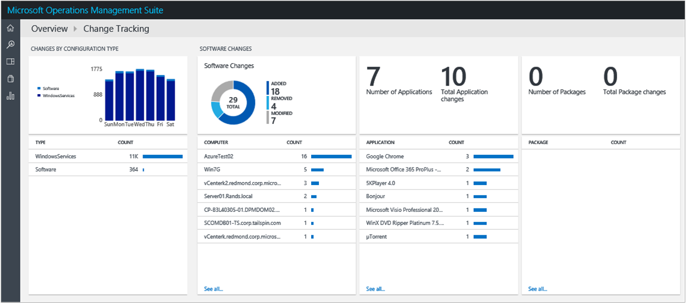
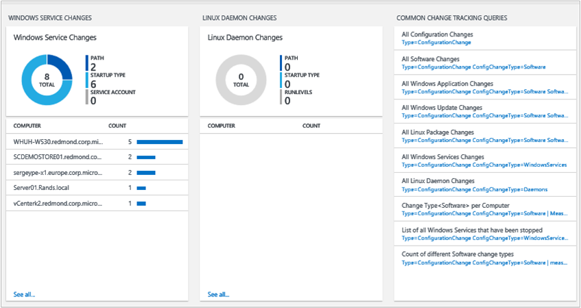

<properties
    pageTitle="變更追蹤解決方案中記錄分析 |Microsoft Azure"
    description="您可以使用設定追蹤修訂的解決方案中記錄分析可協助您輕鬆找出軟體和您的環境中發生的 Windows 服務變更，用來識別變更這些設定可協助您找出操作問題。"
    services="operations-management-suite"
    documentationCenter=""
    authors="bandersmsft"
    manager="jwhit"
    editor=""/>

<tags
    ms.service="operations-management-suite"
    ms.workload="na"
    ms.tgt_pltfrm="na"
    ms.devlang="na"
    ms.topic="article"
    ms.date="10/10/2016"
    ms.author="banders"/>

# 變更追蹤解決方案中記錄狀況分析

您可以使用設定追蹤修訂的解決方案中記錄分析可協助您輕鬆找出軟體和 Linux 精靈變更您的環境中發生的 Windows 服務的變更，用來識別變更這些設定可協助您找出操作問題。

您安裝的方案，更新您所安裝的代理程式類型。 變更安裝軟體並讀取監控伺服器上的 Windows 服務，然後傳送資料至雲端的記錄檔分析服務進行處理。 邏輯會套用至收到的資料和雲端服務記錄的資料。 變更找到時，伺服器的變更會顯示追蹤修訂的儀表板中。 藉由使用追蹤修訂的儀表板上的資訊，您可以輕鬆地查看您的伺服器基礎結構中所做的變更。

## 安裝及設定解決方案
安裝和設定方案，請使用下列資訊。

- Operations Manager 是必要的追蹤修訂的方案。
- 您必須在您想要用來監視變更每一部電腦上的 Windows] 或 [Operations Manager 代理程式。
- 新增到使用中[新增記錄分析解決方案從方案庫](log-analytics-add-solutions.md)所述的程序 OMS 工作區的追蹤修訂的解決方案。  有不需要進行其他設定。

## 變更追蹤資料集合詳細資料

追蹤修訂收集軟體庫存和使用您已啟用代理程式的 Windows 服務中繼資料。

下表顯示資料集合方法和其他詳細資料收集的追蹤修訂的方式。

| 平台 | 直接代理程式 | 是 SCOM 代理程式 | Azure 儲存體 | 必要時，是 SCOM 嗎？ | 透過管理群組傳送是 SCOM 代理程式的資料 | 集合頻率 |
|---|---|---|---|---|---|---|
|Windows|![[是]](./media/log-analytics-change-tracking/oms-bullet-green.png)|![[是]](./media/log-analytics-change-tracking/oms-bullet-green.png)||            |![[是]](./media/log-analytics-change-tracking/oms-bullet-green.png)| 每小時|

## 使用追蹤修訂

安裝解決方案之後，您可以檢視監控伺服器變更的摘要 OMS 中的 [**概觀**] 頁面上使用 [**追蹤修訂**] 磚。

![追蹤修訂] 方塊的圖像](./media/log-analytics-change-tracking/oms-changetracking-tile.png)

您可以檢視變更為您基礎結構，然後向下切入至詳細資料，下列類別︰

- 設定類型的軟體和 Windows 服務所做的變更
- 軟體應用程式和更新個別伺服器的變更
- 每個應用程式的軟體變更總數
- 針對個別伺服器的 Windows 服務變更

### 若要檢視的任何變更變更類型

1. 在 [**概觀**] 頁面上，按一下 [**追蹤修訂**] 磚。
2. 在 [**變更追蹤**儀表板，檢閱摘要資訊中的變更類型刀其中一個，然後按一下其中一個以檢視**記錄檔搜尋**頁面的詳細的資訊。
3. 在任何記錄搜尋頁面，您可以檢視結果，時間、 詳細的結果，以及您記錄搜尋歷程記錄。 您也可以篩選 facet 來縮小結果。

## 後續步驟

- 您可以使用[記錄分析中的記錄檔搜尋](log-analytics-log-searches.md)來檢視詳細的變更追蹤資料。
