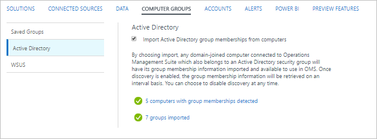
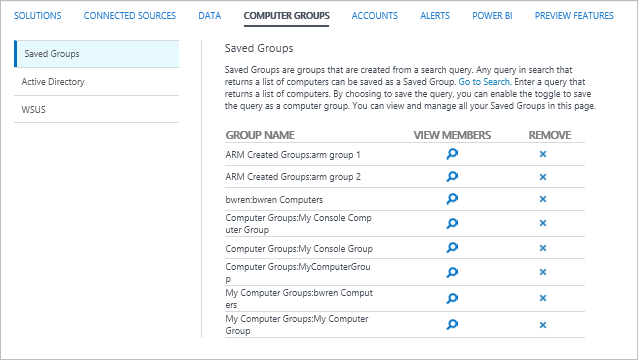

<properties
    pageTitle="在記錄檔分析電腦群組記錄搜尋 |Microsoft Azure"
    description="在記錄檔分析電腦群組可讓您記錄搜尋範圍到一組特定的電腦。  本文將說明您可以使用電腦群組，以及如何使用這些記錄搜尋中所建立的不同方法。"
    services="log-analytics"
    documentationCenter=""
    authors="bwren"
    manager="jwhit"
    editor=""/>

<tags
    ms.service="log-analytics"
    ms.workload="na"
    ms.tgt_pltfrm="na"
    ms.devlang="na"
    ms.topic="article"
    ms.date="09/06/2016"
    ms.author="bwren"/>

# 在記錄檔分析電腦群組登入的搜尋
在記錄檔分析電腦群組可讓您範圍[登搜尋](log-analytics-log-searches.md)一組特定的電腦。  每個群組會填入的電腦，請使用您所定義的查詢或匯入來自不同來源的群組。  當群組包含在記錄檔搜尋時，結果限於符合的電腦] 群組中的所有記錄。

## 建立電腦群組
您可以在任何一種方法使用下表中的記錄檔分析中建立電腦群組。  以下各節提供每一種方法的詳細資訊。 

| 方法 | 描述 |
|:---|:---|
| 記錄檔搜尋       | 建立記錄檔搜尋會傳回電腦的清單，並將結果儲存為電腦群組。 |
| 記錄檔搜尋 API   | 您可以使用記錄搜尋 API 以程式設計方式建立電腦群組根據 [搜尋結果的記錄。 |
| Active Directory | 自動掃描任何代理程式電腦的成員的 Active Directory 網域和記錄分析中建立群組，每個安全性群組的群組成員資格。
| WSUS              | 自動掃描 WSUS 伺服器或用戶端目標群組，並為每位記錄分析中建立群組。 |

### 記錄檔搜尋

電腦群組建立的記錄檔搜尋會包含所有由您定義搜尋查詢所傳回的電腦。  此查詢會執行每次使用 [電腦] 群組中，因此建立群組之後的任何變更都會反映。

使用下列程序建立的記錄檔搜尋的電腦群組。

1. [建立記錄檔搜尋](log-analytics-log-searches.md)會傳回電腦的清單。  搜尋必須傳回一組不同的電腦，例如**不同的電腦**或**量值 count （)，電腦**在查詢中使用項目。  
2. 按一下畫面頂端的 [**儲存**] 按鈕。
3. 選取 [ **** **將此查詢儲存為電腦群組︰**。
4. 輸入**名稱**及群組**] 類別**。  如果使用相同的名稱和類別搜尋已存在，您就會提示覆寫。  您可以在不同類別中有相同名稱的多個搜尋。 

以下是您可以儲存為電腦群組的範例搜尋。

    Computer="Computer1" OR Computer="Computer2" | distinct Computer 
    Computer=*srv* | measure count() by Computer

### 記錄檔搜尋 API

使用記錄搜尋 API 建立的電腦群組是搜尋記錄搜尋以建立相同。

建立使用記錄搜尋 API 的電腦群組的詳細資訊請參閱[在記錄檔分析電腦群組記錄搜尋 REST API](log-analytics-log-search-api.md#computer-groups)。

### Active Directory

當您設定記錄分析，匯入 Active Directory 群組的成員資格時，它會分析任何加入網域的電腦與 OMS 代理程式的群組成員資格。  電腦群組的 Active Directory 中的每個安全性群組時，會在記錄檔分析，每一部電腦會新增至對應的安全性群組的電腦群組。  此成員資格會持續更新，每個 4 小時。  

您設定記錄分析，從**電腦群組**中的功能表記錄分析**設定**匯入 Active Directory 安全性群組。  選取 [**自動化**]，然後按一下 [**從電腦上的 [匯入 Active Directory 群組成員資格**]。  有不需要進行其他設定。

當群組都已匯入時，功能表會列出的群組成員資格偵測電腦數] 及 [群組匯入的數目。  您可以按一下其中一個這些連結，傳回**ComputerGroup**記錄的資訊。

### 服務︰

當您設定記錄分析，匯入 WSUS 群組成員資格時，它會分析 OMS 代理程式的任何電腦的目標群組成員資格。  如果您使用的用戶端選取目標電腦已連線至 OMS，屬於任何 WSUS 目標群組會有匯入到記錄分析其群組成員資格。 如果您使用伺服器端為目標 OMS 代理程式應該安裝順序群組的成員資格資訊匯入到 OMS WSUS 伺服器上。  此成員資格會持續更新，每個 4 小時。 

您設定記錄分析，從**電腦群組**中的功能表記錄分析**設定**匯入 Active Directory 安全性群組。  選取 [ **Active Directory** 、**從電腦上的 [匯入 Active Directory 群組成員資格**。  有不需要進行其他設定。

當群組都已匯入時，功能表會列出的群組成員資格偵測電腦數] 及 [群組匯入的數目。  您可以按一下其中一個這些連結，傳回**ComputerGroup**記錄的資訊。

## 管理電腦群組

您可以檢視記錄檔搜尋] 或 [從**電腦群組**中的功能表記錄分析**設定**記錄搜尋 API 建立的電腦群組。  按一下 [**移除**資料行，若要刪除 [電腦] 群組中的**x** ]。  按一下 [**檢視成員**圖示來執行傳回其成員的群組記錄搜尋群組。 

若要修改的群組，請使用相同**類別****名稱**與覆寫原始的群組建立新的群組。

## 在記錄檔搜尋使用電腦群組
您可以使用下列語法參照電腦中的群組記錄搜尋。  指定**類別**選擇性的只有必要的如果您在不同類別中有相同名稱的電腦群組。 

    $ComputerGroups[Category: Name]

執行搜尋時，會先解析搜尋中包含任何電腦群組的成員。  如果群組根據記錄搜尋，以傳回群組的成員才能執行最上層的記錄檔搜尋執行搜尋。

**IN**子句中記錄搜尋，如下列範例所示通常使用電腦群組。

    Type=UpdateSummary Computer IN $ComputerGroups[My Computer Group]

## 電腦的群組記錄

從 Active Directory 或 WSUS 建立的每個電腦群組成員資格的 OMS 存放庫中建立一筆記錄。  這些記錄**ComputerGroup**類型，並在下表中包含的內容。  根據記錄搜尋電腦群組不會建立記錄。

| 屬性 | 描述 |
|:--|:--|
| 類型                | *ComputerGroup* |
| SourceSystem        | *SourceSystem*  |
| 電腦            | 成員電腦的名稱。 |
| 群組               | 群組的名稱。 |
| GroupFullName       | [包括來源與來源名稱] 群組的完整路徑。
| GroupSource         | 來源該群組是從收集。   Active Directory WSUS WSUSClientTargeting |
| GroupSourceName     | 群組收集從來源的名稱。  適用於 Active Directory，這是網域名稱。 |
| ManagementGroupName | 是 SCOM 代理程式的 [管理] 群組的名稱。  其他代理程式 」，這是 AOI-\<工作區識別碼\> |
| TimeGenerated       | 日期及時間] 群組中的電腦已建立或更新。 |

## 後續步驟

- 深入了解[記錄搜尋](log-analytics-log-searches.md)，以分析的資料來源與解決方案從收集的資料。  