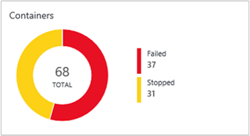
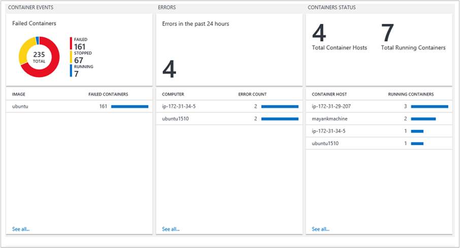

<properties
    pageTitle="在記錄檔分析容器解決方案 |Microsoft Azure"
    description="容器解決方案中記錄分析可協助您檢視及管理您的 Docker 容器主機，在單一位置。"
    services="log-analytics"
    documentationCenter=""
    authors="bandersmsft"
    manager="jwhit"
    editor=""/>

<tags
    ms.service="log-analytics"
    ms.workload="na"
    ms.tgt_pltfrm="na"
    ms.devlang="na"
    ms.topic="article"
    ms.date="10/10/2016"
    ms.author="banders"/>


# <a name="containers-preview-solution-log-analytics"></a>容器 （預覽版本） 解決方案記錄狀況分析

本文將說明如何設定和使用容器解決方案中記錄分析，可協助您檢視及管理您的 Docker 容器主機，在單一位置。 Docker 是用來建立自動化軟體 IT 基礎結構的部署的容器的軟體虛擬化系統。

使用解決方案，您可以看到您容器主機上執行的哪一個容器和圖像容器中的執行。 您可以檢視詳細的稽核資訊顯示容器搭配使用的命令。 然後，您可以檢視及搜尋集中的記錄，而不必從遠端檢視 Docker 主機，即可疑難排解在容器。 您可以找到可能雜訊而耗費主機上多餘的資源的容器。 然後，您可以檢視集中的 CPU、 記憶體、 儲存及容器的網路使用情況和效能資訊。

## <a name="installing-and-configuring-the-solution"></a>安裝及設定解決方案

安裝和設定方案，請使用下列資訊。

新增容器解決方案到 OMS 工作區使用[從方案庫新增記錄分析解決方案](log-analytics-add-solutions.md)所述的程序。

有兩種方式安裝並使用 OMS Docker:

- Linux 作業系統上，安裝和執行 Docker 然後安裝並設定 Linux OMS 代理程式
- 在 CoreOS，安裝及執行 Docker，然後設定執行容器內 OMSAgent

檢閱您容器上主機[GitHub](https://github.com/Microsoft/OMS-docker)支援的 Docker 和 Linux 作業系統版本。

>[AZURE.IMPORTANT] Docker 必須執行**之前**安裝[Linux OMS 代理人](log-analytics-linux-agents.md)您容器主機上。 如果您已經安裝代理程式安裝 Docker 之前，必須重新安裝 Linux OMS 代理程式。 如需有關 Docker 的詳細資訊，請參閱[Docker 網站](https://www.docker.com)。

您需要您可以監視容器之前，您的容器主機上設定下列設定。

## <a name="configure-settings-for-the-linux-container-host"></a>設定 Linux 容器 host （主機）

您已安裝 Docker 之後，請使用下列設定容器主機的 Docker 設定以使用代理程式。 CoreOS 不支援此設定的方法。

### <a name="to-configure-settings-for-the-container-host---systemd-suse-opensuse-centos-7x-rhel-7x-and-ubuntu-15x-and-higher"></a>若要設定為容器主機-systemd (SUSE openSUSE，CentOS 7.x，RHEL 7.x 及 Ubuntu 15.x 及更新版本)

1. 編輯 docker.service 新增下列動作︰

    ```
    [Service]
    ...
    Environment="DOCKER_OPTS=--log-driver=fluentd --log-opt fluentd-address=localhost:25225"
    ...
    ```

2. 新增 $DOCKER\_中選擇從&quot;ExecStart = / usr/bin/docker 精靈&quot;docker.service 檔案中。 使用下列範例。

    ```
    [Service]
    Environment="DOCKER_OPTS=--log-driver=fluentd --log-opt fluentd-address=localhost:25225"
    ExecStart=/usr/bin/docker daemon -H fd:// $DOCKER_OPTS
    ```

3. 重新啟動 Docker 服務。 例如︰

    ```
    sudo systemctl restart docker.service
    ```

### <a name="to-configure-settings-for-the-container-host---upstart-ubuntu-14x"></a>若要設定為容器主機-Upstart (Ubuntu 14.x)

1. 編輯 /etc/default/docker，並新增下列動作︰

    ```
    DOCKER_OPTS="--log-driver=fluentd --log-opt fluentd-address=localhost:25225"
    ```

2. 儲存檔案，然後重新啟動 Docker 和 OMS 服務。

    ```
    sudo service docker restart
    ```

### <a name="to-configure-settings-for-the-container-host---amazon-linux"></a>若要設定為容器主機-Amazon Linux 的設定

1. 編輯 /etc/sysconfig/docker，並新增下列動作︰

    ```
    OPTIONS="--log-driver=fluentd --log-opt fluentd-address=localhost:25225"
    ```

2. 儲存檔案，然後重新啟動 Docker 服務。

    ```
    sudo service docker restart
    ```

## <a name="configure-settings-for-coreos-containers"></a>設定 CoreOS 容器的設定

您已安裝 Docker 之後，請使用下列設定的 CoreOS 執行 Docker，以及建立容器。 您可以使用任何支援的版本的 Linux — 包括 CoreOS，使用此設定的方法。 您必須是您的[OMS 工作區 ID 和金鑰](log-analytics-linux-agents.md)。

### <a name="to-use-oms-for-all-containers-with-coreos"></a>若要使用 OMS 與 CoreOS 所有容器的

- 開始您想要監視 OMS 容器。 修改，並使用以下的範例。

  ```
sudo docker run --privileged -d -v /var/run/docker.sock:/var/run/docker.sock -e WSID="your workspace id" -e KEY="your key" -h=`hostname` -p 127.0.0.1:25224:25224/udp -p 127.0.0.1:25225:25225 --name="omsagent" --log-driver=none --restart=always microsoft/oms
```

### <a name="switching-from-using-an-installed-agent-to-one-in-a-container"></a>使用已安裝代理程式容器中的其中一個切換

如果您先前使用直接安裝代理程式，並想要改為使用 [容器中執行的代理人，您必須先移除 OMSAgent。 請參閱[安裝的 Linux OMS 代理程式的步驟](https://github.com/Microsoft/OMS-Agent-for-Linux/blob/master/docs/OMS-Agent-for-Linux.md)。

## <a name="containers-data-collection-details"></a>容器集合詳細資料

從容器主辦城市] 和 [使用您已啟用的 Linux OMS 代理程式的容器和 OMSAgent 容器中執行，容器解決方案會收集各種效能指標和記錄資料。

下表顯示資料集合方法和其他詳細資料的容器會收集的資料。

| 平台 | Linux OMS 代理程式 | 是 SCOM 代理程式 | Azure 儲存體 | 必要時，是 SCOM 嗎？ | 透過管理群組傳送是 SCOM 代理程式的資料 | 集合頻率 |
|---|---|---|---|---|---|---|
|Linux|![[是]](./media/log-analytics-containers/oms-bullet-green.png)|||            || 每 3 分鐘|


下表顯示容器方案所收集的資料類型的範例︰

| 資料類型 | 欄位 |
| --- | --- |
| [主辦城市] 和 [容器的效能 | 電腦、 物件、 CounterName 與 #40; %處理器時間磁碟讀取 MB 磁碟寫入 MB、 記憶體使用量 MB、 網路接收位元組、 網路傳送位元組，處理器使用 sec 網路與 #41;，CounterValue，TimeGenerated、 CounterPath SourceSystem |
| 容器庫存 | TimeGenerated、 電腦、 容器名稱 ContainerHostname、 圖像、 ImageTag、 ContinerState、 ExitCode、 EnvironmentVar、 命令、 CreatedTime、 StartedTime、 FinishedTime、 SourceSystem、 ContainerID、 ImageID |
| 容器圖像庫存 | TimeGenerated、 電腦、 圖像、 ImageTag、 ImageSize、 VirtualSize、 執行，暫停，停止，失敗，SourceSystem、 ImageID TotalContainer |
| 容器記錄 | TimeGenerated、 電腦、 圖像識別碼、 容器名稱 LogEntrySource、 LogEntry、 SourceSystem ContainerID |
| 容器服務記錄檔 | TimeGenerated、 電腦、 TimeOfCommand、 圖像、 命令、 SourceSystem、 ContainerID |

## <a name="monitor-containers"></a>監視器容器

有 OMS 入口網站中啟用方案之後，您會看到 [**容器**] 方塊顯示您容器主辦城市] 和 [主辦城市中執行的容器的摘要資訊。



執行，或停止此方塊會顯示環境和是否它們失敗，您有多少容器的概觀。

### <a name="using-the-containers-dashboard"></a>使用 [容器儀表板

按一下 [**容器**] 磚。 從這裡，您會看到組織的檢視︰

- 容器事件
- 錯誤
- 容器的狀態
- 容器圖像庫存
- CPU 和記憶體效能

在儀表板中的每個窗格是搜尋收集的資料上執行的視覺呈現。




在 [**容器狀態**刀中，按一下以最上方的區域，如下所示。


記錄檔搜尋隨即開啟，顯示 [主辦城市] 和 [執行中的容器的相關資訊。


從這裡開始，您可以編輯搜尋查詢來尋找特定資訊進行修改您感興趣。 如需記錄搜尋的詳細資訊，請參閱[記錄分析中的記錄檔搜尋](log-analytics-log-searches.md)。

例如，您可以修改搜尋查詢，以便透過變更**執行****停止**搜尋查詢中顯示，而不是執行容器的所有已停止的容器。

## <a name="troubleshoot-by-finding-a-failed-container"></a>疑難排解，請找失敗的容器

OMS 標示為 [**失敗**容器，如果以非零的結束代碼結束。 您可以看到的錯誤和**失敗容器**刀環境中的失敗的概觀。

### <a name="to-find-failed-containers"></a>若要尋找失敗的容器

1. 按一下 [**容器事件**刀]。  
  
2. 記錄檔搜尋隨即開啟，顯示容器，類似以下的狀態。  
  
3. 接下來，按一下 [若要檢視其他資訊，例如影像大小和停止和失敗圖像數失敗的值]。 展開 [**顯示更多**] 以檢視圖像識別碼  
  
4. 接下來，找到正在執行此圖像的容器。 輸入搜尋查詢中的動作。
  `Type=ContainerInventory <ImageID>`隨後便會顯示記錄。 您可以捲動以查看失敗的容器。  
  


## <a name="search-logs-for-container-data"></a>容器資料搜尋記錄

當您正在進行特定錯誤的疑難排解時，有助於若要查看發生您的環境中位置。 下列的記錄類型可協助您建立您想要查詢傳回的資訊。

- **ContainerInventory** – 使用正在執行此類型當您想要容器位置、 其名稱是什麼，以及什麼圖像相關資訊。
- **ContainerImageInventory** – 使用此類型當您嘗試尋找的資訊時組織圖像及，可檢視圖像的資訊，例如識別碼或大小的圖像。
- **ContainerLog** – 使用此類型當您要尋找特定的錯誤記錄檔資訊和項目。
- **ContainerServiceLog** – 使用此類型當您嘗試尋找的 Docker 精靈，例如開始、 停止、 刪除或擷取命令的稽核線索資訊。

### <a name="to-search-logs-for-container-data"></a>若要搜尋的容器資料記錄

- 選擇您知道圖像失敗最近及尋找錯誤記錄檔]。 請先尋找容器名稱以**ContainerInventory**搜尋執行的圖像。 例如，搜尋`Type=ContainerInventory ubuntu Failed`  
    

  請注意**名稱**旁容器的名稱，然後搜尋這些記錄。 在此範例中，則`Type=ContainerLog adoring_meitner`。

**檢視效能資訊**

當您開始建立查詢時，它可以協助，請參閱功能可能第一次。 例如，若要查看所有的效能資料，請嘗試主要查詢輸入下列搜尋查詢。

```
Type=Perf
```


您可以檢視此更多圖形表單中當您按一下 word**指標**在結果中。


您可以設定您看到的特定容器中輸入名稱的右邊的查詢效能資料的範圍。

```
Type=Perf <containerName>
```

顯示個別的容器收集的效能指標的清單。


## <a name="example-log-search-queries"></a>範例記錄搜尋查詢

通常是幫助以建立查詢範例或兩個開始著手，然後再修改以符合您的環境。 起點，您可以嘗試**主要查詢**刀，協助您建立更進階的查詢。


## <a name="saving-log-search-queries"></a>儲存記錄檔搜尋查詢

儲存查詢是中記錄分析的標準功能。 儲存，您必須找到實用的方便，以供日後使用。

建立您有用的查詢之後，請將其儲存記錄檔搜尋頁面的頂端的**[我的最愛]** ，即可。 然後您可以輕鬆地存取其稍後從 [**我的儀表板**頁面。

## <a name="next-steps"></a>後續步驟

- 若要檢視詳細的容器資料記錄中[搜尋記錄](log-analytics-log-searches.md)。
