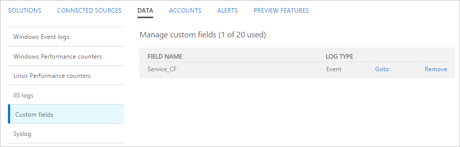

<properties
   pageTitle="自訂欄位中記錄分析 |Microsoft Azure"
   description="記錄檔分析的自訂欄位功能可讓您從 OMS 資料新增至收集記錄的屬性，建立您自己的搜尋欄位。  本文說明的程序建立的自訂欄位，並提供範例事件的詳細逐步解說。"
   services="log-analytics"
   documentationCenter=""
   authors="bwren"
   manager="jwhit"
   editor="tysonn" />
<tags
   ms.service="log-analytics"
   ms.devlang="na"
   ms.topic="article"
   ms.tgt_pltfrm="na"
   ms.workload="infrastructure-services"
   ms.date="10/18/2016"
   ms.author="bwren" />

# 在記錄檔分析中的自訂欄位

記錄分析的**自訂欄位**功能可讓您新增您自己的搜尋欄位來擴充 OMS 存放庫中的現有記錄。  自訂欄位是自動填入資料從在相同記錄其他屬性。

例如，下列範例記錄具有歸事件描述有用的資料。  擷取此資料到不同的屬性，以供排序及篩選的這類動作。

![登入 [搜尋] 按鈕](media/log-analytics-custom-fields/sample-extract.png)

>[AZURE.NOTE] 在預覽中，您會限制為 100 工作區中的自訂欄位。  這項功能達到追加一般的顯示狀態時，這項限制將會展開。

## 建立自訂欄位

當您建立自訂欄位時，記錄分析必須瞭解要用來填入其值的資料。  它會使用從 Microsoft Research 稱為 FlashExtract 技術來快速找出此資料。  而不需要您提供明確指示，記錄分析學習您想要擷取您所提供的範例資料的相關資訊。

下列各節提供建立自訂欄位的程序。  在本文底部是範例擷取的逐步解說。

> [!NOTE] 為符合指定的準則的記錄會新增至 OMS 資料存放區，使其只會出現在收集建立自訂欄位後的記錄，則會填入自訂欄位。  自訂欄位將不會新增至已資料存放區中建立的記錄。

### 步驟 1︰ 找出含有自訂欄位的記錄
第一步是識別會收到的自訂欄位的記錄。  您開始使用[標準記錄搜尋](log-analytics-log-searches.md)，然後選取 [記錄以作為記錄分析會從學習的模型。  當您指定您要將自訂欄位擷取資料時，您驗證及調整準則的位置開啟**欄位擷取精靈**。

2. 移至**記錄的搜尋**，並使用[查詢來擷取記錄](log-analytics-log-searches.md)的自訂欄位。
2. 選取記錄分析將用來做為解壓縮填入自訂欄位的資料模型的記錄。  您會找出您想要從這筆記錄，擷取資料並記錄分析會使用這項資訊來決定要填入的自訂欄位的類似的所有記錄的邏輯。
3. 按一下左側的任何記錄的 [text] 屬性按鈕，然後選取 [**擷取的欄位**。
4. **欄位解壓縮精靈] 中開啟**，而且您選取的記錄會顯示在 [**主要範例**] 欄中。  自訂欄位會使用相同的值，在選取的屬性，這些記錄的定義。  
5. 如果選擇不完全是您想要選取 [縮小準則的其他欄位]。  若要變更欄位值的準則，您必須取消，並選取不同的記錄符合您想要的準則。

### 步驟 2-執行初始解壓縮。
一旦您已識別記錄的自訂欄位，您會識別您想要擷取的資料。  記錄檔分析會使用這項資訊來找出類似類似的記錄中的模式。  在步驟之後您可以驗證結果，並提供更進一步記錄分析，其分析中使用的詳細資料。

1. 醒目提示您想要填入的自訂欄位的範例記錄中的文字。  然後會提供欄位的名稱，並執行初始解壓縮的對話方塊顯示。  字元**\_CF**會自動被附加。
2. 按一下 [執行分析收集記錄中的 [**擷取**]。  
3. [**摘要**及**搜尋結果**] 區段會顯示解壓縮的結果，以便您可以檢查其精確度。  **摘要**顯示用來識別記錄和計算的每個識別的資料值的準則。  **搜尋結果**會提供符合準則的記錄的詳細的清單。

### 步驟 3-確認解壓縮的精確度，以及建立自訂欄位

一旦您已執行初始解壓縮，記錄分析會顯示已收集的資料為基礎的結果。  如果結果看起來正確然後您就可以建立自訂欄位與任何進一步的工作。  如果沒有出現，然後調整結果，以便記錄分析可以改善其邏輯。

2.  如果初始解壓縮中的任何值不正確，然後按一下 [不正確的記錄旁的 [**編輯**] 圖示，並才能修改選取範圍中選取 [**修改此醒目提示**。
3.  項目複製至**其他範例**區段下方的 [**主要範例**。  您可以調整醒目提示以下協助記錄分析瞭解應該有所做的選擇。
4.  按一下 [使用此新的資訊來評估所有現有記錄的 [**擷取**]。  可根據這項新的智慧修改過的項目以外的記錄修改結果。
5.  繼續新增校正，直到解壓縮的所有記錄正確都識別要填入新的自訂欄位的資料。
6. 當您滿意結果時，請按一下 [**儲存擷取**]。  現在已定義的自訂欄位，但它不會新增至任何記錄尚未。
7.  請等候符合指定的準則收集並再執行一次記錄搜尋的新記錄。 新記錄應具備自訂欄位。
8.  使用自訂欄位像其他任何記錄的屬性。  您可以使用彙總及群組資料，並甚至用它來產生新的深入見解。

## 檢視自訂欄位
在您 OMS 儀表板的 [從 [**設定**] 方塊的 [管理] 群組中，您可以檢視所有自訂欄位的清單。  如需工作區中的所有自訂欄位的清單中選取**資料**，然後**自訂欄位**。  

## 移除自訂欄位
有兩種方式若要移除自訂欄位。  檢視的完整清單，如上述時，第一個是每個欄位的 [**移除**] 選項。  其他方法可擷取記錄，然後按一下左側的欄位] 按鈕。  功能表會有若要移除的自訂欄位] 選項。

## 範例逐步解說

下一節逐步建立自訂欄位的完整的範例。  此範例中抽選中表示變更狀態服務的 Windows 事件的服務名稱。  這是在 Windows 電腦的系統記錄檔中建立的服務控制管理員的事件。  如果您想要遵循此範例中，您必須是[收集系統記錄的資訊事件](log-analytics-data-sources-windows-events.md)。

我們輸入下列查詢傳回的所有事件從服務控制管理員有 7036 事件 ID 即表示啟動或停止服務事件。

然後，我們會選取任何記錄與事件識別碼 7036。

我們想要的服務名稱會出現在 [ **RenderedDescription** ] 屬性中，選取 [此屬性按鈕。

**欄位擷取精靈**會開啟，並在**主要範例**資料行選取**事件記錄檔**] 和 [ **EventID**欄位。  這表示定義的自訂欄位，從系統記錄檔的 7036 識別碼的事件。  這是足夠，因此我們不需要選取任何其他欄位。

我們會醒目提示 [ **RenderedDescription** ] 屬性中服務名稱，並使用**服務**來識別服務名稱。  [自訂] 欄位會被稱為**Service_CF**。

我們可以看到某些記錄，而不是用於其他服務名稱正確識別。   **搜尋結果**會顯示未選取 [ **WMI 效能介面卡**名稱的一部分。  **摘要**顯示**DPRMA**服務的四筆記錄不正確包含額外的 word，這兩筆記錄可查**模組安裝程式**，而不是**Windows 模組安裝程式**。  

我們開始**WMI 效能介面卡**記錄。  我們按一下其編輯] 圖示，然後**修改此醒目提示**。  

我們會增加附上**WMI** ，然後重新執行解壓縮以醒目提示。  

我們可以看到的已修正**WMI 效能**介面卡的項目，並記錄分析也可以用這項資訊來修正**Windows 模組**安裝程式的記錄。  我們可以看到 [**摘要**] 區段中，雖然該**DPMRA**仍尚未被識別正確。

我們會向下捲動至 DPMRA 服務記錄，並使用的相同程序修正該筆記錄。

 執行擷取，我們可以看到所有結果現在正確。

我們可以看到**Service_CF**會建立，但是還不會新增至任何記錄。

一些時間已經過了，因此新增後收集事件，我們可以看到的現在會被**Service_CF**欄位新增至記錄的相符項目我們的準則。

現在，我們可以使用像其他任何記錄屬性的自訂欄位。  若要說明這一點，我們會建立群組的新的**Service_CF**欄位要檢查有哪些服務是最踴躍的查詢。

## 後續步驟

- 瞭解[記錄搜尋](log-analytics-log-searches.md)建置查詢準則中使用自訂欄位。
- 監控您剖析使用自訂欄位的[自訂的記錄檔](log-analytics-data-sources-custom-logs.md)。