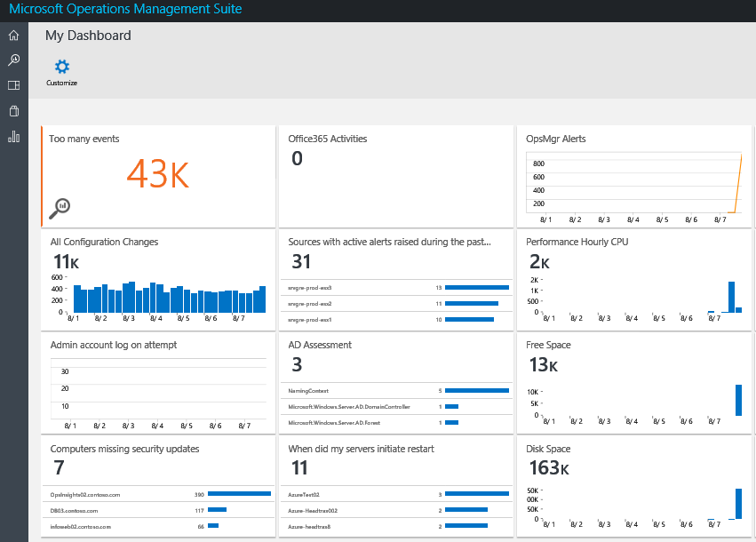
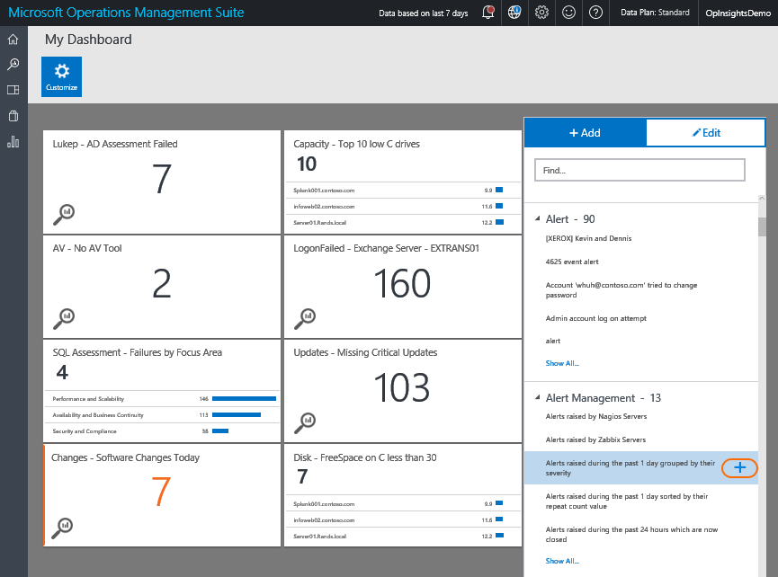
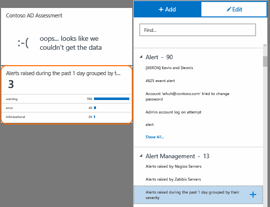

<properties
    pageTitle="在 [記錄分析中建立自訂的儀表板 |Microsoft Azure"
    description="本指南可協助您瞭解如何記錄分析儀表板能以視覺化方式呈現所有您儲存記錄檔的搜尋，可讓您以檢視您的環境的單一 lens。"
    services="log-analytics"
    documentationCenter=""
    authors="bandersmsft"
    manager="jwhit"
    editor=""/>

<tags
    ms.service="log-analytics"
    ms.workload="na"
    ms.tgt_pltfrm="na"
    ms.devlang="na"
    ms.topic="article"
    ms.date="10/10/2016"
    ms.author="banders"/>

# 在 [記錄分析中建立自訂的儀表板

本指南可協助您瞭解如何記錄分析儀表板能以視覺化方式呈現所有您儲存記錄檔的搜尋，可讓您以檢視您的環境的單一 lens。

所有自訂儀表板在 OMS 入口網站中所建立，也會提供 OMS Mobile 應用程式。 請參閱下列相關應用程式的詳細資訊的頁面。

- [從 Microsoft 市集的 OMS 行動應用程式](http://www.windowsphone.com/store/app/operational-insights/4823b935-83ce-466c-82bb-bd0a3f58d865)
- [從 Apple iTunes 的 OMS 行動應用程式](https://itunes.apple.com/app/microsoft-operations-management/id1042424859?mt=8)

## 如何建立我的儀表板？

若要開始，請移至 [OMS 概觀] 頁面。 在左側，您會看到 [**我的儀表板**] 磚。 按一下向下切入儀表板。

## 新增方塊

在儀表板，磚的可儲存記錄檔搜尋。 OMS 提供許多預先製作的儲存記錄檔的搜尋，讓您立即開始。 使用大綱如何開始的下列步驟。

在我的儀表板檢視中，只要按一下 [**自訂**]，輸入自訂模式。

 隨後便會開啟頁面右側的面板會顯示所有的工作區儲存記錄檔搜尋。 若要以視覺化方式顯示儲存記錄檔搜尋方塊，將游標停留在已儲存的搜尋，然後按一下 [**加上**符號。

當您按一下**加上**符號時，新方塊會出現在 [我的儀表板] 檢視中。

## 編輯方塊

在我的儀表板檢視中，只要按一下 [**自訂**]，輸入自訂模式。 按一下您想要編輯的方塊。 若要編輯的右側面板變更，並提供的選項︰

### 並排顯示視覺效果#
有三種選擇的並排顯示視覺效果︰

|圖表類型|功能|
|---|---|
||如果或不會記錄搜尋彙總欄位，結果，請以橫條圖或清單的欄位，結果的顯示儲存記錄檔搜尋結果的時間表。
||顯示為] 方塊中的數字的總記錄搜尋結果叫用。 公制磚可讓您設定達到閾值時將會醒目提示磚閥值。|
||折線圖會顯示您儲存記錄檔搜尋結果叫用含有值的時間表。|

### 閥值
您可以使用 [公制的視覺效果的圖磚上建立臨界值。 若要建立臨界值的圖磚上，選取 [上]。 選擇是否要值是位於或底下所選的閥值，然後設定下列臨界值時，醒目提示磚。

## 組織儀表板
組織您的儀表板，請瀏覽至 [我的儀表板] 檢視，然後按一下**自訂**輸入自訂模式。 按一下並拖曳您想要移動，並將其移至您要為您磚的磚。

## 移除方塊
移除方塊，請瀏覽至 [我的儀表板] 檢視，然後按一下**自訂**輸入自訂模式。 選擇您想要移除，然後在右側的面板上選取 [**移除] 磚**。

## 後續步驟

- 建立記錄檔分析產生的通知並修復問題[通知](log-analytics-alerts.md)。
