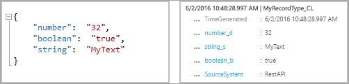
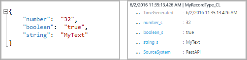

<properties
    pageTitle="登入分析 HTTP 資料收集 API |Microsoft Azure"
    description="您可以使用記錄分析 HTTP 資料收集 API 從打電話 REST API 任何用戶端記錄分析存放庫新增文章 JSON 資料。 本文將說明如何使用 API，並已發佈的資料使用不同的程式設計語言的範例。"
    services="log-analytics"
    documentationCenter=""
    authors="bwren"
    manager="jwhit"
    editor=""/>

<tags
    ms.service="log-analytics"
    ms.workload="na"
    ms.tgt_pltfrm="na"
    ms.devlang="na"
    ms.topic="article"
    ms.date="10/26/2016"
    ms.author="bwren"/>


# <a name="log-analytics-http-data-collector-api"></a>登入分析 HTTP 資料收集 API

當您使用 Azure 記錄分析 HTTP 資料收集 API 時，您可以新增至記錄分析存放庫文章 JavaScript 物件標記法 (JSON) 資料從打電話 REST API 任何用戶端。 藉由使用這個方法，您可以從 Azure 自動化中 runbook 像傳送資料從協力廠商應用程式或指令碼。  

## <a name="create-a-request"></a>建立邀請

接下來的兩個資料表會列出屬性所需的每個記錄分析 HTTP 資料收集 API 邀請。 我們會說明在本文稍後的更多詳細資料中的每個屬性。

### <a name="request-uri"></a>要求 URI

| 屬性 | 屬性 |
|:--|:--|
| 方法 | 文章 |
| URI | https://\<「 客戶識別碼 」\>.ods.opinsights.azure.com/api/logs?api-version=2016-04-01 |
| 內容類型 | 應用程式/json |

### <a name="request-uri-parameters"></a>要求 URI 參數
| 參數 | 描述 |
|:--|:--|
| [客戶編號]  | Microsoft 作業管理套件工作區的唯一識別碼。 |
| 資源    | API 資源名稱: / api/記錄。 |
| API 版本 | 若要使用此要求 API 的版本。 目前，它是 2016年-04-01。 |

### <a name="request-headers"></a>要求標頭
| 頁首 | 描述 |
|:--|:--|
| 授權 | 授權簽章中。 稍後在文章中，您可以瞭解有關如何建立 HMAC SHA256 頁首。 |
| 記錄類型 | 指定要送的資料中的記錄類型。 目前的記錄類型支援 alpha 的字元。 不支援數字或特殊字元。 |
| x ms 日期 | 要求已處理，RFC 1123 格式的日期。 |
| 時間產生的欄位 | 所包含的資料項目時間戳記的資料中的欄位名稱。 如果您指定欄位的內容用於**TimeGenerated**。 如果未指定此欄位， **TimeGenerated**的預設值是郵件 ingested 的時間。 [郵件] 欄位的內容應該會遵循 ISO 8601 格式 YYYY-MM-DDThh:mm:ssZ。 |


## <a name="authorization"></a>授權

任何記錄分析 HTTP 資料收集 API 邀請必須包含授權標頭。 若要驗證要求，您必須登主要或第二個機碼，提出要求的工作區邀請。 然後傳送該簽名要求的一部分。   

以下是授權標頭的格式︰

```
Authorization: SharedKey <WorkspaceID>:<Signature>
```

*WorkspaceID*是作業管理套件工作區的唯一識別碼。 *簽章*是[雜湊訊息驗證碼 (HMAC)](https://msdn.microsoft.com/library/system.security.cryptography.hmacsha256.aspx)建構要求，然後使用[SHA256 演算法](https://msdn.microsoft.com/library/system.security.cryptography.sha256.aspx)來計算。 然後，您將其使用編碼 Base64 編碼。

使用此格式編碼**SharedKey**簽章字串︰

```
StringToSign = VERB + "\n" +
               Content-Length + "\n" +
               Content-Type + "\n" +
               x-ms-date + "\n" +
               "/api/logs";
```

以下是簽章字串的範例︰

```
POST\n1024\napplication/json\nx-ms-date:Mon, 04 Apr 2016 08:00:00 GMT\n/api/logs
```

如果您有簽章字串，編碼，因此使用 HMAC SHA256 演算法 UTF-8 8 編碼的字串，然後編碼 Base64 結果。 使用此格式︰

```
Signature=Base64(HMAC-SHA256(UTF8(StringToSign)))
```

下一節中的範例有可協助您建立的授權標頭的程式碼範例。

## <a name="request-body"></a>邀請內文

在郵件本文必須在 JSON。 此格式，它必須包含屬性名稱 / 值組的一或多個記錄︰

```
{
"property1": "value1",
" property 2": "value2"
" property 3": "value3",
" property 4": "value4"
}
```

您可以使用下列格式，以批次單一要求在一起的多筆記錄。 所有記錄都必須都是相同的記錄類型。

```
{
"property1": "value1",
" property 2": "value2"
" property 3": "value3",
" property 4": "value4"
},
{
"property1": "value1",
" property 2": "value2"
" property 3": "value3",
" property 4": "value4"
}
```

## <a name="record-type-and-properties"></a>記錄類型和屬性

當您送出透過記錄分析 HTTP 資料收集 API 的資料時，您可以定義自訂的記錄類型。 目前您無法將資料寫入現有記錄類型，所建立的其他資料類型與解決方案。 記錄檔分析讀取的內送的資料，，然後建立符合您所輸入的值的資料類型的屬性。

每個記錄分析 API 邀請必須包含**記錄類型**頁首並記錄類型的名稱。 尾碼**_CL**會自動加上您輸入名稱區分作為自訂記錄其他類型的記錄。 例如，如果您輸入名稱**MyNewRecordType**，記錄分析會與類型**MyNewRecordType_CL**建立記錄。 這可協助確保使用者建立類型的名稱和送貨目前或未來 Microsoft 方案中沒有發生衝突。

若要識別屬性的資料類型，記錄分析會將屬性名稱尾碼。 如果屬性包含 null 值，屬性並不會包含該記錄。 此表列出的資料類型的屬性及相對應的後置字元︰

| 資料類型的屬性 | 後置字元 |
|:--|:--|
| 字串    | _s |
| 布林值   | _b |
| 點兩下    | _d |
| 日期/時間 | _t |
| GUID      | _g |


使用每個屬性的記錄分析的資料類型已存在的新記錄的記錄類型的是否而定。

- 如果不存在的記錄類型，記錄分析會建立一個新。 記錄檔分析使用 JSON 型別推斷，來判斷每個新記錄的屬性的資料類型。
- 如果不存在的記錄類型，記錄分析嘗試建立新的記錄根據現有的屬性。 在新記錄中的屬性如果的資料類型不相符，並無法轉換為現有的類型，或記錄分析如果記錄包含不存在的屬性，請建立一個新的屬性具有相關的尾碼。

例如，這個送出項目會建立記錄與三個屬性、 **number_d**、 **boolean_b**， **string_s**:


如果您送出這個下一個項目，具有格式化成字串的所有值，就不會變更屬性。 這些值可以轉換至現有的資料類型︰



不過，如果您然後此下送出，記錄分析會建立新屬性**boolean_d**和**string_d**。 無法轉換為以下值︰


如果之前已建立的記錄類型，然後提交下列項目，，記錄分析會與三個屬性、 **number_s**、 **boolean_s**， **string_s**建立記錄。 在此項目，每個起始值的格式為字串︰




## <a name="data-limits"></a>資料的限制
有一些限制周圍張貼至記錄分析資料集合 API 的資料。

- 30 MB 的每個最大到記錄分析資料收集 API 的文章。 這是單一文章的大小限制。 如果從單一資料張貼的超過 30 MB，您應該分割的資料，最小的尺寸區塊同時傳送給他們。 
- 32 KB 限制欄位值的最大值。 如果欄位值大於 32 KB，資料會取至整數。 
- 建議的數目上限為指定的類型] 欄位為 50。 這是實際的限制，從合用性和搜尋體驗的觀點。  


## <a name="return-codes"></a>傳回碼

HTTP 狀態碼 202 表示已接受邀請進行處理，但尚未完成處理。 這表示順利完成作業。

此表列出可能會傳回服務的狀態碼完成的設定︰

| 程式碼 | 狀態 | 錯誤碼 | 描述 |
|:--|:--|:--|:--|
| 202 | 接受 |  | 成功接受要求。 |
| 400 | 錯誤的要求 | InactiveCustomer | 工作區已關閉。 |
| 400 | 錯誤的要求 | InvalidApiVersion | 由服務無法辨識您指定的 API 版本。 |
| 400 | 錯誤的要求 | InvalidCustomerId | 指定的工作區識別碼不正確。 |
| 400 | 錯誤的要求 | InvalidDataFormat | 已提交無效 JSON。 回應內容可能包含有關如何解決錯誤的詳細資訊。 |
| 400 | 錯誤的要求 | InvalidLogType | 包含特殊字元或數字，就會指定的記錄類型。 |
| 400 | 錯誤的要求 | MissingApiVersion | 未指定的 API 版本。 |
| 400 | 錯誤的要求 | MissingContentType | 未指定的內容類型。 |
| 400 | 錯誤的要求 | MissingLogType | 未指定值所需的記錄類型。 |
| 400 | 錯誤的要求 | UnsupportedContentType | 內容類型未設定為**應用程式/json**。 |
| 403 | 禁止 | InvalidAuthorization | 服務無法驗證要求。 確認有效的工作區識別碼和連線鍵。 |
| 500 | 內部伺服器錯誤 | UnspecifiedError | 服務發生內部錯誤。 請重試要求。 |
| 503 | 服務無法使用 | ServiceUnavailable | 服務目前無法使用接收要求。 請重試您的要求。 |

## <a name="query-data"></a>查詢資料

若要查詢送出記錄分析 HTTP 資料收集 API 的資料，請搜尋記錄**類型**，等於**LogType**值與您指定、 附加與**_CL**。 例如，如果您使用**MyCustomLog**，然後您會傳回的所有記錄**類型 = MyCustomLog_CL**。


## <a name="sample-requests"></a>範例要求

在下一個區段中，您會發現如何資料送出到記錄分析 HTTP 資料收集 API 使用不同的程式設計語言的範例。

針對每一個範例中，執行下列步驟，為授權標頭中的變數︰

1. 在 [作業管理套件] 入口網站中，選取 [**設定**] 方塊中，，然後選取 [**連線來源**] 索引標籤。
2. **工作區 ID**的右邊，選取 [複製] 圖示，並貼識別碼為**客戶識別碼**變數的值。
3. 右邊的**主索引鍵**，選取 [複製] 圖示，並貼識別碼為**共用金鑰**變數的值。

或者，您可以變更的記錄類型和 JSON 資料的變數。

### <a name="powershell-sample"></a>PowerShell 範例

```
# Replace with your Workspace ID
$CustomerId = "xxxxxxxx-xxxx-xxxx-xxxx-xxxxxxxxxxxx"  

# Replace with your Primary Key
$SharedKey = "xxxxxxxxxxxxxxxxxxxxxxxxxxxxxx"

# Specify the name of the record type that you'll be creating
$LogType = "MyRecordType"

# Specify a field with the created time for the records
$TimeStampField = "DateValue"


# Create two records with the same set of properties to create
$json = @"
[{  "StringValue": "MyString1",
    "NumberValue": 42,
    "BooleanValue": true,
    "DateValue": "2016-05-12T20:00:00.625Z",
    "GUIDValue": "9909ED01-A74C-4874-8ABF-D2678E3AE23D"
},
{   "StringValue": "MyString2",
    "NumberValue": 43,
    "BooleanValue": false,
    "DateValue": "2016-05-12T20:00:00.625Z",
    "GUIDValue": "8809ED01-A74C-4874-8ABF-D2678E3AE23D"
}]
"@

# Create the function to create the authorization signature
Function Build-Signature ($customerId, $sharedKey, $date, $contentLength, $method, $contentType, $resource)
{
    $xHeaders = "x-ms-date:" + $date
    $stringToHash = $method + "`n" + $contentLength + "`n" + $contentType + "`n" + $xHeaders + "`n" + $resource

    $bytesToHash = [Text.Encoding]::UTF8.GetBytes($stringToHash)
    $keyBytes = [Convert]::FromBase64String($sharedKey)

    $sha256 = New-Object System.Security.Cryptography.HMACSHA256
    $sha256.Key = $keyBytes
    $calculatedHash = $sha256.ComputeHash($bytesToHash)
    $encodedHash = [Convert]::ToBase64String($calculatedHash)
    $authorization = 'SharedKey {0}:{1}' -f $customerId,$encodedHash
    return $authorization
}


# Create the function to create and post the request
Function Post-OMSData($customerId, $sharedKey, $body, $logType)
{
    $method = "POST"
    $contentType = "application/json"
    $resource = "/api/logs"
    $rfc1123date = [DateTime]::UtcNow.ToString("r")
    $contentLength = $body.Length
    $signature = Build-Signature `
        -customerId $customerId `
        -sharedKey $sharedKey `
        -date $rfc1123date `
        -contentLength $contentLength `
        -fileName $fileName `
        -method $method `
        -contentType $contentType `
        -resource $resource
    $uri = "https://" + $customerId + ".ods.opinsights.azure.com" + $resource + "?api-version=2016-04-01"

    $headers = @{
        "Authorization" = $signature;
        "Log-Type" = $logType;
        "x-ms-date" = $rfc1123date;
        "time-generated-field" = $TimeStampField;
    }

    $response = Invoke-WebRequest -Uri $uri -Method $method -ContentType $contentType -Headers $headers -Body $body -UseBasicParsing
    return $response.StatusCode

}

# Submit the data to the API endpoint
Post-OMSData -customerId $customerId -sharedKey $sharedKey -body ([System.Text.Encoding]::UTF8.GetBytes($json)) -logType $logType  
```

### <a name="c-sample"></a>C# 範例

```
using System;
using System.Net;
using System.Security.Cryptography;

namespace OIAPIExample
{
    class ApiExample
    {
// An example JSON object, with key/value pairs
        static string json = @"[{""DemoField1"":""DemoValue1"",""DemoField2"":""DemoValue2""},{""DemoField1"":""DemoValue3"",""DemoField2"":""DemoValue4""}]";

// Update customerId to your Operations Management Suite workspace ID
        static string customerId = "xxxxxxxx-xxx-xxx-xxx-xxxxxxxxxxxx";

// For sharedKey, use either the primary or the secondary Connected Sources client authentication key   
        static string sharedKey = "xxxxxxxxxxxxxxxxxxxxxxxxxxxxxx";

// LogName is name of the event type that is being submitted to Log Analytics
        static string LogName = "DemoExample";

// You can use an optional field to specify the timestamp from the data. If the time field is not specified, Log Analytics assumes the time is the message ingestion time
        static string TimeStampField = "";

        static void Main()
        {
// Create a hash for the API signature
            var datestring = DateTime.UtcNow.ToString("r");
            string stringToHash = "POST\n" + json.Length + "\napplication/json\n" + "x-ms-date:" + datestring + "\n/api/logs";
            string hashedString = BuildSignature(stringToHash, sharedKey);
            string signature = "SharedKey " + customerId + ":" + hashedString;

            PostData(signature, datestring, json);
        }

// Build the API signature
        public static string BuildSignature(string message, string secret)
        {
            var encoding = new System.Text.ASCIIEncoding();
            byte[] keyByte = Convert.FromBase64String(secret);
            byte[] messageBytes = encoding.GetBytes(message);
            using (var hmacsha256 = new HMACSHA256(keyByte))
            {
                byte[] hash = hmacsha256.ComputeHash(messageBytes);
                return Convert.ToBase64String(hash);
            }
        }

// Send a request to the POST API endpoint
        public static void PostData(string signature, string date, string json)
        {
            string url = "https://"+ customerId +".ods.opinsights.azure.com/api/logs?api-version=2016-04-01";
            using (var client = new WebClient())
            {
                client.Headers.Add(HttpRequestHeader.ContentType, "application/json");
                client.Headers.Add("Log-Type", LogName);
                client.Headers.Add("Authorization", signature);
                client.Headers.Add("x-ms-date", date);
                client.Headers.Add("time-generated-field", TimeStampField);
                client.UploadString(new Uri(url), "POST", json);
            }
        }
    }
}
```

### <a name="python-sample"></a>Python 範例

```
import json
import requests
import datetime
import hashlib
import hmac
import base64

# Update the customer ID to your Operations Management Suite workspace ID
customer_id = 'xxxxxxx-xxxx-xxxx-xxxx-xxxxxxxxxxxx'

# For the shared key, use either the primary or the secondary Connected Sources client authentication key   
shared_key = "xxxxxxxxxxxxxxxxxxxxxxxxxxxxxx"

# The log type is the name of the event that is being submitted
log_type = 'WebMonitorTest'

# An example JSON web monitor object
json_data = [{
   "slot_ID": 12345,
    "ID": "5cdad72f-c848-4df0-8aaa-ffe033e75d57",
    "availability_Value": 100,
    "performance_Value": 6.954,
    "measurement_Name": "last_one_hour",
    "duration": 3600,
    "warning_Threshold": 0,
    "critical_Threshold": 0,
    "IsActive": "true"
},
{   
    "slot_ID": 67890,
    "ID": "b6bee458-fb65-492e-996d-61c4d7fbb942",
    "availability_Value": 100,
    "performance_Value": 3.379,
    "measurement_Name": "last_one_hour",
    "duration": 3600,
    "warning_Threshold": 0,
    "critical_Threshold": 0,
    "IsActive": "false"
}]
body = json.dumps(json_data)

#####################
######Functions######  
#####################

# Build the API signature
def build_signature(customer_id, shared_key, date, content_length, method, content_type, resource):
    x_headers = 'x-ms-date:' + date
    string_to_hash = method + "\n" + str(content_length) + "\n" + content_type + "\n" + x_headers + "\n" + resource
    bytes_to_hash = bytes(string_to_hash).encode('utf-8')  
    decoded_key = base64.b64decode(shared_key)
    encoded_hash = base64.b64encode(hmac.new(decoded_key, bytes_to_hash, digestmod=hashlib.sha256).digest())
    authorization = "SharedKey {}:{}".format(customer_id,encoded_hash)
    return authorization

# Build and send a request to the POST API
def post_data(customer_id, shared_key, body, log_type):
    method = 'POST'
    content_type = 'application/json'
    resource = '/api/logs'
    rfc1123date = datetime.datetime.utcnow().strftime('%a, %d %b %Y %H:%M:%S GMT')
    content_length = len(body)
    signature = build_signature(customer_id, shared_key, rfc1123date, content_length, method, content_type, resource)
    uri = 'https://' + customer_id + '.ods.opinsights.azure.com' + resource + '?api-version=2016-04-01'

    headers = {
        'content-type': content_type,
        'Authorization': signature,
        'Log-Type': log_type,
        'x-ms-date': rfc1123date
    }

    response = requests.post(uri,data=body, headers=headers)
    if (response.status_code == 202):
        print 'Accepted'
    else:
        print "Response code: {}".format(response.status_code)

post_data(customer_id, shared_key, body, log_type)
```

## <a name="next-steps"></a>後續步驟

- 使用[檢視設計工具](log-analytics-view-designer.md)建立自訂的檢視，在您提交的資料。
