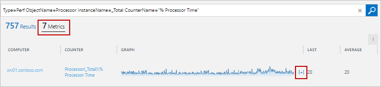

<properties 
   pageTitle="Windows 和 Linux 效能計數器中記錄分析 |Microsoft Azure"
   description="記錄檔分析來分析效能 Windows 和 Linux 代理程式上的會收集效能計數器。  本文將說明如何設定集合的效能計數器這兩個視窗，Linux 代理程式，他們的詳細資料會儲存在 OMS 存放庫和分析其 OMS 入口網站中。"
   services="log-analytics"
   documentationCenter=""
   authors="bwren"
   manager="jwhit"
   editor="tysonn" />
<tags 
   ms.service="log-analytics"
   ms.devlang="na"
   ms.topic="article"
   ms.tgt_pltfrm="na"
   ms.workload="infrastructure-services"
   ms.date="10/27/2016"
   ms.author="bwren" />

# Windows 和 Linux 效能的資料來源記錄狀況分析 

在 Windows 和 Linux 的效能計數器提供深入了解硬體元件與作業系統、 應用程式的效能。  記錄分析可以收集效能計數器在靠近即時 (NRT) 分析，除了彙總效能資料的較長的字詞分析與報告的頻率。

## 設定效能計數器

設定[記錄分析設定] 中的 [資料] 功能表](log-analytics-data-sources.md#configuring-data-sources)的效能計數器。

當您第一次設定 Windows 或 Linux 效能計數器新 OMS 工作區時，您可以快速建立幾個常見計數器的選項。  列出每個] 旁的核取方塊。  請確定您想要開始建立任何計數器已核取，然後按一下 [**新增選取的效能計數器**。

請遵循此程序新增新的 Windows 效能計數器收集。

1. 在 [格式化*物件 （執行個體） \counter*中的 [文字] 方塊中輸入計數器的名稱。  當您開始輸入時，您會看到的常見計數器相符的清單。  您可以從您自己的其中一種類型的清單選取 [計數器。  您也可以藉由指定*object\counter*傳回特定的計數器的所有例項。 
2. 按一下 [**+**或按下**enter 鍵**將計數器新增至清單。
3. 當您新增計數器時，它會使用其**範例間隔**10 秒內的預設值。  您可以變更此較高的值的最 1800 秒 （30 分鐘） 如果您想要減少收集的效能資料的儲存空間需求。
4. 當您完成新增計數器時，按一下 [儲存設定] 畫面頂端的 [**儲存**] 按鈕。

請遵循此程序新增新的 Linux 效能計數器收集。

1. 根據預設，所有設定變更自動推都入所有代理程式。  Linux 代理程式的設定檔會傳送至 Fluentd 資料收集。  如果您想要修改以手動方式在每個 Linux 代理程式此檔案，然後取消核取 [*套用至我的 Linux 電腦設定] 下方*的方塊。
2. 在 [格式化*物件 （執行個體） \counter*中的 [文字] 方塊中輸入計數器的名稱。  當您開始輸入時，您會看到的常見計數器相符的清單。  您可以從您自己的其中一種類型的清單選取 [計數器。  
2. 按一下 [**+**或按下**Enter**以新增至清單中其他物件的計數器計數器。
3. 物件的所有計數器都使用相同的**範例間隔**。  預設值為 10 的秒數。  您變更為較高的值的最 1800 秒 （30 分鐘） 如果您想要減少收集的效能資料的儲存空間需求。
4. 當您完成新增計數器時，按一下 [儲存設定] 畫面頂端的 [**儲存**] 按鈕。

## 資料收集

記錄檔分析會收集所有指定的效能計數器其指定的範例間隔的計數器安裝的所有代理程式上。  未彙總資料，以及原始資料可在所有記錄搜尋檢視指定 OMS 訂閱的持續時間。

## 效能記錄內容

效能記錄**效能**類型，並在下表中包含的內容。

| 屬性 | 描述 |
|:--|:--|
| 電腦         | 從收集事件的電腦。 |
| CounterName      | 效能計數器名稱 |
| CounterPath      | 在表單中計數器的完整路徑\\ \\\<電腦 >\\object(instance)\\計數器。 |
| CounterValue     | 計數器的數值。  |
| InstanceName     | 事件執行個體名稱。  清空如果沒有執行個體。 |
| 物件       | 效能物件的名稱 |
| SourceSystem  | 從收集代理程式的資料類型。   OpsManager – Windows 代理程式]、 [直接連線或是 SCOM   Linux – 所有 Linux 代理程式    AzureStorage – Azure 診斷程式 |
| TimeGenerated       | 日期及時間取樣資料。 |

## 調整大小的評估

 估計在 10 秒的時間間隔的特定計數器集合是關於 1 MB 每日每個執行個體。  您可以估計特定計數器的下列公式的儲存空間的需求。

    1 MB x (number of counters) x (number of agents) x (number of instances)

## 記錄效能記錄的搜尋

下表提供擷取效能記錄的記錄檔搜尋不同的範例。

| 查詢 | 描述 |
|:--|:--|
| 輸入 = 效能 | 所有的效能資料 |
| 輸入 = 效能電腦 = 「 我 」 | 在特定的電腦的所有效能資料 |
| 輸入 = 效能 CounterName = 」 目前磁碟佇列長度 」 | 所有的效能資料特定計數器 |
| 輸入 = 效能 (從 = 處理器) CounterName = 「 %處理器時間 」 InstanceName = _Total & #124;為電腦的 AVGCPU Avg(Average) 的量值 | 平均所有電腦的 CPU 使用率 |
| 輸入 = 效能 (CounterName ="%處理器 Time") & #124; 測量 max(Max) 電腦 | 在所有電腦的 CPU 使用上限 |
| 輸入 = 效能從 = 邏輯磁碟 CounterName = 」 目前磁碟佇列長度 」 電腦 = 」 MyComputerName 「 & #124;量值來 InstanceName Avg(Average) | 指定電腦的所有執行個體的平均目前磁碟佇列長度 |
| 輸入 = 效能 CounterName ="DiskTransfers/sec"& #124;測量 percentile95(Average) 電腦 | 95th 百分位數的磁碟轉送/Sec 所有電腦 |
| 輸入 = 效能 CounterName = 「 %處理器時間 」 InstanceName = 」 _Total 「 & #124;測量 avg(CounterValue) 電腦間隔 1 小時 | 所有電腦的 CPU 使用率每小時的平均值 |
| 輸入 = 效能電腦 = 「 我 」 CounterName = %* InstanceName = _Total & #124;測量 percentile70(CounterValue) CounterName 間隔 1 小時 | 每小時 70 的百分位數的每個 %百分比計數器特定的電腦 |
| 輸入 = 效能 CounterName = 「 %處理器時間 」 InstanceName = 」 _Total 」 (電腦 = 「 我 」) & #124;測量 min(CounterValue)、 avg(CounterValue)、 percentile75(CounterValue) max(CounterValue) 電腦間隔 1 小時 | 每小時平均值、 最小值、 最大值和 75 個百分位數 CPU 使用率用於特定的電腦 |

## 檢視效能資料

當您執行效能資料記錄中的搜尋時，預設會顯示**記錄檔**檢視。  若要檢視資料圖形表單中，按一下 [**指標**]。  詳細的圖形化檢視中，按一下 [**+**計數器旁。  

如果您已選取的時間範圍是 6 小時之內，該圖表會更新每隔幾秒鐘。  即時的資料會顯示在右側的圖表中淺藍色。

若要彙總在記錄檔搜尋效能資料，請[視需要公制彙總和 OMS 中的視覺效果](http://blogs.technet.microsoft.com/msoms/2016/02/26/on-demand-metric-aggregation-and-visualization-in-oms/)，請參閱。

## 後續步驟

- 深入了解[記錄搜尋](log-analytics-log-searches.md)，以分析的資料來源與解決方案從收集的資料。  
- 收集的資料匯出到[Power BI](log-analytics-powerbi.md) ，，其他視覺效果和分析。