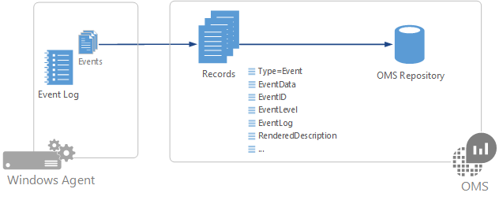
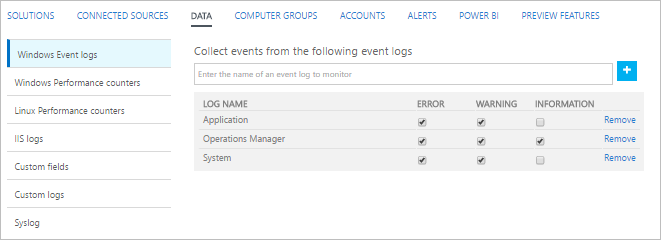

<properties 
   pageTitle="Windows 事件記錄檔中記錄分析 |Microsoft Azure"
   description="Windows 事件記錄是最常見的資料來源使用記錄分析。  本文將說明如何設定的 Windows 事件記錄檔的收集與他們 OMS 存放庫中建立的記錄的詳細資料。"
   services="log-analytics"
   documentationCenter=""
   authors="bwren"
   manager="jwhit"
   editor="tysonn" />
<tags 
   ms.service="log-analytics"
   ms.devlang="na"
   ms.topic="article"
   ms.tgt_pltfrm="na"
   ms.workload="infrastructure-services"
   ms.date="10/18/2016"
   ms.author="bwren" />

# 記錄檔分析中的 Windows 事件記錄檔資料來源

Windows 事件記錄是最常見[的資料來源](log-analytics-data-sources.md)，用於 Windows 代理程式，因為這是用來登入資訊和錯誤大部分的應用程式的方法。  除了指定您要監視的應用程式所建立的任何自訂記錄檔，您可以從標準的記錄，例如系統和應用程式收集事件。

     

## 設定 Windows 事件記錄

設定[記錄分析設定] 中的 [資料] 功能表](log-analytics-data-sources.md#configuring-data-sources)的 Windows 事件記錄檔。

記錄分析只會收集事件設定中指定的 Windows 事件記錄檔。  您可以輸入在登入名稱，然後按一下 [新增新的記錄檔**+**。  每個記錄檔，將會收集只有事件與所選的重要性。  核取您要收集的特定記錄檔的重要性。  您無法提供任何其他準則來篩選事件。

## 資料收集

記錄檔分析會收集建立事件時符合監視的事件記錄檔選取的嚴重性每項事件。  代理程式將錄製位置，它會從每個事件記錄檔中。  如果代理程式離線一段時間，然後記錄分析將事件從收集上次停止的地方，即使代理程式離線時，所建立的事件。

## Windows 事件記錄屬性

Windows 事件記錄**事件**的類型，並在下表中包含的內容。

| 屬性 | 描述 |
|:--|:--|
| 電腦            | 事件收集從電腦的名稱。 |
| EventCategory       | 類別的事件。 |
| EventData           | 原始格式中的所有事件資料。 |
| EventID             | 事件的數目。 |
| EventLevel          | 數字的表單中的事件的嚴重性。 |
| EventLevelName      | 以文字形式事件的嚴重性。 |
| 事件記錄檔            | 從收集事件的事件記錄檔的名稱。 |
| ParameterXml        | 事件的 XML 格式參數值。 |
| ManagementGroupName | 是 SCOM 代理程式的 [管理] 群組的名稱。  其他代理程式 」，這是 AOI-<workspace ID> |
| RenderedDescription | 事件描述與參數值 |
| 來源              | 事件的來源。 |
| SourceSystem  | 從收集代理程式的事件類型。   OpsManager – Windows 代理程式]、 [直接連線或是 SCOM   Linux – 所有 Linux 代理程式    AzureStorage – Azure 診斷程式 |
| TimeGenerated       | 日期及時間在 Windows 中建立的事件。 |
| 使用者名稱            | 登入事件的帳戶使用者名稱。 |

## Windows 事件記錄檔搜尋

下表提供擷取 Windows 事件記錄的記錄檔搜尋不同的範例。

| 查詢 | 描述 |
|:--|:--|
| 輸入 = 事件 | 所有的 Windows 事件。 |
| 輸入 = 事件 EventLevelName = 錯誤 | 所有的 Windows 事件與錯誤嚴重性。 |
| 輸入 = 事件 & #124;來源量值 count （) | 計算的 Windows 事件來源。 |
| 輸入 = 事件 EventLevelName = 錯誤 & #124;來源量值 count （) | 計算的 Windows 錯誤事件來源。 |

## 後續步驟

- 設定記錄分析，收集分析的其他[資料來源](log-analytics-data-sources.md)。
- 深入了解[記錄搜尋](log-analytics-log-searches.md)，以分析的資料來源與解決方案從收集的資料。  
- 使用[自訂欄位](log-analytics-custom-fields.md)來剖析的事件記錄至個別功能變數。
- 設定您的 Windows 代理程式的[效能計數器集合](log-analytics-data-sources-performance-counters.md)。