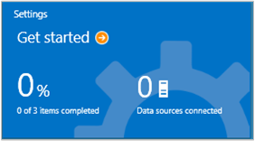

<properties
    pageTitle="開始使用記錄分析 |Microsoft Azure"
    description="您可以使用記錄分析 Microsoft 作業管理套件 (OMS) 中取得執行，以分鐘為單位。"
    services="log-analytics"
    documentationCenter=""
    authors="bandersmsft"
    manager="jwhit"
    editor=""/>

<tags
    ms.service="log-analytics"
    ms.workload="na"
    ms.tgt_pltfrm="na"
    ms.devlang="na"
    ms.topic="get-started-article"
    ms.date="10/10/2016"
    ms.author="banders"/>

# 開始使用記錄狀況分析

您可以使用記錄分析 Microsoft 作業管理套件 (OMS) 中取得執行，以分鐘為單位。 選擇如何建立 OMS 工作區，類似帳戶時，您會有兩個選項︰

- Microsoft 作業管理套件網站
- Microsoft Azure 訂閱

您可以建立使用 OMS 網站免費 OMS 工作區。 或者，您可以使用 Microsoft Azure 訂閱建立 OMS 工作區。 兩個工作區是功能相同，但免費的 OMS 工作區只能夠在傳送 500 MB 的資料每天 OMS 服務。 如果您使用的 Azure 訂閱時，您也可以使用該訂閱存取其他 Azure 服務。 無論您用來建立工作區的方式，您會建立工作區與 Microsoft 帳戶或組織帳戶。

以下是一窺程序︰

## 記錄檔分析先決條件及部署考量

- 您需要的付費的 Microsoft Azure 訂閱完全使用記錄分析。 如果您沒有 Azure 訂閱，建立可讓您存取任何 Azure 服務的[免費的帳戶](https://azure.microsoft.com/free/)。 或者，您可以在[作業管理套件](http://microsoft.com/oms)網站建立的免費 OMS 帳戶，然後按一下 [**免費試用**。
- OMS 工作區
- 每個您想要收集的資料必須在執行 Windows Server 2008 SP1 的 Windows 電腦或以上
- OMS[防火牆](log-analytics-proxy-firewall.md)存取 web 服務的地址
- 若要將流量從伺服器 OMS，以存取網際網路無法從電腦上使用[OMS 記錄分析轉寄站](https://blogs.technet.microsoft.com/msoms/2016/03/17/oms-log-analytics-forwarder)（閘道） 伺服器
- 如果您是使用 Operations Manager，記錄分析支援作業管理員 2012 SP1 UR6 並上方及作業管理員 2012 R2 UR2 及以上。 Proxy 支援已加入的作業管理員 2012 SP1 UR7 和作業管理員 2012 R2 UR3。 決定如何將其會與整合 OMS。
- 判斷您的電腦是否直接存取網際網路。 如果不是，它們會需要閘道伺服器存取 OMS 網站服務。 所有的 access 是透過 HTTPS。
- 決定哪些技術和伺服器會傳送資料至 OMS。 例如，網域控制站，SQL Server 等。
- 將權限授與 OMS 和 Azure 中的使用者。
- 如果您擔心資料使用，個別部署每一個解決方案，然後再新增其他解決方案測試的效能影響。
- 當您新增至記錄分析的解決方案與功能，請檢閱您的資料使用和效能。 這包含事件集合、 記錄集合、 收集效能資料等。更好開始使用最小的集合，直到資料使用量或已識別效能的影響。
- 確認 Windows 代理程式不也管理使用 Operations Manager，否則會造成重複的資料。 這也適用於 Azure-基礎-代理程式的 Azure 診斷啟用。
- 代理程式安裝之後，請確認代理程式正常運作。 如果不是，以確保加密 API 的核取︰ 下一個產生 (CNG) 鍵隔離未停用使用群組原則。
- 一些記錄分析解決方案有其他需求

## 使用作業管理套件的步驟 3 中登入

1. 移至[作業管理套件](http://microsoft.com/oms)網站，然後按一下 [**免費試用**。 若要使用 Office 365 或其他 Microsoft 服務，使用您的 Microsoft 帳戶例如 Outlook.com，或使用組織帳戶提供您的公司或教育機構的登入。
2. 提供一個唯一的工作區名稱。 工作區是邏輯容器管理資料儲存的位置。 會提供您貴組織中的不同小組之間的磁碟分割資料的方法如下的資料是由工作區。 指定的電子郵件地址和您要儲存資料的區域。  
    
3. 接下來，您可以建立新的 Azure 訂閱或連結至現有的 Azure 訂閱。 如果您想要繼續使用免費的試用版，請按一下 [**不是現在**]。  
  

您準備好要開始使用作業管理套件入口網站。

您可以進一步瞭解您的工作區設定與連結現有 Azure 帳戶建立與[管理存取記錄分析](log-analytics-manage-access.md)在作業管理套件的工作區。

## 使用 Microsoft Azure 快速登入

1. 移至[Azure 入口網站](https://portal.azure.com)和登入、 瀏覽的服務清單，然後選取**記錄分析 (OMS)**。  
    
2. 按一下 [**新增**]，然後選取下列項目的選項︰
    - **OMS 工作區**名稱
    - **訂閱**-如果您有多個訂閱，選擇您想要建立新的工作區的關聯。
    - **資源群組**
    - **位置**
    - **價格層**  
        
3. 按一下 [**建立**]，您會看到 Azure 入口網站中的工作區詳細資料。       
             
4. 按一下以開啟新的工作區作業管理套件網站**OMS 入口網站**連結。

您準備好要開始使用作業管理套件入口網站。

您可以進一步瞭解您的工作區設定與連結至 Azure 訂閱[管理存取記錄分析](log-analytics-manage-access.md)作業管理套件與您建立的現有工作區。

## 開始使用作業管理套件入口網站
若要選擇解決方案，而且您想要管理伺服器連線，按一下 [**設定**] 方塊並依照本節中的步驟。  

  

1. **新增解決方案**-檢視您已安裝的解決方案。  
      
    按一下 [新增更多的解決方案的 [**瀏覽 [圖庫**]。  
      
    選取一個方案，然後按一下 [**新增]**。
2. **連線來源**-選擇您要連線到您的伺服器環境收集資料的方式︰
    - 安裝代理程式來直接連接任何 Windows Server 或用戶端。
    - 將連線到 Linux 伺服器 OMS 代理程式的 Linux。
    - 使用 Windows 或 Linux Azure 診斷 VM 副檔名所設定的 Azure 儲存體帳戶。
    - 使用系統管理中心 Operations Manager 附加管理群組或整個 Operations Manager 部署。
    - 啟用 Windows 遙測使用升級分析。
            

3. **收集資料**填入您的工作區資料至少有一個資料來源設定]。 完成時，請按一下 [**儲存**]。    

        

## 您也可以伺服器直接連接到作業管理套件安裝代理程式

下列範例會示範如何安裝 Windows 代理程式。

1. 按一下 [**設定**] 方塊，按一下 [**連線來源**] 索引標籤、 按一下您想要新增來源類型] 及 [任一下載的索引標籤代理程式或進一步瞭解如何啟用代理程式。 例如，按一下 [**下載 Windows 代理程式 （64 位元）**]。 Windows 代理程式，您只能安裝在 Windows Server 2008 sp1 或更新版本或 Windows 7 SP1 或更新版本上的代理程式。
2. 在一或多個伺服器上安裝代理程式。 您可以安裝代理程式接一個項目或更自動化的方法使用[自訂指令碼](log-analytics-windows-agents.md)，或者您可以使用現有的軟體發佈方案，您可能需要。
3. 您同意授權合約，並選擇您的安裝資料夾之後，選擇 [**連線的代理程式 Azure 記錄分析 (OMS)**]。   
    

4. 在下一個頁面上，系統會要求您的工作區識別碼和工作區鍵。 您的工作區編號及索引鍵會顯示在畫面下載代理程式檔案的位置。  
      

    
5. 在安裝期間，您可以按一下 [**進階**]，您也可以設定您的 proxy 伺服器，並提供驗證資訊。 按一下 [**下一步**] 按鈕，若要返回工作區的 [資訊] 畫面。
6. 按一下 [**下一步**以驗證您的工作區編號及索引鍵。 如果找不到任何錯誤，您可以按一下**回**進行修正。 驗證您的工作區識別碼和鍵時按一下 [完成安裝代理程式的 [**安裝**]。
7. 在 [控制台] 中，按一下 [Microsoft 監控代理程式 > Azure 記錄分析 (OMS)] 索引標籤。 代理程式與作業管理套件服務通訊時，會出現綠色核取記號圖示。 開始時，會約 5 到 10 分鐘的時間。

>[AZURE.NOTE] 直接連接到作業管理套件的伺服器目前不支援的容量管理和設定評估解決方案。

您也可以連線至系統管理中心的作業管理員 2012 SP1 及更新版本的代理程式。 若要這麼做，請選擇 [**連線至系統管理中心 Operations Manager 代理程式**]。 當您選擇的選項，您傳送至服務的資料，而不需要額外的硬體或載入您管理群組。

您可以閱讀更多在[連線的 Windows 電腦記錄分析](log-analytics-windows-agents.md)作業管理套件連線代理程式的相關。

## 您也可以使用系統管理中心 Operations Manager 的伺服器的連線

1. 在 Operations Manager 主控台中，選取 [**管理**]。
2. 展開 [**操作的深入見解**節點並選取**操作的深入見解連線**。

  >[AZURE.NOTE] 根據哪些更新彙總套件的是 SCOM 您使用的，您可能會看到*系統管理中心顧問*、*操作的深入見解*或*作業管理套件*的節點。

3. 按一下 [向右上角的 [**註冊操作獲得深入見解**] 連結，然後依照指示操作。
4. 完成註冊精靈之後，按一下 [**新增電腦/群組**] 連結。
5. 在**電腦搜尋**] 對話方塊中您可以搜尋電腦或監視 Operations Manager 的群組。 選取電腦或內建的群組這些至記錄分析、 按一下 [**新增**]，然後按一下**[確定]**。 您可以驗證 OMS 服務所收到的資料，移至作業管理套件入口網站中的 [**使用狀況**] 磚。 資料應該出現在約 5 到 10 分鐘的時間。

您可以閱讀更多在[連線至記錄分析的 Operations Manager](log-analytics-om-agents.md)作業管理套件連線 Operations Manager 相關。

## 您也可以分析從 Microsoft Azure 中的雲端服務的資料

使用作業管理套件中，您可以快速搜尋事件和雲端服務和虛擬機器 IIS 記錄檔啟用診斷 Azure 雲端服務。 您也可以安裝 Microsoft 監控代理程式，來接收用於 Azure 虛擬機器的其他深入資訊。 您可以閱讀更多關於如何設定在[連線 Azure 儲存空間來記錄分析](log-analytics-azure-storage.md)中使用作業管理套件 Azure 環境。

## 後續步驟

- 若要新增的功能和收集資料[從方案庫新增記錄分析解決方案](log-analytics-add-solutions.md)。
- 熟悉[記錄搜尋](log-analytics-log-searches.md)檢視收集解決方案的詳細的資訊。
- 使用[儀表板](log-analytics-dashboards.md)來儲存及顯示您自己的自訂搜尋。
