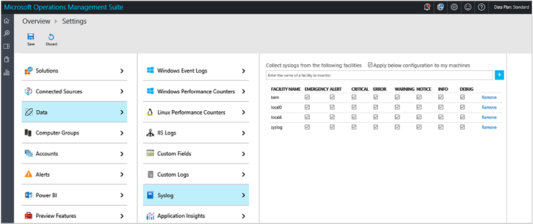
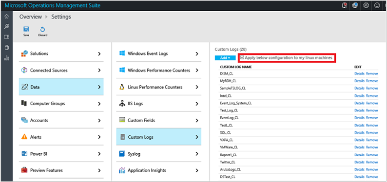

<properties
    pageTitle="Linux 電腦連線到記錄分析 |Microsoft Azure"
    description="您可以使用記錄分析，收集並採取行動產生從 Linux 電腦上的資料。"
    services="log-analytics"
    documentationCenter=""
    authors="bandersmsft"
    manager="jwhit"
    editor=""/>

<tags
    ms.service="log-analytics"
    ms.workload="na"
    ms.tgt_pltfrm="na"
    ms.devlang="na"
    ms.topic="article"
    ms.date="10/10/2016"
    ms.author="banders"/>

# <a name="connect-linux-computers-to-log-analytics"></a>Linux 電腦連線到記錄狀況分析

您可以使用記錄分析，收集並採取行動產生從 Linux 電腦上的資料。 新增資料至 OMS 收集從 Linux 可讓您管理 Linux 系統，例如 Docker 的容器解決方案，無論您的電腦位於何處，幾乎所有地方。 因此，這些資料來源可能位於實體伺服器，例如 Amazon Web 服務 (AWS) 或 Microsoft Azure 或甚至在桌上的膝上型電腦的雲端裝載服務中的虛擬電腦為您的內部部署資料中心。 此外，OMS 也會收集資料從 Windows 電腦上同樣的讓它支援真正混合式 IT 環境。

您可以檢視並從所有這些來源與記錄分析中 OMS 單一管理入口網站管理資料。 這會減少監視使用許多不同的系統，使其易於使用，而且您可以將您要的任何資料匯出至任何商務分析解決方案或您已經有的系統需求。

本文是快速入門指南，可協助您收集並管理 Linux 電腦使用 Linux OMS 代理程式的資料。 取得更多技術的詳細資訊，例如 proxy 伺服器設定，CollectD 標準和自訂 JSON 資料來源的相關資訊，您會發現 Github [OMS 代理人 Linux 概觀](https://github.com/Microsoft/OMS-Agent-for-Linux)與[Linux 完整的文件的 OMS 代理程式](https://github.com/Microsoft/OMS-Agent-for-Linux/blob/master/docs/OMS-Agent-for-Linux.md)的資訊。


目前，您也可以從 Linux 電腦收集下列類型的資料︰

- 效能指標
- 系統事件
- 從 Nagios 和 Zabbix 的通知
- Docker 容器效能指標、 庫存和記錄檔

## <a name="supported-linux-versions"></a>支援的 Linux 版本

在各種不同的 Linux 散佈正式支援 x86 和 x64 版本。 不過，Linux OMS 代理人也可能會執行上未列出其他散佈。

- Amazon Linux 透過 2015.09 2012.09
- CentOS Linux 5、 6 和 7
- Oracle Linux 5、 6 和 7
- 紅色的角色企業 Linux 伺服器 5、 6 和 7
- Debian GNU/Linux 6、 7 和 8
- Ubuntu 12.04 LTS、 14.04 LTS 15.04、 15.10
- SUSE Linux Enterprise Server 11 和 12

## <a name="oms-agent-for-linux"></a>Linux OMS 代理程式
Linux 作業管理套件代理程式包含多個封包。 發行檔案包含下列套件，即可執行命令介面套件與`--extract`。

**套件** | **版本** | **描述**
----------- | ----------- | --------------
omsagent | 1.1.0 | Linux 作業管理套件代理程式
omsconfig | 1.1.1 | 設定代理程式 OMS 代理程式
omi | 1.0.8.3 | 開啟管理基礎結構 (OMI)-輕量型 CIM 伺服器
scx | 1.6.2 | 作業系統效能指標 OMI CIM 提供者
apache cimprov | 1.0.0 | Apache HTTP 伺服器效能監視 OMI 提供者。 如果偵測到 Apache HTTP 伺服器時，只安裝。
mysql cimprov | 1.0.0 | MySQL 伺服器效能監視 OMI 提供者。 如果偵測到 MySQL/MariaDB 伺服器時，只安裝。
docker cimprov | 0.1.0 | OMI docker 提供者。 如果偵測到 Docker 時，只安裝。

### <a name="additional-installation-artifacts"></a>其他安裝成品
安裝後 OMS 代理程式的 Linux 套件，就會套用下列其他系統設定變更。 解除安裝 omsagent 套件時，會移除這些成品。
- 名為未授權使用者︰`omsagent`建立。 這是以執行 omsagent 精靈的帳戶
- 建立一個 sudoers 「 包含 」 檔案 /etc/sudoers.d/omsagent 在此授權 omsagent 重新啟動系統和 omsagent 協助。 已安裝 sudo 版本不支援 sudo 「 包含 」 指示詞時，這些項目會寫入 /etc/sudoers。
- 修改系統設定轉寄給代理程式的事件的子集。 如需詳細資訊，請參閱下方的 [**設定資料集合**] 區段

### <a name="linux-data-collection-details"></a>Linux 集合詳細資料

下表顯示資料集合方法和其他詳細資料收集的方式。

| 來源 | 直接代理程式 | 是 SCOM 代理程式 | Azure 儲存體 | 必要時，是 SCOM 嗎？ | 透過管理群組傳送是 SCOM 代理程式的資料 | 集合頻率 |
|---|---|---|---|---|---|---|
|Zabbix|![[是]](./media/log-analytics-linux-agents/oms-bullet-green.png)|||            ||1 分鐘|
|Nagios|![[是]](./media/log-analytics-linux-agents/oms-bullet-green.png)|||            ||來到|
|系統|![[是]](./media/log-analytics-linux-agents/oms-bullet-green.png)|||            ||從 Azure 儲存空間︰ 10 分鐘的時間。從代理程式︰ 來到|
|Linux 效能計數器|![[是]](./media/log-analytics-linux-agents/oms-bullet-green.png)|||            ||依照排程、 10 秒內的最小值|
|追蹤修訂|![[是]](./media/log-analytics-linux-agents/oms-bullet-green.png)|||            ||每小時|


### <a name="package-requirements"></a>封裝需求
| **必要的套件**  | **描述**   | **最小版本**|
|--------------------- | --------------------- | -------------------|
|Glibc |    GNU C 文件庫   | 2.5 12|
|Openssl    | OpenSSL 文件庫 | 0.9.8e 或 1.0|
|捲曲 | 捲曲網頁用戶端 | 7.15.5
|Python ctypes |函數的文件庫 | n/a|
|PAM | 隨插即用驗證模組  |n/a |

>[AZURE.NOTE] 需要 rsyslog 或系統 ng 收集系統訊息。 版本 5 紅色角色企業 Linux CentOS，與 Oracle Linux 版本 (sysklog) 上的預設系統精靈不支援系統事件集合。 若要從這些散佈此版本收集系統資料，應該安裝和設定取代 sysklog rsyslog 精靈。

## <a name="quick-install"></a>快速安裝

請執行下列命令以下載 omsagent，驗證總和，然後再安裝與內建代理程式。 64 位元版的命令。 在 [**設定****連線來源**] 索引標籤上 [OMS 入口網站中，找到的工作區編號及主索引鍵。


```
wget https://github.com/Microsoft/OMS-Agent-for-Linux/releases/download/v1.1.0-28/omsagent-1.1.0-28.universal.x64.sh
sha256sum ./omsagent-1.1.0-28.universal.x64.sh
sudo sh ./omsagent-1.1.0-28.universal.x64.sh --upgrade -w <YOUR OMS WORKSPACE ID> -s <YOUR OMS WORKSPACE PRIMARY KEY>
```

有各種不同的其他方法來安裝代理程式，並將它升級。 您可以閱讀更多相關[安裝 Linux OMS 代理程式](https://github.com/Microsoft/OMS-Agent-for-Linux/blob/master/docs/OMS-Agent-for-Linux.md#steps-to-install-the-oms-agent-for-linux)的步驟。

您也可以檢視[Azure 視訊的逐步解說](https://www.youtube.com/watch?v=mF1wtHPEzT0)。

## <a name="choose-your-linux-data-collection-method"></a>選擇您 Linux 資料集合方法

如何選擇是否要使用 OMS 入口網站，或者如果您想編輯各種不同的設定檔，直接在您的 Linux 用戶端上取決於您想要收集的資料類型。 如果您選擇使用入口網站，設定會自動傳送至所有 Linux 用戶端。 如果您需要不同的 Linux 用戶端的不同設定，您必須以個別 – 編輯用戶端檔案或使用 PowerShell DSC、 主廚或傀儡等的替代方案。

您可以指定您想要收集使用 Linux 電腦上的設定檔的效能計數器與系統事件。 *如果您選擇設定資料收集編輯代理程式的設定檔，您應該停用集中式的設定。*  提供指示代理程式的設定檔中設定資料收集以及停用所有 OMS 代理程式的中央設定為 Linux 或個別的電腦。

### <a name="disable-oms-management-for-an-individual-linux-computer"></a>停用個別 Linux 電腦的 OMS 管理

設定資料集中的資料收集已停用個別 Linux 電腦與 OMS_MetaConfigHelper.py 指令碼。 這會有幫助如果電腦的子集應有所設計的設定。

若要停用集中式的設定︰

```
sudo /opt/microsoft/omsconfig/Scripts/OMS_MetaConfigHelper.py --disable
```

若要重新啟用集中式的設定︰

```
sudo /opt/microsoft/omsconfig/Scripts/OMS_MetaConfigHelper.py –enable
```

## <a name="linux-performance-counters"></a>Linux 效能計數器

Windows 效能計數器 Linux 效能計數器類似，都會在同樣的運作。 若要新增，並將其設定，您可以使用下列程序。 即會新增到 OMS 之後，會收集資料，每隔 30 秒。

### <a name="to-add-a-linux-performance-counter-in-oms"></a>若要新增 Linux 效能計數器 OMS 中

1. 若要設定 OMS 代理程式的 Linux 使用 OMS 入口網站，您可以新增 Linux 效能計數器，在 [設定] 頁面上，按一下 [**資料**]。  
2. 在 [**資料**] 下的 [**設定**] 頁面中，按一下**Linux 效能計數器**再選取，或輸入您想要新增的計數器的名稱。  
    
3. 如果您不知道計數器的完整名稱，您可以開始輸入部分名稱，並會顯示可用的計數器清單。 當您找到您想要新增的計數器時，請按一下清單中的名稱，然後按一下 [新增計數器加號圖示。
4. 新增計數器之後，它會顯示在計數器的彩色列以醒目提示的清單。
5. 根據預設，已選取 [**套用至我的電腦設定] 下方**的選項。 如果您想要停用傳送設定資料，請清除 [將選取範圍。
6. 當您完成修改效能計數器時，在頁面底部按一下 [**儲存**完成您的變更。 設定您所做的變更然後是已送出 Linux 註冊的 OMS，通常是在 5 分鐘內的所有 OMS 代理程式。

### <a name="configure-linux-performance-counters-in-oms"></a>設定 OMS Linux 效能計數器

Windows 效能計數器，您可以選擇特定的執行個體，每個效能計數器。 不過，Linux 效能計數器，您所選擇的計數器任意執行個體適用於所有的子計數器的上層計數器。 下表顯示使用 Linux 和 Windows 效能計數器常見的執行個體。

| **執行個體名稱** | **意義** |
| --- | --- |
| \_總計 | 所有執行個體的總計 |
| \* | 所有執行個體 |
| (/ & #124; / var) | 符合命名的執行個體: / 或 /var |


同樣地，及其所有子計數器適都用於上層計數器您選擇的範例間隔。 換句話說，所有的子計數器範例間隔及執行個體被連結在一起。

### <a name="add-and-configure-performance-metrics-with-linux"></a>新增與設定 Linux 效能指標

收集效能指標會控制 /etc/opt/microsoft/omsagent/conf/omsagent.conf 中的設定。 請參閱[可用的效能指標](https://github.com/Microsoft/OMS-Agent-for-Linux/blob/master/docs/OMS-Agent-for-Linux.md#appendix-available-performance-metrics)可用的類別和指標 OMS 代理程式 Linux。

每個物件或類別，收集效能指標應為單一設定檔中定義`<source>`項目。 語法會遵循下列模式。

```
<source>
  type oms_omi  
  object_name "Processor"
  instance_regex ".*"
  counter_name_regex ".*"
  interval 30s
</source>

```

可設定的參數，此項目的是︰

- **物件\_名稱**︰ 集合的物件名稱。
- **執行個體\_regex**︰ 定義要收集的例項的*規則運算式*。 值︰`.*`指定所有執行個體。 僅限收集的處理器指標\_總的執行個體，您可以指定`_Total`。 若要收集的只 crond 或 sshd 執行個體的程序指標，您可以指定︰ `(crond|sshd)`。
- **[計數器\_名稱\_regex**︰ 定義的計數器 （物件） 來收集的*規則運算式*。 若要收集的物件的所有計數器，指定︰ `.*`。 若要收集只有交換空間計數器的記憶體物件，您可以指定︰`.+Swap.+`
- **間隔︰**︰ 物件的計數器收集到的頻率。

效能標準的預設設定為︰

```
<source>
  type oms_omi
  object_name "Physical Disk"
  instance_regex ".*"
  counter_name_regex ".*"
  interval 5m
</source>

<source>
  type oms_omi
  object_name "Logical Disk"
  instance_regex ".*
  counter_name_regex ".*"
  interval 5m
</source>

<source>
  type oms_omi
  object_name "Processor"
  instance_regex ".*
  counter_name_regex ".*"
  interval 30s
</source>

<source>
  type oms_omi
  object_name "Memory"
  instance_regex ".*"
  counter_name_regex ".*"
  interval 30s
</source>

```

### <a name="enable-mysql-performance-counters-using-linux-commands"></a>啟用 MySQL 效能計數器使用 Linux] 命令

如果 MySQL 伺服器或 MariaDB 伺服器偵測電腦上安裝 omsagent 套件時，則會自動安裝效能監視 MySQL 伺服器提供者。 此提供者連線到本機 MySQL/MariaDB 伺服器公開效能統計資料。 您需要設定 MySQL 使用者認證，以便提供者能夠存取 MySQL 伺服器。

若要在本機上定義預設 MySQL 伺服器的使用者帳戶，請使用下列命令範例。

>[AZURE.NOTE] 認證檔案必須是可讀取 omsagent 帳戶。 建議您為 omsgent 執行 mycimprovauth 命令。


```
sudo su omsagent -c '/opt/microsoft/mysql-cimprov/bin/mycimprovauth default 127.0.0.1 <username> <password>'

sudo service omiserverd restart
```


或者，您可以在檔案中，指定必要的 MySQL 認證所建立的檔案︰ /var/opt/microsoft/mysql-cimprov/auth/omsagent/mysql-auth. 如需有關管理 MySQL 認證監控透過 mysql 驗證檔案的詳細資訊，請參閱[驗證檔案中的管理 MySQL 監控認證](#manage-mysql-monitoring-credentials-in-the-authentication-file)。

如需詳細資訊 MySQL 使用者收集 MySQL 伺服器效能資料所需的物件權限，請參閱[資料庫的權限所需的 MySQL 效能計數器](#database-permissions-required-for-mysql-performance-counters)。

### <a name="enable-apache-http-server-performance-counters-using-linux-commands"></a>啟用 Apache HTTP 伺服器效能計數器使用 Linux] 命令

如果 Apache HTTP 伺服器偵測電腦上安裝 omsagent 套件時，則會自動安裝效能監視 Apache HTTP 伺服器提供者。 此提供者依賴 Apache 必須載入到 Apache HTTP 伺服器，才能存取效能資料的 「 模組 」。

您可以載入的模組使用下列命令︰

```
sudo /opt/microsoft/apache-cimprov/bin/apache_config.sh -c
```

若要卸載監控同時，執行下列命令︰

```
sudo /opt/microsoft/apache-cimprov/bin/apache_config.sh -u
```
### <a name="to-view-performance-data-with-log-analytics"></a>若要檢視的記錄檔分析效能資料

1. 在作業管理套件入口網站中，按一下 [記錄搜尋] 方塊。
2. 在 [搜尋] 列中，輸入`* (Type=Perf)`若要檢視所有的效能計數器。


因為 OMS 也會收集 Windows 效能計數器資料，您應該範圍向 Linux 特定的資料搜尋。 因此，下列範例會顯示效能資料特定名為 Chorizo21 範例 Linux 伺服器。

```
Type=Perf Computer=chorizo*
```


在結果中，您可以按一下**標準**檢視計數器資料收集到的。 即時資料會顯示為每個計數器的圖形。


## <a name="syslog"></a>系統

系統會類似 Windows 事件記錄檔的事件記錄通訊協定，都會同樣運作時顯示在 OMS。

### <a name="to-add-a-new-linux-syslog-facility-in-oms"></a>若要新增新的 Linux 系統設備 OMS 中

1. 在 [**資料**] 下的 [**設定**] 頁面中，按一下 [**系統**，然後加上圖示的左邊，輸入您想要新增系統設備的名稱。
    
2.  如果您不知道完整功能的名稱，您可以開始輸入部分名稱，然後使用系統設備清單會出現。 當您找到您要新增系統設備時，請按一下清單中的名稱，然後按一下 [加號圖示以新增系統設備。
3.  新增設備，會出現在清單中之後醒目提示的彩色的列。 接下來，選擇您想要收集嚴重性 （系統設備資訊的類別）。
4.  在頁面底部按一下 [**儲存**] 完成您的變更。 設定您所做的變更然後是已送出 Linux 註冊的 OMS，通常是在 5 分鐘內的所有 OMS 代理程式。


### <a name="configure-linux-syslog-facilities-in-linux"></a>設定 Linux Linux 系統設備

系統事件的系統精靈，例如 「 rsyslog 」 或 「 系統 ng，從傳送到本機的連接埠上接聽代理程式。 根據預設，連接埠 25224。 代理程式安裝時，會套用預設系統設定。 這是位於︰


Rsyslog: /etc/rsyslog.d/rsyslog-oms.conf

系統 ng: /etc/syslog-ng/syslog-ng.conf


預設 OMS 代理程式的系統設定上傳嚴重性警告或更高的所有功能的系統的事件。

>[AZURE.NOTE] 如果您編輯系統設定，您必須重新啟動系統精靈，變更才會生效。

預設系統設定 OMS 代理程式的 Linux OMS 是︰

#### <a name="rsyslog"></a>Rsyslog

```
kern.warning       @127.0.0.1:25224
user.warning       @127.0.0.1:25224
daemon.warning     @127.0.0.1:25224
auth.warning       @127.0.0.1:25224
syslog.warning     @127.0.0.1:25224
uucp.warning       @127.0.0.1:25224
authpriv.warning   @127.0.0.1:25224
ftp.warning        @127.0.0.1:25224
cron.warning       @127.0.0.1:25224
local0.warning     @127.0.0.1:25224
local1.warning     @127.0.0.1:25224
local2.warning     @127.0.0.1:25224
local3.warning     @127.0.0.1:25224
local4.warning     @127.0.0.1:25224
local5.warning     @127.0.0.1:25224
local6.warning     @127.0.0.1:25224
local7.warning     @127.0.0.1:25224
```

#### <a name="syslog-ng"></a>系統 ng

```
#OMS_facility = all
filter f_warning_oms { level(warning); };
destination warning_oms { tcp("127.0.0.1" port(25224)); };
log { source(src); filter(f_warning_oms); destination(warning_oms); };
```

### <a name="to-view-all-syslog-events-with-log-analytics"></a>若要檢視所有系統事件記錄檔狀況分析

1. 在作業管理套件入口網站中，按一下 [**記錄搜尋**] 方塊。
2. 在**記錄管理**群組中，選擇一個預先定義的系統的搜尋，然後選取其中一個以執行。

此範例顯示所有系統事件。


現在您可以向上切入至搜尋結果。

## <a name="linux-alerts"></a>Linux 通知

如果您使用 Nagios 或 Zabbix 管理 Linux 電腦，OMS 可接收這些工具產生的警示。 不過，目前有任何方法來設定內送通知的資料使用 OMS 入口網站。 不過，您必須編輯開始通知傳送至 OMS 設定檔。


### <a name="collect-alerts-from-nagios"></a>從 Nagios 收集通知

若要從 Nagios 伺服器收集通知，您需要進行下列設定變更。

1. 授與 Nagios 記錄檔 (亦即 /var/log/nagios/nagios.log/var/log/nagios/nagios.log) 的使用者**omsagent**讀取權限。 假設 nagios.log 檔案所擁有**nagios** ] 群組中，您可以新增使用者**omsagent** **nagios**群組。

    ```
    sudo usermod –a -G nagios omsagent
    ```

2. 修改 omsagent.confconfiguration 檔案 (/ etc/opt/microsoft/omsagent/conf/omsagent.conf)。 確定下列項目並不標為註解︰

    ```
    <source>
    type tail
    #Update path to point to your nagios.log
    path /var/log/nagios/nagios.log
    format none
    tag oms.nagios
    </source>

    <filter oms.nagios>
    type filter_nagios_log
    </filter>
    ```

3. 重新啟動 omsagent 精靈︰

    ```
    sudo service omsagent restart
    ```

### <a name="collect-alerts-from-zabbix"></a>從 Zabbix 收集通知

若要從 Zabbix 伺服器收集通知，您會執行類似於 Nagios 上述的步驟，但必須先在*純文字*指定使用者和密碼。 這不是理想，但很可能會變更推出。 若要解決這個問題，建議您建立的使用者，並授與權限僅監控。

範例 omsagent.conf 設定檔區段 (/ etc/opt/microsoft/omsagent/conf/omsagent.conf) 的 Zabbix 應該如下所示︰

```
<source>
  type zabbix_alerts
  run_interval 1m
  tag oms.zabbix
  zabbix_url http://localhost/zabbix/api_jsonrpc.php
  zabbix_username Admin
  zabbix_password zabbix
</source>

```

### <a name="view-alerts-in-log-analytics-search"></a>檢視記錄檔分析搜尋的警示

您已設定通知傳送至 OMS Linux 電腦之後，您可以使用一些簡單的記錄檔搜尋查詢，若要檢視通知]。 下列的搜尋查詢範例會傳回所產生的所有錄製的通知。 例如，如果 IT 基礎結構中，就會發生的問題，然後下列範例查詢結果可能表示可能會產生問題。 然後，您可以輕鬆地切入通知來縮小來源系統的研究。 優點是，您不一定要移至不同的管理系統的開始，提供您的通知會傳送到 OMS，您就可以開始那里。

```
Type=Alert
```

#### <a name="to-view-all-nagios-alerts-with-log-analytics"></a>若要檢視所有 Nagios 通知與記錄狀況分析
1. 在作業管理套件入口網站中，按一下 [**記錄搜尋**] 方塊。
2. 在 [查詢] 列中，輸入下列搜尋查詢

    ```
    Type=Alert SourceSystem=Nagios
    ```


您看到的搜尋結果之後，您可以深入瞭解其他的詳細資料，例如*AlertState*。

### <a name="to-view-all-zabbix-alerts-with-log-analytics"></a>若要檢視所有 Zabbix 通知與記錄狀況分析
1. 在作業管理套件入口網站中，按一下 [**記錄搜尋**] 方塊。
2. 在 [查詢] 列中，輸入下列搜尋查詢

    ```
    Type=Alert SourceSystem=Zabbix
    ```


您看到的搜尋結果之後，您可以深入瞭解其他的詳細資料，例如*AlertName*。


## <a name="compatibility-with-system-center-operations-manager"></a>相容性系統管理中心 Operations Manager

Linux OMS 代理程式的系統管理中心 Operations Manager 代理程式共用代理程式的二進位檔案。 Linux OMS 代理程式安裝在目前由 Operations Manager 管理系統將 OMI 和 SCX 封包，在電腦上的升級至新版。 Linux 與系統管理中心 2012 R2 OMS 代理程式的相容。 不過，**系統管理中心 2012 SP1 及更早版本目前不是受支援或相容 OMS 代理程式的 Linux。**

>[AZURE.NOTE] 如果 Linux OMS 代理程式已安裝電腦上的不目前由 Operations Manager 管理您稍後想要管理 Operations Manager 的電腦，您必須修改 OMI 設定，您會發現在電腦前。 **如果 Operations Manager 代理程式安裝之前 OMS 代理程式 Linux，則不需要此步驟。**

### <a name="to-enable-the-oms-agent-for-linux-to-communicate-with-operations-manager"></a>若要啟用與 Operations Manager 通訊 Linux OMS 代理程式

1. 編輯檔案 /etc/opt/omi/conf/omiserver.conf
2. 確定行開頭的**httpsport =**定義的連接埠 1270年。 例如`httpsport=1270`
3. 重新啟動 OMI 伺服器︰

    ```
    service omiserver restart or systemctl restart omiserver
    ```


## <a name="database-permissions-required-for-mysql-performance-counters"></a>資料庫 MySQL 效能計數器所需的權限

若要授與權限給 MySQL 監控使用者，授與使用者必須 '授與選項 」 權限，以及要授與的權限。

傳回效能資料使用者 MySQL 使用者需要存取下列查詢︰

```
SHOW GLOBAL STATUS;
SHOW GLOBAL VARIABLES:
```

除了這些查詢 MySQL 使用者會需要選取存取下列預設表格︰

- information_schema
- mysql

執行下列授與命令可以授與這些權限。

```
GRANT SELECT ON information_schema.* TO ‘monuser’@’localhost’;
GRANT SELECT ON mysql.* TO ‘monuser’@’localhost’;
```

## <a name="manage-mysql-monitoring-credentials-in-the-authentication-file"></a>管理 MySQL 監控驗證檔案中的認證

下列各節可以協助您管理 MySQL 認證。

### <a name="configure-the-mysql-omi-provider"></a>設定 MySQL OMI 提供者

MySQL OMI 提供者需要預先設定的 MySQL 使用者，並安裝 MySQL 用戶端文件庫，才能查詢從 MySQL 執行個體的效能/狀況資訊。

### <a name="mysql-omi-authentication-file"></a>MySQL OMI 驗證檔案

MySQL OMI 提供者使用驗證檔案來決定哪些繫結地址，以及執行個體目前聆聽 MySQL 和什麼認證收集指標使用連接埠。 安裝 MySQL OMI 期間會掃描 MySQL my.cnf 設定檔的連結位址和連接埠 （預設位置） 提供者，並將其部分設定 MySQL OMI 驗證檔案中。

若要完成監控 MySQL 伺服器執行個體，將新增預先產生的 MySQL OMI 驗證檔案到正確的目錄。

### <a name="authentication-file-format"></a>驗證檔案格式

MySQL OMI 驗證檔案是文字檔案包含相關的資訊︰

- 連接埠
- 繫結地址
- MySQL 使用者名稱
- Base64 編碼密碼

MySQL OMI 驗證檔案只授與 Linux 使用者所產生的讀/寫權限。

```
[Port]=[Bind-Address], [username], [Base64 encoded Password]
(Port)=(Bind-Address), (username), (Base64 encoded Password)
(Port)=(Bind-Address), (username), (Base64 encoded Password)
AutoUpdate=[true|false]
```

預設 MySQL OMI 驗證檔案包含預設的執行個體和根據哪些資訊是來自找到 MySQL 設定檔的使用和剖析的連接埠號碼。

預設的執行個體以進行管理，一個 Linux 主機上的多個 MySQL 執行個體的方式，且使用連接埠 0 的執行個體以表示。 新增的所有執行個體都會繼承設定預設執行個體的內容。 比方說，如果 MySQL 執行個體接聽連接埠 '3308' 已加入，預設的執行個體的繫結地址、 使用者名稱和密碼 Base64 編碼將用於嘗試並監控接聽 3308 的執行個體。 如果上 3308 的執行個體繫另一個地址，並使用相同的 MySQL 使用者名稱和密碼組需要只繫結地址的 respecification，並將繼承其他屬性。

驗證檔案的範例如下所示。

預設的執行個體和連接埠 3308 的執行個體︰

```
0=127.0.0.1, myuser, cnBwdA==3308=, ,AutoUpdate=true
```

預設的執行個體和使用連接埠 3308 + 不同的底數 64 的執行個體編碼密碼︰

```
0=127.0.0.1, myuser, cnBwdA==3308=127.0.1.1, , AutoUpdate=true
```


| **屬性** | **描述** |
| --- | --- |
| 連接埠 | 連接埠代表接聽 MySQL 執行個體目前的連接埠。  連接埠 0 表示追蹤的內容用於預設的執行個體。 |
| 繫結地址 | 繫結的地址是目前 MySQL 繫結的地址 |
| 使用者名稱 | 此 MySQL 使用者想要使用監視 MySQL 伺服器執行個體的使用者名稱。 |
| Base64 編碼密碼 | 這是以 Base64 編碼 MySQL 監控使用者的密碼。 |
| AutoUpdate | 當升級 MySQL OMI 提供者提供者會重新掃描 my.cnf 檔案中的變更，並覆寫 MySQL OMI 驗證檔案。 設定這個旗標為 true 或 false，視需要更新 MySQL OMI 驗證檔案而定。 |

#### <a name="authentication-file-location"></a>驗證檔案位置

MySQL OMI 驗證檔案應該位於下列位置和名稱為 「 mysql 驗證 」:

/var/opt/microsoft/mysql-cimprov/auth/omsagent/mysql-auth

檔案 （和驗證/omsagent 目錄） 應該被屬於 omsagent 使用者。

## <a name="agent-logs"></a>代理程式記錄

Linux OMS 代理程式的記錄位於︰

var/選擇/microsoft/omsagent/記錄 /

Omsconfig （代理程式設定） 程式 Linux OMS 代理程式的記錄位於︰

var/選擇/microsoft/omsconfig/記錄 /

OMI 及 SCX 元件 （其中提供效能指標資料） 的記錄位於︰

var/選擇/omi/記錄 / 和 /var/opt/microsoft/scx/log

## <a name="troubleshooting-the-oms-agent-for-linux"></a>疑難排解 Linux 的 OMS 代理程式

診斷和疑難排解常見的問題，請使用下列資訊。

如果此區段中的疑難排解資訊可協助您，您也可以使用下列資源，協助解決您的問題。

- 客戶與進階支援可以記錄透過[首要](https://premier.microsoft.com/)支援案例
- Azure 支援合約客戶可以登入[Azure 入口網站](https://manage.windowsazure.com/?getsupport=true)的支援案例
- 檔案[GitHub 問題](https://github.com/Microsoft/OMS-Agent-for-Linux/issues)
- 意見反應，以，以及建立錯誤報告[http://aka.ms/opinsightsfeedback](http://aka.ms/opinsightsfeedback)

### <a name="important-log-locations"></a>重要的記錄檔位置

檔案 | 路徑
---- | -----
OMS 代理程式 Linux 記錄檔 | `/var/opt/microsoft/omsagent/log/omsagent.log `
OMS 代理程式設定記錄檔 | `/var/opt/microsoft/omsconfig/omsconfig.log`

### <a name="important-configuration-files"></a>重要的設定檔

Catergory | 檔案位置
----- | -----
系統 | `/etc/syslog-ng/syslog-ng.conf`或`/etc/rsyslog.conf`或`/etc/rsyslog.d/95-omsagent.conf`
效能，Nagios，Zabbix，OMS 輸出和一般代理程式 | `/etc/opt/microsoft/omsagent/conf/omsagent.conf`
其他設定 | `/etc/opt/microsoft/omsagent/conf.d/*.conf`

>[AZURE.NOTE] 如果啟用 OMS 入口網站設定時，會覆寫效能計數器和系統的編輯設定檔。 您可以停用 OMS 入口網站 （適用於所有節點） 中的設定或單一節點藉由執行下列動作︰

```
sudo su omsagent -c /opt/microsoft/omsconfig/Scripts/OMS_MetaConfigHelper.py --disable
```


### <a name="enable-debug-logging"></a>啟用偵錯記錄

若要啟用偵錯記錄，您可以使用 OMS 輸出外掛程式與輸出詳細資訊。

#### <a name="oms-output-plugin"></a>OMS 輸出外掛程式

FluentD 可讓您指定的輸入和輸出的不同記錄層級的記錄層次外掛程式。 若要指定 OMS 輸出不同的記錄層次，請編輯 [中的一般代理程式設定`/etc/opt/microsoft/omsagent/conf/omsagent.conf`檔案。

底部附近的設定檔，變更`log_level`屬性從`info`至`debug`。

 ```
 <match oms.** docker.**>
  type out_oms
  log_level debug
  num_threads 5
  buffer_chunk_limit 5m
  buffer_type file
  buffer_path /var/opt/microsoft/omsagent/state/out_oms*.buffer
  buffer_queue_limit 10
  flush_interval 20s
  retry_limit 10
  retry_wait 30s
</match>
 ```

偵錯記錄功能可讓您查看批次的上傳至 OMS 服務以類型，數字的資料的項目，並傳送所需的時間。

*範例偵錯啟用記錄︰*
```
Success sending oms.nagios x 1 in 0.14s
Success sending oms.omi x 4 in 0.52s
Success sending oms.syslog.authpriv.info x 1 in 0.91s
```

#### <a name="verbose-output"></a>輸出詳細資訊
而不是使用 OMS 輸出外掛程式，您可以也輸出資料的項目直接`stdout`，這是顯示在 OMS 代理程式 Linux 記錄檔。

OMS 一般代理程式的設定檔， `/etc/opt/microsoft/omsagent/conf/omsagent.conf`、 註解出 OMS 藉由新增輸出外掛程式`#`前面每一行。

```
#<match oms.** docker.**>
#  type out_oms
#  log_level info
#  num_threads 5
#  buffer_chunk_limit 5m
#  buffer_type file
#  buffer_path /var/opt/microsoft/omsagent/state/out_oms*.buffer
#  buffer_queue_limit 10
#  flush_interval 20s
#  retry_limit 10
#  retry_wait 30s
#</match>
```

下方輸出外掛程式，移除註解中的下一節移除`#`每一行的開頭的符號。

```
<match **>
  type stdout
</match>
```

### <a name="forwarded-syslog-messages-do-not-appear-in-the-log"></a>系統轉寄的郵件不會顯示在登入

#### <a name="probable-causes"></a>可能的原因

- 套用到 Linux 伺服器的設定不允許的寄件的設備及/或記錄層級的集合
- 系統不會被轉寄正確 Linux 伺服器
- 訊息轉寄秒數不適合用來處理 Linux OMS 代理程式的基本設定

#### <a name="resolutions"></a>解決方法

- 確認所有的功能和正確的記錄層級擁有系統 OMS 入口網站中的設定
  - **OMS 入口網站 > 設定 > 資料 > 系統**
-  確認訊息協助的原生系統 (`rsyslog`， `syslog-ng`) 接收轉寄的郵件
- 檢查系統伺服器上的防火牆設定，以確保的郵件不會被受到封鎖
-  模擬 OMS 使用系統郵件`logger`命令-，例如︰
  - `logger -p local0.err "This is my test message"`

### <a name="problems-connecting-to-oms-when-using-a-proxy"></a>連線到 OMS 時使用 proxy 的問題

#### <a name="probable-causes"></a>可能的原因

- Proxy 指定安裝及設定代理程式時不正確
- 不資料中心的 whitelistested OMS 服務結束點。

#### <a name="resolutions"></a>解決方法

- 重新 OMS 代理程式的使用下列命令與選項 Linux`-v`啟用。 這個選項可讓輸出連線透過 OMS 服務 proxy 代理程式的詳細資訊。
  - `/opt/microsoft/omsagent/bin/omsadmin.sh -w <OMS Workspace ID> -s <OMS Workspace Key> -p <Proxy Conf> -v`
  - 檢閱的文件，在[設定用於 HTTP proxy 伺服器代理程式](https://github.com/Microsoft/OMS-Agent-for-Linux/blob/master/docs/OMS-Agent-for-Linux.md#configuring-the-agent-for-use-with-an-http-proxy-server)的 OMS proxy
- 確認下列 OMS 服務端點 whitelisted

代理程式資源 | 連接埠
---- | ----
& #42;。ods.opinsights.azure.com | 連接埠 443
& #42;。oms.opinsights.azure.com | 連接埠 443
ods.systemcenteradvisor.com | 連接埠 443
& #42;.blob.core.windows.net/ | 連接埠 443

### <a name="a-403-error-is-displayed-when-onboarding"></a>顯示 403 錯誤訊息時登入

#### <a name="probable-causes"></a>可能的原因

- 日期及時間不正確 Linux 伺服器上
- 工作區編號及所用的工作區鍵不正確

#### <a name="resolution"></a>解決方法

- 請確認您使用的 Linux 伺服器上的時間`date`] 命令。 如果資料是大於或小於 15 分鐘，從目前的時間，請登入失敗。 若要修正這個問題，更新的日期和/或 Linux 伺服器的時區。
- 如果時間差異導致登入失敗的 Linux OMS 代理程式的最新版本通知您
- 重新-內建使用正確的工作區 ID 和工作區鍵。 如需詳細資訊，請參閱[登入使用命令列](https://github.com/Microsoft/OMS-Agent-for-Linux/blob/master/docs/OMS-Agent-for-Linux.md#onboarding-using-the-command-line)。

### <a name="a-500-error-or-404-error-appears-in-the-log-file-after-onboarding"></a>500 錯誤或 404 錯誤記錄檔中後出現登入

這是 OMS 工作區 Linux 資料的第一個上傳期間發生的已知的問題。 這不會影響傳送資料或其他問題。 您可以略過錯誤時一開始登入。

### <a name="nagios-data-does-not-appear-in-the-oms-portal"></a>Nagios 資料未出現在 OMS 入口網站

#### <a name="probable-causes"></a>可能的原因
- Omsagent 使用者沒有讀取 Nagios 記錄檔權限
- [Nagios 來源及篩選] 區段都是仍註 omsagent.conf 檔案中

#### <a name="resolutions"></a>解決方法

- 若要讀取 Nagios 檔案新增 omsagent 使用者。 如需詳細資訊，請參閱[Nagios 通知](https://github.com/Microsoft/OMS-Agent-for-Linux/blob/master/docs/OMS-Agent-for-Linux.md#nagios-alerts)。
- 在 OMS 代理程式 Linux 一般設定檔案在`/etc/opt/microsoft/omsagent/conf/omsagent.conf`，確保該**同時**Nagios 來源，且篩選節可移除，就像以下範例的註解。

```
<source>
  type tail
  path /var/log/nagios/nagios.log
  format none
  tag oms.nagios
</source>

<filter oms.nagios>
  type filter_nagios_log
</filter>
```


### <a name="linux-data-doesnt-appear-in-the-oms-portal"></a>Linux 資料不會顯示在 OMS 入口網站

#### <a name="probable-causes"></a>可能的原因

- 登入失敗 OMS 服務
- 封鎖 OMS 服務的連線
- OMS 代理程式 Linux 資料是備份

#### <a name="resolutions"></a>解決方法

- 驗證 OMS 服務的登入，確認已成功`/etc/opt/microsoft/omsagent/conf/omsadmin.conf`存在。
- 重新-內建使用 omsadmin.sh 命令列。 如需詳細資訊，請參閱[登入使用命令列](https://github.com/Microsoft/OMS-Agent-for-Linux/blob/master/docs/OMS-Agent-for-Linux.md#onboarding-using-the-command-line)。
- 如果使用 proxy，使用 proxy 疑難排解上述的步驟
- 在某些情況下，當 Linux OMS 代理人無法與 OMS 服務，代理程式的資料是備份 50 MB 的完整緩衝大小。 重新啟動後，OMS 代理程式 Linux 執行 [`service omsagent restart`或`systemctl restart omsagent`命令。
  >[AZURE.NOTE] 在 [代理程式版本 1.1.0-28 及更新版本修正這個問題。

### <a name="syslog-linux-performance-counter-configuration-is-not-applied-in-the-oms-portal"></a>系統 Linux 效能計數器設定不會套用在 OMS 入口網站

#### <a name="probable-causes"></a>可能的原因

- 設定代理程式在 OMS 代理程式的 Linux 從 OMS 入口網站並未擷取最新的設定。
- 未套用入口網站中的修訂的設定

#### <a name="resolutions"></a>解決方法

`omsconfig`為 Linux 擷取 OMS 入口網站設定變更每 5 分鐘 OMS 代理程式中的設定代理程式。 此設定套用到 OMS 代理程式的 Linux 設定檔案位於`/etc/opt/microsoft/omsagent/conf/omsagent.conf`。

- 在某些情況下，OMS 代理程式的 Linux 設定代理程式可能無法進行通訊的入口網站設定服務所產生的最新的設定不會套用。
- 確認`omsconfig`代理程式已安裝下列︰
  - `dpkg --list omsconfig`或`rpm -qi omsconfig`
  - 如果沒有安裝，重新安裝最新版的 OMS 代理程式的 Linux

- 確認`omsconfig`OMS 服務傳達的代理程式
  - 執行`sudo su omsagent -c 'python /opt/microsoft/omsconfig/Scripts/GetDscConfiguration.py'`] 命令
    - 上述命令傳回的組態代理程式中擷取從入口網站，包括系統設定、 Linux 效能計數器，以及自訂的記錄
    - 如果上述命令失敗，請執行`sudo su omsagent -c 'python /opt/microsoft/omsconfig/Scripts/PerformRequiredConfigurationChecks.py`] 命令。 這個命令強制 omsconfig 代理程式通訊與 OMS 服務擷取最新的設定。


### <a name="custom-linux-log-data-does-not-appear-in-the-oms-portal"></a>自訂 Linux 記錄資料未出現在 OMS 入口網站

#### <a name="probable-causes"></a>可能的原因

- 登入失敗的 OMS 服務
- 已選取**套用下列設定到我的 Linux 伺服器**設定
- omsconfig 不具有挑選從入口網站的最新的自訂記錄檔
- `omsagent`存取自訂的記錄檔權限問題，因此無法使用或`omsagent`找不到。 在此情況下，您會看到下列輸出︰
  - `[DATETIME] [warn]: file not found. Continuing without tailing it.`
  - `[DATETIME] [error]: file not accessible by omsagent.`
- 這是已固定在 Linux 版本 1.1.0-217 OMS 代理人競爭的已知的問題

#### <a name="resolutions"></a>解決方法
- 確認已成功 onboarded，以決定是否`/etc/opt/microsoft/omsagent/conf/omsadmin.conf`存在檔案。
  - 如果需要，內建一次使用 omsadmin.sh 命令列。 如需詳細資訊，請參閱[登入使用命令列](https://github.com/Microsoft/OMS-Agent-for-Linux/blob/master/docs/OMS-Agent-for-Linux.md#onboarding-using-the-command-line)。
- 在 [OMS 入口網站，在 [**資料**] 索引標籤上的**設定**] 下確認已選取 [**套用至我的 Linux 伺服器下列設定**的設定  
  

- 確認`omsconfig`OMS 服務傳達的代理程式
  - 執行`sudo su omsagent -c 'python /opt/microsoft/omsconfig/Scripts/GetDscConfiguration.py'`] 命令
  - 上述命令傳回的組態代理程式中擷取從入口網站，包括系統設定、 Linux 效能計數器，以及自訂的記錄
  - 如果上述命令失敗，請執行`sudo su omsagent -c 'python /opt/microsoft/omsconfig/Scripts/PerformRequiredConfigurationChecks.py`] 命令。 這個命令強制 omsconfig 代理程式與服務 OMS 通訊和擷取最新的設定。


而不是 OMS 代理程式的權限的使用者身分執行的 Linux 使用者`root`，以執行 Linux OMS 代理人`omsagent`使用者。 在大部分情況下，明確權限必須授與使用者來讀取的特定檔案。

若要授與權限`omsagent`使用者，請執行下列命令︰

1. 新增`omsagent`與特定群組的使用者`sudo usermod -a -G <GROUPNAME> <USERNAME>`
2. 授與通用的讀取權限與必要的檔案`sudo chmod -R ugo+rw <FILE DIRECTORY>`

有已固定在 Linux 版本 1.1.0-217 OMS 代理人競爭的已知的問題。 後更新的最新的代理程式，請執行下列命令以取得最新版本的輸出外掛程式︰

```
sudo cp /etc/opt/microsoft/omsagent/sysconf/omsagent.conf /etc/opt/microsoft/omsagent/conf/omsagent.conf
```

## <a name="known-limitations"></a>已知的限制
檢閱下列各節，瞭解如何 Linux OMS 代理程式的目前限制。

### <a name="azure-diagnostics"></a>Azure 診斷程式

Linux 虛擬機器 Azure 中執行，其他的步驟，可能需要允許資料收集 Azure 診斷和作業管理套件。 需要與 Linux OMS 代理程式的相容性**版本 2.2**的 Linux 診斷副檔名。

如需有關安裝和設定診斷副檔名為 Linux 的詳細資訊，請參閱[使用 Azure CLI 命令，以啟用 Linux 診斷副檔名](../virtual-machines/virtual-machines-linux-classic-diagnostic-extension.md#use-the-azure-cli-command-to-enable-the-linux-diagnostic-extension)。

**2.2 Azure CLI ASM 從 2.0 升級 Linux 診斷副檔名為︰**

```
azure vm extension set -u <vm_name> LinuxDiagnostic Microsoft.OSTCExtensions 2.0
azure vm extension set <vm_name> LinuxDiagnostic Microsoft.OSTCExtensions 2.2 --private-config-path PrivateConfig.json
```

**ARM**

```
azure vm extension set -u <resource-group> <vm-name> Microsoft.Insights.VMDiagnosticsSettings Microsoft.OSTCExtensions 2.0
azure vm extension set <resource-group> <vm-name> LinuxDiagnostic Microsoft.OSTCExtensions 2.2 --private-config-path PrivateConfig.json
```

以下命令範例參考命名 PrivateConfig.json 的檔案。 該檔案的格式應該類似下面的範例。

```
    {
    "storageAccountName":"the storage account to receive data",
    "storageAccountKey":"the key of the account"
    }
```

### <a name="sysklog-is-not-supported"></a>不支援 Sysklog

需要 rsyslog 或系統 ng 收集系統訊息。 版本 5 紅色角色企業 Linux CentOS，與 Oracle Linux 版本 (sysklog) 上的預設系統精靈不支援系統事件集合。 若要從這些散佈此版本收集系統資料，應該安裝和設定取代 sysklog rsyslog 精靈。 如需有關如何使用 rsyslog 取代 sysklog 的詳細資訊，請參閱[安裝新建置的 rsyslog RPM](http://wiki.rsyslog.com/index.php/Rsyslog_on_CentOS_success_story#Install_the_newly_built_rsyslog_RPM)。

## <a name="next-steps"></a>後續步驟

- 若要新增的功能和收集資料[從方案庫新增記錄分析解決方案](log-analytics-add-solutions.md)。
- 熟悉[記錄搜尋](log-analytics-log-searches.md)檢視收集解決方案的詳細的資訊。
- 使用[儀表板](log-analytics-dashboards.md)來儲存及顯示您自己的自訂搜尋。
