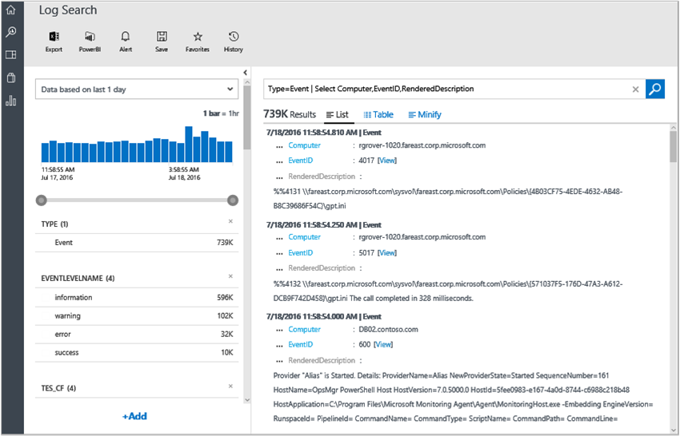
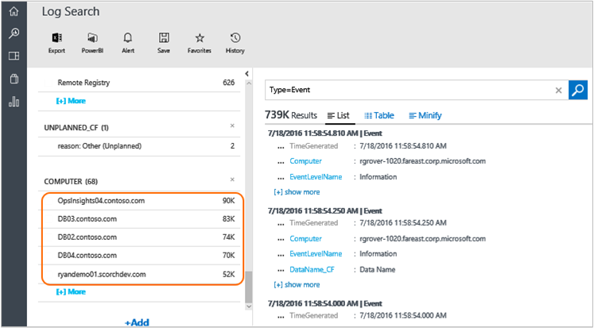
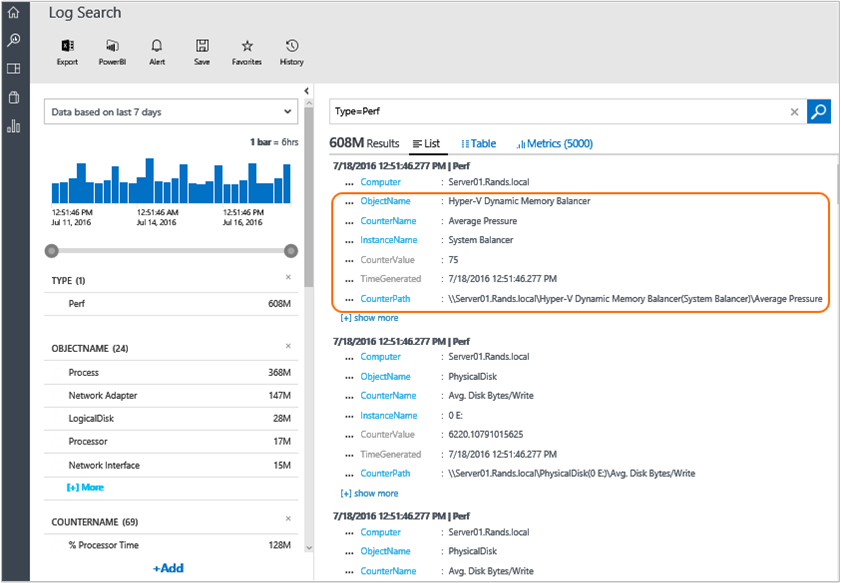
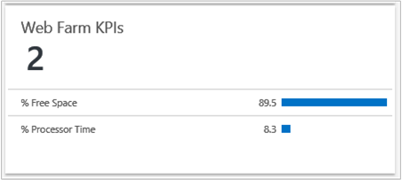
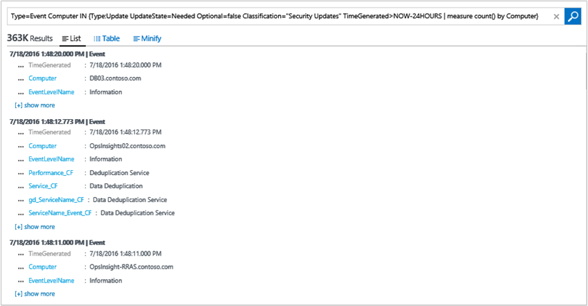

<properties
    pageTitle="登入記錄檔分析的 [搜尋 |Microsoft Azure"
    description="記錄搜尋可讓您合併，並建立您的環境中的多個來源的任何電腦資料的關聯。"
    services="log-analytics"
    documentationCenter=""
    authors="bandersmsft"
    manager="jwhit"
    editor=""/>

<tags
    ms.service="log-analytics"
    ms.workload="na"
    ms.tgt_pltfrm="na"
    ms.devlang="na"
    ms.topic="article"
    ms.date="10/10/2016"
    ms.author="banders"/>

# <a name="log-searches-in-log-analytics"></a>在記錄檔分析記錄搜尋

記錄檔分析的核心是記錄搜尋功能可讓您合併，並建立您的環境中的多個來源的任何電腦資料的關聯。 解決方案也由記錄，讓您指標搜尋旋轉若需要處理周圍的特定問題區域。

在 [搜尋] 頁面中，您可以建立的查詢，然後搜尋時，您可以篩選結果使用多面向控制項。 您也可以建立進階的查詢轉換、 篩選和報表上您的結果。

常見的記錄檔搜尋查詢會出現在大部分的解決方案頁面。 整個 OMS 主控台] 中，您可以按一下磚，或切入至其他項目，使用記錄搜尋來檢視詳細資料的項目。

在本教學課程中，我們會逐步涵蓋的所有基本概念，當您使用記錄搜尋的範例。

我們將會開始簡單、 實用的範例，以便您能了解有關如何使用此語法，若要從資料擷取您想要深入的見解的實際使用情況下，然後建立在其上。

您已熟悉搜尋技術之後，您可以檢閱[記錄分析登搜尋參考](log-analytics-search-reference.md)。

## <a name="use-basic-filters"></a>使用基本篩選

首先瞭解的第一部分的搜尋查詢，請先 」 | 」 垂直管道字元，一律會*篩選*。 您可以將它為 WHERE 子句中 TSQL，它會決定*哪些*提取 OMS 資料存放區的資料子集。 搜尋資料存放區中的主要指定您要從中擷取，因此自然查詢會開始 WHERE 子句資料的特性。

您可以使用最基本篩選是*關鍵字*，例如 」 錯誤 」 或 「 逾時 」 的電腦名稱。 這些類型的簡單查詢通常會傳回相同的結果集內的資料的各種不同的圖形。 這是因為記錄分析系統中具有不同*類型*的資料。


### <a name="to-conduct-a-simple-search"></a>使用簡單的搜尋
1. 在 [OMS 入口網站中，按一下 [**記錄搜尋**。  
    
2. 在 [查詢] 欄位中，輸入`error`，然後按一下 [**搜尋]**。  
      
    例如，查詢`error`下圖中傳回 100000 （藉由使用記錄管理收集） 的**事件**記錄、 18 **ConfigurationAlert**記錄 （由組態評估） 和 12 **ConfigurationChange**記錄 （藉由變更追蹤擷取）。   
      

這些篩選條件並不是真正物件類型類別。 *類型*為只標籤，或屬性時或字串/名稱/類別，附加的資料。 某些系統中的文件都會標示為**類型︰ ConfigurationAlert**和部分標記**類型︰ 效能**，或**類型︰ 事件**，依此類推。 每個搜尋結果、 文件、 記錄或項目會顯示所有原始的屬性及其值的資料，這些組件的每一個，您可以使用這些欄位名稱至您想要擷取的記錄時，在篩選中指定位置的欄位具有指定值。

*輸入*其實有的欄位，所有記錄，不是不同的任何其他的欄位。 這被建立根據 [類型] 欄位的值。 該記錄會有不同的圖案或表單。 附帶，**類型 = 效能**，或**類型 = 事件**也是您需要若要瞭解如何查詢效能資料或事件的語法。

欄位名稱之後，以及值之前，您可以使用 [冒號 （:）] 或 [等號 （=）。 **事件類型︰**和**類型 = 事件**是相當於意義，您可以選擇您想要的樣式。

因此，如果類型 = 效能記錄有欄位稱為 「 CounterName 」，然後您可以撰寫查詢類似`Type=Perf CounterName="% Processor Time"`。

這可讓您只效能資料效能計數器名稱為 「 %處理器時間 」 的位置。

### <a name="to-search-for-processor-time-performance-data"></a>若要搜尋的處理器時間效能資料
- 在 [搜尋查詢] 欄位中，輸入`Type=Perf CounterName="% Processor Time"`

您也可以讓您更明確，並使用**InstanceName = _ '總計'**在查詢中，這是 Windows。 您也可以選取多面向與另一個**欄位︰ 值**。 篩選會自動新增至您在 [查詢] 列中的篩選。 您可以檢視此下圖中。 將其顯示何處可按一下以新增**InstanceName: '_Total'**不需輸入任何查詢。


現在變成您的查詢`Type=Perf CounterName="% Processor Time" InstanceName="_Total"`

在此範例中，您沒有指定**類型 = 效能**若要前往此結果。 因為 CounterName 和 InstanceName 欄位只存在於類型的記錄 = 效能，查詢是特定不夠傳回相同的結果為更長的時間、 上一筆︰
```
CounterName="% Processor Time" InstanceName="_Total"
```

這是因為查詢中的所有篩選的都評估為*與*彼此。 有效，更多欄位您加入準則，您會收到以下，其他特定與精緻的結果。

例如，查詢`Type=Event EventLog="Windows PowerShell"`相同`Type=Event AND EventLog="Windows PowerShell"`。 會傳回所有已登入，並從 Windows PowerShell 的事件記錄檔收集的事件。 如果您在問題為純粹外觀-篩選多次加入重複選取相同的一環，它可能待過濾郵件搜尋] 列中，但它仍會傳回相同的結果，因為隱含 and 一定有。

明確地使用 NOT 運算子，即可輕鬆地還原隱含和運算子。 例如︰

`Type:Event NOT(EventLog:"Windows PowerShell")`或其對等`Type=Event EventLog!="Windows PowerShell"`回收的不是 Windows PowerShell 記錄其他所有記錄檔中的所有事件。

或者，您可以使用其他布林值運算子，例如 「 OR 」。 下列查詢會傳回事件記錄的其中一個應用程式或系統的記錄。

```
EventLog=Application OR EventLog=System
```

上述查詢中，您會收到的項目在相同的結果集中的兩個記錄檔。

不過，如果您移除 [或保留隱含和位置，然後下列查詢會產生任何結果因為沒有屬於兩個記錄檔的事件記錄檔項目。 每個事件記錄檔項目的寫入到其中一個兩個記錄。

```
EventLog=Application EventLog=System
```


## <a name="use-additional-filters"></a>使用其他篩選器

下列查詢會傳回 2 的事件記錄檔的所有電腦傳送資料的項目。

```
EventLog=Application OR EventLog=System
```


選取其中一個 [欄位] 或 [篩選器會範圍縮小到特定的電腦，並排除所有其他的查詢。 查詢結果會如下所示。

```
EventLog=Application OR EventLog=System Computer=SERVER1.contoso.com
```

相當於下列動作，因為隱含 AND

```
EventLog=Application OR EventLog=System AND Computer=SERVER1.contoso.com
```

每個查詢下列明確的順序進行評估。 請注意，然後括號。

```
(EventLog=Application OR EventLog=System) AND Computer=SERVER1.contoso.com
```

就像的事件記錄檔] 欄位中，您可以藉由新增擷取資料僅適用於一組特定的電腦或者。 例如︰

```
(EventLog=Application OR EventLog=System) AND (Computer=SERVER1.contoso.com OR Computer=SERVER2.contoso.com OR Computer=SERVER3.contoso.com)
```

同樣地，這下列查詢會傳回選取兩個電腦只**時間**。

```
CounterName="% Processor Time"  AND InstanceName="_Total" AND (Computer=SERVER1.contoso.com OR Computer=SERVER2.contoso.com)
```


### <a name="boolean-operators"></a>布林值運算子
使用日期時間或數字欄位，您可以搜尋值使用*大於*，*較小比*，及*較小或等於*。 您可以使用簡單的運算子，例如 >，<>，=、 < =、 ！ = 查詢的 [搜尋] 列中。


您可以在特定期間查詢特定的事件記錄檔。 例如，過去 24 小時是以表示下列 mnemonics 運算式。

```
EventLog=System TimeGenerated>NOW-24HOURS
```


#### <a name="to-search-using-a-boolean-operator"></a>若要使用的布林值運算子來進行搜尋
- 在 [搜尋查詢] 欄位中，輸入`EventLog=System TimeGenerated>NOW-24HOURS"`  
    

雖然您可以控制的時間間隔，以圖形方式，您可能會想要執行這項作業的大部分的時間，有許多優點包括直接將查詢的 [時間] 篩選。 例如，這非常適合儀表板，您將可以覆寫每一個磚，無論*全域*時間選取器，在儀表板頁面上的時間。 如需詳細資訊，請參閱[時間準備好儀表板中的項目](http://cloudadministrator.wordpress.com/2014/10/19/system-center-advisor-restarted-time-matters-in-dashboard-part-6/)。

時篩選的時間，請記住您得到的結果，*交集*的兩個時間週期︰ 所指定的 OMS 入口網站 (S1) 和查詢 (S2) 中所指定的項目。


這表示，如果時間週期不相交，例如在 OMS 入口網站，其中您選擇**[本週**在查詢中，您可以定義**最後一週**，則沒有交集並不會收到任何結果。

TimeGenerated 變數所使用的比較運算子，也會在其他情況中非常有用。 例如，使用數值的欄位。

例如，假設組態評估通知有嚴重性為以下值︰

- 0 = 資訊
- 1 = 警告
- 2 = 要徑

您可以查詢警告及重要的通知，而且也排除資訊的文件，與下列查詢︰

```
Type=ConfigurationAlert  Severity>=1
```


您也可以使用範圍查詢。 這表示您可以提供開頭和結尾的範圍一系列中的值。 例如，若要從哪裡 EventID 大於或等於 2100年但不是能大於 2199年 Operations Manager 事件記錄檔的事件，然後下列查詢會傳回這些。

```
Type=Event EventLog="Operations Manager" EventID:[2100..2199]
```


>[AZURE.NOTE] 您必須使用的範圍語法是冒號 （:） 欄位︰ 值分隔符號並**在等號 （=）。 方括號括住上下結束的範圍，請用兩個句點 （.） 隔開。

## <a name="manipulate-search-results"></a>管理搜尋結果

當您要搜尋的資料時，您需要調整您的搜尋查詢，並控制結果的建議層級。 結果擷取時，您可以套用轉換的命令。

垂直管道字元 (|) 之後，請遵循中記錄分析搜尋*必須*的命令。 篩選都必須查詢字串的第一個部分。 它定義您使用的資料集，然後 「 管道 」 的結果為命令。 您可以然後使用管道，若要新增其他命令。 這是 Windows PowerShell 管線彈性類似。

一般而言，記錄分析搜尋語言會嘗試追蹤 PowerShell 樣式和指導方針，使其類似 IT 專業人員和學習曲線。

命令會有動作的名稱，好讓您得知輕鬆它們的功能。  

### <a name="sort"></a>排序

[排序] 命令，可讓您定義的一或多個欄位的排序順序。 即使您沒有使用，根據預設，會強制執行遞減順序的時間。 最新的結果一律是頂端的搜尋結果。 這表示當您執行搜尋，`Type=Event EventID=1234`真的執行您是︰

```
Type=Event EventID=1234 **| Sort TimeGenerated desc**
```

這是體驗的因為它是體驗的您熟悉記錄中的類型。 例如，在 Windows 事件檢視器。

若要變更的方式傳回結果，您可以使用排序。 下列範例會示範如何運作。

```
Type=Event EventID=1234 | Sort TimeGenerated asc
```

```
Type=Event EventID=1234 | Sort Computer asc
```

```
Type=Event EventID=1234 | Sort Computer asc,TimeGenerated desc
```


上述的簡單範例顯示您] 命令的運作方式，允許他們變更圖案的篩選傳回的結果。

### <a name="limit-and-top"></a>上方和限制
限制，是另一個較少已知的命令。 限制為 PowerShell 類似的動作。 限制為功能上與上方的命令。 下列查詢會傳回相同的結果。

```
Type=Event EventID=600 | Limit 1
```

```
Type=Event EventID=600 | Top 1
```


#### <a name="to-search-using-top"></a>若要使用頂端的搜尋
- 在 [搜尋查詢] 欄位中，輸入`Type=Event EventID=600 | Top 1`   
    

上述圖像中有 358 位分節點 EventID = 600。 欄位、 facet 和在左側的篩選永遠顯示結果的相關資訊所傳回*的篩選部分*的查詢，也就是任何管道字元前的部分。 [**結果**] 窗格只會傳回 1 最新的結果，因為 [範例] 命令形狀和轉換結果。

### <a name="select"></a>選取

選取命令與 round 類似在 PowerShell 中選取物件。 會傳回不包含所有其原始的內容的篩選的結果。 不過，它會選取您所指定的屬性。

#### <a name="to-run-a-search-using-the-select-command"></a>若要執行搜尋，使用 [選取] 命令

1. 在搜尋中，輸入`Type=Event`，然後按一下 [**搜尋]**。
2. 按一下**+ 顯示更多**在其中一個要檢視結果的所有內容的結果。
3. 選取的部分，並查詢變更為`Type=Event | Select Computer,EventID,RenderedDescription`。  
    

當您要控制搜尋輸出，然後選擇 [僅限資料的重要您探索通常不完整的記錄的某些部分時，這是特別有用的命令。 不同類型的記錄有*一些*常見的屬性，而不是*所有*屬性的常見，這是也有幫助。 ，您可以產生的輸出，資料表看起來更自然或匯出為 CSV 檔案，然後必須在 Excel 中時，正常運作。


## <a name="use-the-measure-command"></a>使用 [量值] 命令

量值是一種記錄分析搜尋中的最多功能命令。 其可讓您將統計*函數*套用至您的資料和依指定欄位分組的彙總結果。 有多個量值支援的統計函數。

### <a name="measure-count"></a>Count （量值)

第一個統計函數，並瞭解最簡單的項目是*count （）*函數。

例如，從任何搜尋查詢結果`Type=Event`，顯示篩選器也稱為 facet，在搜尋結果的左側。 篩選] 會顯示在搜尋] 執行分配的值，以指定結果的欄位。



例如在上圖中，您會看到 [**電腦**] 欄位並將其顯示的內幾乎 739 位分節點事件在結果中有這些記錄中的 [**電腦**] 欄位的 68 唯一且唯一值。 磚只會顯示上方的 5，也就是最常見的 [**電腦**] 欄位中所撰寫 5 值），依據文件若包含該欄位中的特定值的數目。 影像中您可以看到 – 之間這些幾乎 369 位分節點的事件 – 90 位分節點來自 OpsInsights04.contoso.com 電腦 83 位分節點從 DB03.contoso.com 的電腦，等。


如果您想要查看所有的值，因為磚只會顯示只有前 5？

這是 [量值] 命令可以 count （） 函數。 此函數不使用任何參數。 您只是指定您想要在此情況下的 [**電腦**] 欄位群組依據的欄位︰

`Type=Event | Measure count() by Computer`


不過，**電腦**是用欄位*中*每一筆資料 – 共有沒有關聯式資料庫，並有不同的**電腦**物件沒有任何位置。 只要值*在*資料可用來描述的實體產生，及其他特性的數字和資料-因此特性字詞*多面向*。 不過，您也可以群組依據其他欄位。 因為傳送到 [量值] 命令的幾乎 739 位分節點事件的原始結果也稱為**EventID**的欄位，您可以套用相同技巧群組依據的欄位，並取得依 EventID 事件的計數︰

```
Type=Event | Measure count() by EventID
```

如果您不想在實際記錄計數包含特定的值，但改為如果您只想本身的值清單，您可以新增*選取*的命令結尾，然後只選取第一欄︰

```
Type=Event | Measure count() by EventID | Select EventID
```

然後您可以在此取得更多複雜及預先排序結果的查詢，或您只需按一下方格中的資料行太。

```
Type=Event | Measure count() by EventID | Select EventID | Sort EventID asc
```

#### <a name="to-search-using-measure-count"></a>若要搜尋來計算量值

- 在 [搜尋查詢] 欄位中，輸入`Type=Event | Measure count() by EventID`
- 附加`| Select EventID`到查詢的結尾。
- 最後，附加`| Sort EventID asc`到查詢的結尾。


有注意並強調的幾個重要事項︰

首先，您所看到的結果不是原始的原始結果不再。 而是彙總的結果 – 基本上結果的群組。 這不是問題，但您應該瞭解您正在與原始原始圖形的即時當做彙總/統計函數會建立非常不同圖案的不同的資料進行互動。

第二，**量值計算**目前會傳回前 100 個不同結果。 這項限制不適用於其他統計函數。 因此，通常必須先使用更精確地篩選器，若要搜尋特定項目之前套用量值 count （）。

## <a name="use-the-max-and-min-functions-with-the-measure-command"></a>使用 [量值] 命令，最大值和 min 函數

有各種不同位置**Max （量值）**和**量值字**就很有用的案例。 不過，由於每個函數相反，我們會說明 max （），您可以自行試驗字。

如果您的安全性事件查詢時，他們擁有而有所不同的**層級**屬性。 例如︰

```
Type=SecurityEvent
```


如果您想要檢視的最高值的所有安全性事件提供常見的電腦時，群組依據] 欄位中，您可以使用

```
Type=ConfigurationAlert | Measure Max(Level) by Computer
```


它會顯示的**層級**記錄的電腦上，大部分的已至少層級 8，仍有許多人 16 的層級。

```
Type=ConfigurationAlert | Measure Max(Severity) by Computer
```


此函數的運作方式與數字，但也可以搭配使用日期時間] 欄位。 很有用檢查每一部電腦編製索引的任何的資料一段的最後一個或最新的時間戳記。 例如︰ 時的最新的安全性事件報告每一部電腦？

```
Type=ConfigurationChange | Measure Max(TimeGenerated) by Computer
```

## <a name="use-the-avg-function-with-the-measure-command"></a>使用 [量值] 命令 avg 函數

使用 [量值的 Avg() 統計函數可讓您計算某些欄位中，以及群組結果的相同或其他欄位的平均值。 這是適用於各種情況下，例如效能資料。

我們開始效能資料。 請注意 OMS 目前收集正在同時 Windows 和 Linux 電腦。

若要搜尋*所有*的效能資料，是最基本的查詢︰

```
Type=Perf
```



您會注意到切記的記錄檔分析顯示三個方面:] 清單中，顯示您在前圖; 顯示實際的記錄表格顯示的效能計數器資料; 表格式檢視及指標，會顯示效能計數器的圖表。

在上方的圖片，有兩組標記] 欄位指出下列動作︰

- 第一組識別 Windows 效能計數器名稱、 物件名稱，以及執行個體名稱篩選的查詢。 以下是您可能會最常使用作為 facet/篩選的欄位
- **CounterValue**是計數器的實際值。 在此範例中，值為*75*。
- **TimeGenerated**是 12:51 24 小時的時間格式。

以下是在圖形中的度量資訊的檢視。


閱讀有關效能記錄圖案，並之後無法閱讀其他搜尋技巧，您可以使用 [量值 Avg() 彙總此類型的數字的資料。

以下是一個簡單的範例︰

```
Type=Perf  ObjectName:Processor  InstanceName:_Total  CounterName:"% Processor Time" | Measure Avg(CounterValue) by Computer
```


在此範例中，您可以選取電腦的 CPU 的總時間效能計數器和平均。 如果您想要縮小結果僅最後一個 6 小時，您可以使用 [時間] 篩選控制項，或指定查詢中，如下所示︰

```
Type=Perf  ObjectName:Processor  InstanceName:_Total  CounterName:"% Processor Time" TimeGenerated>NOW-6HOURS | Measure Avg(CounterValue) by Computer
```

### <a name="to-search-using-the-avg-function-with-the-measure-command"></a>若要搜尋 avg 函數使用 [量值] 命令
- 在 [搜尋查詢] 方塊中輸入`Type=Perf  ObjectName:Processor  InstanceName:_Total  CounterName:"% Processor Time" TimeGenerated>NOW-6HOURS | Measure Avg(CounterValue) by Computer`。


您可以彙總，並建立資料*在*電腦之間的關係。 例如，假設您有一組中的伺服器陣列，其中每個節點等於任何一個只要執行所有相同輸入的工作並載入應該大致平衡主機。 若要取得其計數器所有其中一種移以下列查詢，並取得整個伺服器陣列的平均值。 您可以選擇下列範例使用電腦開始︰

```
Type=Perf AND (Computer="AzureMktg01" OR Computer="AzureMktg02" OR Computer="AzureMktg03")
```

有電腦之後，您也只想要選取兩個關鍵效能指標 (Kpi): %cpu 使用率和 %的可用磁碟空間。 因此，成為查詢的一部分︰

```
Type=Perf InstanceName:_Total  ((ObjectName:Processor AND CounterName:"% Processor Time") OR (ObjectName="LogicalDisk" AND CounterName="% Free Space")) AND TimeGenerated>NOW-4HOURS
```

現在您可以新增電腦和計數器的下列範例︰

```
Type=Perf InstanceName:_Total  ((ObjectName:Processor AND CounterName:"% Processor Time") OR (ObjectName="LogicalDisk" AND CounterName="% Free Space")) AND TimeGenerated>NOW-4HOURS AND (Computer="AzureMktg01" OR Computer="AzureMktg02" OR Computer="AzureMktg03")
```

您有特定的選取範圍，因為**量值 Avg()**命令可能會傳回平均不是由的電腦，但伺服陣列，只要 CounterName 的群組。 例如︰

```
Type=Perf  InstanceName:_Total  ((ObjectName:Processor AND CounterName:"% Processor Time") OR (ObjectName="LogicalDisk" AND CounterName="% Free Space")) AND TimeGenerated>NOW-4HOURS AND (Computer="AzureMktg01" OR Computer="AzureMktg02" OR Computer="AzureMktg03") | Measure Avg(CounterValue) by CounterName
```

這會提供您幾個您的環境 Kpi 的實用精簡檢視。


您可以輕鬆地使用搜尋查詢，在儀表板。 例如，您可以儲存搜尋查詢，從其命名為*網頁伺服器陣列 Kpi*建立儀表板。 若要進一步瞭解如何使用儀表板，請參閱[建立自訂的儀表板中記錄分析](log-analytics-dashboards.md)。



### <a name="use-the-sum-function-with-the-measure-command"></a>使用 sum 函數，使用 [量值] 命令

Sum 函數是類似的量值] 命令的其他功能。 您可以看到範例，瞭解如何使用 sum 函數，[在 Microsoft Azure 操作獲得深入見解 W3C IIS 記錄](http://blogs.msdn.com/b/dmuscett/archive/2014/09/20/w3c-iis-logs-search-in-system-center-advisor-limited-preview.aspx)搜尋。

您可以使用 max （） 和字與數字、 日期時間和文字字串。 使用文字字串，依字母順序排序並先最後。

不過，您無法使用 Sum() 任何非數值的欄位。 這也適用於 Avg()。

### <a name="use-the-percentile-function-with-the-measure-command"></a>使用 [量值] 命令的百分位數函數

Percentile 函數是類似 Avg() 或在您只能使用該數字欄位。 您可以使用任何 1 到 99 數值欄位之間的百分位數。 您也可以使用**百分位數**] 及 [ **percent** ] 命令。 以下是一些範例︰  

```
Type:Perf CounterName:"DiskTransers/sec" |measure percentile95(CurrentValue) by Computer
```
```
Type:Perf ObjectName=LogicalDisk CounterName="Current Disk Queue Length" Computer="MyComputerName" | measure pct65(CurrentValue) by InstanceName
```

## <a name="use-the-where-command"></a>使用位置] 命令

命令的運作方式篩選，例如，但它可以套用管線進一步篩選已由量值命令 – 的彙總的結果中的位置而不是原始結果的篩選查詢的開頭。

例如︰

```
Type=Perf  CounterName="% Processor Time"  InstanceName="_Total" | Measure Avg(CounterValue) as AVGCPU by Computer
```

您可以新增另一個管道 」 | 」 字元，以及僅取得其平均 CPU 大於 80%，下列範例使用的電腦] 命令的位置︰

```
Type=Perf  CounterName="% Processor Time"  InstanceName="_Total" | Measure Avg(CounterValue) as AVGCPU by Computer | Where AVGCPU>80
```

如果您已熟悉了 Microsoft 系統管理中心-Operations Manager，您可以將管理套件條款] 命令的位置。 如果範例規則，第一部分的查詢應資料來源和位置] 命令就會條件偵測。

您可以使用查詢] 圖磚在**我的儀表板**，為排序的監視器若要查看當電腦的 Cpu 過度利用。 若要進一步瞭解儀表板，請參閱[建立自訂的儀表板中記錄分析](log-analytics-dashboards.md)。 您也可以建立並使用儀表板使用行動應用程式。 如需詳細資訊，請參閱[OMS Mobile 應用程式](http://www.windowsphone.com/en-us/store/app/operational-insights/4823b935-83ce-466c-82bb-bd0a3f58d865)。 在下列圖像下方兩個並排，您可以看到監視器顯示清單，而是數字。 基本上，您會想要為零和清單是空的數字。 否則，就表示通知的條件。 如有需要您可以使用它來看，哪些機器受到壓力。


## <a name="use-the-in-operator"></a>使用 in 運算子

*IN*運算子，以及*不在*可讓您使用 subsearches，也就是包含做為引數的另一個搜尋的搜尋。 這些都包含在大括弧 {} 另一個*主要*或*外部*搜尋中。 Subsearch 時，通常不同的結果，清單的結果將做為引數中其主要的搜尋。

您可以使用 subsearches 以符合您無法直接在搜尋運算式，但它可以產生的 [搜尋說明您資料的子集。 例如，如果您想要使用搜尋尋找從*遺漏的安全性更新的電腦上*的所有事件，然後必須設計 subsearch 可識別第一*遺漏的安全性更新電腦*的之前找到這些主機所屬的事件。

因此，您可能表示*電腦目前遺漏所需的安全性更新*與下列查詢︰

```
Type:Update UpdateState=Needed Optional=false Classification="Security Updates" TimeGenerated>NOW-24HOURS | measure count() by Computer
```    


清單之後，您可以為內部的搜尋使用搜尋，那些電腦上的事件會尋找外部 （主要） 搜尋摘要電腦的清單項目。 括號括號內搜尋，並提供其結果為外部使用 IN 運算子的搜尋篩選器/欄位的可能值執行此動作。 查詢會看起來像︰

```
Type=Event Computer IN {Type:Update UpdateState=Needed Optional=false Classification="Security Updates" TimeGenerated>NOW-24HOURS | measure count() by Computer}
```



也通知 [時間] 篩選會使用在搜尋] 內部，因為系統更新評估採用的所有電腦快照每 24 小時。 您可以讓內部查詢更精簡且精確地只搜尋一天。 外部搜尋改為使用時間選取範圍中使用者介面，擷取過去 7 天的事件。 如需時間運算子相關資訊，請參閱[布林值運算子](#boolean-operators)。

因為您真的只使用內部的搜尋篩選的結果值針對外部時，您還是可以將外部搜尋中的命令。 例如，您仍群組上述事件與另一個量值] 命令︰

```
Type=Event Computer IN {Type:Update UpdateState=Needed Optional=false Classification="Security Updates" TimeGenerated>NOW-24HOURS | measure count() by Computer} | measure count() by Source
```


一般而言，您會想內部查詢，快速地執行，因為記錄分析具有服務端逾時，也可以傳回少量的結果。 如果內部查詢會傳回更多結果，[結果] 清單會遭到截斷，這可能會讓外部搜尋傳回不正確的結果。

另一個規則是內部搜尋目前必須提供*彙總*的結果。 換句話說，它必須包含*量值*] 命令;您目前無法摘要原始的結果，將外部的搜尋。

此外，可只有一個 IN 運算子，它必須是查詢的最後一個篩選。 無法使用多個 IN 運算子，或想 – 基本上這樣執行多個 subsearches︰ 很重要的一點是只有一個 sub/內部搜尋的每個外部搜尋。

即使使用這些限制，在可讓許多類型的相關聯的搜尋，，並可讓您定義類似的電腦，例如群組的使用者或檔案 – 資料中的任意欄位包含。 以下是更多範例︰

**從電腦上已停用自動更新設定遺失所有的更新**

```
Type=Update UpdateState=Needed Optional=false Computer IN {Type=UpdateSummary WindowsUpdateSetting=Manual | measure count() by Computer} | measure count() by KBID
```

**從電腦上執行 SQL Server （= SQL 評估已執行的位置） 的所有錯誤事件**

```
Type=Event EventLevelName=error Computer IN {Type=SQLAssessmentRecommendation | measure count() by Computer}
```

**從 （= AD 評估已執行的位置） 的網域控制站的電腦上所有的安全性事件**

```
Type=SecurityEvent Computer IN { Type=ADAssessmentRecommendation | measure count() by Computer }
```

**哪些其他帳戶登入帳戶 BACONLAND\jochan 已登入同一部電腦？**

```
Type=SecurityEvent EventID=4624   Account!="BACONLAND\\jochan" Computer IN { Type=SecurityEvent EventID=4624   Account="BACONLAND\\jochan" | measure count() by Computer } | measure count() by Account
```

## <a name="use-the-distinct-command"></a>使用不同的命令

顧名思義，這個命令唯一值的清單中提供的欄位。 它會變得簡單，但非常有用。 相同完成的量值 count （） 命令以及，如下所示。

```
Type=Event | Measure count() by Computer
```

![不同的搜尋] 命令的範例](./media/log-analytics-log-searches/oms-search-distinct01-revised.png)

不過，如果您有興趣是只相異值和不的文件，可提供的值，然後相異計數清單，取得更簡潔且更容易閱讀輸出，以及為較短語法，如下列所示。

```
Type=Event | Distinct Computer
```
![不同的搜尋] 命令的範例](./media/log-analytics-log-searches/oms-search-distinct02-revised.png)

## <a name="use-the-countdistinct-function-with-the-measure-command"></a>使用 [量值] 命令的 countdistinct 函數
Countdistinct 函數會計算每個群組中的唯一值的數目。 比方說，其可用於計算的每個類型報告的唯一電腦︰

```
* | measure countdistinct(Computer) by Type
```


## <a name="use-the-measure-interval-command"></a>使用 [量值的間隔] 命令
附近即時效能資料集合中，您可以收集與記錄分析中的任何效能計數器以視覺化方式呈現。 輸入的查詢**類型︰ 效能**會傳回數以千計的公制圖形後，即可根據計數器和記錄分析環境中的伺服器的數目。 具有視公制彙總，您可以查看在高的層級及深度剖析微調的資料，因為您需要將您的環境中的整體的指標。

例如，假設您想要知道哪些資訊是所有您電腦間的平均 CPU。 查看每一部電腦的 CPU 平均值可能很有幫助因為結果可能會收到平滑。 若要查看更多詳細資料，您可以在彙總結果較小的時間視窗區塊及外觀將時間序列跨不同維度。 例如，您可以執行 CPU 使用率下限的平均值所有您的電腦上，如下所示︰

```
Type:Perf CounterName="% Processor Time" InstanceName="_Total" | measure avg(CounterValue) by Computer Interval 1HOUR
```


依預設這些結果會顯示在多數列互動式折線圖。  此圖支援數列切換 （與 y 軸 rescaling)，縮放，並將游標。  [表格] 顯示選項是仍可在必要時檢視的原始資料。

您也可以由其他欄位群組。 在此範例中，我所要尋找在一部特定電腦的所有 %計數器，並想要瞭解什麼是每小時 70 百分位數的每個計數器︰

```
Type:Perf Computer=beefpatty4 CounterName=%* InstanceName=_Total | measure percentile70(CounterValue) by CounterName Interval 1HOUR
```
注意是這些查詢並不會限制效能計數器。 您可以套用到任何公制。 在此範例中，我正在尋找 W3C IIS 記錄。 我想要知道哪些資訊是透過處理每個要求的 5 分鐘區間的最大時間︰

```
Type:W3CIISLog | measure max(TimeTaken) by csMethod Interval 5MINUTES
```

### <a name="use-multiple-aggregates-in-one-query"></a>在查詢中使用多個彙總
您可以指定多個彙總子句中量值] 命令。  每個可獨立是別名。  如果不指定別名產生的欄位名稱會彙總函數，是使用 (也就是 「 avg(CounterValue) 」 的 avg(CounterValue))。

 ```
Type=WireData | measure avg(ReceivedBytes), avg(SentBytes) by Direction interval 1hour
```


以下是另一個範例︰
 ```
* | measure countdistinct(Computer) as Computers, count() as TotalRecords by Type
```


## <a name="next-steps"></a>後續步驟

如需記錄搜尋的詳細資訊，請參閱︰

- 您可以使用[記錄分析中的自訂欄位](log-analytics-custom-fields.md)來延伸記錄搜尋。
- 檢閱[記錄分析登搜尋參考](log-analytics-search-reference.md)檢視所有的搜尋欄位和記錄分析中可用的 facet。
