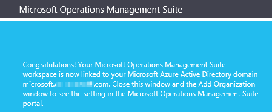

<properties
    pageTitle="管理存取權記錄分析 |Microsoft Azure"
    description="管理存取權的使用者、 帳戶、 OMS 工作區和 Azure 帳戶使用各種不同的系統管理工作的記錄檔分析。"
    services="log-analytics"
    documentationCenter=""
    authors="bandersmsft"
    manager="jwhit"
    editor=""/>

<tags
    ms.service="log-analytics"
    ms.workload="na"
    ms.tgt_pltfrm="na"
    ms.devlang="na"
    ms.topic="get-started-article"
    ms.date="08/16/2016"
    ms.author="banders"/>

# 管理記錄分析資料的存取權

若要管理記錄分析資料的存取，您將使用各種不同的系統管理工作的使用者、 帳戶、 OMS 工作區和 Azure 帳戶。 若要建立新的工作區中的 [作業管理套件 (OMS)，您可以選擇工作區的名稱，與您的帳戶，而您選擇的地理位置。 工作區是基本上容器，內含帳戶資訊及帳戶的簡單的設定資訊。 您或貴組織的其他成員可能會使用多個 OMS 工作區來管理組不同的全部收集的資料或您的 IT 基礎結構的部分。

[開始使用記錄分析](log-analytics-get-started.md)本文將示範如何快速取得，並執行和本文的其餘部分說明的更多詳細資料的部分動作需要管理 OMS 存取。

雖然您可能不需要執行的第一個的每個管理工作，但我們會使用下列各節中的所有常用的工作︰

- 決定您需要的工作區的數目
- 管理帳戶及使用者
- 將群組新增至現有的工作區
- 連結至 Azure 訂閱的現有的工作區
- 將工作區升級至付費的資料計劃
- 變更資料計劃類型
- 將 Azure Active Directory 組織新增至現有的工作區
- 關閉 OMS 工作區

## 決定您需要的工作區的數目

在工作區是 Azure 的資源，容器位置資料收集、 彙總、 分析，以及呈現 OMS 入口網站。

可以建立多個 OMS 記錄分析工作區與一個或多個工作區中有權存取的使用者。 在 [一般您想要的工作區數最小化，因為這可讓您的查詢，並在大部分的資料建立關聯。 本節說明當這會很有幫助建立一個以上的工作區。

現在，提供記錄分析工作區︰

- 資料儲存區地理位置
- 資料粒度的帳單
- 獨立資料

根據上述的特性，您可能會想要建立多個工作區︰

- 您是全域的公司，您需要基於資料主權或法規遵循的特定區域中儲存的資料。
- 您使用的 Azure 和您想要避免輸出資料傳輸費用，由記錄分析工作區為 Azure 資源管理同一個區域中。
- 您想要配置費用不同部門或商務群組根據及其使用方式。 當您建立的工作區，每個部門或商務] 群組中，Azure 帳單及使用方式陳述式分別顯示每個工作區的費用。
- 您是受管理的服務提供者及需要保留記錄分析資料的每一位客戶您管理隔離從其他客戶的資料。
- 管理多個客戶，您想查看自己的資料，但不是包括資料其他客戶或部門或商務群組每一個客戶或部門或商務群組。

使用時代理程式收集資料，您可以設定的必要工作區回報每個代理程式。

如果您使用系統管理中心 Operations manager，每個 Operations Manager 管理群組可連線的單一工作區。 您可以管理 Operations Manager 在電腦上安裝 Microsoft 監控代理程式並代理程式報表 Operations Manager 和不同的記錄檔分析工作區。

### 工作區資訊

在 OMS 入口網站，您可以檢視您的工作區資訊，並選擇您要從 Microsoft 接收資訊。

#### 檢視工作區資訊

1. 在 OMS，按一下 [**設定**] 方塊。
2. 按一下 [**帳戶**] 索引標籤。
3. 按一下 [**工作區資訊**] 索引標籤。  
  

## 管理帳戶及使用者

每個工作區可以有多個使用者帳戶相關聯，而且每個使用者帳戶 （Microsoft 帳戶或組織帳戶） 能存取至多個 OMS 工作區。

根據預設，Microsoft 帳戶或組織帳戶，用來建立工作區會變成工作區的系統管理員。 系統管理員可以邀請其他的 Microsoft 帳戶，或挑選 Azure Active Directory 中的使用者。

讓人員存取 OMS 工作區是在 2 的位置來控制︰

- 在 Azure，您可以使用角色型存取控制提供 Azure 的訂閱和相關聯的 Azure 資源的存取權。 這也會使用 PowerShell 和 REST API 的存取。
- 在 [OMS 入口網站中，存取只 OMS 入口網站-不相關聯的 Azure 訂閱。

如果您允許人員存取 OMS 入口網站，但無法連結至 Azure 訂閱，然後自動化、 備份和網站復原解決方案圖磚不會顯示任何資料給使用者時，登入 OMS 入口網站。

若要允許所有使用者請參閱在這些方案中的資料，請確定至少有**閱讀程式**存取的已連結至工作區中 OMS 自動化帳戶、 備份保存庫及網站復原保存庫。   

### 管理記錄分析使用 Azure 入口網站的存取

如果您允許人員存取記錄分析工作區使用 Azure 權限，在 Azure 入口網站，例如，然後相同的使用者可以存取記錄分析入口網站。 如果使用者是 Azure 入口網站中，他們可以瀏覽至 OMS 入口網站檢視記錄檔分析工作區資源時，按一下 [ **OMS 入口網站**工作。

請謹記有關 Azure 入口的一些事項︰

- 這不是*角色型存取控制*。 如果您有記錄分析工作區 Azure 入口網站中的*閱讀程式*存取權限，您就可以進行使用 OMS 入口網站的變更。 OMS 入口網站具有管理員、 參與者及唯讀使用者的概念。 如果您是登入的帳戶是連結至工作區的 Azure Active Directory 中您必須在 OMS 入口網站中的系統管理員，否則您將會參與者。

- 當您登入 OMS 入口網站使用 http://mms.microsoft.com，然後根據預設，您會看到**選取工作區**] 清單中。 只包含使用 OMS 入口網站所新增的工作區。 若要查看工作區中，您可以存取與 Azure 訂閱]，然後必須指定 URL 的一部分的租用戶。 例如︰

  `mms.microsoft.com/?tenant=contoso.com`租用戶識別碼，通常會的最後一個電子郵件地址您登入的一部分。

- 如果您使用登入的帳戶是 Azure Active Directory，通常是大小寫除非您登入為 CSP、 租用戶中的帳戶，您將會 OMS 入口網站中的*系統管理員*。 如果您的帳戶不是租用戶 Azure Active Directory 中，您就會是 OMS 入口網站中的*使用者*。

- 如果您想要直接瀏覽您可以使用 Azure 權限存取的入口網站，您就需要 URL 中指定的資源。 取得使用 PowerShell 這個 URL 可能是。

  例如， `(Get-AzureRmOperationalInsightsWorkspace).PortalUrl`。

  URL 看起來像︰`https://eus.mms.microsoft.com/?tenant=contoso.com&resource=%2fsubscriptions%2faaa5159e-dcf6-890a-a702-2d2fee51c102%2fresourcegroups%2fdb-resgroup%2fproviders%2fmicrosoft.operationalinsights%2fworkspaces%2fmydemo12`

### 管理使用者在 OMS 入口網站

您管理使用者與群組底下的 [設定] 頁面的 [**帳戶**] 索引標籤的 [**管理使用者**] 索引標籤。 那里，您可以執行的工作，下列各節中。  

#### 將使用者新增至現有的工作區

若要新增的使用者或群組至 OMS 的工作區中使用下列步驟。 使用者或群組能夠檢視並執行此工作區與相關聯的所有通知。

>[AZURE.NOTE] 如果您想要新增的使用者或群組從 Azure Active Directory 組織帳戶，您必須先確定，有相關聯的 OMS 帳戶與您的 Active Directory 網域。 請參閱[新增 Azure Active Directory 組織現有的工作區](#add-an-azure-active-directory-organization-to-an-existing-workspace)。

1. 在 OMS，按一下 [**設定**] 方塊。
2. 按一下 [**帳戶**] 索引標籤，然後按一下 [**管理使用者**] 索引標籤。
3. 在 [**管理使用者**] 區段中，選擇 [若要新增的帳戶類型︰**組織帳戶**， **Microsoft 帳戶**， **Microsoft 支援服務**。
    - 如果您選擇的 Microsoft 帳戶，請輸入電子郵件地址與 Microsoft 帳戶相關聯的使用者。
    - 如果您選擇的組織帳戶，您可以輸入使用者或群組的名稱或電子郵件別名部分，便會列出使用者和群組。 選取 [使用者或群組]。
    - 使用 Microsoft 支援服務給 Microsoft 技術支援工程暫時存取您的工作區，以協助疑難排解。

    >[AZURE.NOTE] 為求最佳效果效能限制的三個單一 OMS 帳戶相關聯的 Active Directory 群組，系統管理員，一個用於參與者，和個唯讀的使用者。 使用多個群組，可能會影響效能的記錄檔分析。

5. 選擇要新增的使用者或群組的類型︰**管理員**、**參與者**或**唯讀使用者**。  
6. 按一下 [**新增**]。

  如果您要新增 Microsoft 帳戶，加入工作區邀請會傳送至您所提供的電子郵件中。 使用者跟加入 OMS 邀請中的指示之後，使用者可以檢視的通知及帳戶資訊，此 OMS 帳戶，和您可以在 [**帳戶**] 索引標籤的 [**設定**] 頁面上檢視的使用者資訊。
  如果您要新增的組織帳戶，使用者可以立即存取記錄分析。  
  

#### 編輯現有的使用者類型

您可以變更您的 OMS 帳戶相關聯的使用者帳戶角色。 您有下列角色選項︰

 - *系統管理員*︰ 可管理使用者、 檢視和處理所有通知，並新增和移除伺服器

 - *參與者*︰ 可以檢視和處理所有通知，並新增和移除伺服器

 - *唯讀使用者*︰ 標示為唯讀的使用者將無法︰
   1. 新增/移除解決方案。 隱藏方案庫。
   2. **我的儀表板**上的 [新增/修改/移除磚。
   3. 檢視**設定**] 頁面。 隱藏頁面。
   4. 在 [搜尋檢視、 中設定、 儲存的搜尋結果，與通知是隱藏的工作。

#### 若要編輯的帳戶

1. 在 OMS，按一下 [**設定**] 方塊。
2. 按一下 [**帳戶**] 索引標籤，然後按一下 [**管理使用者**] 索引標籤。
3. 選取您想要變更使用者的角色。
2. 在 [確認] 對話方塊中，按一下**[是]**。

### 從 OMS 工作區中移除使用者

若要移除 OMS 工作區中的使用者使用下列步驟。 請注意，這不會關閉使用者的工作區。 不過，便會移除該使用者與工作區之間的關聯。 如果使用者是多個工作區與相關聯，該使用者會仍然可以登入 OMS，並查看其他工作區。

1. 在 OMS，按一下 [**設定**] 方塊。
2. 按一下 [**帳戶**] 索引標籤，然後按一下 [**管理使用者**] 索引標籤。
3. 您想要移除的使用者名稱旁，按一下 [**移除**]。
4. 在 [確認] 對話方塊中，按一下**[是]**。

### 將群組新增至現有的工作區

1.  依照步驟中 「 若要新增使用者至現有的工作區 「 1-4、 上方。
2.  在底下，**選擇 [使用者/群組**中，選取 [**群組**]。
    
3.  輸入您想要新增群組的顯示名稱或電子郵件地址。
4.  在結果清單中選取的群組，然後按一下 [**新增]**。

## 連結至 Azure 訂閱的現有的工作區

建立工作區，從[microsoft.com/oms](https://microsoft.com/oms)網站可能是。  不過，限制特定有這些工作區，最顯著正在 500 MB/天的資料上傳的限制，如果您使用的免費的帳戶。 若要進行此工作區中變更您將需要*連結至 Azure 訂閱您現有的工作區*。

>[AZURE.IMPORTANT] 若要連結的工作區，請 Azure 帳戶必須已經有權存取您想要連結的工作區。  換句話說，您用來存取 Azure 入口網站的帳戶必須**相同**您用來存取您的 OMS 工作區的帳戶。 如果不符合上述情況，請參閱[新增使用者至現有的工作區](#add-a-user-to-an-existing-workspace)。

### 若要連結至 Azure 訂閱 OMS 入口網站中的工作區

若要連結至 Azure 訂閱 OMS 入口網站中的工作區，請登入使用者必須已經付費 Azure 帳戶。 您正在使用的工作區會連結至 Azure 帳戶。

1. 在 OMS，按一下 [**設定**] 方塊。
2. 按一下 [**帳戶**] 索引標籤，然後按一下 [ **Azure 訂閱及資料計劃**] 索引標籤。
3. 按一下您要使用的資料方案。
4. 按一下 [**儲存**]。  
  

新的資料計劃會顯示在 OMS 入口網站功能區上方的網頁。

### 若要連結至 Azure 訂閱 Azure 入口網站中的工作區

1.  登入[Azure 入口網站](http://portal.azure.com)。
2.  瀏覽**記錄分析 (OMS)** ，然後選取它。
3.  您會看到您現有的工作區的清單。 按一下 [**新增**]。  
    
4.  **OMS 工作區**中，按一下 [**或現有的連結**。  
    
5.  按一下 [**設定所需的設定**]。  
    
6.  您會看到尚未連結至 Azure 帳戶的工作區的清單。 選取 [工作區]。  
    
7.  如有需要您可以變更下列項目的值︰
    - 訂閱
    - 資源群組
    - 位置
    - 價格層  
        
8.  按一下 [**建立**]。 工作區現在連結至 Azure 帳戶。

>[AZURE.NOTE] 如果看不到您想要連結的工作區，然後 Azure 訂閱沒有存取至您建立的資料使用 OMS 網站 OMS 工作區。  您必須授與存取權從這個帳戶內使用 OMS 網站 OMS 工作區。 若要這麼做，請參閱[新增使用者至現有的工作區](#add-a-user-to-an-existing-workspace)。

## 將工作區升級至付費的資料計劃

有三個工作區資料規劃 OMS 類型︰**免費**、**標準**、 或**進階版**。  如果您是*免費*方案，您可能會叫用您的資料首字放大的 500 MB。  您需要升級您的工作區為***pay-as-you-go 計劃***，才能收集限制，超出此限制的資料。 在任何時候，您可以轉換您計劃的類型。  如需有關 OMS 價格的詳細資訊，請參閱[定價詳細資料](https://www.microsoft.com/en-us/server-cloud/operations-management-suite/pricing.aspx)。

>[AZURE.IMPORTANT] 工作區方案只能*連結*至 Azure 訂閱時變更。  如果您在 Azure 中建立您的工作區，或如果您*已經*連結工作區，您可以忽略這則訊息。  如果您使用[OMS 網站](http://www.microsoft.com/oms)建立您的工作區，您必須追蹤[連結至 Azure 訂閱現有的工作區](#link-an-existing-workspace-to-an-azure-subscription)中的步驟。

### 使用系統管理中心權利從 OMS 附加元件

系統管理中心 OMS 附加元件提供 OMS 記錄分析，在[OMS 價格](https://www.microsoft.com/en-us/server-cloud/operations-management-suite/pricing.aspx)所述的進階版方案的授權。

當您購買的系統管理中心 OMS 附加元件時，OMS 附加元件會新增為在您的系統管理中心合約授權。 本合約下會建立任何 Azure 訂閱可使用的授權。 這可讓您，例如有多個 OMS 工作區的使用 OMS 附加元件的授權。

若要確保 OMS 工作區的使用方式套用至您的權利，從 OMS 附加元件，您必須︰

1. 連結至 Azure 訂閱的企業合約包含 OMS 附加元件購買和 Azure 訂閱的使用方式的 OMS 工作區
2. 選取工作區中的進階版計劃

當您檢閱 Azure 或 OMS 入口網站中的使用時，您就不會看到 OMS 附加元件權利。 不過，您可以看到企業版入口網站中的權利。  

如果您需要變更您的 OMS 工作區已連結至 Azure 訂閱，您可以使用 PowerShell 的 Azure[移動 AzureRmResource](https://msdn.microsoft.com/library/mt652516.aspx)指令程式。

### 使用 Azure 認可從企業合約

如果您選擇使用獨立的價格 OMS 元件，您會分別支付 OMS 的每個元件和 Azure 帳單上會出現的使用方式。

如果您要連結的 Azure 訂閱企業註冊上有 Azure 貨幣認可]，使用任何記錄分析會自動借方針對任何剩餘的貨幣認可。

如果您需要變更 Azure OMS 工作區已連結至您的訂閱，可以使用 PowerShell 的 Azure[移動 AzureRmResource](https://msdn.microsoft.com/library/mt652516.aspx)指令程式。  

### 若要變更工作區付費的資料計劃

1.  登入[Azure 入口網站](http://portal.azure.com)。
2.  瀏覽**記錄分析 (OMS)** ，然後選取它。
3.  您會看到您現有的工作區的清單。 選取 [工作區]。  
    
4.  在 [**設定**] 底下，按一下 [**價格層**]。  
    
5.  在 [**價格層**] 底下，選取資料計劃，然後按一下**選取**。  
    
6.  當您更新您的檢視 Azure 入口網站中時，您會看到您所選取的計劃中更新**價格層**。  
    

現在您可以收集資料，除了 「 免費的 「 資料首字放大。

## 將 Azure Active Directory 組織新增至現有的工作區

您可以建立記錄檔分析 (OMS) 工作區關聯的 Azure Active Directory 網域。 這可讓您新增使用者從 Active Directory 直接 OMS 工作區不需要個別的 Microsoft 帳戶。

當您從 Azure 入口網站中，建立工作區或連結至 Azure 訂閱的工作區時，將您的 Azure Active Directory 連線為您的組織帳戶。

當您從 OMS 入口網站建立工作區系統會提示您連結至 Azure 的訂閱和組織帳戶。

### 若要新增至現有的工作區的 Azure Active Directory 組織

1. 在 [OMS 中的 [設定] 頁面中，按一下 [**帳戶**]，然後按一下 [**工作區資訊**] 索引標籤。  
2. 檢閱組織帳戶的相關資訊，然後按一下 [**新增組織**。  
    
3. 輸入您的 Azure Active Directory 網域系統管理員的身分識別資訊。 之後，您會看到的認可通知，指出您的工作區已連結至您的 Azure Active Directory 網域。
    

>[AZURE.NOTE] 一旦您的帳戶連結至組織帳戶，請連結無法移除或變更。

## 關閉 OMS 工作區

當您關閉 OMS 工作區時，您的工作區與相關的所有資料的關閉工作區 30 天內會都刪除 OMS 服務。

如果您是系統管理員，而且有多個工作區與相關聯的使用者，這些使用者與工作區之間的關聯會中斷。 如果其他工作區與相關聯的使用者，他們會持續 OMS 使用這些其他工作區。 不過，如果不是與其他工作區相關聯然後必須建立新的工作區使用 OMS。

### 若要關閉 OMS 工作區

1. 在 OMS，按一下 [**設定**] 方塊。
2. 按一下 [**帳戶**] 索引標籤，然後按一下 [**工作區資訊**] 索引標籤。
3. 按一下 [**關閉工作區**]。
4. 選取其中一個原因所造成的關閉您的工作區，或在 [文字] 方塊中輸入不同的原因。
5. 按一下 [**關閉工作區**]。

## 後續步驟

- 請參閱[連線的 Windows 電腦記錄分析](log-analytics-windows-agents.md)新增代理程式和收集資料。
- 若要新增的功能和收集資料[從方案庫新增記錄分析解決方案](log-analytics-add-solutions.md)。
- [Proxy 和防火牆設定中記錄分析](log-analytics-proxy-firewall.md)如果貴組織使用 proxy 伺服器或防火牆，讓代理程式可以通訊記錄分析服務。
