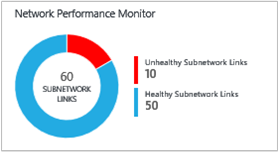
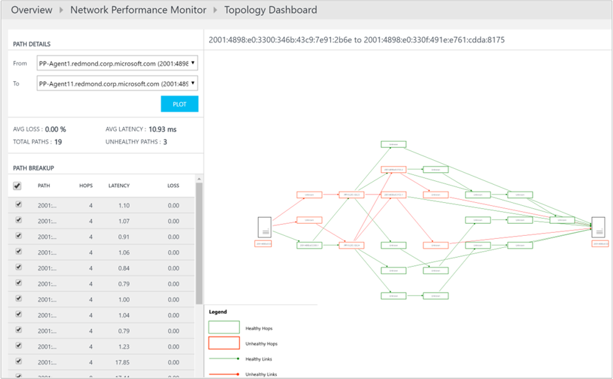
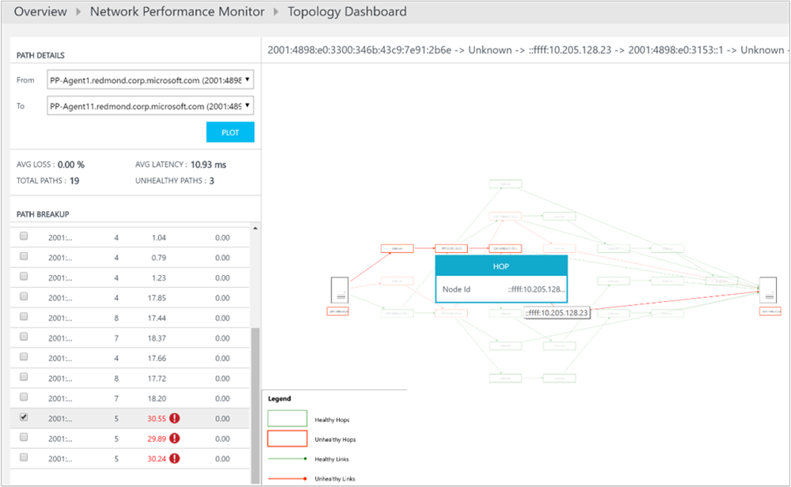

<properties
    pageTitle="網路效能監視器解決方案中 OMS |Microsoft Azure"
    description="網路效能監視器監控您的網路中 real-單次至附近的效能有助於偵測並找出網路效能瓶頸。"
    services="log-analytics"
    documentationCenter=""
    authors="bandersmsft"
    manager="jwhit"
    editor=""/>

<tags
    ms.service="log-analytics"
    ms.workload="na"
    ms.tgt_pltfrm="na"
    ms.devlang="na"
    ms.topic="article"
    ms.date="07/28/2016"
    ms.author="banders"/>

# 網路效能監視器 （預覽版本） OMS 解決方案

>[AZURE.NOTE] 這是[預覽解決方案](log-analytics-add-solutions.md#log-analytics-preview-solutions-and-features)。

這份文件將說明如何設定和使用 OMS，可協助您監控您的網路中 real-單次至附近的效能偵測並找出網路效能監視器解決方案網路效能瓶頸。 網路效能監視器解決方案，您可以監視遺失與子網路或伺服器的兩個網路之間的延遲。 網路效能監視器偵測到的網路問題，例如流量 blackholing、 路由錯誤，以及傳統網路監控方法無法偵測到的問題。 網路效能監視器產生通知，並通知何時臨界值破壞網路連結。 這些臨界值可以自動學習系統或您可以將其設定為使用自訂通知的規則。 網路效能監視器確保及時偵測網路效能問題，並 localizes 至特定的網路區段或裝置問題的來源。

您可以偵測網路問題的解決辦法儀表板會顯示您的網路包括新的網路狀況事件、 不良的網路連結及子網路連結面對高封包遺失與延遲的摘要的資訊。 您可以向下切入至網路連結，以檢視目前的健康狀態子網路的連結，以及節點的連結。 您也可以檢視歷史趨勢的影響在網路、 子網路及節點-層級的延遲。 您可以檢視歷史趨勢圖表的封包遺失與延遲偵測暫時網路問題，然後找出網路瓶頸拓撲地圖上。 互動式拓撲圖形可讓您以視覺化方式呈現的躍點的躍點網路路由，判斷問題的來源。 像其他任何的解決方案中，您可以使用各種不同的分析需求的記錄檔搜尋來建立自訂報表基礎網路效能監視器收集的資料。

解決方案會使用模擬交易作為主要機制偵測網路錯誤。 因此，您可以使用，而不管特定的網路裝置的廠商或模型。 在內部部署與雲端 (IaaS)，混合式環境的其運作方式。 方案會自動探索網路拓撲以及各種路由，在您的網路。

一般網路監視產品著重於監視網路裝置 （路由器、 切換參數等） 狀況，但不是能提供實際品質之間沒有網路效能監視器的兩個點的網路連線到深入資訊。

### 使用解決方案獨立版

如果您想要監視網路之間的連線他們的要徑工作量品質，網路、 資料中心或 office 網站，然後您可以使用網路效能監視器解決方案單獨監控之間的連線健康狀況︰

- 使用公用或私人網路連線的多個資料中心] 或 [office 網站
- 執行商務應用程式中的要徑負載
- 公用雲端服務等 Microsoft Azure 或 Amazon Web 服務 (AWS) 與內部部署網路，如果您有 IaaS (VM) 可用，而且必須設定為允許通訊的閘道器網路內部部署與雲端網路之間
- 當您使用快速傳送 azure 及內部部署網路

### 使用解決方案與其他網路工具

如果您想要監視一行商務應用程式，您可以使用網路效能監視器解決方案，作為其他網路工具小幫手建議的解決方案。 變得很慢的網路，可能會導致變得很慢的應用程式與網路效能監視器可協助您調查應用程式效能問題所造成的基礎網路問題。 解決方案時，不需要任何存取網路的裝置，因為應用程式管理員不需要依賴網路小組提供如何網路會影響應用程式的相關資訊。

此外，如果您已經投資在其他網路監視工具，然後方案延伸這些工具因為最傳統的網路監控解決方案不會提供見解等遺失與延遲的端對端網路效能指標。  網路效能監視器方案可協助填滿的間距。

## 安裝及設定代理程式的解決方案

使用安裝[記錄分析連線的 Windows 電腦](log-analytics-windows-agents.md)，[連線到記錄分析的 Operations Manager](log-analytics-om-agents.md)代理程式的基本程序。

>[AZURE.NOTE]
必須安裝至少 2 代理程式才有足夠的資料來找出並監控您的網路資源。 否則，方案會保留在設定的狀態，直到您安裝並設定其他代理程式。

### 安裝代理程式的位置

安裝代理程式之前，請考慮您的網路和您想要監視的哪些部分的網路拓撲。 我們建議您安裝的每個您想要監視的子網路的多個代理程式。 換句話說，針對您想要監視每一個子網路，選擇兩個或多個伺服器或 Vm 及安裝代理程式在其上。

如果您不確定您的網路拓撲，請在您想要用來監視網路效能的重要工作負載的伺服器上安裝代理程式。 例如，您可能要追蹤的網路與之間的連線的網頁伺服器執行 SQL Server 的伺服器。 在此範例中，您會在兩個伺服器上安裝代理程式。

代理程式監控主機-不主機自行間的網路連線 （連結）。 因此，監控網路連結，您必須安裝代理程式的連結的兩個端點。

### 設定代理程式

您已安裝代理程式之後，必須開啟那些電腦上，以確保代理程式可以進行通訊的防火牆連接埠。 您需要下載並執行任何參數[EnableRules.ps1 PowerShell 指令碼](https://gallery.technet.microsoft.com/OMS-Network-Performance-04a66634)具有系統管理權限 PowerShell 視窗中

指令碼會建立所需的網路效能監視器的登錄機碼，它會建立 Windows 防火牆規則，以允許代理程式，以建立彼此的 TCP 連線。 建立指令碼登錄機碼也可以指定是否要記錄偵錯記錄和記錄檔案的路徑。 也會定義通訊的代理程式 TCP 連接埠。 這些按鍵的值會自動設定的指令碼，因此您無法手動這些按鍵。

開啟預設的連接埠是 8084。 您可以使用自訂的連接埠提供參數`portNumber`指令碼。 不過，相同的連接埠應使用的所有電腦上執行指令碼的位置。

>[AZURE.NOTE] EnableRules.ps1 指令碼只在執行指令碼的位置的電腦上設定 Windows 防火牆規則。 如果您有網路防火牆，請確定其允許正在使用的網路效能監視器的 TCP 連接埠流量。

## 設定解決方案

安裝和設定方案，請使用下列資訊。

1. 網路效能監視器解決方案取得資料執行 Windows Server 2008 SP 1 或更新版本的電腦或 Windows 7 SP1 或更新版本中，這是相同的需求為 Microsoft 監控代理程式 (MMA)。
2. 新增網路效能監視器解決方案到 OMS 工作區使用[從方案庫新增記錄分析解決方案](log-analytics-add-solutions.md)所述的程序。  
  
3. 在 OMS 入口網站，您會看到標題為 「**網路效能監視器**」 郵件*解決方案需要額外設定*新的方塊。 您需要設定新增網路根據大致與代理程式所找到的節點的解決方案。 按一下 [開始設定預設的網路的**網路效能監視器**。  
  

### 設定與預設網路的方案

在 [設定] 頁面中，您會看到**預設**名稱為單一網路。 當您未定義的任何網路時，所有的自動探索到子網路置於預設的網路。

每當您建立網路，請為其新增子網路和子網路會從預設的網路中移除。 如果您刪除網路時，其所有的子網路自動會傳回預設的網路。

換句話說，預設的網路是不在任何使用者定義的網路中的所有子網路的容器。 您無法編輯或刪除預設的網路。 一律會保持在系統。 不過，您可以建立任何數量的網路，視需要。

在大部分情況下，就會在您的組織中的子網路排列在多個網路中，您應該建立一或多個網路邏輯群組您子網路。

### 建立新的網路

網路效能監視器網路是子網路的容器。 您可以建立網路與任何您想要並新增至網路的子網路的名稱。 例如，您可以建立名為*Building1*網路，然後再新增子網路，或您可以建立名為*DMZ*網路，然後再新增所有屬於戰區此網路的子網路。

#### 若要建立新的網路

1. 按一下 [**新增網路**，然後輸入網路名稱與描述。
2.  選取一或多個子網路，然後再按一下 [**新增**]。
3. 按一下 [**儲存**] 儲存設定。  
  

### 等待資料彙總

您已儲存的第一次設定之後，方案開始收集代理程式的安裝位置節點間的網路封包遺失與延遲資訊。 此程序時可能需要，有時候 30 分鐘。 在此狀態，在 [概觀] 頁面中的 [網路效能監視器] 方塊會顯示訊息，指出*程序中的資料彙總*。

當已上傳的資料時，您會看到網路效能監視器更新的磚顯示資料。

按一下 [若要檢視的網路效能監視器儀表板] 磚。

### 編輯監控子網路的設定

所有的子網路位置安裝至少有一個代理程式會列在 [設定] 頁面中 [**子**] 索引標籤。

#### 若要啟用或停用的特定大致監視

1. 選取或清除**子網路 ID** ] 旁的方塊，然後確定**用於監控**是選取或清除，視。 您可以選取或清除多個子網路。 停用，大致不會被監視代理程式將會更新，若要停止 ping 其他代理程式。
2. 選擇您想要監視為特定的子網路，從清單中選取子網路清單包含監控和監視節點之間移動必要的節點的節點。
您可以新增自訂**描述**子網路，如果您想。
3. 按一下 [**儲存**] 儲存設定。  
  

### 選擇要監視的節點

[**節點**] 索引標籤中，會列出所有已安裝在代理程式的節點。

#### 若要啟用或停用監視節點

1. 選取或清除您要監視或停止監控節點。
2. 按一下 [**監視適用於**，或清除，視。
3. 按一下 [**儲存**]。  
  

### 監控規則的設定

網路效能監視器產生健康事件的相關節點或子網路或網路的連結時破壞可能臨界值的一組之間的連線。 這些臨界值可以自動學習系統或設定自訂通知的規則。

*預設規則*由系統，然後建立健康事件時遺失或任何對網路或子網路之間的延遲連結遭侵害等系統學會閥值。 您可以選擇 [停用的預設規則，並建立自訂的監視規則

#### 若要建立自訂的監視規則

1. 在 [**監視器**] 索引標籤中，按一下 [**新增規則**，然後輸入規則的名稱和描述。
2. 選取網路] 或 [子網路的連結，從清單中監控的配對。
3. 從 [網路] 下拉式清單中，選取第一個感興趣的子網路/s 所在的網路，，然後選取 [從的對應的子網路下拉式清單的 [子網路/s。
如果您想要監視的網路連結中的所有子，請選取 [**所有大致**]。 同樣地，請選取其他子網路/s 感興趣。 然後，您可以按一下以排除特定子網路連結，從選取範圍後的監控**加入的例外狀況**。
4. 如果您不想要建立您所選取的項目健康事件，然後清除 [**啟用健康監視覆蓋此規則的連結**。
5. 選擇 [監視條件]。
您可以輸入臨界值狀況事件產生設定自訂臨界值。 條件的值每當上方所選的網路/子網路對其所選臨界值，則會產生健康事件。
6. 按一下 [**儲存**] 儲存設定。  
  

## 集合詳細資料

網路效能監視器使用 TCP SYNACK-SYN-ACK 交換封包收集遺失與延遲資訊和 traceroute 也可用於取得拓撲資訊。

下表顯示資料集合方法和其他詳細資料收集網路效能監視器的方式。

| 平台 | 直接代理程式 | 是 SCOM 代理程式 | Azure 儲存體 | 必要時，是 SCOM 嗎？ | 透過管理群組傳送是 SCOM 代理程式的資料 | 集合頻率 |
|---|---|---|---|---|---|---|
| Windows |![[是]](./media/log-analytics-network-performance-monitor/oms-bullet-green.png)|![[是]](./media/log-analytics-network-performance-monitor/oms-bullet-green.png)||            || TCP handshakes 每 5 秒資料傳送每 3 分鐘 |

解決辦法使用模擬交易評估網路的狀況。 如果有的話，OMS 代理程式安裝在各種點與其他網路 exchange TCP 封包中，然後在 [程序，了解來回時間和封包遺失。 定期，每個代理程式也會執行，則必須測試網路中尋找所有的各種路由其他代理程式的追蹤路由。 使用此資料，請代理程式都能夠推算網路延遲和封包遺失數字。 測試重複每五秒，資料會彙總的三個分鐘期間的代理程式之前上傳至 OMS。

>[AZURE.NOTE] 雖然代理程式彼此經常，但它們不會產生網路流量許多時進行測試。 代理程式只需要 TCP SYNACK-SYN-ACK 交換封包，來判斷遺失與延遲-交換封包沒有資料。 在此程序，代理程式彼此只在需要時，而且代理程式通訊拓撲已最佳化而適合降低網路流量。

## 使用解決方案

本節說明所有儀表板函數及使用方式。

### 解決方案概觀磚

啟用網路效能監視器方案後，[OMS 概觀] 頁面上的 [方案] 磚就會提供網路狀況的快速概觀。 會顯示環圈圖顯示健全和不健全的子網路連結的數目。 當您按一下磚時，它會開啟方案儀表板。

### 網路效能監視器解決方案儀表板

**網路摘要**刀會顯示摘要的網路，以及其相對的大小。 這被後面顯示總數網路連結與子網路連結路徑 （包含路徑與代理程式的兩個主辦城市] 和 [它們之間的所有躍點的 IP 位址） 系統中的磚。

**頂端網路健康事件**刀提供最新狀況事件和通知的清單中系統和時間，因為事件已作用中。 每當封包遺失或網路或子網路連結的延遲超過臨界值時，就會產生的健康事件或提醒。

**頂端不良的網路連結**刀顯示不良的網路連結的清單。 這些是網路連結的一或多個不良的健康事件的時間。

頂端子網路以最遺失以及**連結****子網路最延遲**刀分別顯示上方的子網路封包遺失，以及連結上方的子網路受到延遲。 在高延遲或封包遺失的一些數量可能會如預期上特定的網路連結。 如需上方的十個清單中顯示，但未標示為不佳。

**一般查詢**刀包含一組擷取原始網路直接監視資料的搜尋查詢。 您可以使用下列查詢，開始，建立您自己的自訂報表的查詢。

### 向下切入深度

您可以按一下方案儀表板上向下切入至更深入的各種連結到感興趣的任何區域。 例如，當您看到的提醒或會出現在儀表板上的不良的網路連結，您可以按一下以進一步調查。 您會進入列出您所有的子網路連結特定網路連結的網頁。 您可以查看每個子網路連結的遺失、 延遲和健康狀態並快速找出哪些子網路連結導致問題。 您也可以按一下**檢視節點連結**，請參閱不佳的子網路連結的節點連結。 然後，您可以請參閱個別節點的連結，並尋找不健全的節點的連結。

您可以按一下 [**檢視拓撲**若要檢視的來源與目的地節點之間路由躍點的躍點拓撲。 不佳的路由或躍點會顯示紅色，讓您可以快速識別網路的特定部分的問題。

#### 趨勢圖表

每一層級您向下切入，您可以查看趨勢的影響網路連結的延遲。 趨勢圖表，也會用於子網路] 和 [節點] 連結。 您可以變更繪圖使用時間控制項頂端的 [圖表圖形的時間間隔。

趨勢圖表會顯示您的網路連結的效能歷史檢視方塊。 某些網路問題是暫時性性質的就很難掌握只要查看目前狀態的網路。 這是因為可以快速地呈現問題，並將其消失之前，只是要時間在稍後再次出現。 這類暫時性問題可能也很難應用程式管理員因為那些應用程式回應時間，所有應用程式元件顯示順暢地執行時，也無法解釋增加問題通常曲面圖。

您可以輕鬆地偵測這些類型的問題，查看趨勢圖表問題將會顯示為突然特殊圖文集在網路延遲或封包遺失。

#### 躍點的躍點拓撲地圖

網路效能監視器顯示躍點的躍點拓撲的互動式拓撲地圖上的兩個節點之間的路徑。 您可以選取節點的連結，然後按一下 [**檢視拓撲**檢視拓撲地圖。 此外，您可以檢視拓撲地圖按一下儀表板上的 [**路徑**] 方塊。 當您按一下儀表板上的**路徑**時，您必須選取來源與目的地節點從左側面板，然後按一下 [若要繪製的兩個節點之間路由的**繪圖**。

拓撲地圖會顯示多少路由是介於兩個節點什麼資料封包採取的路徑。 網路效能瓶頸標示紅色拓撲地圖上。 您可以查看 [拓撲地圖上的 [紅色彩色的項目，以找出錯誤的網路連線或錯誤的網路裝置。

當您在拓撲地圖上，按一下節點或將游標暫留在其上時，您會看到像 FQDN 與 IP 位址節點的屬性。 按一下以查看其 IP 位址是躍點。 您可以清除]，然後選取 [您想要在地圖上醒目提示的路由，醒目提示特定路由。 您可以使用滑鼠滾輪拉近或拉拓撲地圖。

請注意，顯示在對應的拓撲階層 3 拓撲不含第 2 層裝置和連線。

#### 故障已進行本地化

網路效能監視器就可以不需連線至網路裝置找到網路瓶頸。 根據從網路和網路圖表上套用進階的演算法來收集資料，網路效能監視器可讓您最有可能網路的組件的 probabilistic 估計問題的來源。

這個方法最有用的存取權的躍點無法使用，因為它不需要任何收集從網路裝置，例如路由器或參數的資料時，決定網路瓶頸。 當兩個節點之間的躍點不在您的管理控制，這是也有幫助。 例如，躍點可能 ISP 路由器。

### 登入分析搜尋

以圖形方式公開，透過網路效能監視器儀表板及向下切入的所有資料中也都會有這些記錄分析搜尋。 您可以查詢中使用搜尋查詢語言的資料，並將資料匯出至 Excel 或中建立自訂報表。 儀表板中的**一般查詢**刀有一些實用的查詢，您可以使用的起點，來建立您自己的查詢和報表。

## 調查根本原因的狀況通知

現在您已閱讀網路效能監視器，我們來看看狀況事件根本原因簡單調查。

1. 在 [概觀] 頁面上就會出現您的網路的健康情況的快速快照觀察**網路效能監視器**] 磚。 請注意監視 80 大致連結，請登出 43 不佳。 這需要檢查。 按一下 [若要檢視的解決方案儀表板] 磚。  
  

2. 在下面的範例影像，您會發現有 4 健康事件目前] 和 [4 不良的網路連結。 您決定要調查此問題，並按一下 [ **Sharepoint Web**網路連結，找出問題的根目錄。  
  

3. [向下切入] 頁面會顯示所有的子網路連結在**Sharepoint 網頁**網路連結。 您會看到兩個子網路連結的延遲將有交叉臨界值進行不良的網路連結。 您也可以查看子網路連結的延遲趨勢。 您可以使用時間選取圖形，將焦點集中在所需的時間範圍中的控制項。 您可以看到時延遲達到其最大使用量的天的時間。 您可以稍後搜尋調查問題這段時間內的記錄。 按一下 [向下切入進一步的**檢視節點連結**]。  
  

4.  類似前一頁，向下切入] 頁面的特定子網路連結會列出下其組成的節點的連結。 您可以執行類似的動作以下按照您在先前的步驟。 按一下 [**檢視拓撲**檢視之間 2 節點拓撲]。  
  

5. 2 選取節點之間的所有路徑都繪製拓撲地圖。 您可以視覺化路由拓撲地圖上的兩個節點之間的躍點的躍點拓撲。 讓您的兩個節點以及之間有多少的路由清除圖片的時間資料封包的路徑。 網路效能瓶頸標示紅色的色彩。 您可以查看 [拓撲地圖上的 [紅色彩色的項目，以找出錯誤的網路連線或錯誤的網路裝置。  
  

6. 您可以在**路徑詳細資料**窗格中檢閱遺失、 延遲和每個 path 中的躍點數目。 在此範例中，您可以看到有 3 不健全的路徑窗格所述。 您可以使用捲軸檢視這些不佳的路徑的詳細資料。  使用核取方塊，以便只有一個路徑的拓撲的繪製方式，請選取其中一個路徑。 若要放大或縮小拓撲地圖，您可以使用滑鼠滾輪。

  在下方圖像清楚，即可看到 [問題] 區域，網路中的特定章節根本原因路徑和紅色的躍點。 拓撲圖中節點上按一下即可在節點，包括 FQDN 的屬性及 IP 位址。 按一下躍點上的 [顯示躍點的 IP 位址。  
  

## 後續步驟

- 若要檢視詳細的網路效能資料記錄中[搜尋記錄](log-analytics-log-searches.md)。
