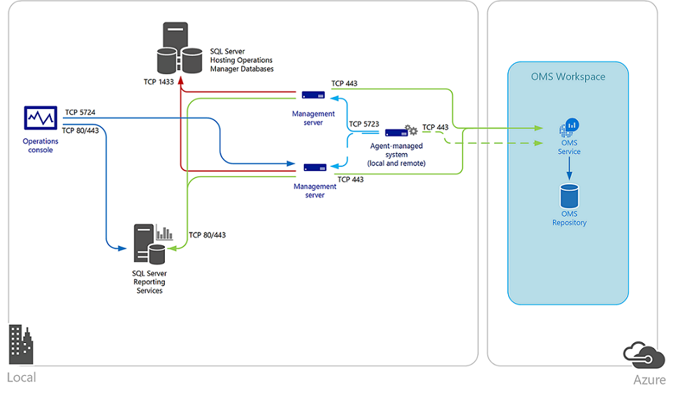
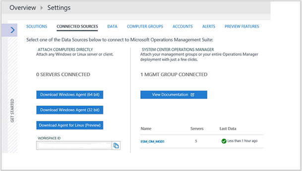

<properties
    pageTitle="連線至記錄分析的 [Operations Manager |Microsoft Azure"
    description="若要維持在系統管理中心 Operations Manager 您現有的投資，並使用記錄分析擴充的功能，您可以整合 Operations Manager 與您 OMS 工作區。"
    services="log-analytics"
    documentationCenter=""
    authors="MGoedtel"
    manager="jwhit"
    editor=""/>

<tags
    ms.service="log-analytics"
    ms.workload="na"
    ms.tgt_pltfrm="na"
    ms.devlang="na"
    ms.topic="article"
    ms.date="09/08/2016"
    ms.author="magoedte"/>

# <a name="connect-operations-manager-to-log-analytics"></a>連線至記錄分析的 [Operations Manager

若要維持在系統管理中心 Operations Manager 您現有的投資，並使用記錄分析擴充的功能，您可以整合 Operations Manager 與您 OMS 工作區。  這個選項可讓您運用 OMS 的商機時繼續使用作業管理員︰

- 繼續監控 Operations Manager 與您的 IT 服務健康狀況
- 使用您支援管理事件及問題的 ITSM 解決方案維護整合
- 管理部署至內部部署和雲端公用 IaaS 虛擬機器您監視與 Operations Manager 的代理程式的生命週期

整合與系統管理中心 Operations Manager 值以新增至您的服務作業策略充分的速度與效率 OMS 收集、 儲存及分析資料從 Operations Manager 中使用。  OMS 有助於建立關聯，並要找出問題的錯誤，並出現 reoccurrences 產生您現有的問題管理程序。   若要檢查的效能、 事件和通知的資料，以有意義的方式公開此報告功能豐富的儀表板與搜尋引擎的彈性，示範 OMS 顯示中 complimenting Operations Manager 強度。

報告 Operations Manager 管理群組的代理程式會收集資料，從您的伺服器根據記錄分析資料來源及啟用 OMS 訂閱中的解決方案。  根據您已啟用的解決方案這些解決方案的資料 [已傳送直接從 Operations Manager 管理伺服器 OMS web 服務中，或因的資料收集代理程式管理系統上，而直接從代理程式傳送到 OMS web 服務。 管理伺服器直接轉寄 OMS OMS web 服務資料，它會永遠不會寫入 OperationsManager 或 OperationsManagerDW 資料庫。  當管理伺服器失去與 OMS web 服務的連線時，只有重新建立與 OMS 通訊之前，本機快取資料。  管理伺服器離線預定進行的維護或意外的中斷時，在 [管理] 群組中的另一個管理伺服器會繼續與 OMS 的連線。  

下圖說明管理伺服器與代理程式的系統管理中心 Operations Manager 管理群組和 OMS，包括方向和連接埠之間的連線。   



## <a name="system-requirements"></a>系統需求
在開始之前，檢視下列詳細資料，以驗證您符合必要的先決條件。

- OMS 僅支援作業管理員 2012 SP1 UR6 和大於，及作業管理員 2012 R2 UR2 和大於。  Proxy 支援已加入的作業管理員 2012 SP1 UR7 和作業管理員 2012 R2 UR3。
- 所有 Operations Manager 代理程式必須都符合最低支援需求。 確定代理程式是最小的更新，否則將會失敗 Windows 代理程式流量多錯誤可能會填滿 Operations Manager 事件記錄檔。
- OMS 訂閱。  如需進一步瞭解檢閱[記錄分析快速入門](log-analytics-get-started.md)。

## <a name="connecting-operations-manager-to-oms"></a>連線到 OMS 的 [Operations Manager
執行下列步驟來設定您連線到其中一個 OMS 工作區的 Operations Manager 管理群組的數列。

1. 在 Operations Manager 主控台中，選取 [**系統管理**工作區]。
2. 展開 [作業管理套件節點並按一下 [**連線]**。
3. 按一下 [**註冊作業管理套件**] 連結。
4. 在**作業管理套件登入精靈︰ 驗證**頁面，輸入的電子郵件地址或電話號碼和密碼管理員帳戶相關聯的 OMS 訂閱，然後按一下 [**登入**。
5. 您所驗證成功，在後**作業管理套件登入精靈︰ 選取 [工作區**頁面，系統會提示您選取 OMS 工作區。  如果您有一個以上的工作區，請選取 [工作的區中您要註冊 Operations Manager 管理群組中，從下拉式清單中，然後按 [**下一步**]。

    >[AZURE.NOTE] Operations Manager 只支援 OMS 工作區，一次。 從 OMS 移除連線與 OMS 與上一個工作區已註冊的電腦。

6. 在**作業管理套件登入精靈︰ 摘要**頁面確認您的設定，如果有正確，請按一下 [**建立**]。
7. 在**作業管理套件登入精靈︰ 完成**頁面上，按一下 [**關閉**]。

### <a name="add-agent-managed-computers"></a>新增代理程式管理的電腦
設定後整合與您 OMS 工作區，這只會建立與 OMS 的連線，不會收集資料從管理群組代理程式]。 之後您設定的特定代理程式管理電腦會收集記錄分析的資料不會發生為止。 您可以個別選取電腦物件，或您可以選取其中包含 Windows 電腦物件群組。 您無法選取其中包含另一個類別，例如邏輯磁碟] 或 [SQL 資料庫的執行個體的群組。

1. 開啟 [Operations Manager 主控台，然後選取**系統管理**工作區。
2. 展開 [作業管理套件節點並按一下 [**連線]**。
3. 按一下 [動作] 底下的 [**新增電腦/群組**的連結在右側窗格的標題。
4. 在**電腦搜尋**] 對話方塊中您可以搜尋電腦或監視 Operations Manager 的群組。 選取電腦或 OMS 至內建的群組，按一下 [**新增**]，然後按一下**[確定]**。

您可以檢視電腦與群組設定為 [作業的操作主控台**管理**工作區中的管理套件下的 [受管理的電腦] 節點從收集資料。  從這裡開始，您可以新增或移除所需的電腦與群組。

### <a name="configure-oms-proxy-settings-in-the-operations-console"></a>在 [作業] 主控台設定 OMS proxy 設定
管理群組和 OMS web 服務之間的內部 proxy 伺服器時，請執行下列步驟。  這些設定集中管理從管理群組及散佈代理程式管理系統的 OMS 收集資料範圍中包含的。  這是有幫助某些解決方案時略過管理伺服器及資料即可直接傳送給 OMS web 服務。

1. 開啟 [Operations Manager 主控台，然後選取**系統管理**工作區。
2. 展開 [作業管理套件，，然後按一下 [**連線**]。
3. 在 OMS 連線] 檢視中，按一下 [**設定 Proxy 伺服器**。
4. 在**作業管理套件精靈︰ Proxy 伺服器**頁面，選取 [**使用 proxy 伺服器存取作業管理套件**，然後輸入連接埠號碼，例如 http://corpproxy:80 的 URL，然後按一下 [**完成]**。

如果您的 proxy 伺服器需要驗證，請執行下列步驟，以設定認證與傳播到受管理的電腦的 [管理] 群組中的 OMS 將報表所需的設定。

1. 開啟 [Operations Manager 主控台，然後選取**系統管理**工作區。
2. [ **RunAs 設定**] 下選取 [**設定檔**]。
3. 開啟 [**系統管理中心顧問執行為設定檔 Proxy**設定檔]。
4. 在執行為設定檔精靈中，按一下 [新增至使用執行為帳戶。 您可以建立新的[執行方式帳戶](https://technet.microsoft.com/library/hh321655.aspx)，或使用現有的帳戶。 此帳戶必須具備足夠的權限通過 proxy 伺服器。
5. 若要設定的帳戶管理，選擇 [**選取的類別、] 群組中或物件**，按一下 [**選取...** 然後按一下 [ **...] 群組** 若要開啟 [**群組搜尋**] 方塊。
6. 搜尋，然後選取 [ **Microsoft 系統管理中心顧問監控伺服器群組**。  選取關閉**] 群組中的搜尋**方塊中的群組後，按一下**[確定]** 。
7.  按一下**[確定**] 關閉 [**新增帳戶執行為**] 方塊。
8.  按一下 [**儲存**完成精靈並儲存變更。

連線建立並設定會收集與報告資料來 OMS 哪個代理程式之後，在 [管理] 群組中，順序不必然套用下列設定︰

- 為帳戶執行**Microsoft.SystemCenter.Advisor.RunAsAccount.Certificate**會建立。  它與執行為設定檔**Microsoft 系統管理中心顧問執行為設定檔 Blob**相關聯，並會針對兩個類別-**集合伺服器**和**作業管理員管理群組**。
- 建立兩個連接器。  第一個為**Microsoft.SystemCenter.Advisor.DataConnector** ，會轉寄至 OMS 記錄分析產生的執行個體的 [管理] 群組中的所有類別的所有通知的訂閱會自動設定]。 第二個連接器是**顧問連接器**，這是負責 OMS web 服務與通訊和共用資料。
- 代理程式，並選取要收集資料，在 [管理] 群組中的群組會新增至**Microsoft 系統管理中心顧問監控伺服器群組**。

## <a name="management-pack-updates"></a>管理套件更新
設定完成之後，[Operations Manager 管理群組會建立與 OMS 服務的連線。  管理伺服器會與 web 服務進行同步處理，並在表單中的管理組件的整合與 Operations Manager 的解決方案您已啟用接收更新的設定資訊。   Operations Manager 會檢查有更新套件自動下載並在他們可以匯入這些管理。  有兩個規則特別的控制項這種行為︰

- **Microsoft.SystemCenter.Advisor.MPUpdate** -更新基底 OMS 管理組件。 依預設會執行每十二個專案 （12） 小時。
- **Microsoft.SystemCenter.Advisor.Core.GetIntelligencePacksRule** -更新解決方案管理組件中您的工作區啟用。 依預設會執行每 5 分鐘。

您可以覆寫這兩個規則，可以停用，避免自動下載或修改管理伺服器頻率 OMS 來判斷新的管理套件有要下載同步處理的頻率。  請遵循步驟[覆寫規則或監視器的方式](https://technet.microsoft.com/library/hh212869.aspx)來修改**頻率**參數值的秒若要變更同步處理的排程，或修改**啟用**參數，以停用規則。  目標類別作業管理員管理群組的所有物件的覆寫。

如果您想要繼續現有的變更控制流程來控制您生產管理] 群組中的管理套件版本追蹤，您可以停用規則，並且啟用這些更新時所允許的特定時間。 如果您在您的環境中有開發或問與答管理群組，而且已連線至網際網路，您可以設定該管理群組與支援這種情況 OMS 工作區。  這可讓您檢閱及之前將其發佈至生產管理群組進行評估的 OMS 管理套件反覆運算版本。

## <a name="switch-an-operations-manager-group-to-a-new-oms-workspace"></a>切換到新的 OMS 工作區的 [Operations Manager 群組
1. 登入 OMS 訂閱，並在 [ [Microsoft 作業管理套件](http://oms.microsoft.com/)中建立新的工作區。
2. 開啟 Operations Manager 主控台是作業管理員系統管理員角色的成員的帳戶，然後選取**系統管理**工作區。
3. 展開作業管理套件，並選取 [**連線]**。
4. 選取端窗格的 [**重新設定作業管理套件**] 連結。
5. 請遵循**作業管理套件登入精靈**]，然後輸入的電子郵件地址或電話號碼和密碼管理員帳戶的新 OMS 工作區與相關聯。

    > [AZURE.NOTE] **作業管理套件登入精靈︰ 選取 [工作區**頁面會顯示為使用中的現有工作區。


## <a name="validate-operations-manager-integration-with-oms"></a>驗證 OMS 作業管理員整合
有一些不同的方式，您可以驗證您 OMS Operations Manager 整合是成功。

### <a name="to-confirm-integration-from-the-oms-portal"></a>若要確認從 OMS 入口網站整合

1.  在 OMS 入口網站中，按一下 [**設定**] 方塊
2.  選取 [**連線來源**]。
3.  在資料表中的 [系統管理中心 Operations Manager] 區段下，您應該會看到時收到最後一個資料列數代理程式和狀態管理群組的名稱。

    

4.  請注意下左邊的 [設定] 頁面的**工作區識別碼**值。  您將驗證，針對下列 Operations Manager 管理群組。  

### <a name="to-confirm-integration-from-the-operations-console"></a>若要確認作業主控台整合

1.  開啟 [Operations Manager 主控台，然後選取**系統管理**工作區。
2.  選取 [**管理組件**以及在**尋找︰**文字方塊中輸入**顧問**或**智慧**。
3.  根據您已啟用的解決方案，您會看到搜尋結果清單中的相對應管理套件。  例如，如果您已啟用通知管理解決方案，管理套件 Microsoft 系統管理中心顧問通知管理就會在清單。
4.  從 [**監控**] 檢視中瀏覽至 [**作業管理 Suite\Health 狀態**] 檢視。  選取 [管理伺服器**管理伺服器狀態**窗格底下，並在 [**檢視詳細資料**] 窗格中確認 [**驗證服務 URI**屬性的值符合 OMS 工作區識別碼

    


## <a name="remove-integration-with-oms"></a>移除與 OMS 整合
當您不再需要 Operations Manager 管理群組和 OMS 工作區之間的整合時，有幾個步驟才能正確移除 [管理] 群組中的 [連線及設定。 下列程序會有您更新 OMS 工作區刪除管理群組的參考，請刪除 OMS 連接線，然後刪除支援 OMS 管理組件。   

1.  開啟作業管理員命令殼層是作業管理員系統管理員角色的成員的帳戶。

    >[AZURE.WARNING] 請確認您沒有 word 顧問或 IntelligencePack 任何自訂管理套件的名稱，再繼續執行，否則下列步驟會將其刪除從管理群組。

2.  從命令命令介面提示字元中，輸入`Get-SCOMManagementPack -name "*advisor*" | Remove-SCOMManagementPack`

3.  下一步類型`Get-SCOMManagementPack -name “*IntelligencePack*” | Remove-SCOMManagementPack`

4.  開啟 [作業管理員作業主控台是作業管理員系統管理員角色的成員的帳戶。
5.  選取 [**管理**] 底下的 [**管理套件**節點以及在**尋找︰** ] 方塊中，輸入**顧問**並確認下列管理套件仍匯入您的 [管理] 群組中︰

    - Microsoft 系統管理中心顧問
    - Microsoft 系統管理中心顧問內部

6. 在 [OMS 入口網站中，按一下 [**設定**] 方塊。
7.  選取 [**連線來源**]。
8.  在資料表中的 [系統管理中心 Operations Manager] 區段下，您應該會看到您要移除工作區的 [管理] 群組的名稱。  **最後一個資料**欄] 底下，按一下 [**移除**]。  

    >[AZURE.NOTE] [**移除**] 連結將無法了，直到 14 天後的，如果沒有偵測到從連線的管理群組的活動。  
   
9.  要求您確認您要繼續移除會出現一個視窗。  按一下 [ **]**以繼續。 

若要刪除的兩個連接器-Microsoft.SystemCenter.Advisor.DataConnector 顧問連接器儲存下列 PowerShell 指令碼至您的電腦，並執行使用下列範例。

```
    .\OM2012_DeleteConnector.ps1 “Advisor Connector” <ManagementServerName>
    .\OM2012_DeleteConnectors.ps1 “Microsoft.SytemCenter.Advisor.DataConnector” <ManagementServerName>
```

>[AZURE.NOTE] 您在執行這個指令碼，如果不是管理伺服器，電腦必須取決於您管理群組的版本的安裝作業管理員 2012 SP1 或 R2 命令殼層。

```
    `param(
    [String] $connectorName,
    [String] $msName="localhost"
    )
    $mg = new-object Microsoft.EnterpriseManagement.ManagementGroup $msName
    $admin = $mg.GetConnectorFrameworkAdministration()
    ##########################################################################################
    # Configures a connector with the specified name.
    ##########################################################################################
    function New-Connector([String] $name)
    {
         $connectorForTest = $null;
         foreach($connector in $admin.GetMonitoringConnectors())
    {
    if($connectorName.Name -eq ${name})
    {
         $connectorForTest = Get-SCOMConnector -id $connector.id
    }
    }
    if ($connectorForTest -eq $null)
    {
         $testConnector = New-Object Microsoft.EnterpriseManagement.ConnectorFramework.ConnectorInfo
         $testConnector.Name = $name
         $testConnector.Description = "${name} Description"
         $testConnector.DiscoveryDataIsManaged = $false
         $connectorForTest = $admin.Setup($testConnector)
         $connectorForTest.Initialize();
    }
    return $connectorForTest
    }
    ##########################################################################################
    # Removes a connector with the specified name.
    ##########################################################################################
    function Remove-Connector([String] $name)
    {
        $testConnector = $null
        foreach($connector in $admin.GetMonitoringConnectors())
       {
        if($connector.Name -eq ${name})
       {
         $testConnector = Get-SCOMConnector -id $connector.id
       }
      }
     if ($testConnector -ne $null)
     {
        if($testConnector.Initialized)
     {
     foreach($alert in $testConnector.GetMonitoringAlerts())
     {
       $alert.ConnectorId = $null;
       $alert.Update("Delete Connector");
     }
     $testConnector.Uninitialize()
     }
     $connectorIdForTest = $admin.Cleanup($testConnector)
     }
    }
    ##########################################################################################
    # Delete a connector's Subscription
    ##########################################################################################
    function Delete-Subscription([String] $name)
    {
      foreach($testconnector in $admin.GetMonitoringConnectors())
      {
      if($testconnector.Name -eq $name)
      {
        $connector = Get-SCOMConnector -id $testconnector.id
      }
    }
    $subs = $admin.GetConnectorSubscriptions()
    foreach($sub in $subs)
    {
      if($sub.MonitoringConnectorId -eq $connector.id)
      {
        $admin.DeleteConnectorSubscription($admin.GetConnectorSubscription($sub.Id))
      }
     }
    }
    #New-Connector $connectorName
    write-host "Delete-Subscription"
    Delete-Subscription $connectorName
    write-host "Remove-Connector"
    Remove-Connector $connectorName
```

日後如果您打算在重新連線至 OMS 的工作區管理群組，您必須重新匯入`Microsoft.SystemCenter.Advisor.Resources.\<Language>\.mpb`管理套件檔案，從最新更新彙總套件套用至您的管理群組。  您可以找到此檔案中的`%ProgramFiles%\Microsoft System Center 2012`或`System Center 2012 R2\Operations Manager\Server\Management Packs for Update Rollups`資料夾。

## <a name="next-steps"></a>後續步驟

- 若要新增的功能和收集資料[從方案庫新增記錄分析解決方案](log-analytics-add-solutions.md)。
- [Proxy 和防火牆設定中記錄分析](log-analytics-proxy-firewall.md)如果貴組織使用 proxy 伺服器或防火牆，讓代理程式可以通訊記錄分析服務。
