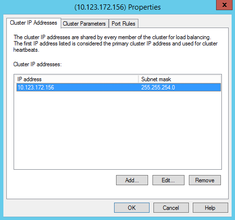
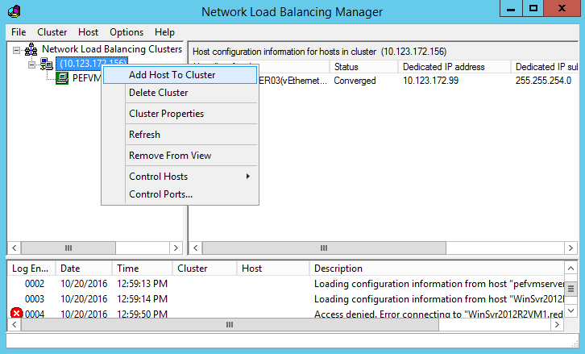
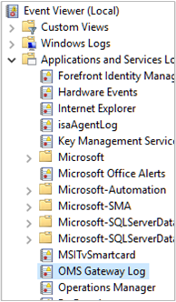

<properties
    pageTitle="連線至 OMS 使用 OMS 閘道器的電腦和裝置 |Microsoft Azure"
    description="將連線到您的 OMS 管理裝置和 Operations Manager 監視電腦 OMS 閘道器至時沒有存取網際網路傳送資料至 OMS 服務。"
    services="log-analytics"
    documentationCenter=""
    authors="bandersmsft"
    manager="jwhit"
    editor=""/>
<tags
    ms.service="log-analytics"
    ms.workload="na"
    ms.tgt_pltfrm="na"
    ms.devlang="na"
    ms.topic="article"
    ms.date="10/26/2016"
    ms.author="banders"/>

# 電腦和裝置連接到 OMS 使用 OMS 閘道器

本文將說明如何您 OMS 管理裝置和監視系統管理中心的作業管理員是 SCOM 的電腦可以傳送資料至 OMS 服務時沒有存取網際網路。 OMS 閘道器可以收集資料，並將其傳送給他們代表 OMS 服務。

閘道器在 HTTP 轉寄 proxy 支援 HTTP 通道使用 HTTP 連線] 命令。 閘道器可以處理在 4 核心 CPU、 執行 Windows 的 16 GB 伺服器上執行時的最多 2000 個 OMS 同時連線裝置。

舉例來說，您的企業或大型組織可能會有網路連線的伺服器，但可能沒有網際網路連線。 在另一個範例中，您可能有許多點銷售 （位置） 裝置的監控其直接沒有所代表的意義。 而在另一個範例中，Operations Manager 可以為 proxy 伺服器使用 OMS 閘道器。 在以下範例中，OMS 閘道器可以從下列伺服器或 OMS 位置裝置安裝的代理程式轉移資料。

而不是每個個別的代理程式傳送直接 OMS 和資料需要直接網際網路連線，請改為是透過 [有網際網路連線的單一電腦傳送代理程式的所有資料。 該電腦已安裝並使用 [閘道器的位置。 在此案例中，您可以在任何您想要用來收集資料的電腦上安裝代理程式。 閘道器然後將資料從代理程式轉換 OMS 直接 — 閘道器不會分析的資料傳輸。

若要監視 OMS 閘道器及分析效能或安裝所在之伺服器的事件資料，您必須安裝 OMS 代理程式也安裝的閘道器的電腦上。

閘道器必須能夠存取網際網路上傳至 OMS 的資料。 讓代理程式可以自動將閘道器的資料轉換，每個代理程式也必須有其閘道器的網路連線。 為了獲得最佳結果，請勿也是網域控制站的電腦上安裝閘道器。

以下是 OMS 資料流程顯示直接代理程式的圖表。

以下是從 Operations Manager 顯示 OMS 資料流程的圖表。

## 安裝 OMS 閘道器

安裝此閘道器會取代舊版的閘道器安裝 （記錄分析轉寄）。

先決條件︰.Net Framework 4.5、 Windows Server 2012 R2 SP1 及以上

1. 從[Microsoft 下載中心](http://download.microsoft.com/download/2/5/C/25CF992A-0347-4765-BD7D-D45D5B27F92C/OMS%20Gateway.msi)下載最新版的 OMS 閘道器。
2. 若要開始安裝，請按兩下**OMS Gateway.msi**。
3. 在 [歡迎] 頁面**下, 一步**。  
    
4. 在 [授權合約] 頁面上，選取 [**我接受授權合約**同意的使用者授權合約，然後**下一步**]。
5. 在連接埠與 proxy 位址頁面中︰
    1. 輸入要用於閘道器的 TCP 連接埠號碼。 設定從 [Windows 防火牆開啟此連接埠號碼。 預設值為 8080。
    連接埠號碼有效範圍是 1-65535。 如果輸入無法歸類為此範圍，就會出現錯誤訊息。
    2. 或者，如果需要使用 proxy 伺服器閘道器安裝的位置，輸入閘道器要連線的 proxy 位址。 例如，`http://myorgname.corp.contoso.com:80`如果空白，閘道器會嘗試直接連上網際網路。 否則，閘道器連線到 proxy。 如果您的 proxy 伺服器需要驗證，請輸入您的使用者名稱和密碼。
          
    3. 按一下 [**下一步**
6. 如果您沒有啟用 Microsoft 更新，會出現 [Microsoft Update] 頁面，您可以選擇以啟用 Microsoft 更新。 選取項目，然後按一下 [**下一步**。 否則，請繼續下一個步驟。
7. 在目的地資料夾頁面上，將預設資料夾**%ProgramFiles%\OMS 閘道器**或是輸入您要安裝閘道器，然後按一下 [**下一步**的位置。
8. 在 [準備好安裝頁面上，按一下 [**安裝**]。 使用者帳戶控制可能會出現要求安裝的權限。 如果是這樣，按一下**[是]**。
9. 安裝完成後，按一下 [**完成**]。 您可以驗證服務以開啟 services.msc 正在執行，並確認 [ **OMS 閘道器**，會出現在 [服務] 清單。  
    

## 在裝置上安裝代理程式

如有需要請參閱[連線的 Windows 電腦記錄分析](log-analytics-windows-agents.md)有關如何安裝直接連線代理程式。 本文說明您可以安裝使用設定精靈代理程式的方式，或使用命令列。

## 設定 OMS 代理程式

請參閱設定為使用 proxy 伺服器，這是這種情況下代理程式的相關資訊[與 Microsoft 監控代理程式的設定 proxy 和防火牆設定](log-analytics-proxy-firewall.md)閘道器。

作業管理員代理程式傳送等 Operations Manager 通知、 組態評估、 執行個體空間容量資料，透過管理伺服器的一些資料。 其他的大量資料，例如 IIS 記錄、 效能及安全性是直接傳送給 OMS 閘道器。 每個頻道透過傳送資料的完整清單，請參閱[從方案庫新增記錄分析解決方案](log-analytics-add-solutions.md)。

>[AZURE.NOTE]
如果您打算使用網路負載平衡閘道器，請參閱[您也可以設定網路負載平衡](#optionally-configure-network-load-balancing)。

## 設定是 SCOM proxy 伺服器

您設定 Operations Manager 新增閘道器至作為 proxy 伺服器。 當您更新 proxy 設定時，proxy 設定會自動套用至所有的代理程式 Operations Manager。

若要使用閘道器支援 Operations Manager，您必須具備︰

- Microsoft 監控代理程式 (代理程式版本 – **8.0.10900.0**及更新版本) 的閘道器伺服器上安裝並設定您要與其通訊的 OMS 工作區。
- 閘道器必須具備網際網路連線，或 proxy 伺服器的連線。

### 若要設定是 SCOM 閘道器

1. 開啟 [Operations Manager 主控台和下**作業管理套件**，按一下 [**連線**，然後按一下 [**設定 Proxy 伺服器**︰  
    
2. 選取 [**使用 proxy 伺服器存取作業管理套件**，然後輸入 [OMS 閘道伺服器的 IP 位址。 確保您開始`http://`首碼︰  
    
3. 按一下 [**完成**]。 Operations Manager 伺服器連線到您的 OMS 工作區。

## 設定網路負載平衡

您可以設定高可用性使用網路負載平衡建立叢集閘道器。 叢集，藉此將要求從 Microsoft 監控代理程式連線到其節點重新導向您的代理程式的管理流量。 如果一個閘道器伺服器當機，流量取得重新導向到其他節點。

1. 開啟網路負載平衡管理員，並建立叢集。
2. 以滑鼠右鍵按一下新增閘道、 之前的叢集，然後選取 [**叢集內容。** 設定叢集有自己的 IP 位址︰  
    
3. 要連線的 OMS 閘道伺服器與 Microsoft 監控代理程式安裝，叢集的 IP 位址，以滑鼠右鍵按一下，然後按一下 [**新增主機到叢集**。  
    
4. 輸入您要連線的閘道器的伺服器 IP 位址︰  
    
5. 在電腦上沒有網際網路連線，請務必使用叢集的 IP 位址，當您設定**Microsoft 監控代理程式屬性**︰  
    

## 設定適用於自動化混合式工作者

如果您有自動化混合式同事，在您的環境中，下列步驟將提供設定以支援這些閘道手動、 暫時因應措施。

在下列步驟中，您必須知道 Azure 自動化帳戶所在的區域。 若要找出位置︰

1. [Azure 入口網站](https://portal.azure.com/)登入。
2. 選取 Azure 自動化服務。
3. 選取適當的 Azure 自動化帳戶。
4. 檢視其在 [**位置]**區域。  
    

請使用下表識別每個位置的 URL:

**工作執行階段資料服務 Url**

| **位置** | **URL** |
| --- | --- |
| 北美美國中部 | ncus-jobruntimedata-產品-su1.azure-automation.net |
| 西歐 | 我們-jobruntimedata-產品-su1.azure-automation.net |
| 美國中部南美洲 | scus-jobruntimedata-產品-su1.azure-automation.net |
| 設定適用於美國 | eus-jobruntimedata-產品-su1.azure-automation.net |
| 中央加拿大 | 副本-jobruntimedata-產品-su1.azure-automation.net |
| 北美歐洲 | ne-jobruntimedata-產品-su1.azure-automation.net |
| 東南亞 | 海-jobruntimedata-產品-su1.azure-automation.net |
| 中央印度 | 德-jobruntimedata-產品-su1.azure-automation.net |
| 日本 | jpe-jobruntimedata-產品-su1.azure-automation.net |
| 澳大利亞 | ase-jobruntimedata-產品-su1.azure-automation.net |

**代理程式服務 Url**

| **位置** | **URL** |
| --- | --- |
| 北美美國中部 | ncus-agentservice-產品-1.azure-automation.net |
| 西歐 | 我們-agentservice-產品-1.azure-automation.net |
| 美國中部南美洲 | scus-agentservice-產品-1.azure-automation.net |
| 設定適用於美國 | eus2-agentservice-產品-1.azure-automation.net |
| 中央加拿大 | 副本-agentservice-產品-1.azure-automation.net |
| 北美歐洲 | ne-agentservice-產品-1.azure-automation.net |
| 東南亞 | 海-agentservice-產品-1.azure-automation.net |
| 中央印度 | 德-agentservice-產品-1.azure-automation.net |
| 日本 | jpe-agentservice-產品-1.azure-automation.net |
| 澳大利亞 | ase-agentservice-產品-1.azure-automation.net |

如果您的電腦已註冊為混合式工作者自動修補使用更新管理方案，請按照以下步驟︰

1. 工作執行階段資料服務 Url 新增至允許主機上的清單 OMS 閘道器。 例如︰ `Add-OMSGatewayAllowedHost we-jobruntimedata-prod-su1.azure-automation.net`
2. 重新啟動 OMS 閘道器服務，使用下列 PowerShell 指令程式︰`Restart-Service OMSGatewayService`

如果您的電腦上-boarded Azure 自動化使用混合式工作者註冊 cmdlet，請使用下列步驟︰

1. 將 OMS 閘道器的 [允許主機] 清單中的代理程式服務註冊 URL。 例如︰`Add-OMSGatewayAllowedHost ncus-agentservice-prod-1.azure-automation.net`
2. 工作執行階段資料服務 Url 新增至允許主機上的清單 OMS 閘道器。 例如︰ `Add-OMSGatewayAllowedHost we-jobruntimedata-prod-su1.azure-automation.net`
3. 重新啟動 OMS 閘道服務。
    `Restart-Service OMSGatewayService`

## 實用的 PowerShell cmdlet

Cmdlet 可協助您完成工作所需更新 OMS 閘道器組態設定。 您可以使用這些之前，請務必︰

1. 安裝 OMS 閘道器 (MSI)。
2. 開啟 [PowerShell 視窗。
3. 若要匯入模組，請輸入下列命令︰`Import-Module OMSGateway`
4. 如果沒有出現錯誤在先前的步驟，模組已成功匯入，並 cmdlet 可用。 類型`Get-Module OMSGateway`
5. 使用 cmdlet 來進行變更之後，請確定您重新啟動閘道服務。

如果您在步驟 3 中看到的錯誤，並不是匯入模組。 找不到模組 PowerShell 時，可能會發生錯誤。 您可以找到它的閘道器安裝路徑︰ C:\Program File\Microsoft OMS Gateway\PowerShell。

| **Cmdlet** | **參數** | **描述** | **範例** |
| --- | --- | --- | --- |
| `Set-OMSGatewayConfig` | 索引鍵 （必要）   值 | 變更 [服務設定 | `Set-OMSGatewayConfig -Name ListenPort -Value 8080` |
| `Get-OMSGatewayConfig` | 索引鍵 | 取得服務的設定 | `Get-OMSGatewayConfig`     `Get-OMSGatewayConfig -Name ListenPort` |
| `Set-OMSGatewayRelayProxy` | 地址   使用者名稱   密碼 | 設定轉送 （上游） proxy 的地址 （和認證） | 1.設定回覆 proxy 與認證︰`Set-OMSGatewayRelayProxy -Address http://www.myproxy.com:8080 -Username user1 -Password 123`     2.設定回覆 proxy 不需要驗證︰`Set-OMSGatewayRelayProxy -Address http://www.myproxy.com:8080`     3.清除回覆 proxy 設定，也就是不需要回覆 proxy:`Set-OMSGatewayRelayProxy -Address ""` |
| `Get-OMSGatewayRelayProxy` |   | 取得轉送 （上游） proxy 位址 | `Get-OMSGatewayRelayProxy` |
| `Add-OMSGatewayAllowedHost` | Host （主機) （必要） | 新增主應用程式清單 | `Add-OMSGatewayAllowedHost -Host www.test.com` |
| `Remove-OMSGatewayAllowedHos`t | Host （主機) （必要） | 允許的清單中移除主應用程式 | `Remove-OMSGatewayAllowedHost -Host www.test.com` |
| `Get-OMSGatewayAllowedHost` |   | 取得目前允許 host （主機） （僅本機設定允許主機，不包含自動下載允許的主機） | `Get-OMSGatewayAllowedHost` |
| `Add-OMSGatewayAllowedClientCertificate` | 主旨 （必要） | 新增主旨，允許清單的用戶端憑證 | `Add-OMSGatewayAllowedClientCertificate -Subject mycert` |
| `Remove-OMSGatewayAllowedClientCertificate` | 主旨 （必要） | 用戶端憑證的主體移除允許的清單 | `Remove- OMSGatewayAllowedClientCertificate -Subject mycert` |
| `Get-OMSGatewayAllowedClientCertificat`e |   | 取得目前允許的用戶端憑證的主體 （僅限本機設定允許的主旨的郵件，不包含自動下載允許的主題） | `Get-OMSGatewayAllowedClientCertificate` |

## 疑難排解

我們建議您安裝的閘道器的電腦上安裝 OMS 代理程式。 代理程式然後可用來收集記錄的閘道器的事件。

**OMS 閘道器事件識別碼和描述**

下表顯示事件 Id 和 OMS 閘道器記錄事件的描述。

| **識別碼** | **描述** |
| --- | --- |
| 400 | 沒有特定的識別碼的任何應用程式錯誤 |
| 401 | 設定錯誤。 例如︰ listenPort = 「 文字 」，而不是整數 |
| 402 | 剖析 TLS 交換郵件中的例外狀況 |
| 403 | 網路錯誤。 例如︰ 無法連線至目標伺服器 |
| 100 | 一般資訊 |
| 101 | 啟動服務 |
| 102 | 已停止服務 |
| 103 | 從用戶端收到 HTTP 連線] 命令 |
| 104 | 不要 HTTP 連線] 命令 |
| 105 | 目的伺服器不允許的清單，或是不安全的連接埠 (443) 的目的地連接埠。     請確定閘道器伺服器上的 MMA 代理程式和閘道器與通訊的代理程式連線至相同的記錄檔分析工作區。|
| 105 | 錯誤 TcpConnection – 無效的用戶端憑證︰ CN = 閘道器    確保︰     & #149;您使用的閘道器的版本號碼 1.0.395.0 或更大。   & #149;閘道器伺服器上的 MMA 代理程式和閘道器與通訊的代理程式連線至相同的記錄檔分析工作區。 |
| 106 | 任何 TLS 工作階段是可疑及拒絕的原因 |
| 107 | 已確認 TLS 工作階段 |

**收集效能計數器**

下表顯示可用的效能計數器 OMS 閘道器。 您可以新增使用效能監視計數器。

| **名稱** | **描述** |
| --- | --- |
| OMS 閘道器/作用中的用戶端連線 | 作用中的用戶端網路 (TCP) 連線數目 |
| OMS 閘道器/錯誤計數 | 錯誤的數目 |
| OMS 閘道器/連線的用戶端 | 連線的用戶端的數字 |
| OMS 閘道器/拒絕計數 | 任何 TLS 驗證的錯誤導致拒絕的數目 |

## 取得協助

當您已登入 Azure 入口網站時，您可以建立協助的要求以 OMS 閘道器或任何其他 Azure 服務或服務的功能。
若要要求協助，請按一下入口網站的右上角的問號符號，然後按一下 [**新增支援要求**。 然後，完成新的支援要求表單。

您也可以在[Microsoft Azure 意見反應](https://feedback.azure.com/forums/267889)保留 OMS 或記錄分析的相關意見反應。

## 後續步驟

- 收集資料來源的資料連線 OMS 工作區中，並將它儲存在 OMS 存放庫中[新增資料來源](log-analytics-data-sources.md)。
