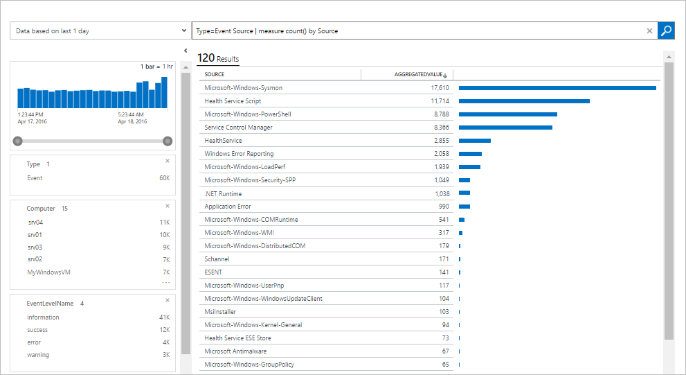

<properties
   pageTitle="什麼是日誌分析？ |Microsoft Azure"
   description="記錄檔分析是一項服務中作業管理套件 (OMS)，可協助您收集並分析您的雲端中的資源所產生的營運資料與內部部署環境。  本文提供記錄分析及連結至詳細內容的不同元件的簡介。"
   services="log-analytics"
   documentationCenter=""
   authors="bwren"
   manager="jwhit"
   editor="tysonn" />
<tags
   ms.service="log-analytics"
   ms.devlang="na"
   ms.topic="hero-article"
   ms.tgt_pltfrm="na"
   ms.workload="infrastructure-services"
   ms.date="09/06/2016"
   ms.author="bwren" />

# 什麼是日誌分析？
記錄檔分析是在服務[作業管理套件\(OMS\) ](../operations-management-suite/operations-management-suite-overview.md) ，可協助您收集並分析您的雲端中的資源所產生的資料和內部部署環境。 它會讓您隨時分析數百萬筆記錄的所有工作負載和伺服器，不論其實體位置使用整合式的搜尋及自訂的儀表板的即時深入資訊。

## 記錄檔分析元件
在管理中心的記錄檔分析是 OMS 儲存機制會裝載於 Azure 雲端。  收集資料到儲存機制來源的資料連線來設定資料來源及新增解決方案至您的訂閱。  資料來源與解決方案會各有自己的內容，但仍要分析的不同記錄類型一起查詢中建立到儲存機制。  這個選項可讓您使用相同的工具和方法使用不同類型的收集不同來源的資料。

連線的來源是電腦及其他資源產生收集記錄分析資料。  這可包括直接連接的[Windows](log-analytics-windows-agents.md)和[Linux](log-analytics-linux-agents.md)電腦上安裝的代理程式或代理程式中的[已連線的系統管理中心 Operations Manager 管理群組](log-analytics-om-agents.md)。  記錄檔分析也可以從[Azure 儲存體](log-analytics-azure-storage.md)收集資料。

[資料來源](log-analytics-data-sources.md)是不同類型的資料收集從每個連線的來源。  這包含事件和[Windows](log-analytics-data-sources-windows-events.md)和 Linux 代理程式除了來源，例如[IIS 記錄檔](log-analytics-data-sources-iis-logs.md)]，然後[自訂文字記錄](log-analytics-data-sources-custom-logs.md)中的[效能資料](log-analytics-data-sources-performance-counters.md)。  您設定您想要收集，每個資料來源設定已自動傳送給每個連線的來源。

## 分析記錄分析資料
大部分的記錄檔分析您互動會透過 OMS 網站在任何瀏覽器中執行，並提供您有權存取的設定和多個工具來分析及採取收集的資料。  從入口網站中，您可以利用[記錄搜尋](log-analytics-log-searches.md)您用來建構分析收集的資料，而您可以自訂與您最有價值的搜尋，和[解決方案](log-analytics-add-solutions.md)提供額外的功能和分析工具的圖形化檢視[儀表板](log-analytics-dashboards.md)的查詢。

記錄檔分析提供的查詢語法，以快速擷取及合併彙算存放庫中的資料。  您可以建立並儲存[記錄檔搜尋](log-analytics-log-searches.md)直接分析 OMS 入口網站中的資料或記錄搜尋執行自動建立提醒，如果查詢的結果表示重要的條件。

若要提供的整體環境健康情況的快速圖形化檢視，您可以新增以儲存記錄檔的搜尋結果的視覺效果至您的[儀表板](log-analytics-dashboards.md)。   

以分析記錄分析外部資料，您可以將資料匯出 OMS 存放庫到[Power BI](log-analytics-powerbi.md)或 Excel 等的工具。  您也可以使用[記錄搜尋 API](log-analytics-log-search-api.md)建立運用記錄分析資料的自訂解決方案，或與其他系統整合。

## 解決方案
解決方案會將功能新增至記錄分析。  其主要執行在雲端，並提供 OMS 存放庫中收集的資料分析。 他們也可以定義新收集您可以使用記錄搜尋或 OMS 儀表板中的方案所提供的其他使用者介面分析的記錄類型。  

解決方案可用的各種功能，而您可以輕鬆地瀏覽可用方案並[將它們新增至您的 OMS 工作區](log-analytics-add-solutions.md)從方案庫。  許多將會自動部署，並開始使用其他人可能需要一些設定時，立即。

## 記錄檔分析架構
記錄檔分析的部署需求是最小，因為主要元件都裝載於 Azure 雲端。  這包含的服務可讓您建立的關聯及分析收集的資料，除了存放庫。  可以從任何瀏覽器存取入口網站，因此沒有用戶端軟體需求。

您必須安裝代理程式[視窗](log-analytics-windows-agents.md)和[Linux](log-analytics-linux-agents.md)電腦上，但沒有其他代理程式所需的電腦已[連線是 SCOM 管理群組](log-analytics-om-agents.md)的成員。  是 SCOM 代理程式會繼續進行通訊的管理伺服器會將其資料轉寄給記錄分析。  有些方案透過會需要直接與記錄分析通訊的代理程式。  每個方案的文件會指定其通訊的需求。

當您[登入記錄檔分析](log-analytics-get-started.md)，您就會建立 OMS 工作區。  您可以將工作區為使用自己的資料存放庫、 資料來源及解決方案的唯一 OMS 環境。 您可以建立多個工作區中支援多重的環境，例如生產並測試您的訂閱。

## 後續步驟

- 在您自己的環境中測試，[註冊免費的記錄檔分析帳戶](log-analytics-get-started.md)。
- 檢視可用到 OMS 存放庫收集資料的不同[資料來源](log-analytics-data-sources.md)。
- 將功能新增至記錄的分析，[瀏覽方案庫中的可用的解決方案](log-analytics-add-solutions.md)。
