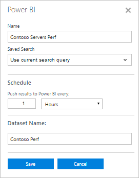

<properties
   pageTitle="將記錄分析資料匯出至 Power BI |Microsoft Azure"
   description="Power BI 是提供的分析不同的資料集的豐富視覺效果和報表的 Microsoft 的雲端商務分析服務。  記錄檔分析可以持續將資料匯出 OMS 存放庫到 Power BI，您可以利用其視覺效果和分析工具。  本文將說明如何設定記錄分析的自動定期匯出至 Power BI 中的查詢。"
   services="log-analytics"
   documentationCenter=""
   authors="bwren"
   manager="jwhit"
   editor="tysonn" />
<tags
   ms.service="log-analytics"
   ms.devlang="na"
   ms.topic="article"
   ms.tgt_pltfrm="na"
   ms.workload="infrastructure-services"
   ms.date="10/18/2016"
   ms.author="bwren" />

# 將記錄分析資料匯出至 Power BI

[Power BI](https://powerbi.microsoft.com/documentation/powerbi-service-get-started/)是提供的分析不同的資料集的豐富視覺效果和報表的 Microsoft 的雲端商務分析服務。  記錄檔分析可以自動將資料匯出 OMS 存放庫到 Power BI，您可以利用其視覺效果和分析工具。

當您記錄分析與設定 Power BI 時，您會建立匯出結果至 Power BI 中的對應資料集的記錄查詢。  查詢和匯出會繼續自動執行您定義用來保留最新的資料收集記錄分析的最新資料集的排程。

## Power BI 排程

*Power BI 排程*包含從 OMS 存放庫的一組資料匯出至 Power BI 和定義搜尋来保留目前的資料集的執行頻率的排程中的對應資料集的記錄檔搜尋。

在資料集中的欄位相符的記錄檔搜尋傳回的記錄的屬性。  如果搜尋會傳回不同類型的記錄然後資料集將會包含所有的每一個包含的記錄類型的屬性。  

> [AZURE.NOTE] 最好使用記錄搜尋查詢會傳回而不執行任何使用命令，如 [[量值](log-analytics-search-reference.md#measure)的合併彙算的原始資料。  您可以在 Power BI 執行任何彙總和計算，從原始資料。

## 連線至 Power BI 的 OMS 工作區

您可以從記錄分析 Power bi 匯出之前，您必須連線至 Power BI 帳戶使用下列程序的 OMS 工作區。  

1. 在 OMS 主控台中，按一下 [**設定**] 方塊。
2. 選取 [**帳戶**]。
3. 在 [**工作區資訊**] 區段中按一下 [**連線至 Power BI 帳戶。**
4. 輸入您的 Power BI 帳戶認證。

## 建立 Power BI 排程

建立使用下列程序每個資料集的 Power BI 排程。

1. 在 [OMS 主控台按一下**記錄搜尋**方塊。
2. 新查詢中輸入或選取已儲存的搜尋傳回您要匯出至**Power BI**的資料。  
3. 按一下 [開啟**Power BI** ] 對話方塊的頁面頂端的 [ **Power BI** ] 按鈕。
4. 提供下列表格中的資訊，然後按一下 [**儲存**]。

| 屬性 | 描述 |
|:--|:--|
| 名稱 | 若要識別排程，當您檢視 Power BI 排程清單的名稱。 |
| 已儲存的搜尋 | 若要執行記錄搜尋。  您可以選取目前的查詢，或從下拉式清單方塊中選取現有的已儲存的搜尋。 |
| 排程 | 如何經常執行已儲存的搜尋並匯出至 Power BI 資料集。  值必須是 15 分鐘之間 24 小時的時間。 |
| 資料集的名稱 | Power BI 中的資料集的名稱。  它會建立不存在並更新存在。 |

## 檢視及移除 Power BI 排程

檢視現有的 Power BI 排程，使用下列程序的清單。

1. 在 OMS 主控台中，按一下 [**設定**] 方塊。
2. 選取 [ **Power BI**]。

排程詳細資料，除了會顯示排程執行週的時間數] 及 [前次同步處理狀態。  如果同步處理發生錯誤，您可以按一下以執行錯誤詳細資料記錄中的搜尋記錄的連結。

您可以移除排程中**移除資料行**的**X** ] 即可。  您可以**關閉**選取停用排程。  若要修改排程必須移除並重新建立新的設定。

## 範例逐步解說
下一節逐步建立 Power BI 排程和建立簡易報表中使用其資料集的範例。  在此範例中的一組電腦的所有效能資料都匯出至 Power BI，然後建立折線圖顯示處理器使用。

### 建立記錄檔搜尋
我們開始建立記錄檔中搜尋我們想要傳送至資料集的資料。  在此範例中，我們將使用傳回名稱開頭的第一句是*srv*的電腦上所有的效能資料的查詢。  

### 建立 Power BI 搜尋
按一下 [ **Power BI** ] 按鈕，開啟 [Power BI] 對話方塊，並提供所需的資訊。  我們希望此搜尋] 執行每小時一次，並建立名為 「 *Contoso 效能*資料集。  因為我們已開啟搜尋所建立的資料，我們希望，我們**儲存**搜尋保留預設的 [*使用目前的搜尋查詢*。

### 確認 [Power BI 搜尋
若要確認我們正確地建立排程，我們可以檢視 Power BI 搜尋的清單，在 [**設定**] 方塊下 OMS 儀表板中。  我們稍候幾分鐘，並重新整理此檢視，直到它會報告同步處理已執行。

### 確認 [Power BI 中的資料集
我們登入我們[powerbi.microsoft.com](http://powerbi.microsoft.com/) ，然後捲動至底部的左窗格的**資料集**的帳戶。  我們可以看到表示我們匯出已經順利執行列出 [ *Contoso 效能*資料集。

### 建立報表以資料集
我們選取**Contoso 效能**資料集]，然後按一下 [**欄位**] 窗格右側，檢視屬於此資料集中的欄位中的 [**結果**。  若要建立折線圖顯示每一部電腦的處理器使用，我們可以執行下列動作。

1. 選取折線圖的視覺效果。
2. 將**物件**拖曳至**報表篩選層級**，並檢查**處理器**。
3. 拖曳**CounterName**報告**層級篩選**，並檢查**%處理器時間**。
4. 拖曳**CounterValue** **的值**。
5. 將**電腦**拖曳到 [**圖例**。
6. 將**TimeGenerated**拖曳至**座標軸**。

我們可以看到產生的線條圖顯示的資料集的資料。

### 儲存報表
我們在畫面頂端的 [儲存] 按鈕上的 [儲存報表，並驗證現在已列在左窗格中的 [報表] 區段中。

## 後續步驟

- 瞭解[記錄搜尋](log-analytics-log-searches.md)建置可以匯出至 Power BI 的查詢。
- 進一步瞭解[Power BI](http://powerbi.microsoft.com)建立記錄檔分析匯出為根據的視覺效果。
