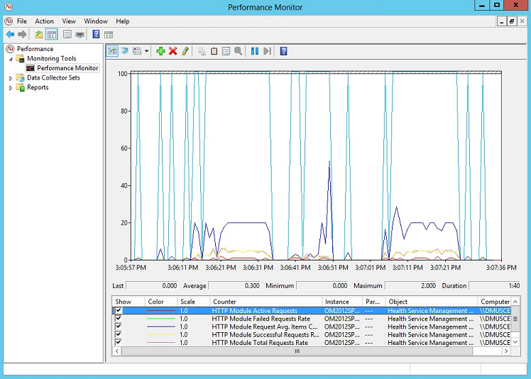

<properties
    pageTitle="在記錄檔分析設定 proxy 和防火牆設定 |Microsoft Azure"
    description="當您代理程式或 OMS 服務需要使用特定的連接埠時，請設定 proxy 和防火牆設定。"
    services="log-analytics"
    documentationCenter=""
    authors="bandersmsft"
    manager="jwhit"
    editor=""/>

<tags
    ms.service="log-analytics"
    ms.workload="na"
    ms.tgt_pltfrm="na"
    ms.devlang="na"
    ms.topic="get-started-article"
    ms.date="08/23/2016"
    ms.author="banders;magoedte"/>

# <a name="configure-proxy-and-firewall-settings-in-log-analytics"></a>在記錄檔分析設定 proxy 和防火牆設定

設定 proxy 所需的動作，並在 OMS 記錄分析的防火牆設定不同，當您使用 Operations Manager 及與 Microsoft 監控代理程式的直接連接到伺服器其代理程式。 檢閱下列各節，針對您所使用的代理程式的類型。

## <a name="configure-proxy-and-firewall-settings-with-the-microsoft-monitoring-agent"></a>設定 proxy 和防火牆設定與 Microsoft 監控代理程式

Microsoft 監控代理程式連線至，並登錄 OMS 服務，它必須有權存取您的網域和 Url 的連接埠號碼。 如果您使用 proxy 伺服器代理程式與 OMS 服務之間的通訊時，必須，以確保適當的資源都可以存取。 如果您使用防火牆來限制存取至網際網路時，必須先設定您的防火牆，以允許 OMS 存取。 下表列出 OMS 需要的連接埠。

|**代理程式資源**|**連接埠**|**略過 HTTPS 檢查**|
|--------------|-----|--------------|
|\*。 ods.opinsights.azure.com|443|[是]|
|\*。 oms.opinsights.azure.com|443|[是]|
|\*。 blob.core.windows.net|443|[是]|
|ods.systemcenteradvisor.com|443| |

您可以使用下列程序來設定 Microsoft 監控代理程式的使用 [控制台] 的 proxy 設定。 您需要使用每個伺服器的程序。 如果您有許多您需要設定的伺服器時，您可能會發現更好用的指令碼來自動化此程序。 如果是這樣，請參閱[設定 Microsoft 監控代理程式的使用指令碼的 proxy 設定](#to-configure-proxy-settings-for-the-microsoft-monitoring-agent-using-a-script)的下一個程序。

### <a name="to-configure-proxy-settings-for-the-microsoft-monitoring-agent-using-control-panel"></a>若要設定 Microsoft 監控代理程式的使用 [控制台] 的 proxy 設定

1. 開啟**[控制台]**。

2. 開啟**Microsoft 監控代理程式**。

3. 按一下 [ **Proxy 設定**] 索引標籤。<br>  
  ![proxy 設定] 索引標籤](./media/log-analytics-proxy-firewall/proxy-direct-agent-proxy.png)

4. 選取 [**使用 proxy 伺服器**並輸入的 URL 和連接埠號碼]，如果有需要，就像所示的範例。 如果您的 proxy 伺服器需要驗證，請輸入使用者名稱和密碼，才能存取 proxy 伺服器。

您可以使用下列程序建立的 PowerShell 指令碼，您可以執行設定直接連接到伺服器每一個代理程式的 proxy 設定。

### <a name="to-configure-proxy-settings-for-the-microsoft-monitoring-agent-using-a-script"></a>若要設定 Microsoft 監控代理程式的使用指令碼的 proxy 設定

複製下面的範例，更新您的環境的特定資訊、 使用 PS1 副檔名，將其儲存，然後執行指令碼直接連接到 OMS 服務每一部電腦上。

        
    param($ProxyDomainName="http://proxy.contoso.com:80", $cred=(Get-Credential))

    # First we get the Health Service configuration object.  We need to determine if we
    #have the right update rollup with the API we need.  If not, no need to run the rest of the script.
    $healthServiceSettings = New-Object -ComObject 'AgentConfigManager.MgmtSvcCfg'

    $proxyMethod = $healthServiceSettings | Get-Member -Name 'SetProxyInfo'

    if (!$proxyMethod)
    {
         Write-Output 'Health Service proxy API not present, will not update settings.'
         return
    }

    Write-Output "Clearing proxy settings."
    $healthServiceSettings.SetProxyInfo('', '', '')

    $ProxyUserName = $cred.username

    Write-Output "Setting proxy to $ProxyDomainName with proxy username $ProxyUserName."
    $healthServiceSettings.SetProxyInfo($ProxyDomainName, $ProxyUserName, $cred.GetNetworkCredential().password)
        

## <a name="configure-proxy-and-firewall-settings-with-operations-manager"></a>設定 proxy 和防火牆設定 Operations Manager

登錄 OMS 服務的連線到 Operations Manager 管理群組，它必須有權存取您的網域及 Url 的連接埠號碼。 如果您使用 proxy 伺服器 Operations Manager 管理伺服器與 OMS 服務之間的通訊時，必須，以確保適當的資源都可以存取。 如果您使用防火牆來限制存取至網際網路時，必須先設定您的防火牆，以允許 OMS 存取。 即使 Operations Manager 管理伺服器並不是前的 proxy 伺服器，可能是其代理程式。 在此情況下，proxy 伺服器應該設定的相同方式代理程式才能啟用並允許安全性，以及記錄管理解決方案取得傳送資料至 OMS web 服務。

通訊與 OMS 服務 Operations Manager 代理程式的順序，Operations Manager 基礎結構 （包括代理程式） 應有的正確的 proxy 設定和版本。 Proxy 設定代理程式 Operations Manager 主控台中指定。 您的版本，應該是下列其中一項︰

- 作業管理員 2012 SP1 更新彙總套件 7 或更新版本
- 作業管理員 2012 R2 更新彙總套件 3 或更新版本


下表列出這些工作相關的連接埠。

>[AZURE.NOTE] 下列資源部分提及顧問和操作深入資訊，同時舊版 OMS。 不過，所列的資源將會在未來變更。

以下是代理程式資源和連接埠的清單︰<br>

|**代理程式資源**|**連接埠**|
|--------------|-----|
|\*。 ods.opinsights.azure.com|443|
|\*。 oms.opinsights.azure.com|443|
|\*.blob.core.windows.net/\*|443|
|ods.systemcenteradvisor.com|443|
<br>
以下是管理伺服器資源和連接埠的清單︰<br>

|**管理伺服器資源**|**連接埠**|**略過 HTTPS 檢查**|
|--------------|-----|--------------|
|service.systemcenteradvisor.com|443| |
|\*。 service.opinsights.azure.com|443| |
|\*。 blob.core.windows.net|443|[是]| 
|data.systemcenteradvisor.com|443| | 
|ods.systemcenteradvisor.com|443| | 
|\*。 ods.opinsights.azure.com|443|[是]| 
<br>
以下是 OMS 和 Operations Manager 主控台資源和連接埠的清單。<br>

|**OMS 和 Operations Manager 主控台資源**|**連接埠**|
|----|----|
|service.systemcenteradvisor.com|443|
|\*。 service.opinsights.azure.com|443|
|\*。 live.com|連接埠 80 和 443|
|\*。 microsoft.com|連接埠 80 和 443|
|\*。 microsoftonline.com|連接埠 80 和 443|
|\*。 mms.microsoft.com|連接埠 80 和 443|
|login.windows.net|連接埠 80 和 443|
<br>

您可以使用下列程序登錄 OMS 服務 Operations Manager 管理群組。 如果您有 [管理] 群組和 OMS 服務之間的通訊問題，請使用的驗證程序來疑難排解 OMS 服務的資料傳輸。

### <a name="to-request-exceptions-for-the-oms-service-endpoints"></a>若要要求 OMS 服務端點的例外狀況

1. 使用先前呈現，以確保 Operations Manager 管理伺服器所需的資源都可透過防火牆存取的第一個資料表中您可能需要的資訊。
2. 使用您可能需要第二個資料表，以確保操作主控台 Operations Manager 和 OMS 中所需的資源都可透過防火牆存取先前呈現的資訊。
3. 如果您是使用 Internet Explorer 使用 proxy 伺服器，請確定設定妥當，並能正常運作。 若要驗證，您可以開啟安全的網路連線 (HTTPS)，例如[https://bing.com](https://bing.com)。 如果安全的網路連線無法使用瀏覽器中，它可能不適用於 Operations Manager 管理主控台在雲端的 web 服務使用。

### <a name="to-configure-the-proxy-server-in-the-operations-manager-console"></a>若要在 Operations Manager 主控台設定 proxy 伺服器

1. 開啟 [Operations Manager 主控台，然後選取**系統管理**工作區。

2. 展開**操作深入資訊**，然後選取 [**操作的深入見解連線**。<br>  
    
3. 在 OMS 連線] 檢視中，按一下 [**設定 Proxy 伺服器**。<br>  
    
4. 在操作的深入見解設定精靈︰ Proxy 伺服器，選取**使用 proxy 伺服器存取操作的深入見解 Web 服務**]，然後輸入的 URL 與連接埠的數字，例如**http://myproxy:80**。<br>  
    


### <a name="to-specify-credentials-if-the-proxy-server-requires-authentication"></a>若要指定的認證，如果 proxy 伺服器需要驗證
 Proxy 伺服器認證和設定需要傳播到受管理 OMS 會回報的電腦。 *Microsoft 系統管理中心顧問監控伺服器] 群組*中，應那些伺服器。 在登錄中的每個群組中的伺服器加密認證。

1. 開啟 [Operations Manager 主控台，然後選取**系統管理**工作區。
2. [ **RunAs 設定**] 下選取 [**設定檔**]。
3. 開啟 [**系統管理中心顧問執行為設定檔 Proxy**設定檔]。  
    
4. 在執行為設定檔精靈中，按一下 [**新增**至使用執行為帳戶。 您可以建立新的執行方式帳戶，或使用現有的帳戶。 此帳戶必須具備足夠的權限通過 proxy 伺服器。  
    ![[執行為設定檔] 精靈的圖像](./media/log-analytics-proxy-firewall/proxy-proxyacct2.png)
5. 若要設定要管理的帳戶，選擇**所選的類別、] 群組中或物件**以開啟 [物件搜尋] 方塊。  
    ![[執行為設定檔] 精靈的圖像](./media/log-analytics-proxy-firewall/proxy-proxyacct2-1.png)
6. 搜尋，然後選取 [ **Microsoft 系統管理中心顧問監控伺服器群組**。  
    ![[物件搜尋] 方塊的圖像](./media/log-analytics-proxy-firewall/proxy-proxyacct3.png)
7. 按一下**[確定**] 以關閉 [新增執行為帳戶] 方塊。  
    ![[執行為設定檔] 精靈的圖像](./media/log-analytics-proxy-firewall/proxy-proxyacct4.png)
8. 完成精靈並儲存變更。  
    ![[執行為設定檔] 精靈的圖像](./media/log-analytics-proxy-firewall/proxy-proxyacct5.png)


### <a name="to-validate-that-oms-management-packs-are-downloaded"></a>若要驗證該 OMS 管理下載套件

如果您已加入 OMS 解決方案，您可以檢視其 Operations Manager 主控台中為 [**管理**] 下方的 [管理組件。 搜尋*系統管理中心顧問*快速尋找他們。  
    或者，您也可以檢查 OMS 管理套件 Operations Manager 管理伺服器中使用下列 Windows PowerShell 命令︰

    ```
    Get-ScomManagementPack | where {$_.DisplayName -match 'Advisor'} | select Name,DisplayName,Version,KeyToken
    ```

### <a name="to-validate-that-operations-manager-is-sending-data-to-the-oms-service"></a>若要驗證該 Operations Manager 傳送資料至 OMS 服務

1. 在 [Operations Manager 管理伺服器開啟效能監視器 (perfmon.exe)，然後選取**效能監視器**。
2. 按一下 [**新增**]，然後選取 [**健康情況的服務管理群組**。
3. 新增開頭為**HTTP**的所有計數器。  
    
4. 如果您 Operations Manager 設定好的您會看到活動的健康情況的服務管理計數器事件和其他資料項目，根據 OMS 及設定的記錄集合原則，您新增的管理封包。  
    


## <a name="next-steps"></a>後續步驟

- 若要新增的功能和收集資料[從方案庫新增記錄分析解決方案](log-analytics-add-solutions.md)。
- 熟悉[記錄搜尋](log-analytics-log-searches.md)檢視收集解決方案的詳細的資訊。
