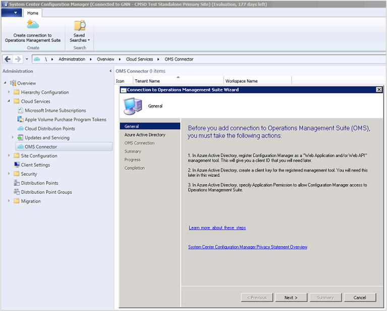

<properties
    pageTitle="連線至記錄分析的 [組態管理員 |Microsoft Azure"
    description="本文將示範連接記錄分析組態管理員，並啟動 [分析資料的步驟。"
    services="log-analytics"
    documentationCenter=""
    authors="bandersmsft"
    manager="jwhit"
    editor=""/>

<tags
    ms.service="log-analytics"
    ms.workload="na"
    ms.tgt_pltfrm="na"
    ms.devlang="na"
    ms.topic="article"
    ms.date="08/29/2016"
    ms.author="banders"/>

# 連線至記錄分析的 [組態管理員

您可以連線至記錄分析 OMS 中的系統管理中心設定管理員同步處理裝置集合資料。 如此可讓您設定管理員部署中的資料提供 OMS。

有幾個連接組態管理員 OMS，以下為您的整體的程序概要所需的步驟︰

1. Azure 管理入口網站中註冊組態管理員為 Web 應用程式及/或 Web API 應用程式，確保您擁有的用戶端識別碼及私密金鑰從 Azure Active Directory 註冊從用戶端。 請參閱[使用入口網站，以建立 Active Directory 應用程式與服務主要的可存取資源](../resource-group-create-service-principal-portal.md)的詳細資訊，瞭解如何完成此步驟。
2. Azure 管理入口網站中，[有權限來存取 OMS 提供組態管理員 （已註冊的 web 應用程式）](#provide-configuration-manager-with-permissions-to-oms)。
3. 組態管理員中，[新增使用 [新增 OMS 連線精靈的連線](#add-an-oms-connection-to-configuration-manager)。
4. 組態管理員中，您可以[更新的連線屬性](#update-oms-connection-properties)如果密碼或用戶端私密金鑰曾過期，或將會遺失。
5. OMS 入口網站中的資訊，[下載並安裝 Microsoft 監控代理程式](#download-and-install-the-agent)組態管理員服務連線的電腦上指向 [站台系統角色]。 代理程式會傳送至 OMS 組態管理員資料。
6. 在 [OMS，[匯入集合從組態管理員中](#import-collections)為電腦的群組。
7. 在 [OMS，檢視資料從組態管理員中為[電腦的群組](log-analytics-computer-groups.md)。

您可以閱讀更多相關連線[同步處理](https://technet.microsoft.com/library/mt757374.aspx)資料從組態管理員 Microsoft 作業管理套件 OMS 組態管理員。

## 具有權限提供 OMS 組態管理員

下列程序提供權限存取 OMS Azure 管理入口網站。 具體來說，您必須授*參與者角色*與 [資源] 群組中的使用者。 接著，可讓組態管理員連線至 OMS Azure 管理入口網站。

>[AZURE.NOTE] 您必須指定 OMS 組態管理員的權限。 否則，您會收到錯誤訊息，當您使用設定精靈設定管理員中。

1. 開啟[Azure 入口網站](https://portal.azure.com/)，然後按一下 [**瀏覽** > **記錄分析 (OMS)**若要開啟記錄分析 (OMS) 刀。  
2. 在**記錄檔分析 (OMS)**刀中，按一下 [**新增**] 以開啟**OMS 工作區**刀。  
  
3. 在**OMS 工作區**刀，提供下列資訊，然後按一下**[確定]**。
  - **OMS 工作區**
  - **訂閱**
  - **資源群組**
  - **位置**
  - **價格層**  
      

    >[AZURE.NOTE] 上述範例會建立新的資源群組。 資源群組只會用來設定管理員提供 OMS 工作區，在此範例中的權限。

4. 按一下 [**瀏覽** > **資源群組**] 以開啟 [**資源群組**刀。
5. 在 [**資源群組**刀中，按一下 [資源群組，以開啟&lt;資源群組名稱&gt;設定刀。  
  
6. 在 [&lt;資源群組名稱&gt;設定刀按一下存取控制 (IAM)，以開啟&lt;資源群組名稱&gt;使用者刀。  
    
7. 在 [&lt;資源群組名稱&gt;使用者刀，按一下 [**新增**] 以開啟 [**新增存取**刀。
8. 在**新增存取**刀中，按一下 [**選擇一個角色**]，然後選取的**參與者**角色。  
    
9. 按一下 [**新增使用者**設定管理員使用者，按一下 [**選取**]，然後選取然後按一下**[確定]**。  
    

## 新增 OMS 連線至組態管理員

才能加入 OMS 連線，請您設定管理員的環境必須具有設定為 [線上模式[服務連接點](https://technet.microsoft.com/library/mt627781.aspx)。

1. **管理**工作區中的組態管理員中，選取 [ **OMS 連接器**]。 這會開啟 [**新增 OMS 連線精靈**]。 選取 [**下一步**]。

2. 在 [**一般**] 畫面中，確認 [您必須完成下列動作，與您有詳細資料的每個項目，然後選取 [**下一步**]。
  1. Azure 管理入口網站，您已註冊為 Web 應用程式及/或 Web API 的應用程式，組態管理員，而且您有[從註冊的用戶端識別碼](../active-directory/active-directory-integrating-applications.md)。
  2. 在 Azure 管理入口網站，您已經建立應用程式的私密金鑰的 Azure Active Directory 中登錄應用程式。  
  3. Azure 管理入口網站中您已有權限來存取 OMS 提供註冊的 web 應用程式。  
  

3. **Azure Active Directory**在畫面上，提供您的**租用戶**、**用戶端識別碼**，與**用戶端密碼金鑰**，設定 OMS 連線設定，然後選取 [**下一步**]。  
  

4. 如果您已順利完成所有其他的程序，然後在 [ **OMS 連線設定**] 畫面上的資訊會自動出現在此頁面上。 資訊的連線設定應該出現**Azure 訂閱**， **Azure 資源群組**]，然後**作業管理套件工作區**。  
  ![連線到 OMS 精靈 OMS 連線] 頁面](./media/log-analytics-sccm/sccm-wizard-configure04.png)

5. 精靈會連線到 OMS 服務已輸入的資訊。 選取您想要與 OMS 同步處理，然後按一下 [**新增**裝置集合。  
  

6. 驗證您的連線設定，在 [**摘要**] 畫面，然後選取 [**下一步**]。 [**進度**] 畫面會顯示連線狀態]，然後應該**完成**。

>[AZURE.NOTE] 您必須連線至最上層網站的 OMS 階層中。 如果您將 OMS 連線至獨立主要網站，然後將管理中心網站新增至您的環境，您必須刪除並重新建立新的階層 OMS 連線。

設定管理員連結至 OMS 之後，您可以新增或移除集合]，並檢視 OMS 連線的內容。

## 更新 OMS 連線內容

如果密碼或用戶端的私密金鑰曾到期或遺失，必須手動更新 OMS 連線的屬性。

1. 組態管理員中，瀏覽至**雲端服務**，然後選取 [ **OMS 連接器**，以開啟**OMS 連線內容**] 頁面。
2. 在此頁面上，按一下 [檢視您**的租用戶**，**用戶端識別碼**，**用戶端密碼到期日**的**Azure Active Directory** ] 索引標籤。 **驗證**您的**用戶端私密金鑰**如果已過期。

## 下載並安裝代理程式

1. 在 OMS 入口網站[下載 OMS 從 [代理程式安裝] 檔案](log-analytics-windows-agents.md#download-the-agent-setup-file-from-oms)。
2. 安裝和設定管理員服務連接點網站系統角色的電腦上設定代理程式中使用下列方法之一︰
  - [安裝代理程式使用設定](log-analytics-windows-agents.md#install-the-agent-using-setup)
  - [安裝代理程式使用命令列](log-analytics-windows-agents.md#install-the-agent-using-the-command-line)
  - [安裝在 Azure 自動化使用 DSC 代理程式](log-analytics-windows-agents.md#install-the-agent-using-dsc-in-azure-automation)

## 匯入集合

您已新增 OMS 連線至組態管理員安裝代理程式後，指向 [組態管理員服務連線的電腦上的 [網站系統角色下, 一步是匯入集合從組態管理員中 OMS 為電腦的群組。

啟用匯入後，集合成員資格擷取的資訊是每 3 小時来保留目前的集合成員資格。 您可以選擇停用隨時匯入作業。

1. 在 OMS 入口網站中，按一下 [**設定**]。
2. 按一下 [**電腦群組**] 索引標籤，然後按一下 [ **SCCM** ] 索引標籤。
3. 選取 [**匯入組態管理員集合成員資格**，然後再按一下 [**儲存**]。  
  ![電腦群組-SCCM] 索引標籤](./media/log-analytics-sccm/sccm-computer-groups01.png)

## 檢視資料從組態管理員

您已新增 OMS 連線至組態管理員中，並設定管理員服務連接點網站系統角色的電腦上安裝代理程式後，來自代理程式的資料會傳送至 OMS。 OMS，在您設定管理員集合會顯示為[電腦的群組](log-analytics-computer-groups.md)。 您可以檢視**電腦群組**] 下的 [**組態管理員**] 頁面的群組**設定**] 中。

集合匯入後，您可以看到多少集合成員資格的電腦已偵測到。 您也可以查看已匯入的集合數目。

![電腦群組-SCCM] 索引標籤](./media/log-analytics-sccm/sccm-computer-groups02.png)

當您按一下其中一項動作時，搜尋隨即開啟，顯示 [匯入群組的所有或每個群組的所有電腦。 使用[記錄搜尋](log-analytics-log-searches.md)，您就可以開始深入分析組態管理員] 中的資料。

## 後續步驟

- 若要檢視您的組態管理員資料的詳細的資訊，使用[記錄搜尋](log-analytics-log-searches.md)。
